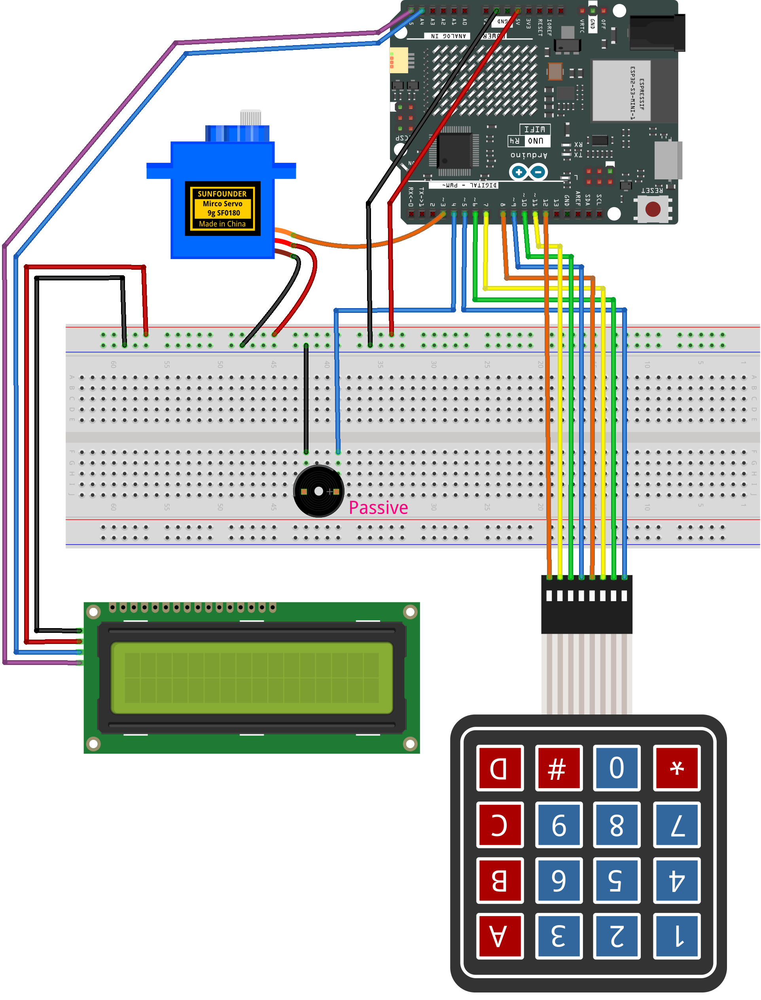

.. _pin_lock2.0:

PIN Lock 2.0
==============================================================

.. note::
  
  🌟 Welcome to the SunFounder Facebook Community! Whether you're into Raspberry Pi, Arduino, or ESP32, you'll find inspiration, help ideas here.
   
  - ✅ Be the first to get free learning resources. 
   
  - ✅ Stay updated on new products & exclusive giveaways. 
   
  - ✅ Share your creations and get real feedback.
   
  * 👉 Need faster updates or support? Click [|link_sf_facebook|] join our Facebook community 

  * 👉 Or join our WhatsApp group: Click [|link_sf_whatsapp|]
   
  * 🎁 Looking for parts?Check out our all-in-one kits below — packed with components, beginner-friendly guides, and tons of fun.

  .. list-table::
    :widths: 20 20 20
    :header-rows: 1

    *   - Name	
        - Includes Arduino board
        - PURCHASE LINK
    *   - Elite Explorer Kit	
        - Arduino Uno R4 WiFi
        - |link_elite_buy|
    *   - 3 in 1 Ultimate Starter Kit
        - Arduino Uno R4 Minima
        - |link_arduinor4_buy|

Course Introduction
------------------------

This project creates a PIN lock system using an Arduino, a 4×4 keypad, an I2C LCD, a servo, and a buzzer.

Users press * to enter PIN mode, input digits, and confirm with #.
A correct PIN smoothly opens and closes the servo lock, with status shown on the LCD and audio feedback from the buzzer.

.. .. raw:: html
 
..  <iframe width="700" height="394" src="https://www.youtube.com/embed/ycnotjYgYik?si=O7JOw9KEJYwVpxTy" title="YouTube video player" frameborder="0" allow="accelerometer; autoplay; clipboard-write; encrypted-media; gyroscope; picture-in-picture; web-share" referrerpolicy="strict-origin-when-cross-origin" allowfullscreen></iframe>

.. note::

  If this is your first time working with an Arduino project, we recommend downloading and reviewing the basic materials first.
  
  * :ref:`install_arduino`
  * :ref:`introduce_arduino`

**Required Components**

In this project, we need the following components:

.. list-table::
    :widths: 5 20 5 20
    :header-rows: 1

    *   - SN
        - COMPONENT INTRODUCTION	
        - QUANTITY
        - PURCHASE LINK

    *   - 1
        - Arduino UNO R4 Minima/Arduino UNO R4 WIFI
        - 1
        - |link_unor4_buy|
    *   - 2
        - USB Type-C cable
        - 1
        - 
    *   - 3
        - Breadboard
        - 1
        - |link_breadboard_buy|
    *   - 4
        - Wires
        - Several
        - |link_wires_buy|
    *   - 5
        - Passive buzzer
        - 1
        - |link_passive_buzzer_buy|
    *   - 6
        - KeyPad
        - 1
        - |link_keypad_buy|
    *   - 7
        - I2C LCD 1602
        - 1
        - |link_i2clcd1602_buy|
    *   - 8
        - Digital Servo Motor
        - 1
        - |link_motor_buy|

**Wiring**

**Common Connections:**

* **Keypad**

  - **RowPins:** Connect to  **5** to **8** on the Arduino.
  - **ColPins:** Connect to **9** to **12** on the Arduino.

* **I2C LCD 1602**

  - **SDA:** Connect to **A4** on the Arduino.
  - **SCL:** Connect to **A5** on the Arduino.
  - **GND:** Connect to breadboard’s negative power bus.
  - **VCC:** Connect to breadboard’s red power bus.

* **Passive buzzer**

  - **＋:** Connect to **4** on the Arduino.
  - **－:** Connect to breadboard’s negative power bus.

* **Digital Servo Motor**

  - Connect to breadboard’s positive power bus.
  - Connect to breadboard’s negative power bus.
  - Connect to **3** on the Arduino.

**Writing the Code**

.. note::

    * You can copy this code into **Arduino IDE**. 
    * To install the library, use the Arduino Library Manager and search for **LiquidCrystal I2C** and **Adafruit_Keypad** install it.
    * Don't forget to select the board(Arduino UNO R4 WIFI) and the correct port before clicking the **Upload** button.

.. code-block:: arduino

      #include <Adafruit_Keypad.h>
      #include <LiquidCrystal_I2C.h>
      #include <Servo.h>

      // ---------------- Pins ----------------
      const int PIN_BUZZER = 4;
      const int PIN_SERVO  = 3;   // keep D3 to avoid conflict with keypad cols (9,10,11,12)

      // ---------------- Keypad ----------------
      const byte ROWS = 4, COLS = 4;
      // If pressing physical '#' shows 'D' at LCD bottom-right, switch to VARIANT 1.
      #define KEYPAD_VARIANT 0
      #if KEYPAD_VARIANT == 0
      char keys[ROWS][COLS] = {
        {'1','2','3','A'},
        {'4','5','6','B'},
        {'7','8','9','C'},
        {'*','0','#','D'}
      };
      #else
      char keys[ROWS][COLS] = {
        {'1','2','3','A'},
        {'4','5','6','B'},
        {'7','8','9','C'},
        {'*','0','D','#'}
      };
      #endif
      byte rowPins[ROWS] = {5, 6, 7, 8};
      byte colPins[COLS] = {9, 10, 11, 12};
      Adafruit_Keypad keypad = Adafruit_Keypad(makeKeymap(keys), rowPins, colPins, ROWS, COLS);

      LiquidCrystal_I2C lcd(0x27, 16, 2);
      Servo door;

      // ---------------- State ----------------
      // LOCKED: waiting for '*' to enter PIN input
      // INPUT: entering PIN
      // ACTION: after correct PIN, run sequence: 90->0, wait 1s, 0->90, then return to LOCKED
      enum State { STATE_LOCKED, STATE_INPUT, STATE_ACTION };
      State state = STATE_LOCKED;

      // ---------------- Config ----------------
      String pinCode = "1234";
      const byte PIN_LEN = (byte)pinCode.length(); // auto follow pinCode length

      // We define "locked" display posture at 90°
      const int lockAngle   = 90;   // idle/locked posture at 90°
      const int openAngle   = 0;    // open posture at 0°
      String inputBuf = "";

      unsigned long lastLcdRefresh = 0;
      const unsigned long lcdRefreshMs = 120;

      char lastKey = ' ';      // last pressed key (debug)

      // ------- Smooth servo move --------
      int currentAngle = lockAngle;
      int targetAngle  = lockAngle;
      unsigned long lastStepAt = 0;
      const unsigned long stepInterval = 15; // 1° every 15 ms

      // Attach/detach control to reduce brownout and avoid attach-jump
      bool servoIsAttached = false;

      // ---------------- Beeps ------------------
      void beepKey()    { tone(PIN_BUZZER, 1200, 40); }
      void beepOK()     { tone(PIN_BUZZER, 900, 120); delay(20); tone(PIN_BUZZER, 1400, 120); } // tiny delay is OK
      void beepError()  { tone(PIN_BUZZER, 300, 220); }

      // ---- Servo helpers ----
      void servoAttachOnce() {
        if (!servoIsAttached) {
          // Attach and IMMEDIATELY write the currentAngle to prevent the "jump to 90°" default
          door.attach(PIN_SERVO);
          servoIsAttached = true;
          door.write(currentAngle);   // sync pulse to currentAngle right away
          delay(10);                  // tiny settle to ensure the first pulse is applied
        }
      }
      void servoDetachIfIdle() {
        if (servoIsAttached) {
          door.detach();
          servoIsAttached = false;
        }
      }
      void setTarget(int ang) {
        targetAngle = constrain(ang, 0, 180);
        if (currentAngle != targetAngle) {
          // Attach and immediately sync to current angle; start stepping next ticks
          servoAttachOnce();
          lastStepAt = millis();  // no artificial waiting; step scheduler starts now
        }
      }
      bool atTarget() {
        return currentAngle == targetAngle;
      }
      void tickServo(unsigned long now) {
        if (currentAngle == targetAngle) {
          // detach when idle to save power and avoid jitter/reset
          servoDetachIfIdle();
          return;
        }
        if ((long)(now - lastStepAt) >= (long)stepInterval) {
          lastStepAt = now;
          currentAngle += (currentAngle < targetAngle) ? 1 : -1;
          door.write(currentAngle);
        }
      }

      // ---- UI helpers ----
      void putLastKeyDebug() {
        // Show the bottom-right last key ONLY in INPUT state to avoid overwriting "enter"
        if (state != STATE_INPUT) return;
        lcd.setCursor(14,1); lcd.print(' ');
        lcd.setCursor(15,1); lcd.print(lastKey);
      }

      void drawLocked() {
        lcd.setCursor(0,0); lcd.print("Status: LOCKED  ");
        lcd.setCursor(0,1); lcd.print("Press * to enter");
        putLastKeyDebug(); // safe: function returns early if not INPUT
      }
      void drawInput() {
        lcd.setCursor(0,0); lcd.print("Enter PIN       ");
        lcd.setCursor(0,1);
        // draw masked PIN (stars) followed by underscores
        for (byte i=0; i<PIN_LEN; i++) lcd.print(i < inputBuf.length() ? '*' : '_');

        // tail hint fits 16x2; ensure we don't overflow the line
        int used = PIN_LEN;
        if (used < 16) {
          lcd.setCursor(used, 1);
          // —— 根据你的要求：只显示  "  #=OK"
          String hint = F("  #=OK");
          int remain = 16 - used;
          if ((int)hint.length() > remain) hint.remove(remain);
          lcd.print(hint);
        }
        putLastKeyDebug(); // visible only in INPUT
      }
      void drawAction() {
        // During action sequence show English message as required
        lcd.setCursor(0,0); lcd.print("Unlock Success  ");
        lcd.setCursor(0,1); lcd.print("Please wait ... ");
        putLastKeyDebug(); // safe: not shown outside INPUT
      }

      // ---------------- Action Phases ----------------
      // After correct PIN: PHASE_TO_ZERO -> PHASE_WAIT_1S -> PHASE_BACK_TO_90
      enum ActionPhase { PHASE_IDLE, PHASE_TO_ZERO, PHASE_WAIT_1S, PHASE_BACK_TO_90 };
      ActionPhase actionPhase = PHASE_IDLE;
      unsigned long actionPhaseStart = 0;

      void startActionSequence() {
        actionPhase = PHASE_TO_ZERO;
        actionPhaseStart = millis();
        setTarget(openAngle); // 90 -> 0
      }

      void updateActionSequence(unsigned long now) {
        switch (actionPhase) {
          case PHASE_TO_ZERO:
            if (atTarget()) {
              actionPhase = PHASE_WAIT_1S;
              actionPhaseStart = now;
            }
            break;
          case PHASE_WAIT_1S:
            if ((long)(now - actionPhaseStart) >= 1000) { // wait 1 second
              actionPhase = PHASE_BACK_TO_90;
              setTarget(lockAngle); // 0 -> 90
            }
            break;
          case PHASE_BACK_TO_90:
            if (atTarget()) {
              // Sequence done: return to LOCKED UI/state
              actionPhase = PHASE_IDLE;
              enterState(STATE_LOCKED);
            }
            break;
          default: break;
        }
      }

      // ---------------- State transitions ----------------
      void enterState(State s) {
        state = s;
        if (s == STATE_LOCKED) {
          inputBuf = "";
          setTarget(lockAngle);    // ensure posture returns to 90°
          lastKey = ' ';           // clear debug char so bottom-right stays blank
        } else if (s == STATE_INPUT) {
          inputBuf = "";
        } else if (s == STATE_ACTION) {
          // Show action UI and kick off sequence
          startActionSequence();
        }
        lcd.clear();
        lastLcdRefresh = 0;
      }

      // ---------------- Key handling ----------------
      void handleKey(char k) {
        lastKey = k;
        beepKey();

        if (state == STATE_LOCKED) {
          if (k == '*') enterState(STATE_INPUT);
        }
        else if (state == STATE_INPUT) {
          if (k >= '0' && k <= '9') {
            if (inputBuf.length() < PIN_LEN) inputBuf += k;
          } else if (k == 'D') {
            if (inputBuf.length() > 0) inputBuf.remove(inputBuf.length()-1);
          } else if (k == 'C') {
            inputBuf = "";
          } else if (k == '#' || k == 'A') {  // A also works for confirm (helps during mapping debug)
            if (inputBuf.length() == PIN_LEN) {
              if (inputBuf == pinCode) {
                beepOK();
                enterState(STATE_ACTION);  // run 90->0->(1s)->90 then return to LOCKED
              } else {
                beepError();
                inputBuf = "";
              }
            } else {
              beepError();
            }
          }
        }
        else if (state == STATE_ACTION) {
          // During action we ignore keys; uncomment below to allow abort.
          // if (k == '#') enterState(STATE_LOCKED);
        }
      }

      // ---------------- LCD refresh ----------------
      void refreshLCD(unsigned long now) {
        if ((long)(now - lastLcdRefresh) < (long)lcdRefreshMs) return;
        lastLcdRefresh = now;

        if (state == STATE_LOCKED) drawLocked();
        else if (state == STATE_INPUT) drawInput();
        else if (state == STATE_ACTION) drawAction();
      }

      // ---------------- Setup & Loop ----------------
      void setup() {
        keypad.begin();
        lcd.init(); lcd.backlight();
        pinMode(PIN_BUZZER, OUTPUT);

        // Initialize servo at locked posture (90°)
        currentAngle = lockAngle;
        targetAngle  = lockAngle;

        // Attach -> immediately sync to currentAngle -> 给足时间真正回到 90° -> detach
        door.attach(PIN_SERVO);
        servoIsAttached = true;
        door.write(currentAngle);

        // —— 关键优化：上电时保持一段时间的脉冲，让舵机真的回到 90° —— //
        // 固定等待：根据常见舵机速度，600~800ms 较稳；这里取 700ms
        delay(700);

        servoDetachIfIdle();

        enterState(STATE_LOCKED);
      }

      void loop() {
        unsigned long now = millis();

        // keypad events (non-blocking)
        keypad.tick();
        while (keypad.available()) {
          keypadEvent e = keypad.read();
          if (e.bit.EVENT == KEY_JUST_PRESSED) handleKey((char)e.bit.KEY);
        }

        // smooth servo movement
        tickServo(now);

        // if in ACTION, update sequence sub-phases
        if (state == STATE_ACTION) {
          updateActionSequence(now);
        }

        // LCD refresh
        refreshLCD(now);
      }
