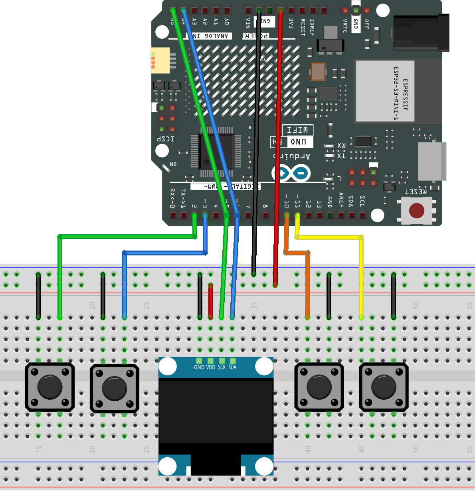

.. _pocket_arcade:

Pocket Arcade
==============================================================

.. note::
  
  🌟 Welcome to the SunFounder Facebook Community! Whether you're into Raspberry Pi, Arduino, or ESP32, you'll find inspiration, help ideas here.
   
  - ✅ Be the first to get free learning resources. 
   
  - ✅ Stay updated on new products & exclusive giveaways. 
   
  - ✅ Share your creations and get real feedback.
   
  * 👉 Need faster updates or support? Click [|link_sf_facebook|] join our Facebook community 

  * 👉 Or join our WhatsApp group: Click [|link_sf_whatsapp|]
   
  * 🎁 Looking for parts?Check out our all-in-one kits below — packed with components, beginner-friendly guides, and tons of fun.
  
  .. list-table::
    :widths: 20 20 20
    :header-rows: 1

    *   - Name	
        - Includes Arduino board
        - PURCHASE LINK
    *   - Elite Explorer Kit	
        - Arduino Uno R4 WiFi
        - |link_elite_buy|
    *   - Ultimate Sensor Kit	
        - Arduino Uno R4 Minima
        - |link_arduinor4_buy|
    *   - Universal Maker Sensor Kit
        - ×
        - |link_umsk_buy|

Course Introduction
------------------------

In this lesson, you'll use an OLED display, input controls, and a game manager system with Arduino to create a retro-style arcade game.

Players interact through button inputs to control on-screen actions, while the game manager updates the gameplay at ~60 FPS. The system includes an intro screen, high-score tracking, and smooth frame rendering for an engaging experience.

.. .. raw:: html

..  <iframe width="700" height="394" src="https://www.youtube.com/embed/KkPsawETYfg?si=4nMpy4ZNZjKVSooc" title="YouTube video player" frameborder="0" allow="accelerometer; autoplay; clipboard-write; encrypted-media; gyroscope; picture-in-picture; web-share" referrerpolicy="strict-origin-when-cross-origin" allowfullscreen></iframe>

.. note::

  If this is your first time working with an Arduino project, we recommend downloading and reviewing the basic materials first.

  * :ref:`install_arduino`
  * :ref:`introduce_arduino`

**Required Components**

In this project, we need the following components:

.. list-table::
    :widths: 5 20 5 20
    :header-rows: 1

    *   - SN
        - COMPONENT INTRODUCTION	
        - QUANTITY
        - PURCHASE LINK

    *   - 1
        - Arduino UNO R4 WIFI
        - 1
        - |link_unor4_wifi_buy|
    *   - 2
        - USB Type-C cable
        - 1
        - 
    *   - 3
        - Breadboard
        - 1
        - |link_breadboard_buy|
    *   - 4
        - Wires
        - Several
        - |link_wires_buy|
    *   - 5
        - Button
        - 4
        - |link_button_buy|
    *   - 6
        - OLED Display Module
        - 1
        - |link_oled_buy|

**Wiring**

**Common Connections:**

* **OLED Display Module**

  - **SDA:** Connect to **A4** on the Arduino.
  - **SCK:** Connect to **A5** on the Arduino.
  - **GND:** Connect to breadboard’s negative power bus.
  - **VCC:** Connect to breadboard’s red power bus.

* **Button**

  - **button1:** Connect to the breadboard’s negative power bus, and the other end to **2** on the Arduino board.
  - **button2:** Connect to the breadboard’s negative power bus, and the other end to **3** on the Arduino board.
  - **button3:** Connect to the breadboard’s negative power bus, and the other end to **10** on the Arduino board.
  - **button4:** Connect to the breadboard’s negative power bus, and the other end to **11** on the Arduino board.

**Writing the Code**

.. note::

    * You can copy this code into **Arduino IDE**. 
    * Use the C code ``Pocket_Arcade`` . You can click here :download:`Pocket_Arcade.zip </_static/Pocket_Arcade.zip>` to download it. 
    * To install the library, use the Arduino Library Manager and search for **config** and **display** and **gamemanager** and **highscore** and install it.
    * Don't forget to select the board(Arduino UNO R4 WIFI) and the correct port before clicking the **Upload** button.

.. code-block:: arduino

    // GameSystem.ino - Hack_updt
    #include "config.h"
    #include "display.h"
    #include "input.h"
    #include "gamemanager.h"
    #include "highscore.h"

    void intro(){
      display.clearDisplay();
      display.drawBitmap(0, 0, epd_bitmap_Intro, 128, 64, 1);
      display.display();
    }
    void setup() {
      Serial.begin(115200);
      initDisplay();
      intro();
      delay(12000);
      initInput();
      initHighscores();
      initGameManager();
    }

    void loop() {

      updateInput();
      updateGameManager();
      delay(16); // ~60 FPS
    }