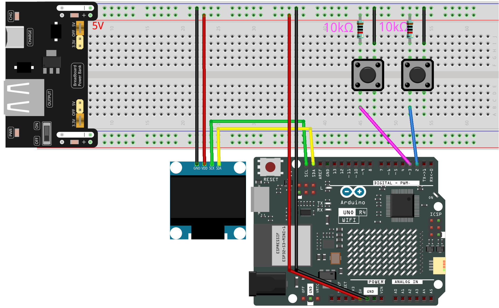

.. _pong_game:

Pong Game
==============================================================

.. note::
  
  🌟 Welcome to the SunFounder Facebook Community! Whether you're into Raspberry Pi, Arduino, or ESP32, you'll find inspiration, help ideas here.
   
  - ✅ Be the first to get free learning resources. 
   
  - ✅ Stay updated on new products & exclusive giveaways. 
   
  - ✅ Share your creations and get real feedback.
   
  * 👉 Need faster updates or support? Click [|link_sf_facebook|] join our Facebook community 

  * 👉 Or join our WhatsApp group: Click [|link_sf_whatsapp|]
   
  * 🎁 Looking for parts?Check out our all-in-one kits below — packed with components, beginner-friendly guides, and tons of fun.
  
  .. list-table::
    :widths: 20 20 20
    :header-rows: 1

    *   - Name	
        - Includes Arduino board
        - PURCHASE LINK
    *   - Elite Explorer Kit	
        - Arduino Uno R4 WiFi
        - |link_elite_buy|
    *   - Ultimate Sensor Kit	
        - Arduino Uno R4 Minima
        - |link_arduinor4_buy|
    *   - Universal Maker Sensor Kit
        - ×
        - |link_umsk_buy|

Course Introduction
------------------------

In this lesson, you’ll learn how to use a OLED Display Module, two buttons with the Arduino R4 UNO to create a Pong Game. We’ll cover using the Adafruit SSD1306 and GFX libraries to display on the screen.

The OLED Screen will display the game screen, and players can use button to control the game.

.. raw:: html

  <iframe width="700" height="394" src="https://www.youtube.com/embed/yu5bHYTUZGM?si=vAyT6zkDEDQUF-wg" title="YouTube video player" frameborder="0" allow="accelerometer; autoplay; clipboard-write; encrypted-media; gyroscope; picture-in-picture; web-share" referrerpolicy="strict-origin-when-cross-origin" allowfullscreen></iframe>

.. note::

  If this is your first time working with an Arduino project, we recommend downloading and reviewing the basic materials first.

  * :ref:`install_arduino`
  * :ref:`introduce_arduino`

**Required Components**

In this project, we need the following components:

.. list-table::
    :widths: 5 20 5 20
    :header-rows: 1

    *   - SN
        - COMPONENT INTRODUCTION	
        - QUANTITY
        - PURCHASE LINK

    *   - 1
        - Arduino UNO R4 Wifi
        - 1
        - |link_unor4_wifi_buy|
    *   - 2
        - USB Type-C cable
        - 1
        - 
    *   - 3
        - Breadboard
        - 1
        - |link_breadboard_buy|
    *   - 4
        - Wires
        - Several
        - |link_wires_buy|
    *   - 5
        - Button
        - 2
        - |link_button_buy|
    *   - 6
        - OLED Display Module
        - 1
        - |link_oled_buy|

**Wiring**

**Common Connections:**

* **OLED Display Module**

  - **SDA:** Connect to **SDA** on the Arduino.
  - **SCK:** Connect to **SCL** on the Arduino.
  - **GND:** Connect to breadboard’s negative power bus.
  - **VCC:** Connect to breadboard’s red power bus.

**Writing the Code**

.. note::

    * You can copy this code into **Arduino IDE**. 
    * To install the library, use the Arduino Library Manager and search for **Adafruit SSD1306** and **Adafruit GFX** and install it.
    * Don't forget to select the board(Arduino UNO R4 WIFI) and the correct port before clicking the **Upload** button.

.. code-block:: arduino

      #include <SPI.h>
      #include <Wire.h>
      #include <Adafruit_GFX.h>
      #include <Adafruit_SSD1306.h>

      // Button pins
      #define UP_BUTTON    3
      #define DOWN_BUTTON  2

      // OLED display sized
      #define SCREEN_WIDTH 128
      #define SCREEN_HEIGHT 64
      // OLED reset pin
      #define OLED_RESET   4
      Adafruit_SSD1306 display(SCREEN_WIDTH, SCREEN_HEIGHT, &Wire, OLED_RESET);

      // === Ball settings ===
      // How often (ms) we update the ball’s position
      const unsigned long BALL_RATE = 16;
      // Current x/y position of the ball
      int  ball_x       = SCREEN_WIDTH / 2;
      int  ball_y       = SCREEN_HEIGHT / 2;
      // How many pixels the ball moves each update
      int  ball_speed   = 1;
      // Direction: +1 means right/down, −1 means left/up
      int8_t ball_dir_x = 1, ball_dir_y = 1;

      // === Paddle settings ===
      // How often (ms) we update paddles
      const unsigned long PADDLE_RATE = 33;
      // Paddle height in pixels
      const uint8_t PADDLE_H = 16;
      // X position of the CPU’s paddle
      const uint8_t CPU_X = 12;
      // Current y position of the CPU paddle
      int8_t cpu_y = 16;
      // X position of the player’s paddle
      const uint8_t PLAYER_X = 115;
      // Current y position of the player paddle
      int8_t player_y = 16;
      // How many pixels the player paddle moves per button press
      int paddle_spd = 3;

      // For timing the updates
      unsigned long ball_update, paddle_update;

      // === Score and game state ===
      uint8_t player_score = 0;
      uint8_t cpu_score    = 0;
      bool    game_over    = false;

      void setup() {
        Serial.begin(115200);

        // Initialize random starting direction
        randomSeed(analogRead(A0));
        ball_dir_x = random(0, 2) * 2 - 1;
        ball_dir_y = random(0, 2) * 2 - 1;

        // Start the OLED display
        display.begin(SSD1306_SWITCHCAPVCC, 0x3C);
        display.clearDisplay();

        // Draw the border once at startup
        drawCourt();
        display.display();

        // Set up button inputs
        pinMode(UP_BUTTON, INPUT);
        pinMode(DOWN_BUTTON, INPUT);

        // Pause briefly so you can see the court before play begins
        delay(2000);

        // Show the initial score
        displayScore();
        display.display();

        // Initialize the update timers
        ball_update   = millis();
        paddle_update = ball_update;
      }

      void loop() {
        // If the game has ended, do nothing further
        if (game_over) return;

        unsigned long now = millis();
        bool updated = false;

        // === Move the ball if it’s time ===
        if (now >= ball_update) {
          ball_update += BALL_RATE;

          int new_x = ball_x + ball_dir_x * ball_speed;
          int new_y = ball_y + ball_dir_y * ball_speed;

          // Bounce off top and bottom edges
          if (new_y <= 0 || new_y >= SCREEN_HEIGHT - 1) {
            ball_dir_y = -ball_dir_y;
            new_y += ball_dir_y * ball_speed;
          }

          // Bounce off the CPU paddle
          if (new_x <= CPU_X + 1
              && ball_x > CPU_X + 1
              && new_y >= cpu_y
              && new_y <= cpu_y + PADDLE_H) {
            ball_dir_x = -ball_dir_x;
            new_x = CPU_X + 1;  // Prevent clipping into the paddle
            ball_speed++;       // Speed up on each hit
          }

          // Bounce off the player’s paddle
          if (new_x >= PLAYER_X - 1
              && ball_x < PLAYER_X - 1
              && new_y >= player_y
              && new_y <= player_y + PADDLE_H) {
            ball_dir_x = -ball_dir_x;
            new_x = PLAYER_X - 1;
            ball_speed++;
          }

          // Check left/right edges for a score and reset
          if (new_x <= 0) {
            // Ball hit CPU’s side → player scores
            player_score++;
            resetBall();
          }
          else if (new_x >= SCREEN_WIDTH - 1) {
            // Ball hit player’s side → CPU scores
            cpu_score++;
            resetBall();
          }
          else {
            // No score: update ball position normally
            ball_x = new_x;
            ball_y = new_y;
          }

          updated = true;
        }

        // === Move the paddles if it’s time ===
        if (now >= paddle_update) {
          paddle_update += PADDLE_RATE;

          // CPU paddle follows the ball slowly
          int8_t mid = cpu_y + (PADDLE_H >> 1);
          if (mid < ball_y) cpu_y++;
          if (mid > ball_y) cpu_y--;
          cpu_y = constrain(cpu_y, 1, SCREEN_HEIGHT - 1 - PADDLE_H);

          // Player paddle moves on button press
          if (digitalRead(UP_BUTTON)   == LOW) player_y -= paddle_spd;
          if (digitalRead(DOWN_BUTTON) == LOW) player_y += paddle_spd;
          player_y = constrain(player_y, 1, SCREEN_HEIGHT - 1 - PADDLE_H);

          updated = true;
        }

        // === Redraw everything if something moved ===
        if (updated) {
          display.clearDisplay();
          drawCourt();
          displayScore();

          // Draw CPU paddle (4 pixels wide for visibility)
          display.fillRect(CPU_X - 1, cpu_y - 1, 4, PADDLE_H + 2, WHITE);
          // Draw player paddle
          display.fillRect(PLAYER_X - 1, player_y - 1, 4, PADDLE_H + 2, WHITE);
          // Draw ball as a 5×5 square
          display.fillRect(ball_x - 2, ball_y - 2, 5, 5, WHITE);

          display.display();
        }

        // === Check for end‑of‑game ===
        if (player_score >= 3 || cpu_score >= 3) {
          game_over = true;

          // Decide which message to show
          String msg = (player_score >= 3) ? "You win!" : "You lose!";

          // Calculate text centering
          uint8_t ts    = 2;                   // Text size
          uint8_t charW = 6 * ts;              // Character width in pixels
          uint8_t textW = msg.length() * charW;
          uint8_t textH = 8 * ts;              // Character height in pixels
          int16_t x     = (SCREEN_WIDTH  - textW) / 2;
          int16_t y     = (SCREEN_HEIGHT - textH) / 2;

          // Show the final message
          display.clearDisplay();
          display.setTextSize(ts);
          display.setTextColor(WHITE);
          display.setCursor(x, y);
          display.print(msg);
          display.display();
        }
      }

      // Draw the outer border of the court
      void drawCourt() {
        display.drawRect(0, 0, SCREEN_WIDTH, SCREEN_HEIGHT, WHITE);
      }

      // Display the current score at the top center
      void displayScore() {
        display.fillRect((SCREEN_WIDTH / 2) - 20, 10, 60, 10, BLACK);
        display.setTextSize(1);
        display.setTextColor(WHITE);
        display.setCursor((SCREEN_WIDTH / 2) - 20, 10);
        display.print(cpu_score);
        display.print(" - ");
        display.print(player_score);
      }

      // Reset the ball to the center and set a new random direction
      void resetBall() {
        ball_speed   = 1;
        ball_x       = SCREEN_WIDTH / 2;
        ball_y       = SCREEN_HEIGHT / 2;
        ball_dir_x   = (ball_dir_x > 0 ? -1 : 1);
        ball_dir_y   = random(0, 2) * 2 - 1;
      }
