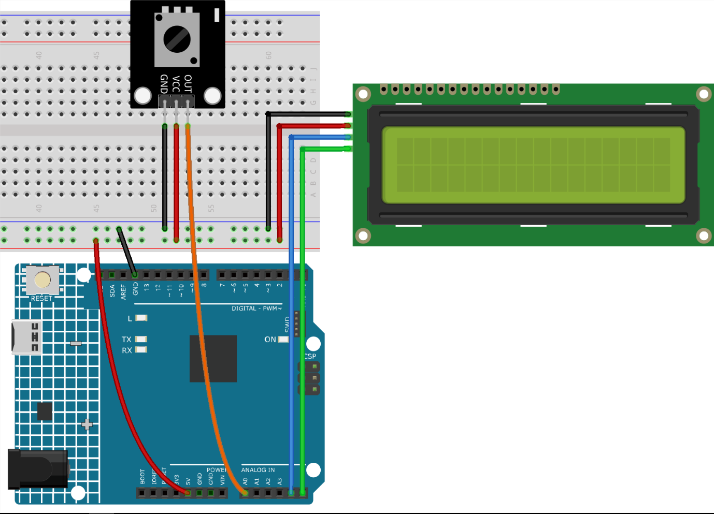

.. _potentiometer_value:

Potentiometer Value
==============================================================

.. note::
  
  🌟 Welcome to the SunFounder Facebook Community! Whether you're into Raspberry Pi, Arduino, or ESP32, you'll find inspiration, help ideas here.
   
  - ✅ Be the first to get free learning resources. 
   
  - ✅ Stay updated on new products & exclusive giveaways. 
   
  - ✅ Share your creations and get real feedback.
   
  * 👉 Need faster updates or support? Click [|link_sf_facebook|] join our Facebook community 

  * 👉 Or join our WhatsApp group: Click [|link_sf_whatsapp|]
   
  * 🎁 Looking for parts? Check out our all-in-one kits below — packed with components, beginner-friendly guides, and tons of fun.
  
  .. list-table::
    :widths: 20 20 20
    :header-rows: 1

    *   - Name	
        - Includes Arduino board
        - PURCHASE LINK
    *   - Elite Explorer Kit
        - Arduino Uno R4 WiFi
        - |link_elite_buy|
    *   - Universal Maker Sensor Kit
        - ×
        - |link_umsk_buy|
    *   - 3 in 1 Ultimate Starter Kit	
        - Arduino Uno R3
        - |link_arduinor3_buy|

Course Introduction
------------------------

In this lesson, you’ll build a simple display system using a potentiometer and an I2C LCD with the Arduino UNO R4.

By rotating the potentiometer, the Arduino reads the analog value and displays it on the LCD, along with a visual bar that represents the current position. The value is also printed to the serial monitor in real time.

.. .. raw:: html

..  <iframe width="700" height="394" src="https://www.youtube.com/embed/dJjgRm4Qjh0?si=7lZ-xXccWiOGLNSJ" title="YouTube video player" frameborder="0" allow="accelerometer; autoplay; clipboard-write; encrypted-media; gyroscope; picture-in-picture; web-share" referrerpolicy="strict-origin-when-cross-origin" allowfullscreen></iframe>

.. note::

  If this is your first time working with an Arduino project, we recommend downloading and reviewing the basic materials first.
  
  * :ref:`install_arduino`
  * :ref:`introduce_arduino`

**Required Components**

In this project, we need the following components:

.. list-table::
    :widths: 5 20 5 20
    :header-rows: 1

    *   - SN
        - COMPONENT INTRODUCTION	
        - QUANTITY
        - PURCHASE LINK

    *   - 1
        - Arduino UNO R4 Minima/Arduino UNO R4 WIFI
        - 1
        - |link_arduinor4_buy|
    *   - 2
        - USB Cable
        - 1
        - 
    *   - 3
        - Breadboard
        - 1
        - |link_breadboard_buy|
    *   - 4
        - Wires
        - Several
        - |link_wires_buy|
    *   - 5
        - I2C LCD 1602
        - 1
        - |link_i2clcd1602_buy|
    *   - 6
        - Potentiometer Sensor Module
        - 1
        - |link_potentiometer_module_buy|

**Wiring**

**Common Connections:**

* **Potentiometer Sensor Module**

  - **OUT:** Connect to **A0** on the Arduino.
  - **GND:** Connect to breadboard’s negative power bus.
  - **VCC:** Connect to breadboard’s red power bus.

* **I2C LCD 1602**

  - **SDA:** Connect to **A4** on the Arduino.
  - **SCL:** Connect to **A5** on the Arduino.
  - **GND:** Connect to breadboard’s negative power bus.
  - **VCC:** Connect to breadboard’s red power bus.

**Writing the Code**

.. note::

    * You can copy this code into **Arduino IDE**. 
    * To install the library, use the Arduino Library Manager and search for **LiquidCrystal I2C** and install it.
    * Don't forget to select the board(Arduino UNO R4) and the correct port before clicking the **Upload** button.

.. code-block:: arduino

        /*
        This Arduino code reads the value from a potentiometer connected to analog pin A0. 
        The read value is then displayed on an LCD 1620 with an I2C interface. 
        Additionally, the value is sent to the serial monitor. The LCD also displays a bar 
        corresponding to the potentiometer's value.

        Board: Arduino Uno R4 (or R3)
        Component:  Liquid Crystal Display 1620 with I2C Interface and Potentiometer module
        Library: https://www.arduino.cc/reference/en/libraries/liquidcrystal-i2c/ (LiquidCrystal I2C by Frank de Brabander)  
        */

        // Required libraries for I2C and LCD operations
        #include <Wire.h>
        #include <LiquidCrystal_I2C.h>

        // Initialize LCD at I2C address 0x27 with 16 columns and 2 rows
        LiquidCrystal_I2C lcd(0x27, 16, 2);

        // Variables to hold the potentiometer readings
        int lastRead = 0;     // Previous potentiometer value
        int currentRead = 0;  // Current potentiometer value

        void setup() {
        lcd.init();          // Initialize the LCD
        lcd.backlight();     // Turn on the LCD backlight
        Serial.begin(9600);  // Start serial communication at 9600 baud rate
        }

        void loop() {
        // Read the current potentiometer value
        int currentRead = analogRead(A0);

        // Map the read value from 0-1023 to 0-16
        int barLength = map(currentRead, 0, 1023, 0, 16);

        // Update LCD only if the difference between current and last reading is greater than 2 to avoid jitter
        if (abs(lastRead - currentRead) > 2) {
            lcd.clear();
            lcd.setCursor(0, 0);
            lcd.print("Value:");
            lcd.setCursor(7, 0);
            lcd.print(currentRead);
            Serial.println(currentRead);

            // Display a bar on the second row of LCD proportional to the potentiometer value
            for (int i = 0; i < barLength; i++) {
            lcd.setCursor(i, 1);
            lcd.print(char(255));
            }
        }

        // Update the last read value for the next iteration
        lastRead = currentRead;

        // Introduce a delay for a stable reading
        delay(200);
        }