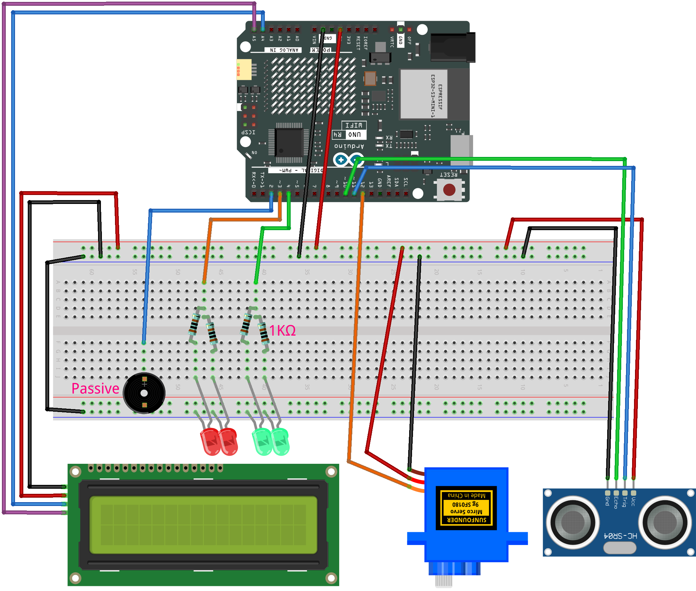

.. _radar_guard1.0:

Radar Guard 1.0
==============================================================

.. note::
  
  🌟 Welcome to the SunFounder Facebook Community! Whether you're into Raspberry Pi, Arduino, or ESP32, you'll find inspiration, help ideas here.
   
  - ✅ Be the first to get free learning resources. 
   
  - ✅ Stay updated on new products & exclusive giveaways. 
   
  - ✅ Share your creations and get real feedback
   
  * 👉 Need faster updates or support? Click [|link_sf_facebook|] join our Facebook community 

  * 👉 Or join our WhatsApp group: Click [|link_sf_whatsapp|]
   
  * 🎁 Looking for parts?Check out our all-in-one kits below — packed with components, beginner-friendly guides, and tons of fun.
  
  .. list-table::
    :widths: 20 20 20
    :header-rows: 1

    *   - Name	
        - Includes Arduino board
        - PURCHASE LINK
    *   - Elite Explorer Kit	
        - Arduino Uno R4 WiFi
        - |link_elite_buy|
    *   - 3 in 1 Ultimate Starter Kit
        - Arduino Uno R4 Minima
        - |link_arduinor4_buy|

Course Introduction
------------------------

In this lesson, we will learn how to use the Ultrasonic Sensor Module, Digital Servo Motor, and I2C LCD 1602 with the Arduino Board to create a radar defense system.

When the ultrasonic sensor module is running, it emits an audible alarm and flashes the red LED if it detects an obstacle within its sensing range. 
If no obstacle is detected, indicating a safe state, the green LED stays on.

.. raw:: html
 
  <iframe width="700" height="394" src="https://www.youtube.com/embed/IIe3DMzaRSA?si=EmbqV2plsvQtJ3yr" title="YouTube video player" frameborder="0" allow="accelerometer; autoplay; clipboard-write; encrypted-media; gyroscope; picture-in-picture; web-share" referrerpolicy="strict-origin-when-cross-origin" allowfullscreen></iframe>

.. note::

  If this is your first time working with an Arduino project, we recommend downloading and reviewing the basic materials first.
  
  * :ref:`install_arduino`
  * :ref:`introduce_arduino`

**Required Components**

In this project, we need the following components:

.. list-table::
    :widths: 5 20 5 20
    :header-rows: 1

    *   - SN
        - COMPONENT INTRODUCTION	
        - QUANTITY
        - PURCHASE LINK

    *   - 1
        - Arduino UNO R4 Minima/Arduino UNO R4 WIFI
        - 1
        - |link_unor4_wifi_buy|
    *   - 2
        - USB Type-C cable
        - 1
        - 
    *   - 3
        - Breadboard
        - 1
        - |link_breadboard_buy|
    *   - 4
        - Wires
        - Several
        - |link_wires_buy|
    *   - 5
        - 1kΩ resistor
        - 4
        - |link_resistor_buy|
    *   - 6
        - Ultrasonic Sensor Module
        - 1
        - |link_ultrasonic_buy|
    *   - 7
        - LED
        - 4
        - |link_led_buy|
    *   - 8
        - I2C LCD 1602
        - 1
        - |link_i2clcd1602_buy|
    *   - 9
        - Digital Servo Motor
        - 1
        - |link_motor_buy|
    *   - 10
        - Passive Buzzer
        - 1
        - |link_passive_buzzer_buy|

**Wiring**

**Common Connections:**

* **LED**

  - Connect the LEDs **anode** to a **1kΩ resistor** then to the negative power bus on the breadboard, and the LEDs **cathode** to **3**, **4** on the Arduino.

* **Digital Servo Motor**

  - Connect to breadboard’s positive power bus.
  - Connect to breadboard’s negative power bus.
  - Connect to **12** on the Arduino.

* **Button**

  - Connect to breadboard’s negative power bus.
  - Connect to **8** to **11** on the Arduino.

* **Passive Buzzer**

  - **＋:** Connect to **2** on the Arduino.
  - **－:** Connect to breadboard’s negative power bus.

* **I2C LCD 1602**

  - **SDA:** Connect to **A4** on the Arduino.
  - **SCL:** Connect to **A5** on the Arduino.
  - **GND:** Connect to breadboard’s negative power bus.
  - **VCC:** Connect to breadboard’s red power bus.

* **Ultrasonic Sensor Module**

  - **Trig:** Connect to **11** on the Arduino.
  - **Echo:** Connect to **10** on the Arduino.
  - **GND:** Connect to breadboard’s negative power bus.
  - **VCC:** Connect to breadboard’s red power bus.

**Writing the Code**

.. note::

    * You can copy this code into **Arduino IDE**. 
    * To install the library, use the Arduino Library Manager and search for **LiquidCrystal I2C** and install it.
    * Don't forget to select the board(Arduino UNO R4 WIFI) and the correct port before clicking the **Upload** button.

.. code-block:: arduino

      #include <Servo.h>
      #include <Wire.h>
      #include <LiquidCrystal_I2C.h>

      // Servo and ultrasonic sensor settings
      Servo radarServo;
      const int trigPin = 11;
      const int echoPin = 10;
      const int servoPin = 12;

      // LED and buzzer (active buzzer controlled via digitalWrite)
      const int redLed = 3;
      const int greenLed = 4;
      const int buzzer = 2;

      // Initialize the LCD (16x2). Check the I2C address (commonly 0x27 or 0x3F)
      LiquidCrystal_I2C lcd(0x27, 16, 2);

      // Settings
      const int alertDistance = 20;           // Alarm triggers if distance is less than 20cm
      const unsigned long updateInterval = 20; // Servo update interval (ms)

      // Variables for smooth scanning
      int currentAngle = 0;
      int increment = 1;  // Increase or decrease angle by 1 degree each update

      unsigned long lastServoUpdate = 0;

      // Variable to count consecutive detections under threshold
      int triggerCount = 0;

      // Enum to record state (for updating LCD only when state changes)
      enum RadarState { EMPTY, WARNING };
      RadarState lastState = EMPTY;

      void setup() {
        // Initialize servo
        radarServo.attach(servoPin);
        
        // Initialize ultrasonic sensor pins
        pinMode(trigPin, OUTPUT);
        pinMode(echoPin, INPUT);
        
        // Initialize LED and buzzer pins
        pinMode(redLed, OUTPUT);
        pinMode(greenLed, OUTPUT);
        pinMode(buzzer, OUTPUT);
        
        // Initialize LCD
        lcd.init();
        lcd.backlight();
        lcd.clear();
        
        // Set initial status: LCD shows "Area is Empty", green LED on
        lcdSetEmpty();
        setNormalState();
      }

      void loop() {
        unsigned long currentMillis = millis();
        
        // If not in alarm mode, update servo position smoothly
        if (currentMillis - lastServoUpdate >= updateInterval) {
          lastServoUpdate = currentMillis;
          
          // Update servo position
          radarServo.write(currentAngle);
          
          // Every 5 degrees, perform ultrasonic distance measurement
          if (currentAngle % 5 == 0) {
            float distance = getDistance();
            if (distance < alertDistance) {
              triggerCount++;  // Count consecutive detections under threshold
            } else {
              triggerCount = 0; // Reset counter if measurement is safe
            }
            
            // Trigger alarm only if detected three times consecutively
            if (triggerCount >= 5) {
              if (lastState != WARNING) {
                lastState = WARNING;
                lcdSetWarning();
              }
              alertMode();
              triggerCount = 0; // Reset counter after alarm mode
            }
            else {
              if (lastState != EMPTY) {
                lastState = EMPTY;
                lcdSetEmpty();
                setNormalState();
              }
            }
          }
          
          // Update angle for smooth scanning
          currentAngle += increment;
          if (currentAngle >= 180) {
            currentAngle = 180;
            increment = -1;
          } else if (currentAngle <= 0) {
            currentAngle = 0;
            increment = 1;
          }
        }
      }

      // Measure distance using the ultrasonic sensor (returns distance in cm)
      float getDistance() {
        digitalWrite(trigPin, LOW);
        delayMicroseconds(2);
        digitalWrite(trigPin, HIGH);
        delayMicroseconds(10);
        digitalWrite(trigPin, LOW);
        
        long duration = pulseIn(echoPin, HIGH, 30000);  // Wait for a maximum of 30ms
        float distance = duration * 0.034 / 2;  // Calculate distance (cm)
        return distance;
      }

      // Alarm mode: if an object is detected, halt servo and continuously alarm
      void alertMode() {
        // Turn off green LED while in alarm mode
        digitalWrite(greenLed, LOW);
        
        // Keep alarming until the object is removed
        while (getDistance() < alertDistance) {
          // Flash red LED and activate the active buzzer (producing continuous beeps)
          digitalWrite(redLed, HIGH);
          digitalWrite(buzzer, HIGH);
          delay(100);
          digitalWrite(redLed, LOW);
          digitalWrite(buzzer, LOW);
          delay(100);
        }
        // When safe, exit alarm mode and update status
        lcdSetEmpty();
        setNormalState();
        lastState = EMPTY;
      }

      // Set normal status: green LED on, red LED and buzzer off
      void setNormalState() {
        digitalWrite(greenLed, HIGH);
        digitalWrite(redLed, LOW);
        digitalWrite(buzzer, LOW);
      }

      // LCD display "Area is Empty" centered on the first line; clear the second line
      void lcdSetEmpty() {
        lcd.clear();
        // "Area is Empty" has 14 characters; center calculates as (16-14)/2 = 1
        lcd.setCursor(1, 0);
        lcd.print("Area is Empty");
        lcd.setCursor(0, 1);
        lcd.print("                ");
      }

      // LCD display warning message: first line "WARNING!!", second line "Foreign Body" centered
      void lcdSetWarning() {
        lcd.clear();
        // "WARNING!!" has 9 characters; center calculates as (16-9)/2 ≈ 4
        lcd.setCursor(4, 0);
        lcd.print("WARNING!!");
        // "Foreign Body" is printed starting at column 2 (as requested)
        lcd.setCursor(2, 1);
        lcd.print("Foreign Body");
      }
