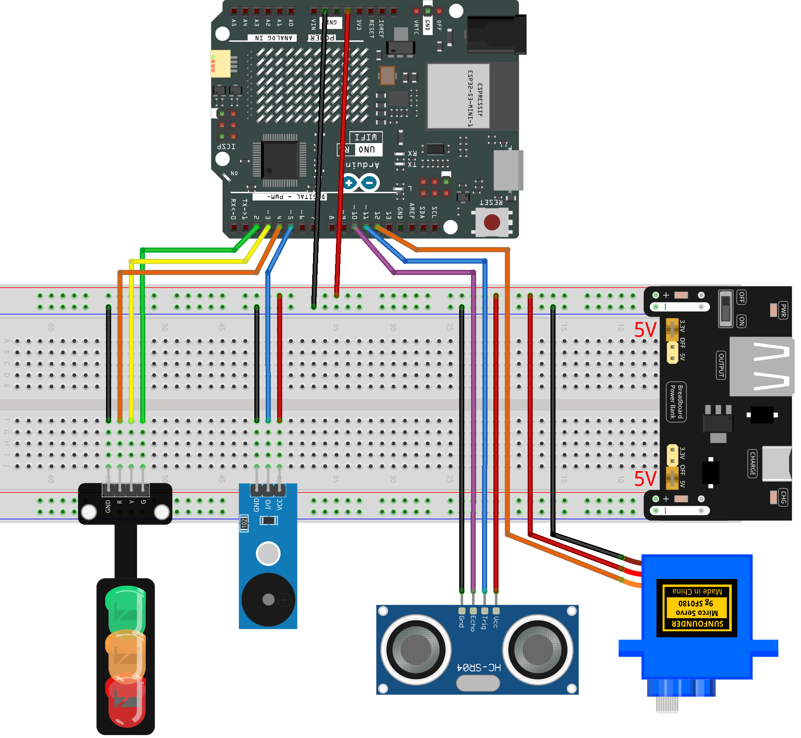

.. _radar_guard10.0:

Radar Guard 10.0
==============================================================

.. note::
  
  🌟 Welcome to the SunFounder Facebook Community! Whether you're into Raspberry Pi, Arduino, or ESP32, you'll find inspiration, help ideas here.
   
  - ✅ Be the first to get free learning resources. 
   
  - ✅ Stay updated on new products & exclusive giveaways. 
   
  - ✅ Share your creations and get real feedback.
   
  * 👉 Need faster updates or support? Click [|link_sf_facebook|] join our Facebook community 

  * 👉 Or join our WhatsApp group: Click [|link_sf_whatsapp|]
   
  * 🎁 Looking for parts?Check out our all-in-one kits below — packed with components, beginner-friendly guides, and tons of fun.
  
  .. list-table::
    :widths: 20 20 20
    :header-rows: 1

    *   - Name	
        - Includes Arduino board
        - PURCHASE LINK
    *   - Elite Explorer Kit	
        - Arduino Uno R4 WiFi
        - |link_elite_buy|
    *   - 3 in 1 Ultimate Starter Kit
        - Arduino Uno R4 Minima
        - |link_arduinor4_buy|

Course Introduction
------------------------

In this lesson, you’ll build an ultrasonic safety scanner using a servo, LEDs, and a buzzer. The servo sweeps the ultrasonic sensor to detect distance, while the LEDs change from green to yellow to red based on how close an object is. In danger zones, the buzzer sounds an alert with different beeping patterns.

.. .. raw:: html
 
..  <iframe width="700" height="394" src="https://www.youtube.com/embed/TtjAzlOizvg" title="YouTube video player" frameborder="0" allow="accelerometer; autoplay; clipboard-write; encrypted-media; gyroscope; picture-in-picture; web-share" referrerpolicy="strict-origin-when-cross-origin" allowfullscreen></iframe>

.. note::

  If this is your first time working with an Arduino project, we recommend downloading and reviewing the basic materials first.
  
  * :ref:`install_arduino`
  * :ref:`introduce_arduino`

**Required Components**

In this project, we need the following components:

.. list-table::
    :widths: 5 20 5 20
    :header-rows: 1

    *   - SN
        - COMPONENT INTRODUCTION	
        - QUANTITY
        - PURCHASE LINK

    *   - 1
        - Arduino UNO R4 Minima/Arduino UNO R4 WIFI
        - 1
        - |link_unor4_wifi_buy|
    *   - 2
        - USB Type-C cable
        - 1
        - 
    *   - 3
        - Breadboard
        - 1
        - |link_breadboard_buy|
    *   - 4
        - Wires
        - Several
        - |link_wires_buy|
    *   - 5
        - Ultrasonic Sensor Module
        - 1
        - |link_ultrasonic_buy|
    *   - 6
        - I2C LCD 1602
        - 1
        - |link_i2clcd1602_buy|
    *   - 7
        - Digital Servo Motor
        - 1
        - |link_motor_buy|
    *   - 8
        - Buzzer Module
        - 1
        - |link_buzzer_module_buy|
    *   - 9
        - Traffic Light LED
        - 1
        - |link_trafficlinght_buy|

**Wiring**

**Common Connections:**

* **Traffic light LED**

  - **R:** Connect to **2** on the Arduino.
  - **Y:** Connect to **3** on the Arduino.
  - **G:** Connect to **4** on the Arduino.
  - **GND:** Connect to **GND** on the Arduino.

* **Digital Servo Motor**

  - Connect to breadboard’s positive power bus.
  - Connect to breadboard’s negative power bus.
  - Connect to **12** on the Arduino.

* **Buzzer Modudle**

  - **I/O:** Connect to **5** on the Arduino.
  - **GND:** Connect to breadboard’s negative power bus.
  - **VCC:** Connect to breadboard’s red power bus.

* **Ultrasonic Sensor Module**

  - **Trig:** Connect to **11** on the Arduino.
  - **Echo:** Connect to **10** on the Arduino.
  - **GND:** Connect to breadboard’s negative power bus.
  - **VCC:** Connect to breadboard’s red power bus.

**Writing the Code**

.. note::

 * Build the circuit.

 * Upload the code to the Arduino board using Arduino IDE.

 * In the Arduino IDE, check the current Arduino port(COMx).

 * The ``ArduinoRadarGUI`` is used here. You can click here :download:`Radar_Guard10.0.zip </_static/Radar_Guard10.0.zip>` to download it. 
 
 * Open ArduinoLidarGUI.pde in the |link_processing_ide|.

 * Modify the code in line 35 to ensure the correct port number(COMx).

 * Run the Processing sketch to visualize the radar data.

.. code-block:: arduino

      #include <Servo.h>

      // ------------ Pin Definitions ------------
      const int trigPin   = 11;    // Ultrasonic Trig pin
      const int echoPin   = 10;    // Ultrasonic Echo pin
      const int servoPin  = 12;    // Servo signal pin
      const int buzzerPin = 5;     // Passive buzzer
      const int greenLED  = 2;     // Traffic light - Green
      const int yellowLED = 3;     // Traffic light - Yellow
      const int redLED    = 4;     // Traffic light - Red

      // ------------ Servo Settings ------------
      const int minAngle  = 0;     // Servo minimum angle
      const int maxAngle  = 180;   // Servo maximum angle
      const int stepAngle = 1;     // Servo movement step
      int currentAngle    = minAngle;
      int direction       = 1;     // +1 for forward, -1 for backward

      // ------------ Distance Thresholds ------------
      const int thresholdYellowCM = 30;  // ≤30cm = Yellow zone
      const int thresholdRedCM    = 15;  // ≤15cm = Red zone

      // ------------ Buzzer Control ------------
      bool buzzerEnabled = false;
      unsigned long nextBuzzTime = 0;
      int buzzerFreq = 2000;     // Default beep frequency
      int buzzOnMs    = 80;
      int buzzOffMs   = 200;
      bool buzzing = false;

      // ------------ Timing ------------
      unsigned long nextServoMove = 0;
      const uint16_t servoStepInterval = 20;

      // ------------ Servo Object ------------
      Servo scanner;

      // ------------ Measure distance (cm) ------------
      long measureDistanceCM() {
        digitalWrite(trigPin, LOW);
        delayMicroseconds(2);
        digitalWrite(trigPin, HIGH);
        delayMicroseconds(10);
        digitalWrite(trigPin, LOW);

        unsigned long duration = pulseIn(echoPin, HIGH, 20000); // timeout 20ms
        if (duration == 0) return 9999;                         // No echo

        long distance = duration / 58.0;
        if (distance <= 0) distance = 9999;
        return distance;
      }

      // ------------ Update LEDs + Buzzer by distance ------------
      void updateStateByDistance(long dist) {

        // ---- Red zone ----
        if (dist <= thresholdRedCM) {

          digitalWrite(redLED, HIGH);
          digitalWrite(yellowLED, LOW);
          digitalWrite(greenLED, LOW);

          buzzerEnabled = true;
          buzzerFreq = 2800;   // Danger tone
          buzzOnMs  = 120;
          buzzOffMs = 120;
        }

        // ---- Yellow zone ----
        else if (dist <= thresholdYellowCM) {

          digitalWrite(redLED, LOW);
          digitalWrite(yellowLED, HIGH);
          digitalWrite(greenLED, LOW);

          buzzerEnabled = true;
          buzzerFreq = 2000;   // Warning tone
          buzzOnMs  = 80;
          buzzOffMs = 250;
        }

        // ---- Green zone ----
        else {

          digitalWrite(redLED, LOW);
          digitalWrite(yellowLED, LOW);
          digitalWrite(greenLED, HIGH);

          buzzerEnabled = false;
          noTone(buzzerPin);
        }
      }

      // ------------ Non-blocking buzzer scheduler ------------
      void updateBuzzer(unsigned long now) {
        if (!buzzerEnabled) {
          buzzing = false;
          noTone(buzzerPin);
          return;
        }

        if (now >= nextBuzzTime) {
          if (!buzzing) {
            tone(buzzerPin, buzzerFreq);
            buzzing = true;
            nextBuzzTime = now + buzzOnMs;
          } else {
            noTone(buzzerPin);
            buzzing = false;
            nextBuzzTime = now + buzzOffMs;
          }
        }
      }

      // ------------ Setup ------------
      void setup() {
        Serial.begin(9600);

        pinMode(trigPin, OUTPUT);
        pinMode(echoPin, INPUT);

        pinMode(buzzerPin, OUTPUT);
        pinMode(greenLED, OUTPUT);
        pinMode(yellowLED, OUTPUT);
        pinMode(redLED, OUTPUT);

        // Initial LED state
        digitalWrite(greenLED, HIGH);
        digitalWrite(yellowLED, LOW);
        digitalWrite(redLED, LOW);

        // Servo init
        scanner.attach(servoPin);
        scanner.write(currentAngle);

        nextServoMove = millis();
        nextBuzzTime = millis();
      }

      // ------------ Main Loop ------------
      void loop() {
        unsigned long now = millis();

        // ------ Servo movement control ------
        if (now >= nextServoMove) {
          nextServoMove = now + servoStepInterval;

          currentAngle += direction * stepAngle;

          if (currentAngle >= maxAngle) {
            currentAngle = maxAngle;
            direction = -1;
          }
          else if (currentAngle <= minAngle) {
            currentAngle = minAngle;
            direction = 1;
          }

          scanner.write(currentAngle);

          long dist = measureDistanceCM();

          updateStateByDistance(dist);

          // Send angle + distance to Processing GUI
          Serial.print(currentAngle);
          Serial.print(",");
          Serial.print(dist);
          Serial.print(".");
        }

        // ------ Update buzzer (non-blocking) ------
        updateBuzzer(now);
      }
