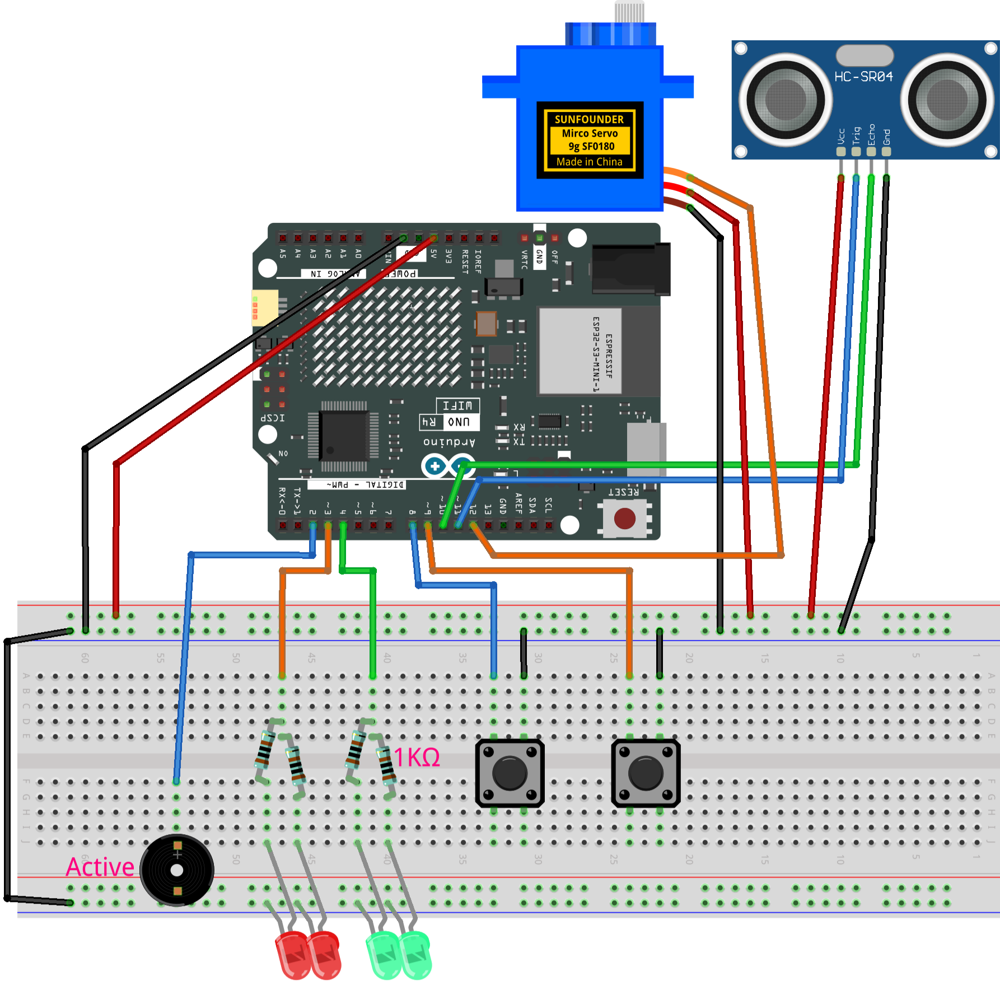

.. _radar_guard11.0:

Radar Guard 11.0
==============================================================

.. note::
  
  🌟 Welcome to the SunFounder Facebook Community! Whether you're into Raspberry Pi, Arduino, or ESP32, you'll find inspiration, help ideas here.
   
  - ✅ Be the first to get free learning resources. 
   
  - ✅ Stay updated on new products & exclusive giveaways. 
   
  - ✅ Share your creations and get real feedback.
   
  * 👉 Need faster updates or support? Click [|link_sf_facebook|] join our Facebook community 

  * 👉 Or join our WhatsApp group: Click [|link_sf_whatsapp|]
   
Kit purchase
------------------------

Looking for parts? Check out our all-in-one kits below — packed with components, beginner-friendly guides, and tons of fun.

.. image:: img/elite_explore_kit.png
   :width: 100%
   :align: center
   :target: https://www.sunfounder.com/collections/arduino-kits-bundles/products/sunfounder-elite-explorer-kit-with-official-arduino-uno-r4-wifi?ref=jbzmncle

.. raw:: html

     

.. list-table::
   :widths: 20 20 20
   :header-rows: 1

   * - Name
     - Includes Arduino board
     - PURCHASE LINK
   * - Ultimate Sensor Kit
     - Arduino Uno R4 Minima
     - |link_ultimate_sensor_buy|
   * - Elite Explorer Kit
     - Arduino Uno R4 WiFi
     - |link_elite_buy|
   * - 3 in 1 Ultimate Starter Kit
     - Arduino Uno R4 Minima
     - |link_arduinor4_buy|
   * - Universal Maker Sensor Kit
     - ×
     - |link_umsk_buy|

Course Introduction
------------------------

This project creates a servo-based ultrasonic scanner with LEDs and a buzzer. The ultrasonic sensor sweeps left and right to detect objects. When something gets too close, the red LED and buzzer turn on as an alarm, and when the area is safe, the green LED lights up.

.. raw:: html

   <iframe width="700" height="394" src="https://www.youtube.com/embed/GvmddEXRVKg?si=ukv_8M09It9rxy3D" title="YouTube video player" frameborder="0" allow="accelerometer; autoplay; clipboard-write; encrypted-media; gyroscope; picture-in-picture; web-share" referrerpolicy="strict-origin-when-cross-origin" allowfullscreen></iframe>

.. note::

  If this is your first time working with an Arduino project, we recommend downloading and reviewing the basic materials first.
  
  * :ref:`install_arduino`
  * :ref:`introduce_arduino`

**Required Components**

In this project, we need the following components:

.. list-table::
    :widths: 5 20 5 20
    :header-rows: 1

    *   - SN
        - COMPONENT INTRODUCTION	
        - QUANTITY
        - PURCHASE LINK

    *   - 1
        - Arduino UNO R4 Minima/Arduino UNO R4 WIFI
        - 1
        - |link_unor4_wifi_buy|
    *   - 2
        - USB Type-C cable
        - 1
        - 
    *   - 3
        - Breadboard
        - 1
        - |link_breadboard_buy|
    *   - 4
        - Wires
        - Several
        - |link_wires_buy|
    *   - 5
        - Ultrasonic Sensor Module
        - 1
        - |link_ultrasonic_buy|
    *   - 6
        - 1kΩ resistor
        - 4
        - |link_resistor_buy|
    *   - 7
        - Digital Servo Motor
        - 1
        - |link_motor_buy|
    *   - 8
        - Active Buzzer
        - 1
        - 
    *   - 9
        - LED
        - 4
        - |link_led_buy|
    *   - 10
        - Button
        - 2
        - |link_button_buy|

**Wiring**

**Common Connections:**

* **Red LED**

  - Connect the LEDs **cathode** to the negative power bus on the breadboard, and the LEDs **anode** to a **1kΩ resistor** then to **3** on the Arduino.

* **Green LED**

  - Connect the LEDs **cathode** to the negative power bus on the breadboard, and the LEDs **anode** to a **1kΩ resistor** then to **4** on the Arduino.

* **Button Left**

  - Connect to the breadboard’s negative power bus, and the other end to **8** on the Arduino board.

* **Button Right**

  - Connect to the breadboard’s negative power bus, and the other end to **9** on the Arduino board.

* **Digital Servo Motor**

  - Connect to breadboard’s positive power bus.
  - Connect to breadboard’s negative power bus.
  - Connect to **12** on the Arduino.

* **Active Buzzer**

  - **GND:** Connect to breadboard’s negative power bus.
  - **+:** Connect to **2** on the Arduino.

* **Ultrasonic Sensor Module**

  - **Trig:** Connect to **11** on the Arduino.
  - **Echo:** Connect to **10** on the Arduino.
  - **GND:** Connect to breadboard’s negative power bus.
  - **VCC:** Connect to breadboard’s red power bus.

**Writing the Code**

.. note::

 * Build the circuit.

 * Upload the code to the Arduino board using Arduino IDE.

 * In the Arduino IDE, check the current Arduino port(COMx).

 * The ``ArduinoRadarGUI`` is used here. You can click here :download:`Radar_Guard11.0.zip </_static/Radar_Guard11.0.zip>` to download it. 
 
 * Open ArduinoLidarGUI.pde in the |link_processing_ide|.

 * Modify the code in line 35 to ensure the correct port number(COMx).

 * Run the Processing sketch to visualize the radar data.

.. code-block:: arduino

      #include <Servo.h>

      // Ultrasonic sensor pins
      const int trigPin   = 11;
      const int echoPin   = 10;

      // Output devices
      const int servoPin  = 12;
      const int buzzerPin = 2;    // Active buzzer: HIGH = sound

      const int ledGreen = 4;
      const int ledRed   = 3;

      // Control buttons
      // Blue button: rotate servo to the right
      // Red button: rotate servo to the left
      const int btnBlue = 8;
      const int btnRed  = 9;

      // Servo control
      Servo radarServo;
      int currentAngle = 90;      // Start from center position
      int servoDir = 0;           // -1 = left, 0 = stop, 1 = right

      const int servoStep = 1;    // Move 1 degree each update
      const unsigned long servoInterval = 20;
      unsigned long lastServoMillis = 0;

      // Direction hold (fix for button switching issue)
      unsigned long lastDirChangeMillis = 0;
      const unsigned long dirHoldTime = 50; // ms

      // Ultrasonic detection
      const int alertDistance = 20;   // Alarm distance (cm)
      int triggerCount = 0;

      unsigned long lastPingMillis = 0;
      const unsigned long pingInterval = 60;

      // System state
      enum RadarState { SAFE, ALERT };
      RadarState radarState = SAFE;

      // Alarm blinking control
      unsigned long lastAlertMillis = 0;
      bool alertToggle = false;
      const unsigned long alertInterval = 120;

      // Last valid distance for radar output
      int lastDistance = 40;

      void setup() {
        pinMode(trigPin, OUTPUT);
        pinMode(echoPin, INPUT);

        pinMode(buzzerPin, OUTPUT);
        pinMode(ledGreen, OUTPUT);
        pinMode(ledRed, OUTPUT);

        pinMode(btnBlue, INPUT_PULLUP);
        pinMode(btnRed, INPUT_PULLUP);

        radarServo.attach(servoPin);
        radarServo.write(currentAngle);

        digitalWrite(ledGreen, HIGH);
        digitalWrite(ledRed, LOW);
        digitalWrite(buzzerPin, LOW);

        Serial.begin(9600);
      }

      void loop() {
        readButtons();
        updateServo();
        updateDistance();
        handleAlert();
        sendRadarData();
      }

      void readButtons() {
        bool bluePressed = (digitalRead(btnBlue) == LOW);
        bool redPressed  = (digitalRead(btnRed)  == LOW);

        if (bluePressed) {
          servoDir = 1;   // Rotate right
          lastDirChangeMillis = millis();
        }
        else if (redPressed) {
          servoDir = -1;  // Rotate left
          lastDirChangeMillis = millis();
        }
        else {
          // Keep last direction for a short time
          if (millis() - lastDirChangeMillis > dirHoldTime) {
            servoDir = 0;
          }
        }
      }

      void updateServo() {
        if (millis() - lastServoMillis >= servoInterval) {
          lastServoMillis = millis();

          currentAngle += servoDir * servoStep;
          currentAngle = constrain(currentAngle, 0, 180);

          radarServo.write(currentAngle);
        }
      }

      void updateDistance() {
        // Skip distance check during alarm
        if (radarState == ALERT) return;

        if (millis() - lastPingMillis < pingInterval) return;
        lastPingMillis = millis();

        int distance = getDistance();
        if (distance <= 0) return;

        lastDistance = distance;

        if (distance < alertDistance) {
          triggerCount++;
        } else {
          triggerCount = 0;
        }

        if (triggerCount >= 5) {
          radarState = ALERT;
        }
      }

      void handleAlert() {
        if (radarState == ALERT) {
          if (millis() - lastAlertMillis >= alertInterval) {
            lastAlertMillis = millis();
            alertToggle = !alertToggle;

            digitalWrite(ledRed, alertToggle);
            digitalWrite(buzzerPin, alertToggle);
            digitalWrite(ledGreen, LOW);
          }

          int dist = getDistance();
          if (dist >= alertDistance && dist > 0) {
            radarState = SAFE;
            triggerCount = 0;

            digitalWrite(ledRed, LOW);
            digitalWrite(buzzerPin, LOW);
            digitalWrite(ledGreen, HIGH);
          }
        }
        else {
          digitalWrite(ledRed, LOW);
          digitalWrite(buzzerPin, LOW);
          digitalWrite(ledGreen, HIGH);
        }
      }

      void sendRadarData() {
        // Processing expects: angle,distance.
        Serial.print(currentAngle);
        Serial.print(",");
        Serial.print(lastDistance);
        Serial.print(".");
      }

      int getDistance() {
        digitalWrite(trigPin, LOW);
        delayMicroseconds(2);
        digitalWrite(trigPin, HIGH);
        delayMicroseconds(10);
        digitalWrite(trigPin, LOW);

        long duration = pulseIn(echoPin, HIGH, 12000);
        if (duration == 0) return -1;

        return duration * 0.034 / 2;
      }
