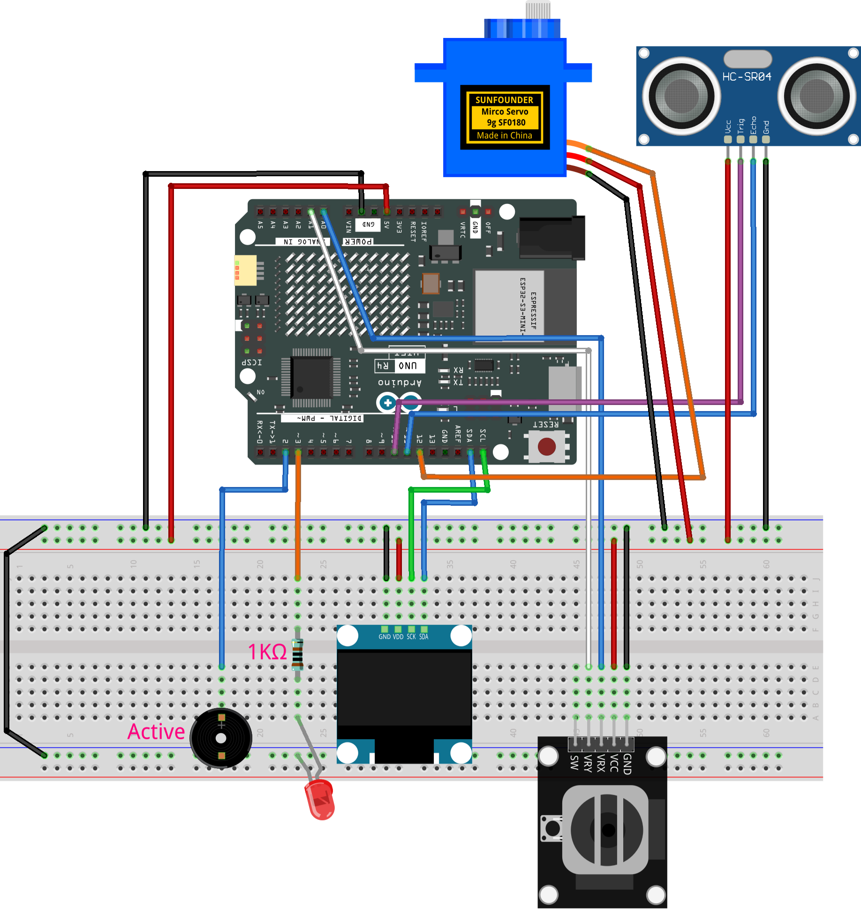

.. _radar_guard12.0:

Radar Guard 12.0
==============================================================

.. note::
  
  🌟 Welcome to the SunFounder Facebook Community! Whether you're into Raspberry Pi, Arduino, or ESP32, you'll find inspiration, help ideas here.
   
  - ✅ Be the first to get free learning resources. 
   
  - ✅ Stay updated on new products & exclusive giveaways. 
   
  - ✅ Share your creations and get real feedback.
   
  * 👉 Need faster updates or support? Click [|link_sf_facebook|] join our Facebook community 

  * 👉 Or join our WhatsApp group: Click [|link_sf_whatsapp|]
   
Kit purchase
------------------------

Looking for parts? Check out our all-in-one kits below — packed with components, beginner-friendly guides, and tons of fun.

.. image:: img/elite_explore_kit.png
   :width: 100%
   :align: center
   :target: https://www.sunfounder.com/collections/arduino-kits-bundles/products/sunfounder-elite-explorer-kit-with-official-arduino-uno-r4-wifi?ref=jbzmncle

.. raw:: html

     

.. list-table::
   :widths: 20 20 20
   :header-rows: 1

   * - Name
     - Includes Arduino board
     - PURCHASE LINK
   * - Ultimate Sensor Kit
     - Arduino Uno R4 Minima
     - |link_ultimate_sensor_buy|
   * - Elite Explorer Kit
     - Arduino Uno R4 WiFi
     - |link_elite_buy|
   * - 3 in 1 Ultimate Starter Kit
     - Arduino Uno R4 Minima
     - |link_arduinor4_buy|
   * - Universal Maker Sensor Kit
     - ×
     - |link_umsk_buy|

Course Introduction
------------------------

In this lesson, you’ll learn how to use an OLED display, an ultrasonic sensor, a servo, a joystick, an LED, and a buzzer with the Arduino UNO R4 to create a Radar Guard system. We’ll use the Adafruit SSD1306 and GFX libraries to display distance, angle, and detection status on the screen.

Players can move the sensor left and right with the joystick. When an object is detected within 20 cm, the OLED shows an alert while the LED and buzzer turn on.

.. .. raw:: html
 
..  <iframe width="700" height="394" src="https://www.youtube.com/embed/8P2FZA5f90E?si=u_6onrcnZY4Xhi4J" title="YouTube video player" frameborder="0" allow="accelerometer; autoplay; clipboard-write; encrypted-media; gyroscope; picture-in-picture; web-share" referrerpolicy="strict-origin-when-cross-origin" allowfullscreen></iframe>

.. note::

  If this is your first time working with an Arduino project, we recommend downloading and reviewing the basic materials first.
  
  * :ref:`install_arduino`
  * :ref:`introduce_arduino`

**Required Components**

In this project, we need the following components:

.. list-table::
    :widths: 5 20 5 20
    :header-rows: 1

    *   - SN
        - COMPONENT INTRODUCTION	
        - QUANTITY
        - PURCHASE LINK

    *   - 1
        - Arduino UNO R4 Minima
        - 1
        - |link_unor4_buy|
    *   - 2
        - USB Type-C cable
        - 1
        - 
    *   - 3
        - Breadboard
        - 1
        - |link_breadboard_buy|
    *   - 4
        - Wires
        - Several
        - |link_wires_buy|
    *   - 5
        - Ultrasonic Sensor Module
        - 1
        - |link_ultrasonic_buy|
    *   - 6
        - Digital Servo Motor
        - 1
        - |link_motor_buy|
    *   - 7
        - Active Buzzer
        - 1
        - 
    *   - 8
        - LED
        - 1
        - |link_led_buy|
    *   - 9
        - 1kΩ resistor
        - 1
        - |link_resistor_buy|
    *   - 10
        - OLED Display Module
        - 1
        - |link_oled_buy|
    *   - 11
        - Joystick Module
        - 1
        - |link_joystick_buy|

**Wiring**

**Common Connections:**

* **LED**

  - **Red LED**: Connect the LEDs **anode** to a **1kΩ resistor** then to the  **3** on Arduino, and the LEDs **cathode** to  negative power bus on the breadboard.

* **Active Buzzer**

  - **＋:** Connect to **2** on the Arduino.
  - **－:** Connect to breadboard’s negative power bus.

* **Digital Servo Motor**

  - Connect to breadboard’s positive power bus.
  - Connect to breadboard’s negative power bus.
  - Connect to **12** on the Arduino.

* **Ultrasonic Sensor Module**

  - **Trig:** Connect to **10** on the Arduino.
  - **Echo:** Connect to **11** on the Arduino.
  - **GND:** Connect to breadboard’s negative power bus.
  - **VCC:** Connect to breadboard’s red power bus.

* **OLED Display Module**

  - **SDA:** Connect to **SDA** on the Arduino.
  - **SCK:** Connect to **SCL** on the Arduino.
  - **GND:** Connect to breadboard’s negative power bus.
  - **VCC:** Connect to breadboard’s red power bus.

* **Joystick Module**

  - **VRY:** Connect to **A1** on the Arduino.
  - **VRX:** Connect to **A0** on the Arduino.
  - **GND:** Connect to breadboard’s negative power bus.
  - **VCC:** Connect to breadboard’s red power bus.

**Writing the Code**

.. note::

    * You can copy this code into **Arduino IDE**. 
    * To install the library, use the Arduino Library Manager and search for  **Adafruit GFX** and **Adafruit SSD1306** and install it.
    * Don't forget to select the board(Arduino UNO R4 Minima/WIFI) and the correct port before clicking the **Upload** button.

.. code-block:: arduino

      #include <Wire.h>
      #include <Servo.h>
      #include <Adafruit_GFX.h>
      #include <Adafruit_SSD1306.h>

      // OLED screen size and I2C address
      #define SCREEN_WIDTH 128
      #define SCREEN_HEIGHT 64
      #define OLED_RESET -1
      #define OLED_ADDRESS 0x3C

      // Create the OLED display object
      Adafruit_SSD1306 display(
        SCREEN_WIDTH,
        SCREEN_HEIGHT,
        &Wire,
        OLED_RESET
      );

      // Ultrasonic sensor pins
      const int TRIG_PIN = 10;
      const int ECHO_PIN = 11;

      // Output device pins
      const int SERVO_PIN = 12;
      const int BUZZER_PIN = 2;
      const int RED_LED_PIN = 3;

      // Joystick horizontal axis pin
      const int JOYSTICK_X_PIN = A0;

      // Create the servo object
      Servo radarServo;

      // Current servo position
      int servoAngle = 90;

      // Servo movement limits
      const int MIN_SERVO_ANGLE = 15;
      const int MAX_SERVO_ANGLE = 165;

      // Servo movement speed
      const int SERVO_STEP = 3;
      const unsigned long SERVO_INTERVAL = 20;

      unsigned long lastServoUpdate = 0;

      // Joystick center dead zone
      const int JOYSTICK_LEFT_THRESHOLD = 400;
      const int JOYSTICK_RIGHT_THRESHOLD = 620;

      // Distance settings
      const int ALERT_DISTANCE_CM = 20;
      const int RELEASE_DISTANCE_CM = 20;
      const int MAX_DISTANCE_CM = 300;

      // Number of close readings needed before the alarm starts
      const int DETECTION_CONFIRM_COUNT = 2;

      // Keep the detected state briefly after the object moves away
      const unsigned long DETECTED_HOLD_TIME = 300;

      // Distance measurement timing
      const unsigned long DISTANCE_INTERVAL = 80;
      unsigned long lastDistanceUpdate = 0;

      int currentDistance = -1;

      // Detection state
      bool objectDetected = false;
      int detectionCount = 0;
      unsigned long lastDetectedTime = 0;

      // OLED refresh timing
      const unsigned long DISPLAY_INTERVAL = 80;
      unsigned long lastDisplayUpdate = 0;

      // Alarm blink timing
      const unsigned long ALARM_ON_TIME = 80;
      const unsigned long ALARM_OFF_TIME = 80;

      unsigned long lastAlarmToggle = 0;
      bool alarmOutputState = false;

      void setup() {
        // Set ultrasonic sensor pin modes
        pinMode(TRIG_PIN, OUTPUT);
        pinMode(ECHO_PIN, INPUT);

        // Set LED and buzzer as outputs
        pinMode(BUZZER_PIN, OUTPUT);
        pinMode(RED_LED_PIN, OUTPUT);

        // Set joystick pin as input
        pinMode(JOYSTICK_X_PIN, INPUT);

        // Start all outputs in the off state
        digitalWrite(TRIG_PIN, LOW);
        digitalWrite(BUZZER_PIN, LOW);
        digitalWrite(RED_LED_PIN, LOW);

        // Attach the servo and move it to the center
        radarServo.attach(SERVO_PIN);
        radarServo.write(servoAngle);

        // Start the OLED display
        if (!display.begin(SSD1306_SWITCHCAPVCC, OLED_ADDRESS)) {
          // Blink the LED if the OLED cannot start
          while (true) {
            digitalWrite(RED_LED_PIN, HIGH);
            delay(200);

            digitalWrite(RED_LED_PIN, LOW);
            delay(200);
          }
        }

        // Prepare the OLED text color
        display.clearDisplay();
        display.setTextColor(SSD1306_WHITE);

        // Show the startup message
        showStartupScreen();

        delay(1200);
      }

      void loop() {
        // Run each task repeatedly
        updateServoFromJoystick();
        updateDistance();
        updateDetection();
        updateAlarm();
        updateOLED();
      }

      void updateServoFromJoystick() {
        unsigned long currentMillis = millis();

        // Wait until the next servo update
        if (currentMillis - lastServoUpdate < SERVO_INTERVAL) {
          return;
        }

        lastServoUpdate = currentMillis;

        // Read the joystick horizontal position
        int joystickX = analogRead(JOYSTICK_X_PIN);

        // Move the servo left
        if (joystickX < JOYSTICK_LEFT_THRESHOLD) {
          servoAngle -= SERVO_STEP;
        }

        // Move the servo right
        else if (joystickX > JOYSTICK_RIGHT_THRESHOLD) {
          servoAngle += SERVO_STEP;
        }

        // Keep the servo angle inside the safe range
        servoAngle = constrain(
          servoAngle,
          MIN_SERVO_ANGLE,
          MAX_SERVO_ANGLE
        );

        // Send the new angle to the servo
        radarServo.write(servoAngle);
      }

      void updateDistance() {
        unsigned long currentMillis = millis();

        // Wait until the next distance measurement
        if (currentMillis - lastDistanceUpdate < DISTANCE_INTERVAL) {
          return;
        }

        lastDistanceUpdate = currentMillis;

        // Use the newest measurement directly
        currentDistance = measureDistance();
      }

      int measureDistance() {
        // Make sure the trigger pin starts low
        digitalWrite(TRIG_PIN, LOW);
        delayMicroseconds(2);

        // Send a 10 microsecond trigger pulse
        digitalWrite(TRIG_PIN, HIGH);
        delayMicroseconds(10);
        digitalWrite(TRIG_PIN, LOW);

        // Measure how long the echo signal stays high
        unsigned long duration = pulseIn(
          ECHO_PIN,
          HIGH,
          20000UL
        );

        // Return -1 when no echo is received
        if (duration == 0) {
          return -1;
        }

        // Convert the echo time into centimeters
        int distance = duration * 0.0343 / 2.0;

        // Ignore readings outside the valid range
        if (distance <= 0 || distance > MAX_DISTANCE_CM) {
          return -1;
        }

        return distance;
      }

      void updateDetection() {
        unsigned long currentMillis = millis();

        // Check whether an object is inside the alert range
        bool targetInsideAlertRange =
          currentDistance > 0 &&
          currentDistance <= ALERT_DISTANCE_CM;

        if (!objectDetected) {
          // Count consecutive close readings
          if (targetInsideAlertRange) {
            detectionCount++;

            // Start the alarm after enough close readings
            if (detectionCount >= DETECTION_CONFIRM_COUNT) {
              objectDetected = true;
              detectionCount = 0;
              lastDetectedTime = currentMillis;

              // Turn on the first alarm pulse immediately
              alarmOutputState = true;
              lastAlarmToggle = currentMillis;

              digitalWrite(RED_LED_PIN, HIGH);
              digitalWrite(BUZZER_PIN, HIGH);
            }
          } else {
            // Reset the count when the object is not close
            detectionCount = 0;
          }
        } else {
          // Keep the detected state while the object is nearby
          if (
            currentDistance > 0 &&
            currentDistance <= RELEASE_DISTANCE_CM
          ) {
            lastDetectedTime = currentMillis;
          }

          // Return to scanning after the hold time ends
          if (
            currentMillis - lastDetectedTime >=
            DETECTED_HOLD_TIME
          ) {
            objectDetected = false;
            detectionCount = 0;
          }
        }
      }

      void updateAlarm() {
        unsigned long currentMillis = millis();

        // Keep the alarm off when no object is detected
        if (!objectDetected) {
          alarmOutputState = false;

          digitalWrite(RED_LED_PIN, LOW);
          digitalWrite(BUZZER_PIN, LOW);

          return;
        }

        // Use a different wait time for the on and off states
        unsigned long alarmInterval;

        if (alarmOutputState) {
          alarmInterval = ALARM_ON_TIME;
        } else {
          alarmInterval = ALARM_OFF_TIME;
        }

        // Toggle the LED and buzzer after the interval
        if (
          currentMillis - lastAlarmToggle >=
          alarmInterval
        ) {
          lastAlarmToggle = currentMillis;
          alarmOutputState = !alarmOutputState;

          digitalWrite(
            RED_LED_PIN,
            alarmOutputState ? HIGH : LOW
          );

          digitalWrite(
            BUZZER_PIN,
            alarmOutputState ? HIGH : LOW
          );
        }
      }

      void updateOLED() {
        unsigned long currentMillis = millis();

        // Wait until the next OLED refresh
        if (
          currentMillis - lastDisplayUpdate <
          DISPLAY_INTERVAL
        ) {
          return;
        }

        lastDisplayUpdate = currentMillis;

        // Choose the screen based on the detection state
        if (objectDetected) {
          showDetectedScreen();
        } else {
          showScanningScreen();
        }
      }

      void showStartupScreen() {
        // Clear the previous frame
        display.clearDisplay();

        // Show the project title
        display.setTextSize(1);
        display.setCursor(8, 15);
        display.println("*** RADAR GUARD ***");

        // Show the startup message
        display.setCursor(35, 35);
        display.println("Starting...");

        // Send the frame to the OLED
        display.display();
      }

      void showScanningScreen() {
        // Clear the previous frame
        display.clearDisplay();

        display.setTextColor(SSD1306_WHITE);
        display.setTextSize(1);

        // Show the project title
        display.setCursor(8, 2);
        display.println("*** RADAR GUARD ***");

        // Draw a line below the title
        display.drawLine(
          0,
          13,
          127,
          13,
          SSD1306_WHITE
        );

        // Show the measured distance
        display.setCursor(0, 20);
        display.print("Distance: ");

        if (currentDistance < 0) {
          display.println("-- cm");
        } else {
          display.print(currentDistance);
          display.println(" cm");
        }

        // Show the current servo angle
        display.setCursor(0, 34);
        display.print("Angle: ");
        display.print(servoAngle);
        display.println(" deg");

        // Show the current system status
        display.setCursor(0, 48);
        display.println("Status: Scanning");

        // Send the frame to the OLED
        display.display();
      }

      void showDetectedScreen() {
        // Clear the previous frame
        display.clearDisplay();

        display.setTextColor(SSD1306_WHITE);

        // Show the alert title
        display.setTextSize(2);
        display.setCursor(14, 0);
        display.println("DETECTED!");

        // Prepare the distance text
        display.setTextSize(2);

        String distanceText;

        if (currentDistance < 0) {
          distanceText = "-- cm";
        } else {
          distanceText =
            String(currentDistance) + " cm";
        }

        // Calculate an approximate centered position
        int distanceWidth =
          distanceText.length() * 12;

        int distanceX =
          (SCREEN_WIDTH - distanceWidth) / 2;

        if (distanceX < 0) {
          distanceX = 0;
        }

        // Show the distance in the center area
        display.setCursor(distanceX, 25);
        display.println(distanceText);

        // Show the current servo angle
        display.setTextSize(1);
        display.setCursor(24, 52);
        display.print("Angle: ");
        display.print(servoAngle);
        display.print(" deg");

        // Send the frame to the OLED
        display.display();
      }
