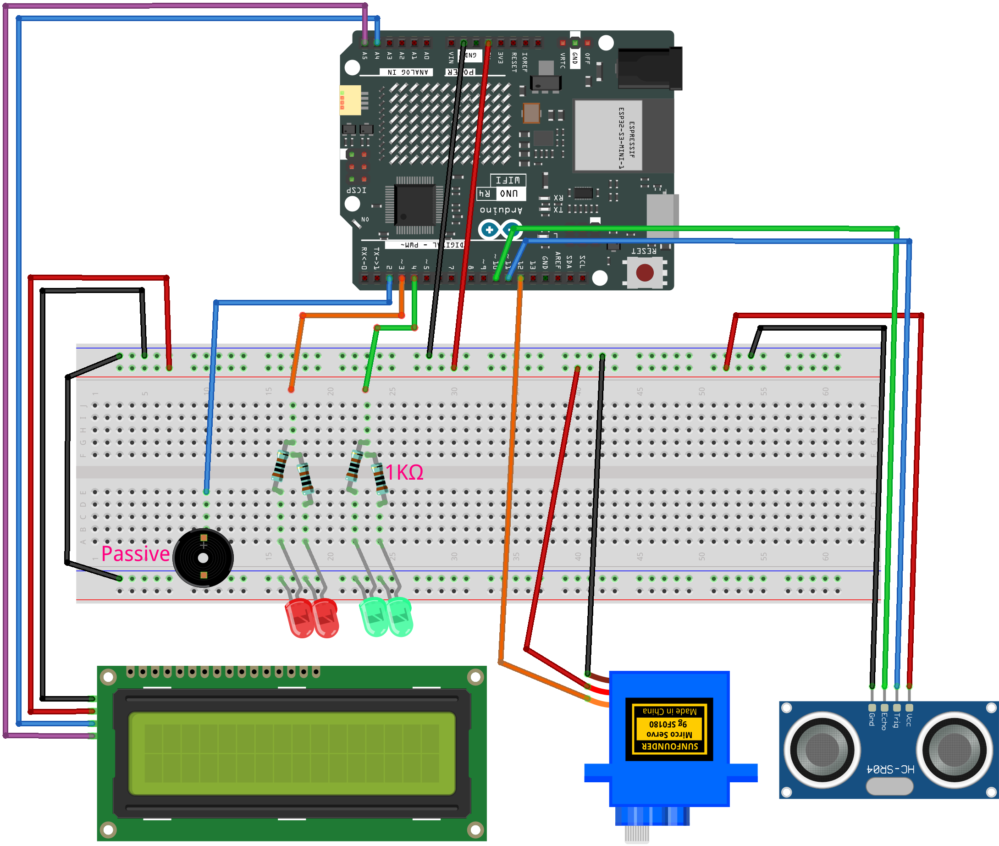

.. _radar_guard2.0:

Radar Guard 2.0
==============================================================

.. note::
  
  🌟 Welcome to the SunFounder Facebook Community! Whether you're into Raspberry Pi, Arduino, or ESP32, you'll find inspiration, help ideas here.
   
  - ✅ Be the first to get free learning resources. 
   
  - ✅ Stay updated on new products & exclusive giveaways. 
   
  - ✅ Share your creations and get real feedback.
   
  * 👉 Need faster updates or support? Click [|link_sf_facebook|] join our Facebook community 

  * 👉 Or join our WhatsApp group: Click [|link_sf_whatsapp|]
   
Kit purchase
------------------------

Looking for parts? Check out our all-in-one kits below — packed with components, beginner-friendly guides, and tons of fun.

.. image:: img/elite_explore_kit.png
   :width: 100%
   :align: center
   :target: https://www.sunfounder.com/collections/arduino-kits-bundles/products/sunfounder-elite-explorer-kit-with-official-arduino-uno-r4-wifi?ref=jbzmncle

.. raw:: html

     

.. list-table::
   :widths: 20 20 20
   :header-rows: 1

   * - Name
     - Includes Arduino board
     - PURCHASE LINK
   * - Ultimate Sensor Kit
     - Arduino Uno R4 Minima
     - |link_ultimate_sensor_buy|
   * - Elite Explorer Kit
     - Arduino Uno R4 WiFi
     - |link_elite_buy|
   * - 3 in 1 Ultimate Starter Kit
     - Arduino Uno R4 Minima
     - |link_arduinor4_buy|
   * - Universal Maker Sensor Kit
     - ×
     - |link_umsk_buy|

Course Introduction
------------------------

In this lesson, we will learn how to use the Ultrasonic Sensor Module, Digital Servo Motor, and I2C LCD 1602 with the Arduino Board to create a radar defense system version 2.0.

When the ultrasonic sensor module is running, it emits an audible alarm and flashes the red LED if it detects an obstacle within its sensing range. 
If no obstacle is detected, indicating a safe state, the green LED stays on.

.. raw:: html
 
 <iframe width="700" height="394" src="https://www.youtube.com/embed/enMBMfVlbpY?si=LOntoW4GBtHXT783" title="YouTube video player" frameborder="0" allow="accelerometer; autoplay; clipboard-write; encrypted-media; gyroscope; picture-in-picture; web-share" referrerpolicy="strict-origin-when-cross-origin" allowfullscreen></iframe>

.. note::

  If this is your first time working with an Arduino project, we recommend downloading and reviewing the basic materials first.
  
  * :ref:`install_arduino`
  * :ref:`introduce_arduino`

**Required Components**

In this project, we need the following components:

.. list-table::
    :widths: 5 20 5 20
    :header-rows: 1

    *   - SN
        - COMPONENT INTRODUCTION	
        - QUANTITY
        - PURCHASE LINK

    *   - 1
        - Arduino UNO R4 Minima/Arduino UNO R4 WIFI
        - 1
        - |link_unor4_wifi_buy|
    *   - 2
        - USB Type-C cable
        - 1
        - 
    *   - 3
        - Breadboard
        - 1
        - |link_breadboard_buy|
    *   - 4
        - Wires
        - Several
        - |link_wires_buy|
    *   - 5
        - 1kΩ resistor
        - 4
        - |link_resistor_buy|
    *   - 6
        - Ultrasonic Sensor Module
        - 1
        - |link_ultrasonic_buy|
    *   - 7
        - LED
        - 4
        - |link_led_buy|
    *   - 8
        - I2C LCD 1602
        - 1
        - |link_i2clcd1602_buy|
    *   - 9
        - Digital Servo Motor
        - 1
        - |link_motor_buy|
    *   - 10
        - Passive Buzzer
        - 1
        - |link_passive_buzzer_buy|

**Wiring**

**Common Connections:**

* **LED**

  - Connect the LEDs **anode** to a **1kΩ resistor** then to the  **3**, **4** on Arduino, and the LEDs **cathode** to  negative power bus on the breadboard.

* **Digital Servo Motor**

  - Connect to breadboard’s positive power bus.
  - Connect to breadboard’s negative power bus.
  - Connect to **12** on the Arduino.

* **Passive Buzzer**

  - **＋:** Connect to **2** on the Arduino.
  - **－:** Connect to breadboard’s negative power bus.

* **I2C LCD 1602**

  - **SDA:** Connect to **A4** on the Arduino.
  - **SCL:** Connect to **A5** on the Arduino.
  - **GND:** Connect to breadboard’s negative power bus.
  - **VCC:** Connect to breadboard’s red power bus.

* **Ultrasonic Sensor Module**

  - **Trig:** Connect to **11** on the Arduino.
  - **Echo:** Connect to **10** on the Arduino.
  - **GND:** Connect to breadboard’s negative power bus.
  - **VCC:** Connect to breadboard’s red power bus.

**Writing the Code**

.. note::

    * You can copy this code into **Arduino IDE**. 
    * To install the library, use the Arduino Library Manager and search for **LiquidCrystal I2C** and install it.
    * Don't forget to select the board(Arduino UNO R4 Minima/WIFI) and the correct port before clicking the **Upload** button.

.. code-block:: arduino

      #include <Servo.h>
      #include <Wire.h>
      #include <LiquidCrystal_I2C.h>

      // Servo and ultrasonic sensor
      Servo radarServo;
      const int trigPin    = 11;
      const int echoPin    = 10;
      const int servoPin   = 12;

      // LEDs and passive buzzer (controlled by tone()/noTone())
      const int redLed     = 3;
      const int greenLed   = 4;
      const int buzzer     = 2;

      // I2C LCD (address 0x27, 16×2 characters)
      LiquidCrystal_I2C lcd(0x27, 16, 2);

      // Configuration parameters
      const int alertDistance        = 30;     // distance threshold for alert (cm)
      const unsigned long updateInterval   = 20;     // servo scan interval (ms)
      const int triggerThreshold     = 2;      // number of consecutive detections needed
      const unsigned long displayDuration     = 500;    // LCD display time (ms)
      const unsigned long blinkInterval       = 200;    // LED blink interval (ms)

      // Scanning state
      int currentAngle     = 0;
      int increment        = 1;
      unsigned long lastServoUpdate = 0;

      // Alert control
      bool displayAlarm    = false;  // whether showing text on LCD
      bool alarmActive     = false;  // whether in blink alert state
      int triggerCount     = 0;
      int detectedAngle    = 0;
      unsigned long displayStartTime = 0;
      unsigned long lastBlinkTime     = 0;
      bool blinkState       = false;

      void setup() {
        radarServo.attach(servoPin);
        pinMode(trigPin, OUTPUT);
        pinMode(echoPin, INPUT);
        pinMode(redLed, OUTPUT);
        pinMode(greenLed, OUTPUT);
        // buzzer uses tone()/noTone(), no pinMode needed

        lcd.init();
        lcd.backlight();
        lcd.clear();

        // show idle state
        lcdSetEmpty();
        digitalWrite(greenLed, HIGH);
      }

      void loop() {
        unsigned long now = millis();

        // 1. Smooth scanning & distance measurement
        if (now - lastServoUpdate >= updateInterval) {
          lastServoUpdate = now;
          radarServo.write(currentAngle);

          if (currentAngle % 5 == 0) {
            float d = getDistance();

            // if not already showing or blinking an alert
            if (!displayAlarm && !alarmActive) {
              if (d < alertDistance) triggerCount++;
              else                   triggerCount = 0;

              if (triggerCount >= triggerThreshold) {
                triggerCount = 0;
                detectedAngle = currentAngle;
                startAlarmDisplay();
              }
            }
            // if currently blinking and object is out of range, exit alert
            else if (alarmActive && d >= alertDistance) {
              exitAlarm();
            }
          }

          // update servo angle back and forth between 0°–180°
          currentAngle += increment;
          if (currentAngle >= 180) {
            currentAngle = 180; increment = -1;
          } else if (currentAngle <= 0) {
            currentAngle = 0;   increment = 1;
          }
        }

        // 2. Manage LCD display duration & transition to blinking
        if (displayAlarm) {
          // if display time has passed, switch to blinking state
          if (now - displayStartTime >= displayDuration) {
            displayAlarm = false;
            alarmActive  = true;
            lastBlinkTime = now;
          }
        }
        else if (alarmActive) {
          alarmBlink();
        }
      }

      // start showing alert text (for displayDuration)
      void startAlarmDisplay() {
        displayAlarm     = true;
        alarmActive      = false;
        displayStartTime = millis();

        digitalWrite(greenLed, LOW);
        digitalWrite(redLed, LOW);
        noTone(buzzer);

        lcd.clear();
        // first line: centered "{detectedAngle}°"
        char buf[6];
        sprintf(buf, "%d", detectedAngle);
        int len1 = strlen(buf) + 1;
        int start1 = (16 - len1) / 2;
        lcd.setCursor(start1, 0);
        lcd.print(buf);
        lcd.write(223);

        // second line: centered "Foreign Body"
        const char* msg = "Foreign Body";
        int len2 = strlen(msg);
        int start2 = (16 - len2) / 2;
        lcd.setCursor(start2, 1);
        lcd.print(msg);
      }

      // non-blocking blink of red LED and buzzer
      void alarmBlink() {
        unsigned long now = millis();
        if (now - lastBlinkTime >= blinkInterval) {
          lastBlinkTime = now;
          blinkState = !blinkState;
          digitalWrite(redLed, blinkState);
          if (blinkState) tone(buzzer, 1000);
          else           noTone(buzzer);
        }
      }

      // exit alert and return to idle state
      void exitAlarm() {
        displayAlarm = false;
        alarmActive  = false;
        triggerCount = 0;

        digitalWrite(redLed, LOW);
        noTone(buzzer);
        digitalWrite(greenLed, HIGH);
        lcdSetEmpty();
      }

      // show idle state on LCD
      void lcdSetEmpty() {
        lcd.clear();
        lcd.setCursor(1, 0);
        lcd.print("Area is Empty");
      }

      // perform ultrasonic distance measurement (cm)
      float getDistance() {
        digitalWrite(trigPin, LOW);
        delayMicroseconds(2);
        digitalWrite(trigPin, HIGH);
        delayMicroseconds(10);
        digitalWrite(trigPin, LOW);
        long duration = pulseIn(echoPin, HIGH, 30000);
        return duration * 0.034 / 2;
      }
