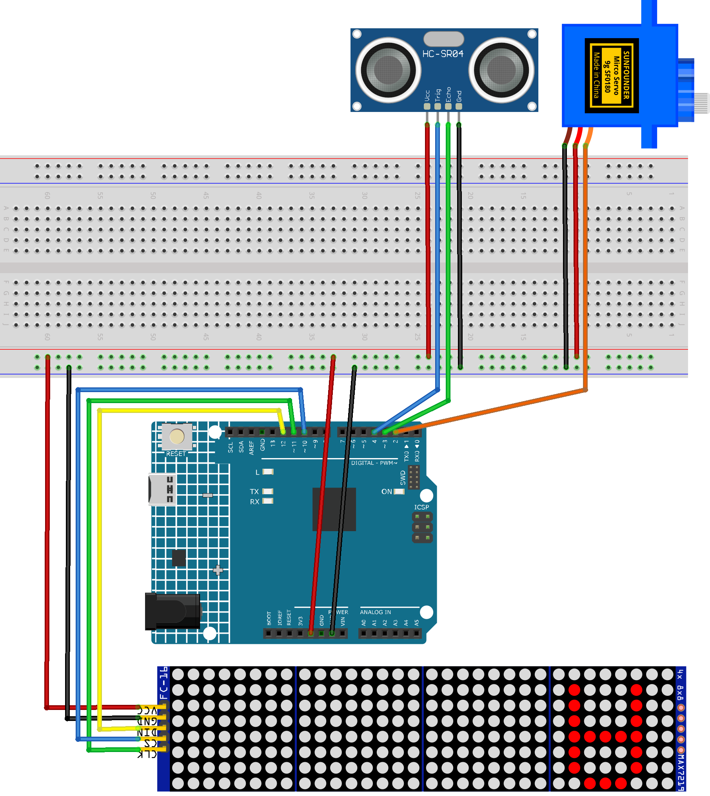

.. _radar_guard3.0:

Radar Guard 3.0
==============================================================

.. note::
  
  🌟 Welcome to the SunFounder Facebook Community! Whether you're into Raspberry Pi, Arduino, or ESP32, you'll find inspiration, help ideas here.
   
  - ✅ Be the first to get free learning resources. 
   
  - ✅ Stay updated on new products & exclusive giveaways. 
   
  - ✅ Share your creations and get real feedback
   
  * 👉 Need faster updates or support? Click [|link_sf_facebook|] join our Facebook community 

  * 👉 Or join our WhatsApp group: Click [|link_sf_whatsapp|]
   
Kit purchase
------------------------

Looking for parts? Check out our all-in-one kits below — packed with components, beginner-friendly guides, and tons of fun.

.. raw:: html

     

.. list-table::
   :widths: 20 20 20
   :header-rows: 1

   * - Name
     - Includes Arduino board
     - PURCHASE LINK
   * - Ultimate Sensor Kit
     - Arduino Uno R4 Minima
     - |link_ultimate_sensor_buy|
   * - Elite Explorer Kit
     - Arduino Uno R4 WiFi
     - |link_elite_buy|
   * - 3 in 1 Ultimate Starter Kit
     - Arduino Uno R4 Minima
     - |link_arduinor4_buy|
   * - Universal Maker Sensor Kit
     - ×
     - |link_umsk_buy|

Course Introduction
------------------------

In this lesson, we will learn how to use the Ultrasonic Sensor Module, Digital Servo Motor, and MAX7219 Dot Matrix Module with the Arduino Board to create a radar defense system version 3.0.

When the ultrasonic sensor module detects an object, it will display the object's range on the MAX7219 Dot Matrix Module.

.. raw:: html
 
  <iframe width="700" height="394" src="https://www.youtube.com/embed/jA1AHHbWs_c?si=KMp7CX8b13NGUcLj" title="YouTube video player" frameborder="0" allow="accelerometer; autoplay; clipboard-write; encrypted-media; gyroscope; picture-in-picture; web-share" referrerpolicy="strict-origin-when-cross-origin" allowfullscreen></iframe>

.. note::

  If this is your first time working with an Arduino project, we recommend downloading and reviewing the basic materials first.
  
  * :ref:`install_arduino`
  * :ref:`introduce_arduino`

**Required Components**

In this project, we need the following components:

.. list-table::
    :widths: 5 20 5 20
    :header-rows: 1

    *   - SN
        - COMPONENT INTRODUCTION	
        - QUANTITY
        - PURCHASE LINK

    *   - 1
        - Arduino UNO R4 Minima/Arduino UNO R4 WIFI
        - 1
        - |link_unor4_wifi_buy|
    *   - 2
        - USB Type-C cable
        - 1
        - 
    *   - 3
        - Breadboard
        - 1
        - |link_breadboard_buy|
    *   - 4
        - Wires
        - Several
        - |link_wires_buy|
    *   - 5
        - Ultrasonic Sensor Module
        - 1
        - |link_ultrasonic_buy|
    *   - 6
        - Digital Servo Motor
        - 1
        - |link_motor_buy|
    *   - 7
        - MAX7219 Dot Matrix Module
        - 1
        - |link_martix_buy|

**Wiring**

**Common Connections:**

* **Digital Servo Motor**

  - Connect to breadboard’s positive power bus.
  - Connect to breadboard’s negative power bus.
  - Connect to **2** on the Arduino.

* **Ultrasonic Sensor Module**

  - **Trig:** Connect to **4** on the Arduino.
  - **Echo:** Connect to **3** on the Arduino.
  - **GND:** Connect to breadboard’s negative power bus.
  - **VCC:** Connect to breadboard’s red power bus.

* **MAX7219 Dot Matrix Module**

  - **CLK:** Connect to **11** on the Arduino.
  - **CS:** Connect to **10** on the Arduino.
  - **DIN:** Connect to **12** on the Arduino.
  - **GND:** Connect to breadboard’s negative power bus.
  - **VCC:** Connect to breadboard’s red power bus.

**Writing the Code**

.. note::

    * You can copy this code into **Arduino IDE**. 
    * To install the library, use the Arduino Library Manager and search for **LedControl** and install it.
    * Don't forget to select the board(Arduino UNO R4 WIFI) and the correct port before clicking the **Upload** button.

.. code-block:: arduino

      #include <LedControl.h>
      #include <Servo.h>

      // hardware pins
      LedControl lc(12, 11, 10, 4);   // DIN=12, CLK=11, CS=10, 4 modules
      Servo    radarServo;
      const int servoPin = 2;         // servo control pin
      const int trigPin  = 4;         // HC-SR04 Trig pin
      const int echoPin  = 3;         // HC-SR04 Echo pin

      // timing
      const unsigned long updateInterval = 20;  // ms per step
      unsigned long lastUpdate = 0;
      int currentAngle = 0;
      int increment    = 1;

      // thresholds for rows 0..7
      const int thresholds[8] = { 32, 28, 24, 20, 16, 12, 8, 4 };

      void setup() {
        Serial.begin(9600);

        // init LED matrix
        for (int m = 0; m < 4; m++) {
          lc.shutdown(m, false);
          lc.setIntensity(m, 8);
          lc.clearDisplay(m);
        }

        // init servo
        radarServo.attach(servoPin);
        radarServo.write(currentAngle);

        // init ultrasonic
        pinMode(trigPin, OUTPUT);
        pinMode(echoPin, INPUT);
      }

      void loop() {
        unsigned long now = millis();
        if (now - lastUpdate < updateInterval) return;
        lastUpdate = now;

        // 1) move servo to currentAngle
        radarServo.write(currentAngle);

        // 2) measure distance
        float d = getDistance();
        Serial.print("Angle: ");
        Serial.print(currentAngle);
        Serial.print("°, Distance: ");
        Serial.print(d);
        Serial.println(" cm");

        // 3) map angle -> step -> module & col
        int step   = map(currentAngle, 0, 180, 31, 0);
        int module = step / 8;
        int col    = 7 - (step % 8);

        // 4) always light row 0 at (module,col)
        lc.setLed(module, 0, col, true);

        //    then for each deeper threshold light extra rows
        for (int r = 1; r < 8; r++) {
          if (d <= thresholds[r]) {
            lc.setLed(module, r, col, true);
          }
        }

        // 5) update angle
        currentAngle += increment;

        // 6) at each end clear all before reversing
        if (currentAngle >= 180) {
          currentAngle = 180;
          increment = -1;
          clearAll();
        } else if (currentAngle <= 0) {
          currentAngle = 0;
          increment = 1;
          clearAll();
        }
      }

      // perform ultrasonic distance measurement (cm)
      float getDistance() {
        digitalWrite(trigPin, LOW);
        delayMicroseconds(2);
        digitalWrite(trigPin, HIGH);
        delayMicroseconds(10);
        digitalWrite(trigPin, LOW);
        long dur = pulseIn(echoPin, HIGH, 30000);
        return dur * 0.034 / 2;
      }

      // helper: clear entire display
      void clearAll() {
        for (int m = 0; m < 4; m++) {
          lc.clearDisplay(m);
        }
      }
