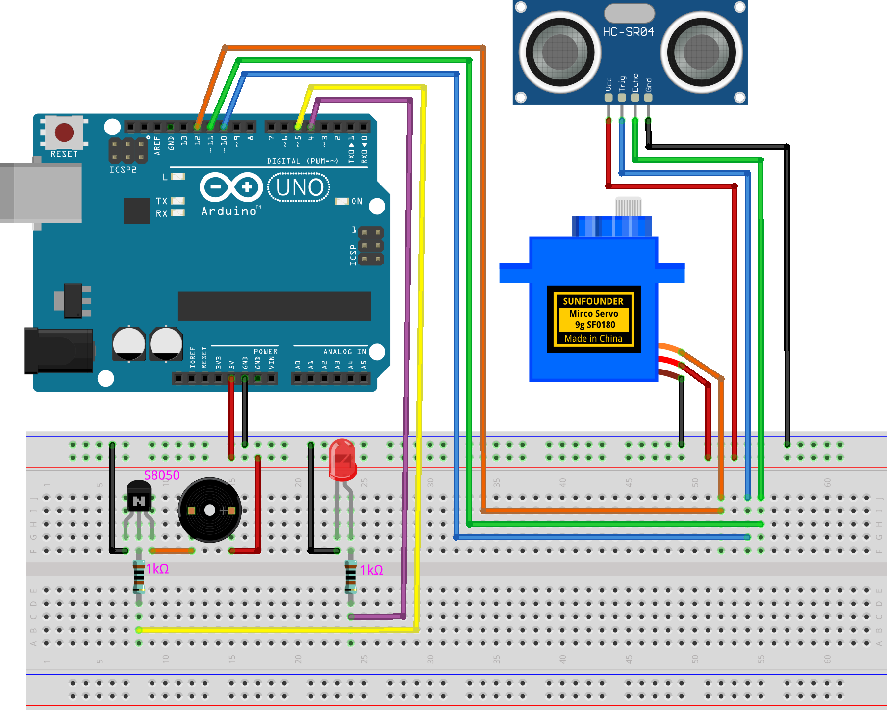

.. _radar_guard4.0:

Radar Guard 4.0
==============================================================

.. note::
  
  🌟 Welcome to the SunFounder Facebook Community! Whether you're into Raspberry Pi, Arduino, or ESP32, you'll find inspiration, help ideas here.
   
  - ✅ Be the first to get free learning resources. 
   
  - ✅ Stay updated on new products & exclusive giveaways. 
   
  - ✅ Share your creations and get real feedback.
   
  * 👉 Need faster updates or support? Click [|link_sf_facebook|] join our Facebook community 

  * 👉 Or join our WhatsApp group: Click [|link_sf_whatsapp|]
   
  * 🎁 Looking for parts?Check out our all-in-one kits below — packed with components, beginner-friendly guides, and tons of fun.
  
  .. list-table::
    :widths: 20 20 20
    :header-rows: 1

    *   - Name	
        - Includes Arduino board
        - PURCHASE LINK
    *   - Elite Explorer Kit	
        - Arduino Uno R4 WiFi
        - |link_elite_buy|
    *   - 3 in 1 Ultimate Starter Kit
        - Arduino Uno R4 Minima
        - |link_arduinor4_buy|

Course Introduction
------------------------

This project implements a basic radar system using an Arduino Uno, a servo motor, an ultrasonic sensor (HC-SR04), an LED, and a buzzer. 

The system scans the environment by rotating the ultrasonic sensor between 15 and 165 degrees, measuring distances to nearby objects. 

If an object is detected within 15 cm, an LED lights up, and a buzzer sounds. The angle and distance data are sent to the serial port, allowing for real-time visualization using the Processing IDE.

.. .. raw:: html
 
..  <iframe width="700" height="394" src="https://www.youtube.com/embed/IIe3DMzaRSA?si=EmbqV2plsvQtJ3yr" title="YouTube video player" frameborder="0" allow="accelerometer; autoplay; clipboard-write; encrypted-media; gyroscope; picture-in-picture; web-share" referrerpolicy="strict-origin-when-cross-origin" allowfullscreen></iframe>

.. note::

  If this is your first time working with an Arduino project, we recommend downloading and reviewing the basic materials first.
  
  * :ref:`install_arduino`
  * :ref:`introduce_arduino`

**Required Components**

In this project, we need the following components:

.. list-table::
    :widths: 5 20 5 20
    :header-rows: 1

    *   - SN
        - COMPONENT INTRODUCTION	
        - QUANTITY
        - PURCHASE LINK

    *   - 1
        - Arduino UNO R3
        - 1
        - |link_arduinor3_buy|
    *   - 2
        - USB Type-C cable
        - 1
        - 
    *   - 3
        - Breadboard
        - 1
        - |link_breadboard_buy|
    *   - 4
        - Wires
        - Several
        - |link_wires_buy|
    *   - 5
        - Ultrasonic Sensor Module
        - 1
        - |link_ultrasonic_buy|
    *   - 6
        - Digital Servo Motor
        - 1
        - |link_motor_buy|
    *   - 7
        - Active Buzzer
        - 1
        - 
    *   - 8
        - LED
        - 1
        - |link_led_buy|
    *   - 9
        - Transistor
        - 1(S8050)
        - |link_transistor_buy|

**Wiring**

**Common Connections:**

* **LED**

  - Connect the LEDs **anode**  tot the negative power bus on the breadboard, and the LEDs **cathode** to a **1kΩ resistor** then to **4** on the Arduino.

* **transistor**

  - **emitter:** Connect to breadboard’s negative power bus.
  - **base:** Connect a **1kΩ resistor** then to **5** on the Arduino.
  - **collector:** Connect to the buzzer.

* **Buzzer**

  - **＋:** Connect to breadboard’s positive power bus.
  - **－:** Connect to transistor .

* **Digital Servo Motor**

  - Connect to breadboard’s positive power bus.
  - Connect to breadboard’s negative power bus.
  - Connect to **12** on the Arduino.

* **Ultrasonic Sensor Module**

  - **Trig:** Connect to **10** on the Arduino.
  - **Echo:** Connect to **11** on the Arduino.
  - **GND:** Connect to breadboard’s negative power bus.
  - **VCC:** Connect to breadboard’s red power bus.

**Writing the Code**

.. note::

 * Build the circuit.

 * Upload the code to the Arduino board using Arduino IDE.

 * In the Arduino IDE, check the current Arduino port(COMx).

 * The ``ArduinoSonarGUI`` is used here. You can click here :download:`ArduinoSonarGUI.zip </_static/ArduinoSonarGUI.zip>` to download it. 
 
 * Open ArduinoSonarGUI.pde in the |link_processing_ide| .

 * Modify the code in line 35 to ensure the correct port number(COMx).

 * Run the Processing sketch to visualize the sonar data.

**arduino code**

.. code-block:: arduino

      /*
        This code controls a servo motor to rotate an ultrasonic sensor and measure distances. 
        The sensor scans from 15 to 165 degrees and back, calculating the distance to objects 
        and sending the angle and distance data to the serial port. The data can be used in the 
        Processing IDE to visualize a real-time radar.

        An LED and buzzer are activated if an object is detected within 15 cm.
        
        Board: Arduino Uno R4 (or R3)
        Component: Ultrasonic distance Sensor(HC-SR04)

        Source Code From：https://howtomechatronics.com/projects/arduino-radar-project/

        Modified by wulu from SunFounder 2024.08

      */

      #include <Servo.h>  // Include Servo library

      // Define pins for the ultrasonic sensor
      const int trigPin = 10;
      const int echoPin = 11;

      // Variables for measuring distance
      long duration;
      int distance;

      const int servoPin = 12;
      Servo myServo;  // Create a Servo object to control the motor

      const int ledPin = 4;  // Pin for LED
      const int buzzerPin = 5;  // Pin for Buzzer

      void setup() {
        pinMode(trigPin, OUTPUT);  // Sets the trigPin as an Output
        pinMode(echoPin, INPUT);   // Sets the echoPin as an Input

        pinMode(ledPin, OUTPUT);  // Set ledPin as an OUTPUT
        pinMode(buzzerPin, OUTPUT);  // Set buzzerPin as an OUTPUT

        Serial.begin(9600);
        myServo.attach(servoPin);  // Defines on which pin is the servo motor attached
      }

      void loop() {
        // rotates the servo motor from 15 to 165 degrees
        for (int i = 15; i <= 165; i++) {
          myServo.write(i);  // Set servo position
          delay(30);  // Wait for the servo to reach the position

          distance = calculateDistance();  // Measure distance at this angle
          handleAlerts();  // Check distance and handle alerts

          Serial.print(i);         // Sends the current degree into the Serial Port
          Serial.print(",");       // Sends addition character right next to the previous value needed later in the Processing IDE for indexing
          Serial.print(distance);  // Sends the distance value into the Serial Port
          Serial.print(".");       // Sends addition character right next to the previous value needed later in the Processing IDE for indexing
        }

        // Repeats the previous lines from 165 to 15 degrees
        for (int i = 165; i > 15; i--) {
          myServo.write(i);
          delay(30);

          distance = calculateDistance(); // Measure distance at this angle
          handleAlerts();  // Check distance and handle alerts

          Serial.print(i);
          Serial.print(",");
          Serial.print(distance);
          Serial.print(".");
        }
      }

      // Function to read the sensor data and calculate the distance
      int calculateDistance() {
        digitalWrite(trigPin, LOW);   // Set trig pin to low to ensure a clean pulse
        delayMicroseconds(2);         // Delay for 2 microseconds
        digitalWrite(trigPin, HIGH);  // Send a 10 microsecond pulse by setting trig pin to high
        delayMicroseconds(10);
        digitalWrite(trigPin, LOW);  // Set trig pin back to low

        // Measure the pulse width of the echo pin and calculate the distance value
        float distance = pulseIn(echoPin, HIGH) / 58.00;  // Formula: (340m/s * 1us) / 2
        return distance;
      }

      void handleAlerts() {
        // Activate LED and buzzer if object is within 15 cm
        if (distance <= 15) {
          digitalWrite(ledPin, HIGH);  // Turn on LED
          tone(buzzerPin, 500);  // Turn on Buzzer with a 500 Hz tone
        } else {
          digitalWrite(ledPin, LOW);  // Turn off LED
          noTone(buzzerPin);  // Turn off Buzzer
        }
      }

