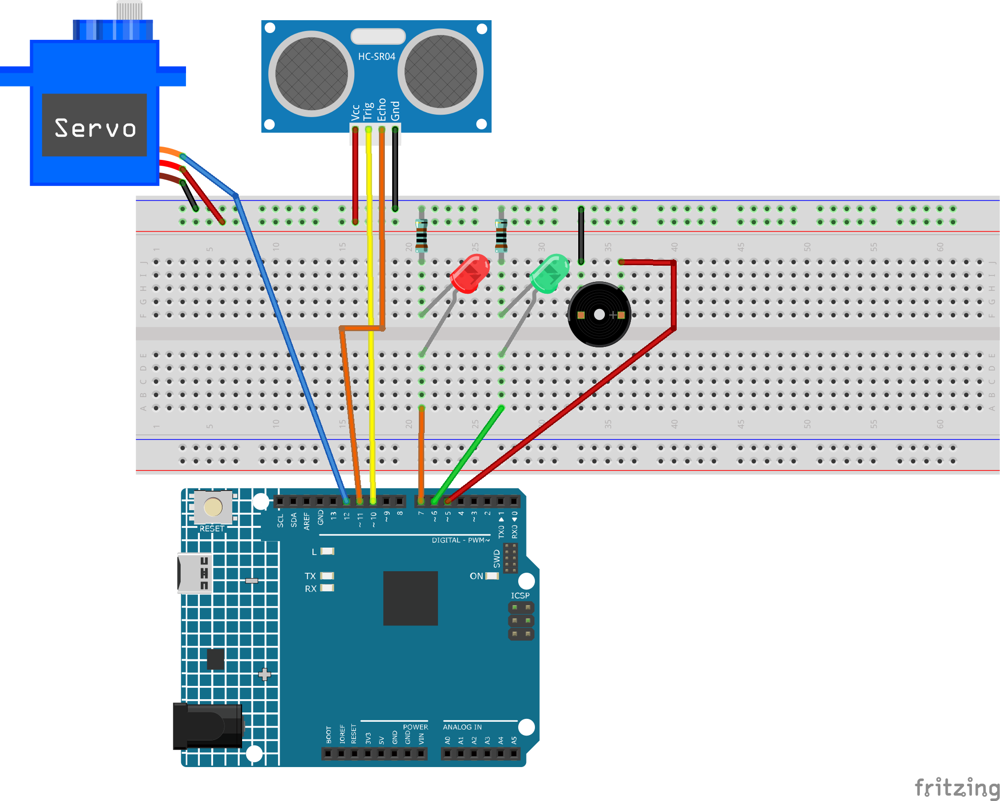

.. _radar_guard:

Radar Guard 5.0
==============================================================

.. note::
  
  🌟 Welcome to the SunFounder Facebook Community! Whether you're into Raspberry Pi, Arduino, or ESP32, you'll find inspiration, help ideas here.
   
  - ✅ Be the first to get free learning resources. 
   
  - ✅ Stay updated on new products & exclusive giveaways. 
   
  - ✅ Share your creations and get real feedback.
   
  * 👉 Need faster updates or support? Click [|link_sf_facebook|] join our Facebook community 

  * 👉 Or join our WhatsApp group: Click [|link_sf_whatsapp|]
   
  * 🎁 Looking for parts?Check out our all-in-one kits below — packed with components, beginner-friendly guides, and tons of fun.
  
  .. list-table::
    :widths: 20 20 20
    :header-rows: 1

    *   - Name	
        - Includes Arduino board
        - PURCHASE LINK
    *   - Elite Explorer Kit	
        - Arduino Uno R4 WiFi
        - |link_elite_buy|
    *   - Ultimate Sensor Kit
        - Arduino Uno R4 Minima
        - |link_ultimate_sensor_buy|

Course Introduction
------------------------

This project uses an ultrasonic sensor, a servo motor, and an Arduino to create a simple radar system with LED and buzzer alerts.

The servo rotates the sensor to scan for obstacles. If an object is within a set distance, a red LED and buzzer are activated. Otherwise, a green LED shows it's clear.

Angle and distance data are sent via the serial port for monitoring.

.. .. raw:: html
 
..  <iframe width="700" height="394" src="https://www.youtube.com/embed/IIe3DMzaRSA?si=EmbqV2plsvQtJ3yr" title="YouTube video player" frameborder="0" allow="accelerometer; autoplay; clipboard-write; encrypted-media; gyroscope; picture-in-picture; web-share" referrerpolicy="strict-origin-when-cross-origin" allowfullscreen></iframe>

.. note::

  If this is your first time working with an Arduino project, we recommend downloading and reviewing the basic materials first.
  
  * :ref:`install_arduino`
  * :ref:`introduce_arduino`

**Required Components**

In this project, we need the following components:

.. list-table::
    :widths: 5 20 5 20
    :header-rows: 1

    *   - SN
        - COMPONENT INTRODUCTION	
        - QUANTITY
        - PURCHASE LINK

    *   - 1
        - Arduino UNO R4 Minima
        - 1
        - |link_unor4_buy|
    *   - 2
        - USB Type-C cable
        - 1
        - 
    *   - 3
        - Breadboard
        - 1
        - |link_breadboard_buy|
    *   - 4
        - Wires
        - Several
        - |link_wires_buy|
    *   - 5
        - Ultrasonic Sensor Module
        - 1
        - |link_ultrasonic_buy|
    *   - 6
        - Digital Servo Motor
        - 1
        - |link_motor_buy|
    *   - 7
        - Buzzer
        - 1
        - 
    *   - 8
        - LED
        - 2
        - |link_led_buy|
    *   - 9
        - 1kΩ resistor
        - 2
        - |link_resistor_buy|

**Wiring**

**Common Connections:**

* **LED**

  - Connect the LEDs **anode** to the  **3**, **4** on Arduino, and the LEDs **cathode** to a **1kΩ resistor** then to negative power bus on the breadboard.

* **Buzzer**

  - **＋:** Connect to breadboard’s positive power bus.
  - **－:** Connect to transistor.

* **Digital Servo Motor**

  - Connect to breadboard’s positive power bus.
  - Connect to breadboard’s negative power bus.
  - Connect to **12** on the Arduino.

* **Ultrasonic Sensor Module**

  - **Trig:** Connect to **10** on the Arduino.
  - **Echo:** Connect to **11** on the Arduino.
  - **GND:** Connect to breadboard’s negative power bus.
  - **VCC:** Connect to breadboard’s red power bus.

**Writing the Code**

.. note::

 * Build the circuit.

 * Upload the code to the Arduino board using Arduino IDE.

 * In the Arduino IDE, check the current Arduino port(COMx).

 * The ``ArduinoRadarGUI`` is used here. You can click here :download:`ArduinoSonarGUI.zip </_static/ArduinoRadarGUI5.0.zip>` to download it. 
 
 * Open ArduinoLidarGUI.pde in the |link_processing_ide|.

 * Modify the code in line 35 to ensure the correct port number(COMx).

 * Run the Processing sketch to visualize the Lidar data.

.. code-block:: arduino

      /*
        Modified Arduino Radar Code with LED and Buzzer Alerts
      */

      #include <Servo.h>

      // Ultrasonic sensor pins
      const int trigPin = 10;
      const int echoPin = 11;

      const int servoPin = 12;
      Servo myServo;

      // LEDs and buzzer pins
      const int redLED = 7;
      const int greenLED = 6;
      const int buzzerPin = 5;

      // Distance threshold in cm
      const int threshold = 50;

      long duration;
      int distance;

      void setup() {
        pinMode(trigPin, OUTPUT);
        pinMode(echoPin, INPUT);

        pinMode(redLED, OUTPUT);
        pinMode(greenLED, OUTPUT);
        pinMode(buzzerPin, OUTPUT);

        Serial.begin(9600);
        myServo.attach(servoPin);
      }

      void loop() {
        for (int i = 15; i <= 165; i++) {
          myServo.write(i);
          delay(30);
          distance = calculateDistance();
          alertSystem(distance);
          sendData(i, distance);
        }
        for (int i = 165; i > 15; i--) {
          myServo.write(i);
          delay(30);
          distance = calculateDistance();
          alertSystem(distance);
          sendData(i, distance);
        }
      }

      int calculateDistance() {
        digitalWrite(trigPin, LOW);
        delayMicroseconds(2);
        digitalWrite(trigPin, HIGH);
        delayMicroseconds(10);
        digitalWrite(trigPin, LOW);

        float distance = pulseIn(echoPin, HIGH) / 58.00;
        return (int)distance;
      }

      void alertSystem(int dist) {
        if (dist > 0 && dist <= threshold) {
          digitalWrite(redLED, HIGH);
          digitalWrite(greenLED, LOW);

          int beepDelay = map(dist, 1, threshold, 50, 300); // Closer = faster beep
          digitalWrite(buzzerPin, HIGH);
          delay(5);
          digitalWrite(buzzerPin, LOW);
          delay(beepDelay);
        } else {
          digitalWrite(redLED, LOW);
          digitalWrite(greenLED, HIGH);
          digitalWrite(buzzerPin, LOW);
        }
      }

      void sendData(int angle, int dist) {
        Serial.print(angle);
        Serial.print(",");
        Serial.print(dist);
        Serial.print(".");
      }
