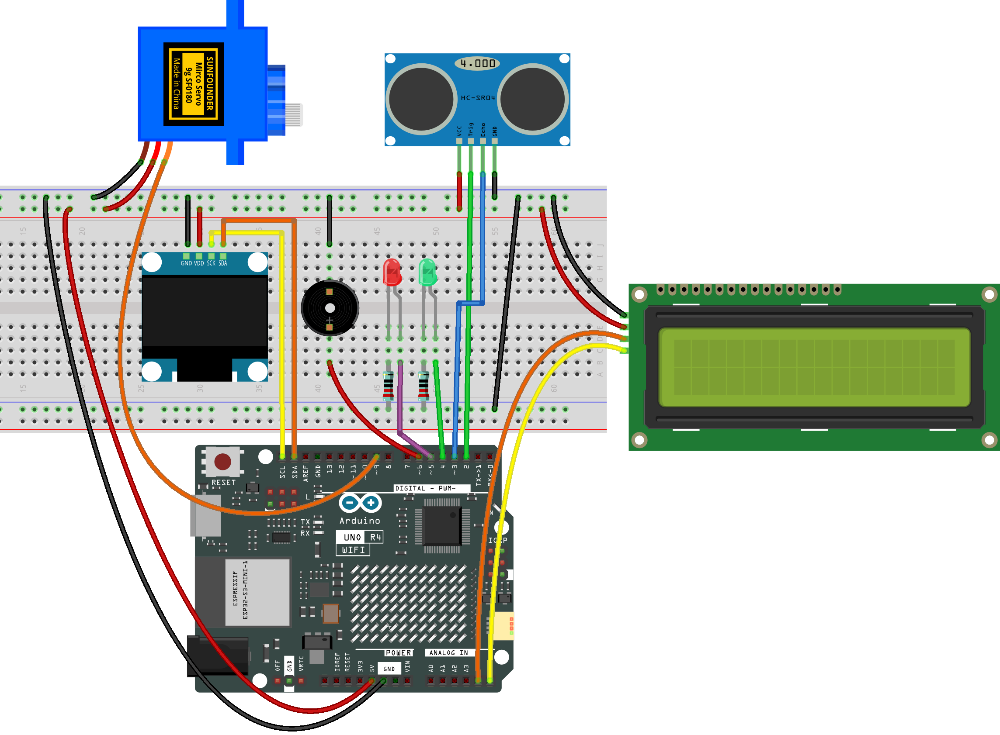

.. _radar_guard6.0:

Radar Guard 6.0
==============================================================

.. note::
  
  🌟 Welcome to the SunFounder Facebook Community! Whether you're into Raspberry Pi, Arduino, or ESP32, you'll find inspiration, help ideas here.
   
  - ✅ Be the first to get free learning resources. 
   
  - ✅ Stay updated on new products & exclusive giveaways. 
   
  - ✅ Share your creations and get real feedback.
   
  * 👉 Need faster updates or support? Click [|link_sf_facebook|] join our Facebook community 

  * 👉 Or join our WhatsApp group: Click [|link_sf_whatsapp|]
   
  * 🎁 Looking for parts?Check out our all-in-one kits below — packed with components, beginner-friendly guides, and tons of fun.
  
  .. list-table::
    :widths: 20 20 20
    :header-rows: 1

    *   - Name	
        - Includes Arduino board
        - PURCHASE LINK
    *   - Elite Explorer Kit	
        - Arduino Uno R4 WiFi
        - |link_elite_buy|
    *   - Ultimate Sensor Kit
        - Arduino Uno R4 Minima
        - |link_ultimate_sensor_buy|

Course Introduction
------------------------

This project uses an ultrasonic sensor, a servo motor, and an Arduino to build a radar system with LCD and OLED displays.

The servo scans for obstacles, showing distance and angle data on both screens with a semicircle radar view. If an object is closer than the set threshold, a red LED and buzzer alert; otherwise, a green LED indicates a clear path.

.. raw:: html
 
  <iframe width="700" height="394" src="https://www.youtube.com/embed/8P2FZA5f90E?si=u_6onrcnZY4Xhi4J" title="YouTube video player" frameborder="0" allow="accelerometer; autoplay; clipboard-write; encrypted-media; gyroscope; picture-in-picture; web-share" referrerpolicy="strict-origin-when-cross-origin" allowfullscreen></iframe>

.. note::

  If this is your first time working with an Arduino project, we recommend downloading and reviewing the basic materials first.
  
  * :ref:`install_arduino`
  * :ref:`introduce_arduino`

**Required Components**

In this project, we need the following components:

.. list-table::
    :widths: 5 20 5 20
    :header-rows: 1

    *   - SN
        - COMPONENT INTRODUCTION	
        - QUANTITY
        - PURCHASE LINK

    *   - 1
        - Arduino UNO R4 Minima
        - 1
        - |link_unor4_buy|
    *   - 2
        - USB Type-C cable
        - 1
        - 
    *   - 3
        - Breadboard
        - 1
        - |link_breadboard_buy|
    *   - 4
        - Wires
        - Several
        - |link_wires_buy|
    *   - 5
        - Ultrasonic Sensor Module
        - 1
        - |link_ultrasonic_buy|
    *   - 6
        - Digital Servo Motor
        - 1
        - |link_motor_buy|
    *   - 7
        - Active Buzzer
        - 1
        - 
    *   - 8
        - LED
        - 2
        - |link_led_buy|
    *   - 9
        - 220Ω resistor
        - 2
        - |link_resistor_buy|
    *   - 10
        - OLED Display Module
        - 1
        - |link_oled_buy|
    *   - 11
        - I2C LCD 1602
        - 1
        - |link_i2clcd1602_buy|

**Wiring**

**Common Connections:**

* **LED**

  - **Red LED**: Connect the LEDs **anode** to the  **4** on Arduino, and the LEDs **cathode** to a **220Ω resistor** then to negative power bus on the breadboard.
  - **Green LED**: Connect the LEDs **anode** to the  **5** on Arduino, and the LEDs **cathode** to a **220Ω resistor** then to negative power bus on the breadboard.

* **Active Buzzer**

  - **＋:** Connect to **6** on the Arduino.
  - **－:** Connect to breadboard’s negative power bus.

* **Digital Servo Motor**

  - Connect to breadboard’s positive power bus.
  - Connect to breadboard’s negative power bus.
  - Connect to **9** on the Arduino.

* **Ultrasonic Sensor Module**

  - **Trig:** Connect to **2** on the Arduino.
  - **Echo:** Connect to **3** on the Arduino.
  - **GND:** Connect to breadboard’s negative power bus.
  - **VCC:** Connect to breadboard’s red power bus.

* **OLED Display Module**

  - **SDA:** Connect to **SDA** on the Arduino.
  - **SCK:** Connect to **SCL** on the Arduino.
  - **GND:** Connect to breadboard’s negative power bus.
  - **VCC:** Connect to breadboard’s red power bus.

* **I2C LCD 1602**

  - **SDA:** Connect to **A4** on the Arduino.
  - **SCL:** Connect to **A5** on the Arduino.
  - **GND:** Connect to breadboard’s negative power bus.
  - **VCC:** Connect to breadboard’s red power bus.

**Writing the Code**

.. note::

    * You can copy this code into **Arduino IDE**. 
    * To install the library, use the Arduino Library Manager and search for **LiquidCrystal I2C** and **Adafruit GFX** and **Adafruit SSD1306** and install it.
    * Don't forget to select the board(Arduino UNO R4 Minima/WIFI) and the correct port before clicking the **Upload** button.

.. code-block:: arduino

      #include <Servo.h>
      #include <Wire.h>
      #include <LiquidCrystal_I2C.h>
      #include <Adafruit_GFX.h>
      #include <Adafruit_SSD1306.h>

      // --- Servo & Ultrasonic ---
      Servo servo;
      const int trigPin = 2;
      const int echoPin = 3;

      // --- LED & Buzzer ---
      const int ledGreen = 4;
      const int ledRed   = 5;
      const int buzzer   = 6;

      // --- LCD (0x27 or 0x3F) ---
      LiquidCrystal_I2C lcd(0x27, 16, 2);

      // --- OLED (0x3C) ---
      #define SCREEN_WIDTH 128
      #define SCREEN_HEIGHT 64
      Adafruit_SSD1306 display(SCREEN_WIDTH, SCREEN_HEIGHT, &Wire, -1);

      // --- Parameters ---
      int angle = 0;
      long distance = 0;
      const int DETECT_THRESHOLD = 20;  // cm

      // --- Distance measurement function ---
      long getDistance() {
        digitalWrite(trigPin, LOW);
        delayMicroseconds(2);
        digitalWrite(trigPin, HIGH);
        delayMicroseconds(10);
        digitalWrite(trigPin, LOW);
        long duration = pulseIn(echoPin, HIGH, 30000); // 30ms timeout
        if (duration == 0) return 999; // timeout handling
        return duration * 0.034 / 2;   // cm
      }

      void setup() {
        Serial.begin(9600);
        servo.attach(9);

        pinMode(trigPin, OUTPUT);
        pinMode(echoPin, INPUT);
        pinMode(ledGreen, OUTPUT);
        pinMode(ledRed, OUTPUT);
        pinMode(buzzer, OUTPUT);

        // LCD
        lcd.init();
        lcd.backlight();

        // OLED
        if (!display.begin(SSD1306_SWITCHCAPVCC, 0x3C)) {
          for (;;); // stop if initialization fails
        }
        display.clearDisplay();
        display.display();
      }

      void loop() {
        // Left to right
        for (angle = 0; angle <= 180; angle += 3) {
          servo.write(angle);
          delay(30);
          distance = getDistance();
          radarAction(distance);
          drawRadar(angle, distance);
        }
        // Right to left
        for (angle = 180; angle >= 0; angle -= 3) {
          servo.write(angle);
          delay(30);
          distance = getDistance();
          radarAction(distance);
          drawRadar(angle, distance);
        }
      }

      // --- Buzzer/LED/LCD display control ---
      void radarAction(long d) {
        lcd.clear();
        if (d < DETECT_THRESHOLD && d > 0) {
          digitalWrite(ledRed, HIGH);
          digitalWrite(ledGreen, LOW);
          digitalWrite(buzzer, HIGH);
          lcd.setCursor(0, 0);
          lcd.print("Detected Object");
          lcd.setCursor(0, 1);
          lcd.print("Dist: ");
          lcd.print(d);
          lcd.print(" cm");
        } else {
          digitalWrite(ledRed, LOW);
          digitalWrite(ledGreen, HIGH);
          digitalWrite(buzzer, LOW);
          lcd.setCursor(0, 0);
          lcd.print("No Object");
          lcd.setCursor(0, 1);
          lcd.print("Dist: ");
          lcd.print(d);
          lcd.print(" cm");
        }
      }

      // --- OLED semicircle radar drawing ---
      void drawRadar(int angle, long d) {
        display.clearDisplay();

        int centerX = SCREEN_WIDTH / 2;
        int centerY = SCREEN_HEIGHT - 1;

        // --- Semicircle concentric circles ---
        for (int r = 15; r <= 60; r += 15) {
          display.drawCircle(centerX, centerY, r, SSD1306_WHITE);
        }
        // --- Radius lines ---
        for (int a = 0; a <= 180; a += 30) {
          float rad = radians(a);
          int x = centerX + cos(rad) * 60;
          int y = centerY - sin(rad) * 60;
          display.drawLine(centerX, centerY, x, y, SSD1306_WHITE);
        }

        // --- Scanning line ---
        float rad = radians(angle);
        int x2 = centerX + cos(rad) * 60;
        int y2 = centerY - sin(rad) * 60;
        display.drawLine(centerX, centerY, x2, y2, SSD1306_WHITE);

        // --- Detected target point ---
        if (d < 60) {
          int tx = centerX + cos(rad) * d;
          int ty = centerY - sin(rad) * d;
          display.fillCircle(tx, ty, 2, SSD1306_WHITE);
        }

        // --- Angle/Distance text ---
        display.setTextSize(1);
        display.setTextColor(SSD1306_WHITE);
        display.setCursor(0, 0);
        display.print("Ang:");
        display.print(angle);
        display.print(" D:");
        display.print(d);

        display.display();
      }
