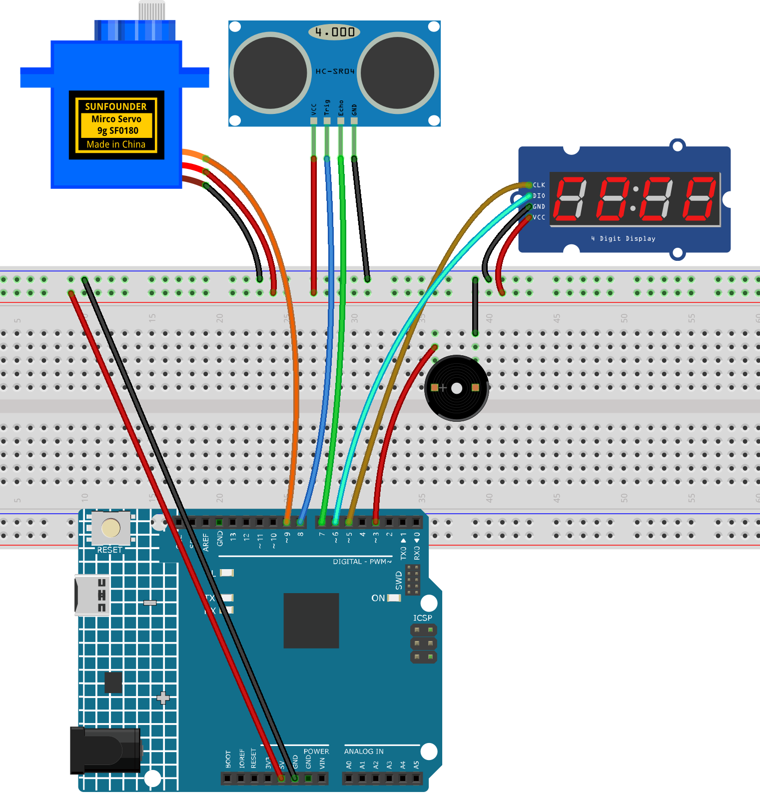

.. _radar_guard7.0:

Radar Guard 7.0
==============================================================

.. note::
  
  🌟 Welcome to the SunFounder Facebook Community! Whether you're into Raspberry Pi, Arduino, or ESP32, you'll find inspiration, help ideas here.
   
  - ✅ Be the first to get free learning resources. 
   
  - ✅ Stay updated on new products & exclusive giveaways. 
   
  - ✅ Share your creations and get real feedback.
   
  * 👉 Need faster updates or support? Click [|link_sf_facebook|] join our Facebook community 

  * 👉 Or join our WhatsApp group: Click [|link_sf_whatsapp|]
   
  * 🎁 Looking for parts?Check out our all-in-one kits below — packed with components, beginner-friendly guides, and tons of fun.
  
  .. list-table::
    :widths: 20 20 20
    :header-rows: 1

    *   - Name	
        - Includes Arduino board
        - PURCHASE LINK
    *   - Elite Explorer Kit	
        - Arduino Uno R4 WiFi
        - |link_elite_buy|
    *   - 3 in 1 Ultimate Starter Kit
        - Arduino Uno R4 Minima
        - |link_arduinor4_buy|

Course Introduction
------------------------

In this lesson, we’ll build a Radar Bomb Simulator using an ultrasonic sensor, a servo, a 4-digit display, and a buzzer.

The servo sweeps the ultrasonic sensor to detect objects. If something enters within 15 cm, a countdown appears on the display with beeping sounds that speed up as the target gets closer. At just 2 cm, the system simulates an explosion with flashing and a continuous alarm.

.. .. raw:: html
 
..  <iframe width="700" height="394" src="https://www.youtube.com/embed/IIe3DMzaRSA?si=EmbqV2plsvQtJ3yr" title="YouTube video player" frameborder="0" allow="accelerometer; autoplay; clipboard-write; encrypted-media; gyroscope; picture-in-picture; web-share" referrerpolicy="strict-origin-when-cross-origin" allowfullscreen></iframe>

.. note::

  If this is your first time working with an Arduino project, we recommend downloading and reviewing the basic materials first.
  
  * :ref:`install_arduino`
  * :ref:`introduce_arduino`

**Required Components**

In this project, we need the following components:

.. list-table::
    :widths: 5 20 5 20
    :header-rows: 1

    *   - SN
        - COMPONENT INTRODUCTION	
        - QUANTITY
        - PURCHASE LINK

    *   - 1
        - Arduino UNO R4 Minima/Arduino UNO R4 WIFI
        - 1
        - |link_unor4_wifi_buy|
    *   - 2
        - USB Type-C cable
        - 1
        - 
    *   - 3
        - Breadboard
        - 1
        - |link_breadboard_buy|
    *   - 4
        - Wires
        - Several
        - |link_wires_buy|
    *   - 5
        - Ultrasonic Sensor Module
        - 1
        - |link_ultrasonic_buy|
    *   - 6
        - I2C LCD 1602
        - 1
        - |link_i2clcd1602_buy|
    *   - 7
        - 4-Digit Segment Display Module
        - 1
        - |link_4segment_buy|
    *   - 8
        - Passive Buzzer
        - 1
        - |link_passive_buzzer_buy|

**Wiring**

**Common Connections:**

* **Digital Servo Motor**

  - Connect to breadboard’s positive power bus.
  - Connect to breadboard’s negative power bus.
  - Connect to **9** on the Arduino.

* **Buzzer**

  - Connect to breadboard’s negative power bus.
  - Connect to **3** on the Arduino.

* **4-Digit Segment Display Module**

  - **CLK:** Connect to **5** on the Arduino.
  - **DIO:** Connect to **6** on the Arduino.
  - **GND:** Connect to breadboard’s negative power bus.
  - **VCC:** Connect to breadboard’s red power bus.

* **Ultrasonic Sensor Module**

  - **Trig:** Connect to **8** on the Arduino.
  - **Echo:** Connect to **7** on the Arduino.
  - **GND:** Connect to breadboard’s negative power bus.
  - **VCC:** Connect to breadboard’s red power bus.

**Writing the Code**

.. note::

    * You can copy this code into **Arduino IDE**. 
    * To install the library, use the Arduino Library Manager and search for **TM1637Display** and install it.
    * Don't forget to select the board(Arduino UNO R4 WIFI) and the correct port before clicking the **Upload** button.

.. code-block:: arduino

      #include <Servo.h>
      #include <TM1637Display.h>

      // ------------------- Pin Definitions -------------------
      #define TRIG_PIN   8
      #define ECHO_PIN   7
      #define SERVO_PIN  9
      #define BUZZER_PIN 3

      // TM1637 4-digit display
      #define TM_CLK_PIN 5
      #define TM_DIO_PIN 6

      // ------------------- Objects -------------------
      Servo radarServo;
      TM1637Display display(TM_CLK_PIN, TM_DIO_PIN);

      // ------------------- Parameters -------------------
      // Servo scanning angle and speed
      const int SERVO_MIN_ANGLE   = 15;     // Left limit
      const int SERVO_MAX_ANGLE   = 165;    // Right limit
      const int SERVO_STEP_DEG    = 2;      // Step angle
      const unsigned long SERVO_STEP_MS = 20;  // Interval per step (ms)

      // Distance thresholds (cm)
      const int ALERT_DISTANCE_CM   = 15;   // Start countdown threshold
      const int EXPLODE_DISTANCE_CM = 2;    // Immediate "explosion" threshold

      // Map distance to countdown interval (closer = faster)
      const unsigned long COUNT_INTERVAL_MIN_MS = 120; // Fastest interval
      const unsigned long COUNT_INTERVAL_MAX_MS = 800; // Slowest interval

      // Countdown settings
      const int COUNT_START = 9;    // Starting countdown value
      const int COUNT_END   = 0;    // End

      // State machine
      enum State { SCANNING, COUNTDOWN, EXPLODED };
      State state = SCANNING;

      // Scanning variables
      int servoAngle = SERVO_MIN_ANGLE;
      int servoDir   = +1;
      unsigned long lastServoStepMs = 0;

      // Distance measurement
      long readDistanceCm() {
        // Trigger ultrasonic
        pinMode(TRIG_PIN, OUTPUT);
        digitalWrite(TRIG_PIN, LOW);
        delayMicroseconds(3);
        digitalWrite(TRIG_PIN, HIGH);
        delayMicroseconds(10);
        digitalWrite(TRIG_PIN, LOW);

        // Echo
        pinMode(ECHO_PIN, INPUT);
        unsigned long dur = pulseIn(ECHO_PIN, HIGH, 30000UL); // 30ms timeout
        if (dur == 0) return -1; // Timeout/invalid
        long dist = (long)(dur * 0.034f / 2.0f); // μs -> cm
        return dist;
      }

      // Average multiple measurements to reduce jitter
      long readDistanceAvg(uint8_t samples = 3) {
        long sum = 0; int cnt = 0;
        for (uint8_t i = 0; i < samples; i++) {
          long d = readDistanceCm();
          if (d > 0) { sum += d; cnt++; }
          delay(5);
        }
        return (cnt == 0) ? -1 : (sum / cnt);
      }

      // Display helper: show "----"
      void showDashes() {
        static const uint8_t dash = 0x40; // Segment code for '-'
        uint8_t data[] = { dash, dash, dash, dash };
        display.setSegments(data);
      }

      // Display a positive integer 0~9999 (auto hide leading zero)
      void showNumber(int value) {
        display.showNumberDec(value, true); // leading_zeros=true (force show leading zero)
      }

      // "Explosion" effect: flashing + continuous buzzer
      void doExplodeEffect(unsigned long durationMs = 2000) {
        unsigned long start = millis();
        tone(BUZZER_PIN, 2500); // Continuous beep
        while (millis() - start < durationMs) {
          display.setBrightness(7, true);
          delay(80);
          display.setBrightness(0, true); // Approximate off to simulate flashing
          delay(80);
        }
        noTone(BUZZER_PIN);
      }

      // Map distance to countdown interval
      unsigned long mapCountIntervalByDistance(long distCm) {
        // Clamp: restrict distance to [EXPLODE_DISTANCE_CM, ALERT_DISTANCE_CM]
        if (distCm < EXPLODE_DISTANCE_CM) distCm = EXPLODE_DISTANCE_CM;
        if (distCm > ALERT_DISTANCE_CM)   distCm = ALERT_DISTANCE_CM;
        // Closer -> smaller interval (faster)
        long iv = map(distCm, EXPLODE_DISTANCE_CM, ALERT_DISTANCE_CM,
                      COUNT_INTERVAL_MIN_MS, COUNT_INTERVAL_MAX_MS);
        if (iv < (long)COUNT_INTERVAL_MIN_MS) iv = COUNT_INTERVAL_MIN_MS;
        if (iv > (long)COUNT_INTERVAL_MAX_MS) iv = COUNT_INTERVAL_MAX_MS;
        return (unsigned long)iv;
      }

      // ------------------- Setup -------------------
      void setup() {
        pinMode(BUZZER_PIN, OUTPUT);
        digitalWrite(BUZZER_PIN, LOW);

        radarServo.attach(SERVO_PIN);
        radarServo.write(servoAngle);

        display.setBrightness(7, true); // Brightness: 0~7
        showDashes();

        // Optional: Serial debug
        Serial.begin(115200);
        delay(300);
      }

      // ------------------- Main Loop -------------------
      void loop() {
        switch (state) {

          case SCANNING: {
            // Servo scanning
            unsigned long now = millis();
            if (now - lastServoStepMs >= SERVO_STEP_MS) {
              lastServoStepMs = now;
              servoAngle += servoDir * SERVO_STEP_DEG;
              if (servoAngle >= SERVO_MAX_ANGLE) { servoAngle = SERVO_MAX_ANGLE; servoDir = -1; }
              else if (servoAngle <= SERVO_MIN_ANGLE) { servoAngle = SERVO_MIN_ANGLE; servoDir = +1; }
              radarServo.write(servoAngle);
            }

            // Distance measurement
            long dist = readDistanceAvg(3);
            if (dist > 0) {
              // Check explosion threshold
              if (dist <= EXPLODE_DISTANCE_CM) {
                state = EXPLODED;
                break;
              }
              // Check countdown threshold
              if (dist <= ALERT_DISTANCE_CM) {
                state = COUNTDOWN;
                // Initialize countdown params
              }
            }
            // Show "----" while scanning
            showDashes();
          } break;

          case COUNTDOWN: {
            // Real-time distance -> dynamic speed
            long dist = readDistanceAvg(3);
            if (dist <= 0 || dist > ALERT_DISTANCE_CM + 3) {
              // Target moved away, back to scanning
              state = SCANNING;
              showDashes();
              noTone(BUZZER_PIN);
              break;
            }
            if (dist <= EXPLODE_DISTANCE_CM) {
              state = EXPLODED;
              break;
            }

            // Countdown (non-blocking)
            static int countVal = COUNT_START;
            static unsigned long lastTick = 0;
            static unsigned long intervalMs = COUNT_INTERVAL_MAX_MS;

            // First enter or reset
            static bool firstEnter = true;
            if (firstEnter) {
              countVal  = COUNT_START;
              lastTick  = millis();
              intervalMs = mapCountIntervalByDistance(dist);
              firstEnter = false;
            }

            // Update interval dynamically
            intervalMs = mapCountIntervalByDistance(dist);

            // Show countdown number
            showNumber(countVal);

            // Each tick -> decrement, short beep
            unsigned long now = millis();
            if (now - lastTick >= intervalMs) {
              lastTick = now;

              // Short beep: frequency rises as number decreases
              int freq = 800 + (COUNT_START - countVal) * 120; // 800Hz ~ ?
              tone(BUZZER_PIN, freq, 90); // 90ms beep
              if (countVal > COUNT_END) {
                countVal--;
              } else {
                // Reached 0 -> trigger explosion
                state = EXPLODED;
                firstEnter = true; // Reset when re-enter COUNTDOWN
              }
            }

            // Exit COUNTDOWN -> cleanup
            if (state != COUNTDOWN) {
              noTone(BUZZER_PIN);
              firstEnter = true;
            }
          } break;

          case EXPLODED: {
            // Explosion effect
            doExplodeEffect(2000); // 2 sec
            showDashes();
            // Wait until target moves away before reset
            while (true) {
              long d = readDistanceAvg(3);
              if (d <= 0 || d > ALERT_DISTANCE_CM + 5) break;
              delay(60);
            }
            state = SCANNING;
          } break;
        }
      }
