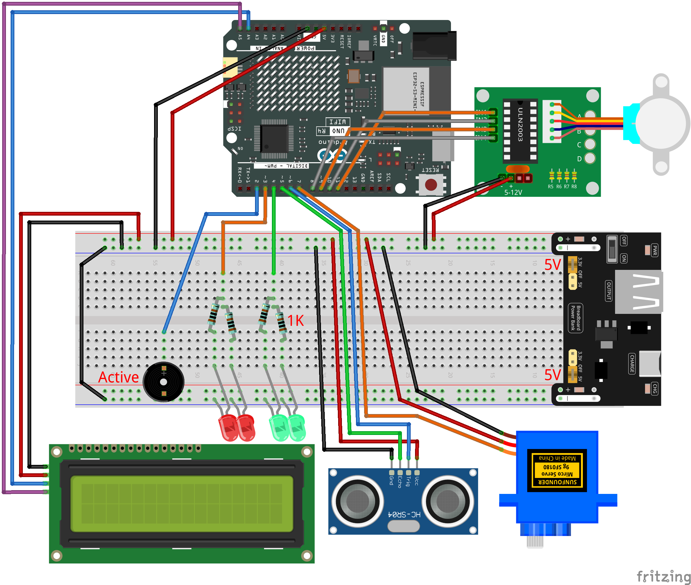

.. _radar_guard8.0:

Radar Guard 8.0
==============================================================

.. note::
  
  🌟 Welcome to the SunFounder Facebook Community! Whether you're into Raspberry Pi, Arduino, or ESP32, you'll find inspiration, help ideas here.
   
  - ✅ Be the first to get free learning resources. 
   
  - ✅ Stay updated on new products & exclusive giveaways. 
   
  - ✅ Share your creations and get real feedback.
   
  * 👉 Need faster updates or support? Click [|link_sf_facebook|] join our Facebook community 

  * 👉 Or join our WhatsApp group: Click [|link_sf_whatsapp|]
   
  * 🎁 Looking for parts?Check out our all-in-one kits below — packed with components, beginner-friendly guides, and tons of fun.
  
  .. list-table::
    :widths: 20 20 20
    :header-rows: 1

    *   - Name	
        - Includes Arduino board
        - PURCHASE LINK
    *   - Elite Explorer Kit	
        - Arduino Uno R4 WiFi
        - |link_elite_buy|
    *   - 3 in 1 Ultimate Starter Kit
        - Arduino Uno R4 Minima
        - |link_arduinor4_buy|

Course Introduction
------------------------

In this project, we’ll build a Radar Warning System using an ultrasonic sensor, servo, LCD, stepper motor, and buzzer.

The servo scans the area, and when an object comes within 20 cm, the system enters ALERT mode: the LCD shows a warning, the red LED and buzzer blink, and the stepper motor sweeps back and forth. Once the object leaves, the system resets to normal with the green LED on and “Area is Empty” displayed.

.. .. raw:: html
 
..  <iframe width="700" height="394" src="https://www.youtube.com/embed/3-j4CZyHikc" title="YouTube video player" frameborder="0" allow="accelerometer; autoplay; clipboard-write; encrypted-media; gyroscope; picture-in-picture; web-share" referrerpolicy="strict-origin-when-cross-origin" allowfullscreen></iframe>

.. note::

  If this is your first time working with an Arduino project, we recommend downloading and reviewing the basic materials first.
  
  * :ref:`install_arduino`
  * :ref:`introduce_arduino`

**Required Components**

In this project, we need the following components:

.. list-table::
    :widths: 5 20 5 20
    :header-rows: 1

    *   - SN
        - COMPONENT INTRODUCTION	
        - QUANTITY
        - PURCHASE LINK

    *   - 1
        - Arduino UNO R4 Minima/Arduino UNO R4 WIFI
        - 1
        - |link_unor4_wifi_buy|
    *   - 2
        - USB Type-C cable
        - 1
        - 
    *   - 3
        - Breadboard
        - 1
        - |link_breadboard_buy|
    *   - 4
        - Wires
        - Several
        - |link_wires_buy|
    *   - 5
        - Ultrasonic Sensor Module
        - 1
        - |link_ultrasonic_buy|
    *   - 6
        - I2C LCD 1602
        - 1
        - |link_i2clcd1602_buy|
    *   - 7
        - Digital Servo Motor
        - 1
        - |link_motor_buy|
    *   - 8
        - Passive Buzzer
        - 1
        - |link_passive_buzzer_buy|
    *   - 9
        - 1kΩ resistor
        - 4
        - |link_resistor_buy|
    *   - 10
        - LED
        - 4
        - |link_led_buy|
    *   - 11
        - Stepper Motor 28BYJ-48 ULN2003 Drive Module 5
        - 1
        - |link_stepper_buy|

**Wiring**

**Common Connections:**

* **LED**

  - **Red LED**: Connect the LEDs **anode** to a **1kΩ resistor** then to  the  **3** on Arduino, and the LEDs **cathode**  to negative power bus on the breadboard.
  - **Green LED**: Connect the LEDs **anode** to a **1kΩ resistor** then to the  **4** on Arduino, and the LEDs **cathode** to negative power bus on the breadboard.

* **Digital Servo Motor**

  - Connect to breadboard’s positive power bus.
  - Connect to breadboard’s negative power bus.
  - Connect to **7** on the Arduino.

* **Buzzer**

  - Connect to breadboard’s negative power bus.
  - Connect to **2** on the Arduino.

* **Ultrasonic Sensor Module**

  - **Trig:** Connect to **6** on the Arduino.
  - **Echo:** Connect to **5** on the Arduino.
  - **GND:** Connect to breadboard’s negative power bus.
  - **VCC:** Connect to breadboard’s red power bus.

* **Stepper Motor 28BYJ-48 ULN2003 Drive Module 5**

  - **IN1:** Connect to **11** on the Arduino.
  - **IN2:** Connect to **10** on the Arduino.
  - **IN3:** Connect to **9** on the Arduino.
  - **IN4:** Connect to **8** on the Arduino.

* **I2C LCD 1602**

  - **SDA:** Connect to **A4** on the Arduino.
  - **SCL:** Connect to **A5** on the Arduino.
  - **GND:** Connect to breadboard’s negative power bus.
  - **VCC:** Connect to breadboard’s red power bus.

**Writing the Code**

.. note::

    * You can copy this code into **Arduino IDE**. 
    * To install the library, use the Arduino Library Manager and search for **LiquidCrystal_I2C** and **Stepper** and install it.
    * Don't forget to select the board(Arduino UNO R4 WIFI) and the correct port before clicking the **Upload** button.

.. code-block:: arduino

      #include <Servo.h>
      #include <Wire.h>
      #include <LiquidCrystal_I2C.h>
      #include <Stepper.h>

      // --------------------- Pins ---------------------
      // Ultrasonic
      const int trigPin = 6;
      const int echoPin = 5;

      // Servo (scanner)
      const int servoPin = 7;

      // LEDs & Active Buzzer
      const int redLed   = 3;
      const int greenLed = 4;
      const int buzzer   = 2;   // Active buzzer: HIGH=on, LOW=off

      // LCD
      LiquidCrystal_I2C lcd(0x27, 16, 2); // if no display, try 0x3F

      // Stepper (28BYJ-48 + ULN2003)  IN1→8, IN2→9, IN3→10, IN4→11
      const int IN1 = 8;
      const int IN2 = 9;
      const int IN3 = 10;
      const int IN4 = 11;
      const int stepsPerRevolution = 2048;     // typical for 28BYJ-48
      const int stepperRPM = 16;
      // Phase order (common): IN1, IN3, IN2, IN4; if not working, try IN1,IN2,IN3,IN4
      Stepper stepperMotor(stepsPerRevolution, IN1, IN3, IN2, IN4);

      // --------------------- Scan settings ---------------------
      Servo radarServo;
      const int alertDistance = 20;            // cm
      const unsigned long updateInterval = 20; // ms per servo tick
      int currentAngle = 0;
      int increment    = 1;
      unsigned long lastServoUpdate = 0;

      // Detection threshold
      const uint8_t ENTER_HITS = 3;            // Enter ALERT after 3 consecutive hits
      int triggerCount = 0;

      // --------------------- Beep/Blink (100ms) ---------------------
      unsigned long lastBlinkTs = 0;
      bool blinkOn = false;

      // --------------------- Helpers (decl) ---------------------
      float getDistance();
      float getDistanceMedian3();
      void setNormalState();
      void lcdSetEmpty();
      void lcdSetWarning();
      void doSweepWithBeepBlink(); // Perform 0→180→0 sweep, with LED/Buzzer blinking

      // --------------------- Setup ---------------------
      void setup() {
        radarServo.attach(servoPin);

        pinMode(trigPin, OUTPUT);
        pinMode(echoPin, INPUT);

        pinMode(redLed, OUTPUT);
        pinMode(greenLed, OUTPUT);
        pinMode(buzzer, OUTPUT);

        lcd.init();
        lcd.backlight();
        lcd.clear();

        stepperMotor.setSpeed(stepperRPM);

        lcdSetEmpty();
        setNormalState();
      }

      // --------------------- Main Loop ---------------------
      void loop() {
        unsigned long now = millis();

        // Servo scanning (only when not in ALERT mode)
        if (now - lastServoUpdate >= updateInterval) {
          lastServoUpdate = now;

          radarServo.write(currentAngle);

          // Distance measurement every 5 degrees
          if (currentAngle % 5 == 0) {
            float d = getDistanceMedian3();
            if (d < alertDistance) triggerCount++;
            else triggerCount = 0;

            // Enter ALERT after enough hits
            if (triggerCount >= ENTER_HITS) {
              triggerCount = 0;

              // Show warning on LCD, turn off green LED
              lcdSetWarning();
              digitalWrite(greenLed, LOW);

              // Loop: after each full sweep, check distance again
              while (true) {
                doSweepWithBeepBlink(); // Perform 0→180→0 sweep with LED/Buzzer

                // After sweep, check if object is still present
                float d2 = getDistanceMedian3();
                if (d2 >= alertDistance) {
                  // No object → exit ALERT
                  break;
                }
                // Still detected → repeat another sweep
              }

              // Stop buzzer and LED, restore normal state
              blinkOn = false;
              digitalWrite(redLed, LOW);
              digitalWrite(buzzer, LOW);
              setNormalState();
              lcdSetEmpty();
            }
          }

          // Update scanning angle
          currentAngle += increment;
          if (currentAngle >= 180) { currentAngle = 180; increment = -1; }
          else if (currentAngle <= 0) { currentAngle = 0; increment = 1; }
        }
      }

      // --------------------- Sweep (0→180→0) with Beep/Blink ---------------------
      // Perform one complete sweep 0→180→0 smoothly, 
      // with LED and buzzer toggling every 100ms during the motion.
      void doSweepWithBeepBlink() {
        const int halfTurnSteps = stepsPerRevolution / 2; // 180°

        // Reset blinking state
        lastBlinkTs = millis();
        blinkOn = false;
        digitalWrite(redLed, LOW);
        digitalWrite(buzzer, LOW);

        // Forward half-turn
        for (int i = 0; i < halfTurnSteps; i++) {
          stepperMotor.step(1);
          unsigned long now = millis();
          if (now - lastBlinkTs >= 100) {
            lastBlinkTs = now;
            blinkOn = !blinkOn;
            digitalWrite(redLed, blinkOn ? HIGH : LOW);
            digitalWrite(buzzer, blinkOn ? HIGH : LOW);
          }
        }

        // Backward half-turn
        for (int i = 0; i < halfTurnSteps; i++) {
          stepperMotor.step(-1);
          unsigned long now = millis();
          if (now - lastBlinkTs >= 100) {
            lastBlinkTs = now;
            blinkOn = !blinkOn;
            digitalWrite(redLed, blinkOn ? HIGH : LOW);
            digitalWrite(buzzer, blinkOn ? HIGH : LOW);
          }
        }

        // At the end, ensure LED and buzzer are off
        digitalWrite(redLed, LOW);
        digitalWrite(buzzer, LOW);
      }

      // --------------------- Distance (median filter) ---------------------
      float getDistance() {
        digitalWrite(trigPin, LOW);
        delayMicroseconds(2);
        digitalWrite(trigPin, HIGH);
        delayMicroseconds(10);
        digitalWrite(trigPin, LOW);

        unsigned long duration = pulseIn(echoPin, HIGH, 30000UL);
        if (duration == 0) return 9999.0; // Timeout → very far
        return duration * 0.034f / 2.0f;  // Convert to cm
      }

      float getDistanceMedian3() {
        float a = getDistance();
        float b = getDistance();
        float c = getDistance();
        // Return the median of three readings
        if (a > b) { float t = a; a = b; b = t; }
        if (b > c) { float t = b; b = c; c = t; }
        if (a > b) { float t = a; a = b; b = t; }
        return b;
      }

      // --------------------- UI helpers ---------------------
      void setNormalState() {
        digitalWrite(greenLed, HIGH);
        digitalWrite(redLed, LOW);
        digitalWrite(buzzer, LOW);
      }

      void lcdSetEmpty() {
        lcd.clear();
        lcd.setCursor(1, 0);  // Centered "Area is Empty"
        lcd.print("Area is Empty");
        lcd.setCursor(0, 1);
        lcd.print("                ");
      }

      void lcdSetWarning() {
        lcd.clear();
        lcd.setCursor(4, 0); // Centered "WARNING!!"
        lcd.print("WARNING!!");
        lcd.setCursor(2, 1); // Centered "Foreign Body"
        lcd.print("Foreign Body");
      }
