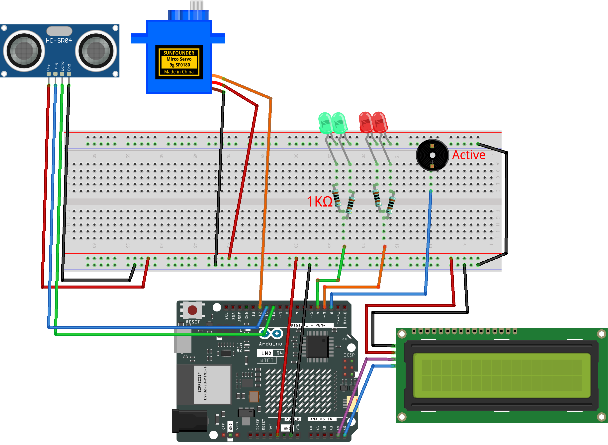

.. _radar_guard9.0:

Radar Guard 9.0
==============================================================

.. note::
  
  🌟 Welcome to the SunFounder Facebook Community! Whether you're into Raspberry Pi, Arduino, or ESP32, you'll find inspiration, help ideas here.
   
  - ✅ Be the first to get free learning resources. 
   
  - ✅ Stay updated on new products & exclusive giveaways. 
   
  - ✅ Share your creations and get real feedback.
   
  * 👉 Need faster updates or support? Click [|link_sf_facebook|] join our Facebook community 

  * 👉 Or join our WhatsApp group: Click [|link_sf_whatsapp|]
   
  * 🎁 Looking for parts?Check out our all-in-one kits below — packed with components, beginner-friendly guides, and tons of fun.
  
  .. list-table::
    :widths: 20 20 20
    :header-rows: 1

    *   - Name	
        - Includes Arduino board
        - PURCHASE LINK
    *   - Elite Explorer Kit	
        - Arduino Uno R4 WiFi
        - |link_elite_buy|
    *   - 3 in 1 Ultimate Starter Kit
        - Arduino Uno R4 Minima
        - |link_arduinor4_buy|

Course Introduction
------------------------

In this lesson, we’ll build a Radar Warning System using an ultrasonic sensor, a servo, an I²C LCD, LEDs, and a buzzer.

The servo sweeps the ultrasonic sensor across the area, measuring distances in real time. When an object comes within 50 cm, the system enters ALERT mode: the LCD shows a warning, the green LED turns off while the red LED turns on, and the buzzer beeps with a frequency that increases as the target gets closer. Once the object moves away, the system resets to normal mode, showing “Area is Empty” and restoring the green LED.

.. .. raw:: html
 
..  <iframe width="700" height="394" src="https://www.youtube.com/embed/3-j4CZyHikc" title="YouTube video player" frameborder="0" allow="accelerometer; autoplay; clipboard-write; encrypted-media; gyroscope; picture-in-picture; web-share" referrerpolicy="strict-origin-when-cross-origin" allowfullscreen></iframe>

.. note::

  If this is your first time working with an Arduino project, we recommend downloading and reviewing the basic materials first.
  
  * :ref:`install_arduino`
  * :ref:`introduce_arduino`

**Required Components**

In this project, we need the following components:

.. list-table::
    :widths: 5 20 5 20
    :header-rows: 1

    *   - SN
        - COMPONENT INTRODUCTION	
        - QUANTITY
        - PURCHASE LINK

    *   - 1
        - Arduino UNO R4 Minima/Arduino UNO R4 WIFI
        - 1
        - |link_unor4_wifi_buy|
    *   - 2
        - USB Type-C cable
        - 1
        - 
    *   - 3
        - Breadboard
        - 1
        - |link_breadboard_buy|
    *   - 4
        - Wires
        - Several
        - |link_wires_buy|
    *   - 5
        - Ultrasonic Sensor Module
        - 1
        - |link_ultrasonic_buy|
    *   - 6
        - I2C LCD 1602
        - 1
        - |link_i2clcd1602_buy|
    *   - 7
        - Digital Servo Motor
        - 1
        - |link_motor_buy|
    *   - 8
        - Active Buzzer
        - 1
        - 
    *   - 9
        - 1kΩ resistor
        - 4
        - |link_resistor_buy|
    *   - 10
        - LED
        - 4
        - |link_led_buy|

**Wiring**

**Common Connections:**

* **LED**

  - **Red LED**: Connect the LEDs **anode** to a **1kΩ resistor** then to  the  **3** on Arduino, and the LEDs **cathode**  to negative power bus on the breadboard.
  - **Green LED**: Connect the LEDs **anode** to a **1kΩ resistor** then to the  **4** on Arduino, and the LEDs **cathode** to negative power bus on the breadboard.

* **Digital Servo Motor**

  - Connect to breadboard’s positive power bus.
  - Connect to breadboard’s negative power bus.
  - Connect to **7** on the Arduino.

* **Buzzer**

  - Connect to breadboard’s negative power bus.
  - Connect to **2** on the Arduino.

* **Ultrasonic Sensor Module**

  - **Trig:** Connect to **11** on the Arduino.
  - **Echo:** Connect to **10** on the Arduino.
  - **GND:** Connect to breadboard’s negative power bus.
  - **VCC:** Connect to breadboard’s red power bus.

* **I2C LCD 1602**

  - **SDA:** Connect to **A4** on the Arduino.
  - **SCL:** Connect to **A5** on the Arduino.
  - **GND:** Connect to breadboard’s negative power bus.
  - **VCC:** Connect to breadboard’s red power bus.

**Writing the Code**

.. note::

 * Build the circuit.

 * Upload the code to the Arduino board using Arduino IDE.

 * In the Arduino IDE, check the current Arduino port(COMx).

 * To install the library, use the Arduino Library Manager and search for **LiquidCrystal_I2C** and install it.

 * The ``ArduinoRadarGUI`` is used here. You can click here :download:`Radar_Guard9.0.zip </_static/Radar_Guard9.0.zip>` to download it. 
 
 * Open ArduinoLidarGUI.pde in the |link_processing_ide|.

 * Modify the code in line 35 to ensure the correct port number(COMx).

 * Run the Processing sketch to visualize the radar data.

.. code-block:: arduino

      #include <Servo.h>
      #include <Wire.h>
      #include <LiquidCrystal_I2C.h>

      // ---------- Pin Mapping ----------
      const int trigPin   = 11;   // ultrasonic trig
      const int echoPin   = 10;   // ultrasonic echo
      const int servoPin  = 12;   // servo motor
      const int buzzerPin = 2;    // buzzer
      const int redLED    = 3;    // red LED
      const int greenLED  = 4;    // green LED

      // ---------- Config ----------
      const long BAUD_RATE     = 9600;
      const int  thresholdCM   = 50;          // base threshold
      const int  minAngle      = 0;           // servo min angle
      const int  maxAngle      = 180;         // servo max angle
      const int  stepAngle     = 1;           // step size
      const uint16_t servoMs   = 20;          // step interval
      const uint32_t echoTOus  = 20000UL;     // ultrasonic timeout

      // --- Hysteresis & stability ---
      const int  thresholdEnterCM = 50;       // enter alert
      const int  thresholdExitCM  = 55;       // exit alert
      const byte stableN          = 3;        // stable count
      byte enterCnt = 0, exitCnt = 0;

      // ---------- LCD ----------
      LiquidCrystal_I2C lcd(0x27, 16, 2);

      // ---------- Globals ----------
      Servo scanner;
      int  angleCur = minAngle;
      int  dir      = +1;

      bool alertNow  = false;
      bool lastAlert = false;

      uint32_t tServoNext  = 0;

      // Buzzer scheduler
      bool      buzzOn      = false;
      uint32_t  tBuzzNext   = 0;
      uint16_t  buzzOnMs    = 20;            
      uint16_t  buzzOffMs   = 200;           

      long lastDistCM = 9999;

      // ---------- Helpers ----------
      // Measure distance (cm)
      long measureDistanceCM() {
        digitalWrite(trigPin, LOW);
        delayMicroseconds(2);
        digitalWrite(trigPin, HIGH);
        delayMicroseconds(10);
        digitalWrite(trigPin, LOW);

        unsigned long dur = pulseIn(echoPin, HIGH, echoTOus);
        if (dur == 0) return 9999;
        long cm = (long)(dur / 58.0f);
        if (cm <= 0) cm = 9999;
        return cm;
      }

      // Send data to Serial
      void sendData(int angle, long dist) {
        Serial.print(angle);
        Serial.print(",");
        Serial.print(dist);
        Serial.print(".");
      }

      // LED state
      void setIdleIndicators() {
        digitalWrite(greenLED, HIGH);
        digitalWrite(redLED, LOW);
      }
      void setAlertIndicators() {
        digitalWrite(redLED, HIGH);
        digitalWrite(greenLED, LOW);
      }

      // LCD messages
      void lcdSetEmpty() {
        lcd.clear();
        lcd.setCursor(1, 0);
        lcd.print("Area is Empty");
        lcd.setCursor(0, 1);
        lcd.print("                ");
      }
      void lcdSetWarning() {
        lcd.clear();
        lcd.setCursor(4, 0);
        lcd.print("WARNING!!");
        lcd.setCursor(2, 1);
        lcd.print("Foreign Body");
      }

      // Update LCD only when state changes
      void updateLCDIfChanged(bool state) {
        if (state != lastAlert) {
          if (state) lcdSetWarning();
          else       lcdSetEmpty();
          lastAlert = state;
        }
      }

      // Stable alert decision
      bool computeStableAlert(long dist) {
        static bool state = false;
        if (!state) {
          if (dist <= thresholdEnterCM) {
            if (++enterCnt >= stableN) { state = true; enterCnt = 0; exitCnt = 0; }
          } else enterCnt = 0;
        } else {
          if (dist >= thresholdExitCM || dist == 9999) {
            if (++exitCnt >= stableN) { state = false; exitCnt = 0; enterCnt = 0; }
          } else exitCnt = 0;
        }
        return state;
      }

      // Buzzer timing
      void updateBuzzerScheduler(bool state, long dist) {
        if (!state) {
          digitalWrite(buzzerPin, LOW);
          buzzOn = false;
          return;
        }
        int mapped = map((int)dist, 5, thresholdCM, 60, 300);
        mapped = constrain(mapped, 40, 400);
        buzzOffMs = (uint16_t)mapped;
      }

      // ---------- Setup ----------
      void setup() {
        pinMode(trigPin, OUTPUT);
        pinMode(echoPin, INPUT);
        pinMode(buzzerPin, OUTPUT);
        pinMode(redLED, OUTPUT);
        pinMode(greenLED, OUTPUT);

        Serial.begin(BAUD_RATE);

        scanner.attach(servoPin);
        scanner.write(angleCur);

        lcd.init();
        lcd.backlight();
        lcd.clear();
        lcdSetEmpty();

        setIdleIndicators();

        uint32_t now = millis();
        tServoNext = now + servoMs;
        tBuzzNext  = now;
      }

      // ---------- Loop ----------
      void loop() {
        uint32_t now = millis();

        // Servo & distance update
        if ((int32_t)(now - tServoNext) >= 0) {
          tServoNext += servoMs;

          // move servo
          angleCur += dir * stepAngle;
          if (angleCur >= maxAngle) { angleCur = maxAngle; dir = -1; }
          else if (angleCur <= minAngle) { angleCur = minAngle; dir = +1; }
          scanner.write(angleCur);

          // distance
          long d = measureDistanceCM();
          lastDistCM = d;

          // alert state
          alertNow = computeStableAlert(d);
          if (alertNow) setAlertIndicators();
          else          setIdleIndicators();

          updateLCDIfChanged(alertNow);
          updateBuzzerScheduler(alertNow, d);
          sendData(angleCur, d);
        }

        // Buzzer update
        if (alertNow) {
          if ((int32_t)(now - tBuzzNext) >= 0) {
            if (!buzzOn) {
              digitalWrite(buzzerPin, HIGH);
              buzzOn    = true;
              tBuzzNext = now + buzzOnMs;
            } else {
              digitalWrite(buzzerPin, LOW);
              buzzOn    = false;
              tBuzzNext = now + buzzOffMs;
            }
          }
        } else {
          if (buzzOn) {
            digitalWrite(buzzerPin, LOW);
            buzzOn = false;
          }
        }
      }
