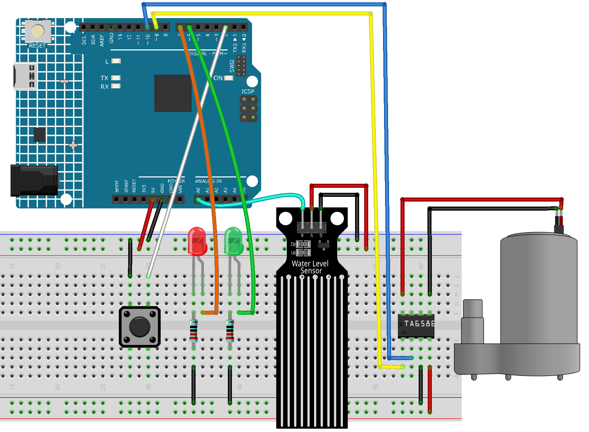

.. _rain_irrigation:

Rain Irrigation
==============================================================

.. note::
  
  🌟 Welcome to the SunFounder Facebook Community! Whether you're into Raspberry Pi, Arduino, or ESP32, you'll find inspiration, help ideas here.
   
  - ✅ Be the first to get free learning resources. 
   
  - ✅ Stay updated on new products & exclusive giveaways. 
   
  - ✅ Share your creations and get real feedback.
   
  * 👉 Need faster updates or support? Click [|link_sf_facebook|] join our Facebook community 

  * 👉 Or join our WhatsApp group: Click [|link_sf_whatsapp|]
   
Kit purchase
------------------------

Looking for parts? Check out our all-in-one kits below — packed with components, beginner-friendly guides, and tons of fun.

.. image:: img/umsk_kit.png
   :width: 100%
   :align: center
   :target: https://www.sunfounder.com/collections/raspberrypi-kits/products/sunfounder-universal-maker-sensor-kit?ref=jbzmncle

.. raw:: html

     

.. list-table::
   :widths: 20 20 20
   :header-rows: 1

   * - Name
     - Includes Arduino board
     - PURCHASE LINK
   * - Ultimate Sensor Kit
     - Arduino Uno R4 Minima
     - |link_ultimate_sensor_buy|
   * - Elite Explorer Kit
     - Arduino Uno R4 WiFi
     - |link_elite_buy|
   * - 3 in 1 Ultimate Starter Kit
     - Arduino Uno R4 Minima
     - |link_arduinor4_buy|
   * - Universal Maker Sensor Kit
     - ×
     - |link_umsk_buy|

Course Introduction
------------------------

This program uses an Arduino UNO R4 board with a Water Level Sensor Module, a water pump, LEDs, and a push button.

The sensor monitors the water level, while the LEDs indicate the water status. Pressing the button turns the water pump on or off.

.. .. raw:: html
 
..  <iframe width="700" height="394" src="https://www.youtube.com/embed/pTUmTnP-Rbo" title="YouTube video player" frameborder="0" allow="accelerometer; autoplay; clipboard-write; encrypted-media; gyroscope; picture-in-picture; web-share" referrerpolicy="strict-origin-when-cross-origin" allowfullscreen></iframe>

.. note::

  If this is your first time working with an Arduino project, we recommend downloading and reviewing the basic materials first.
  
  * :ref:`install_arduino`
  * :ref:`introduce_arduino`

**Required Components**

In this project, we need the following components:

.. list-table::
    :widths: 5 20 5 20
    :header-rows: 1

    *   - SN
        - COMPONENT INTRODUCTION	
        - QUANTITY
        - PURCHASE LINK

    *   - 1
        - Arduino UNO R4 WIFI
        - 1
        - |link_unor4_wifi_buy|
    *   - 2
        - USB Type-C cable
        - 1
        - 
    *   - 3
        - Breadboard
        - 1
        - |link_breadboard_buy|
    *   - 4
        - Wires
        - Several
        - |link_wires_buy|
    *   - 5
        - Water Level Detection Module
        - 1
        - 
    *   - 6
        - Button
        - 1
        - |link_button_buy|
    *   - 7
        - TA6586 - Motor Driver Chip
        - 1
        - 
    *   - 8
        - Centrifugal Pump
        - 1
        - 
    *   - 9
        - LED
        - 2
        - |link_led_buy|
    *   - 10
        - 220Ω resistor
        - 2
        - |link_resistor_buy|

**Wiring**

**Common Connections:**

* **Water Level Detection Module**

  - **A:** Connect to **A0** on the Arduino.
  - **G:** Connect to breadboard’s negative power bus.
  - **V:** Connect to breadboard’s red power bus.

* **LED**

  - **RED:** Connect the LEDs **cathode** to a **220Ω resistor** then to the negative power bus on the breadboard, and the LED **anode** to **7** on the Arduino.
  - **Green:** Connect the LEDs **cathode** to a **220Ω resistor** then to the negative power bus on the breadboard, and the LED **anode** to **6** on the Arduino.

* **Button**

  - Connect to the breadboard’s negative power bus, and the other end to **2** on the Arduino board.

* **TA6586 - Motor Driver Chip**

  - **BI:** Connect to **9** on the Arduino.
  - **FI:** Connect to **10** on the Arduino.
  - **GND:** Connect to breadboard’s negative power bus.
  - **VCC:** Connect to breadboard’s red power bus.

* **Centrifugal Pump**

  -  Connect to **TA6586** B0.
  -  Connect to **TA6586** F0.

**Writing the Code**

.. note::

    * You can copy this code into **Arduino IDE**. 
    * Don't forget to select the board(Arduino UNO R4 Minima/WIFI) and the correct port before clicking the **Upload** button.

.. code-block:: arduino

      // Pins
      const int WATER_LEVEL_PIN = A0;
      const int BUTTON_PIN = 2;

      const int GREEN_LED_PIN = 6;
      const int RED_LED_PIN = 7;

      const int PUMP_IN1_PIN = 9;
      const int PUMP_IN2_PIN = 10;

      // Water level threshold
      // UNO R4 is set to 10-bit ADC: 0-1023.
      // About two-thirds of 1023 is approximately 650.
      const int WATER_LEVEL_THRESHOLD = 650;

      // Button debounce
      const unsigned long DEBOUNCE_DELAY = 50;

      bool pumpRunning = false;

      bool lastButtonReading = HIGH;
      bool stableButtonState = HIGH;

      unsigned long lastDebounceTime = 0;

      void setup() {
        analogReadResolution(10);

        pinMode(WATER_LEVEL_PIN, INPUT);
        pinMode(BUTTON_PIN, INPUT_PULLUP);

        pinMode(GREEN_LED_PIN, OUTPUT);
        pinMode(RED_LED_PIN, OUTPUT);

        pinMode(PUMP_IN1_PIN, OUTPUT);
        pinMode(PUMP_IN2_PIN, OUTPUT);

        pumpOff();
      }

      void loop() {
        updateWaterLevelIndicator();
        handleButton();
      }

      void updateWaterLevelIndicator() {
        int waterLevel = analogRead(WATER_LEVEL_PIN);

        if (waterLevel >= WATER_LEVEL_THRESHOLD) {
          digitalWrite(GREEN_LED_PIN, HIGH);
          digitalWrite(RED_LED_PIN, LOW);
        } else {
          digitalWrite(GREEN_LED_PIN, LOW);
          digitalWrite(RED_LED_PIN, HIGH);
        }
      }

      void handleButton() {
        bool currentReading = digitalRead(BUTTON_PIN);

        if (currentReading != lastButtonReading) {
          lastDebounceTime = millis();
        }

        if (millis() - lastDebounceTime >= DEBOUNCE_DELAY) {
          if (currentReading != stableButtonState) {
            stableButtonState = currentReading;

            // Trigger only when the button is pressed
            if (stableButtonState == LOW) {
              pumpRunning = !pumpRunning;

              if (pumpRunning) {
                pumpOn();
              } else {
                pumpOff();
              }
            }
          }
        }

        lastButtonReading = currentReading;
      }

      void pumpOn() {
        // Run the pump in one direction
        digitalWrite(PUMP_IN1_PIN, HIGH);
        digitalWrite(PUMP_IN2_PIN, LOW);
      }

      void pumpOff() {
        // Stop the pump
        digitalWrite(PUMP_IN1_PIN, LOW);
        digitalWrite(PUMP_IN2_PIN, LOW);
      }