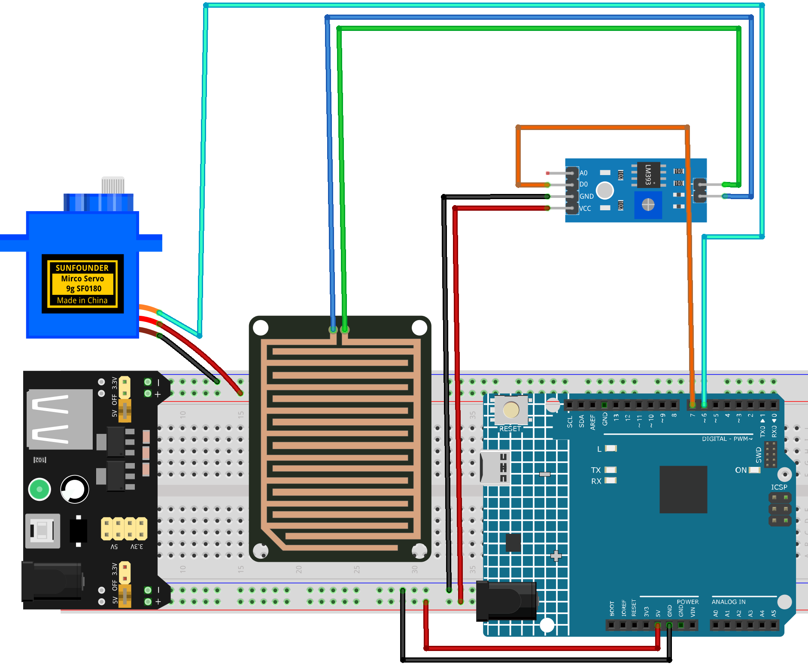

.. _smart_rain_cover:

Smart Rain Cover 
==============================================================

.. note::
  
  🌟 Welcome to the SunFounder Facebook Community! Whether you're into Raspberry Pi, Arduino, or ESP32, you'll find inspiration, help ideas here.
   
  - ✅ Be the first to get free learning resources. 
   
  - ✅ Stay updated on new products & exclusive giveaways. 
   
  - ✅ Share your creations and get real feedback.
   
  * 👉 Need faster updates or support? Click [|link_sf_facebook|] join our Facebook community 

  * 👉 Or join our WhatsApp group: Click [|link_sf_whatsapp|]
   
  * 🎁 Looking for parts?Check out our all-in-one kits below — packed with components, beginner-friendly guides, and tons of fun.
  
  .. list-table::
    :widths: 20 20 20
    :header-rows: 1

    *   - Name	
        - Includes Arduino board
        - PURCHASE LINK
    *   - Electronic Kit	
        - ×
        - |link_electronic_buy|
    *   - Elite Explorer Kit	
        - Arduino Uno R4 WiFi
        - |link_elite_buy|
    *   - 3 in 1 Ultimate Starter Kit	
        - Arduino Uno R4 Minima
        - |link_arduinor4_buy|

Course Introduction
------------------------

In this lesson, you’ll build a simple automatic rain cover using a raindrop sensor and a servo with the Arduino UNO R4.

When rain is detected, the sensor triggers the servo to rotate and open the cover. When the rain stops, the servo automatically returns to its original position, closing the cover.

.. .. raw:: html

.. <iframe width="700" height="394" src="https://www.youtube.com/embed/frHJHmXgnK4?si=iCaX_KMK4dy8d3KH" title="YouTube video player" frameborder="0" allow="accelerometer; autoplay; clipboard-write; encrypted-media; gyroscope; picture-in-picture; web-share" referrerpolicy="strict-origin-when-cross-origin" allowfullscreen></iframe>

.. note::

  If this is your first time working with an Arduino project, we recommend downloading and reviewing the basic materials first.
  
  * :ref:`install_arduino`
  * :ref:`introduce_arduino`

**Required Components**

In this project, we need the following components:

.. list-table::
    :widths: 5 20 5 20
    :header-rows: 1

    *   - SN
        - COMPONENT INTRODUCTION	
        - QUANTITY
        - PURCHASE LINK

    *   - 1
        - Arduino UNO R4 Minima
        - 1
        - |link_unor4_buy|
    *   - 2
        - USB Type-C cable
        - 1
        - 
    *   - 3
        - Breadboard
        - 1
        - |link_breadboard_buy|
    *   - 4
        - Wires
        - Several
        - |link_wires_buy|
    *   - 5
        - Digital Servo Motor
        - 1
        - |link_motor_buy|
    *   - 6
        - Raindrop Detection Sensor Module
        - 1
        - |link_raindrop_buy|

**Wiring**

**Common Connections:**

**Raindrop Detection Sensor Module**

  - **D0:** Connect to **7** on the Arduino.
  - **GND:** Connect to breadboard’s negative power bus.
  - **VCC:** Connect to breadboard’s passive power bus.

* **Digital Servo Motor**

  - Connect to breadboard’s positive power bus.
  - Connect to breadboard’s negative power bus.
  - Connect to **6** on the Arduino.

**Writing the Code**

.. note::

    * You can copy this code into **Arduino IDE**. 
    * Don't forget to select the board(Arduino UNO R4 Minima) and the correct port before clicking the **Upload** button.

.. code-block:: arduino

    #include <Servo.h>

    /*
      Raindrop Sensor + Servo Canopy
      - If rain is detected (DO = LOW): servo moves to 90°
      - If no rain (DO = HIGH): servo returns to 0°
    */

    const int RAIN_DO_PIN = 7;   // Raindrops sensor DO pin (LOW when rain detected)
    const int SERVO_PIN   = 6;   // Servo signal pin

    // Servo angles
    const int SERVO_CLOSED_ANGLE = 0;
    const int SERVO_OPEN_ANGLE   = 90;

    Servo canopyServo;
    bool canopyOpened = false;

    void setup() {
      pinMode(RAIN_DO_PIN, INPUT);

      canopyServo.attach(SERVO_PIN);
      canopyServo.write(SERVO_CLOSED_ANGLE);

      Serial.begin(9600);
      Serial.println("Raindrop Servo Canopy Ready (DO LOW = Rain).");
    }

    void loop() {
      int rainDO = digitalRead(RAIN_DO_PIN);

      if (rainDO == LOW) {
        // Rain detected -> open canopy
        if (!canopyOpened) {
          canopyServo.write(SERVO_OPEN_ANGLE);
          canopyOpened = true;
        }
      } else {
        // No rain -> close canopy
        if (canopyOpened) {
          canopyServo.write(SERVO_CLOSED_ANGLE);
          canopyOpened = false;
        }
      }

      delay(20);
    }
