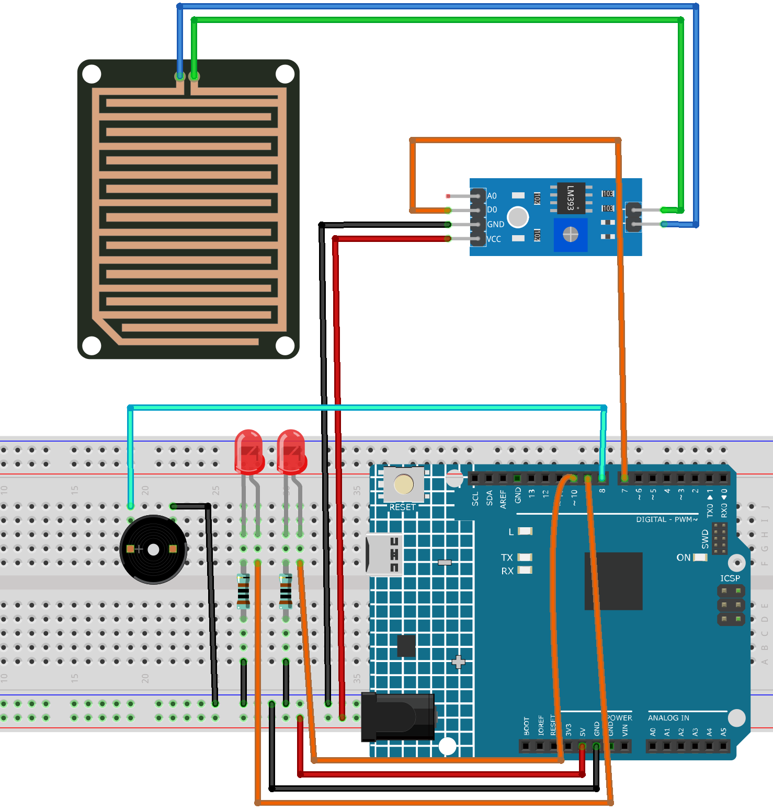

.. _rain_drop1.0:

Rain Alarm 1.0
==============================================================

.. note::
  
  🌟 Welcome to the SunFounder Facebook Community! Whether you're into Raspberry Pi, Arduino, or ESP32, you'll find inspiration, help ideas here.
   
  - ✅ Be the first to get free learning resources. 
   
  - ✅ Stay updated on new products & exclusive giveaways. 
   
  - ✅ Share your creations and get real feedback.
   
  * 👉 Need faster updates or support? Click [|link_sf_facebook|] join our Facebook community 

  * 👉 Or join our WhatsApp group: Click [|link_sf_whatsapp|]
   
  * 🎁 Looking for parts?Check out our all-in-one kits below — packed with components, beginner-friendly guides, and tons of fun.
  
  .. list-table::
    :widths: 20 20 20
    :header-rows: 1

    *   - Name	
        - Includes Arduino board
        - PURCHASE LINK
    *   - Electronic Kit	
        - ×
        - |link_electronic_buy|
    *   - Elite Explorer Kit	
        - Arduino Uno R4 WiFi
        - |link_elite_buy|
    *   - 3 in 1 Ultimate Starter Kit	
        - Arduino Uno R4 Minima
        - |link_arduinor4_buy|

Course Introduction
------------------------

In this lesson, you’ll build a simple raindrop alarm system using a raindrop sensor, a buzzer, and LEDs with the Arduino UNO R4.

When rain is detected, the sensor triggers the buzzer to beep and the LEDs to blink as a warning. When the surface is dry, all indicators turn off automatically.

.. .. raw:: html

.. <iframe width="700" height="394" src="https://www.youtube.com/embed/frHJHmXgnK4?si=iCaX_KMK4dy8d3KH" title="YouTube video player" frameborder="0" allow="accelerometer; autoplay; clipboard-write; encrypted-media; gyroscope; picture-in-picture; web-share" referrerpolicy="strict-origin-when-cross-origin" allowfullscreen></iframe>

.. note::

  If this is your first time working with an Arduino project, we recommend downloading and reviewing the basic materials first.
  
  * :ref:`install_arduino`
  * :ref:`introduce_arduino`

**Required Components**

In this project, we need the following components:

.. list-table::
    :widths: 5 20 5 20
    :header-rows: 1

    *   - SN
        - COMPONENT INTRODUCTION	
        - QUANTITY
        - PURCHASE LINK

    *   - 1
        - Arduino UNO R4 Minima
        - 1
        - |link_unor4_buy|
    *   - 2
        - USB Type-C cable
        - 1
        - 
    *   - 3
        - Breadboard
        - 1
        - |link_breadboard_buy|
    *   - 4
        - Wires
        - Several
        - |link_wires_buy|
    *   - 5
        - Passive Buzzer
        - 1
        - |link_passive_buzzer_buy|
    *   - 6
        - Raindrop Detection Sensor Module
        - 1
        - |link_raindrop_buy|
    *   - 7
        - LED
        - 2
        - |link_led_buy|
    *   - 8
        - 1kΩ resistor
        - 2
        - |link_resistor_buy|

**Wiring**

**Common Connections:**

* **LEDS**

  - **Red:** Connect the LED **anode** to **9,10** on the Arduino, and the **cathode** to a **1kΩ resistor**, then to the negative power bus on the breadboard.

* **Passive Buzzer**

  - **＋:** Connect to **8** on the Arduino.
  - **－:** Connect to breadboard’s negative power bus.

**Raindrop Detection Sensor Module**

  - **D0:** Connect to **7** on the Arduino.
  - **GND:** Connect to breadboard’s negative power bus.
  - **VCC:** Connect to breadboard’s passive power bus.

**Writing the Code**

.. note::

    * You can copy this code into **Arduino IDE**. 
    * Don't forget to select the board(Arduino UNO R4 Minima) and the correct port before clicking the **Upload** button.

.. code-block:: arduino

    /*
      Raindrop Alarm System
      - Reads digital output (DO) from a raindrops detection sensor module.
      - When rain is detected (DO = LOW), a 3-pin buzzer beeps and two LEDs blink.
      - When no rain (DO = HIGH), buzzer and LEDs stay OFF.

      Board: Arduino Uno R4 (or R3)
      Components: Raindrops Detection Sensor Module + 3-pin Active Buzzer Module + 2 LEDs
    */

    // -------- Pin Definitions --------
    const int RAIN_DO_PIN = 7;   // Raindrops sensor DO pin (LOW when rain detected)

    const int BUZZER_PIN  = 8;   // 3-pin buzzer module signal pin (S/IN)
    const int LED1_PIN    = 9;   // LED1 pin
    const int LED2_PIN    = 10;  // LED2 pin

    // -------- Blink / Beep Timing (ms) --------
    const unsigned long BLINK_INTERVAL_MS = 150;  // LED blink speed
    const unsigned long BEEP_INTERVAL_MS  = 150;  // buzzer beep speed

    // -------- State Variables --------
    unsigned long lastBlinkMs = 0;
    unsigned long lastBeepMs  = 0;
    bool ledState = false;
    bool buzzerState = false;

    void setup() {
      pinMode(RAIN_DO_PIN, INPUT);     // DO is a digital output from the sensor
      pinMode(BUZZER_PIN, OUTPUT);     // buzzer module control
      pinMode(LED1_PIN, OUTPUT);       // LED1 control
      pinMode(LED2_PIN, OUTPUT);       // LED2 control

      // Ensure everything is OFF at startup
      digitalWrite(BUZZER_PIN, LOW);
      digitalWrite(LED1_PIN, LOW);
      digitalWrite(LED2_PIN, LOW);

      Serial.begin(9600);
      Serial.println("Raindrop Alarm System Ready (DO LOW = Rain Detected).");
    }

    void loop() {
      // Read raindrop sensor digital output
      int rainDO = digitalRead(RAIN_DO_PIN);

      // Print raw DO value for debugging
      Serial.println(rainDO);

      // If rain detected (DO is LOW)
      if (rainDO == LOW) {
        unsigned long now = millis();

        // ---- LED blinking ----
        if (now - lastBlinkMs >= BLINK_INTERVAL_MS) {
          lastBlinkMs = now;
          ledState = !ledState;
          digitalWrite(LED1_PIN, ledState ? HIGH : LOW);
          digitalWrite(LED2_PIN, ledState ? LOW : HIGH); // opposite blink for nicer effect
        }

        // ---- Buzzer beeping ----
        if (now - lastBeepMs >= BEEP_INTERVAL_MS) {
          lastBeepMs = now;
          buzzerState = !buzzerState;
          digitalWrite(BUZZER_PIN, buzzerState ? HIGH : LOW);
        }
      }
      else {
        // No rain: turn everything OFF
        digitalWrite(BUZZER_PIN, LOW);
        digitalWrite(LED1_PIN, LOW);
        digitalWrite(LED2_PIN, LOW);

        // Reset states so the next rain starts cleanly
        ledState = false;
        buzzerState = false;
      }

      // Small delay to reduce serial spam (optional)
      delay(20);
    }
