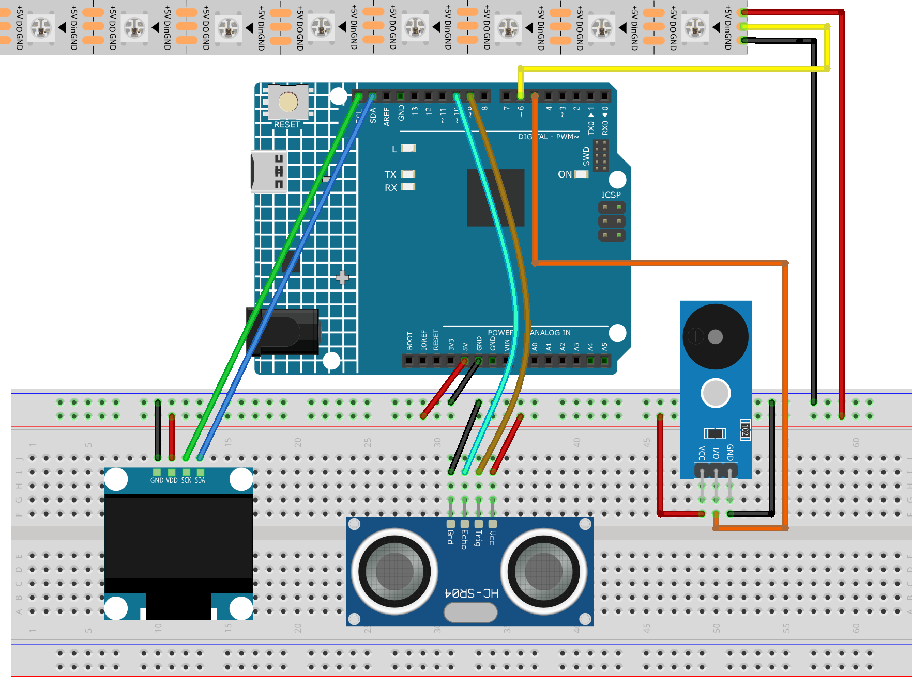

.. _reversing_radar:

Reversing Radar
==============================================================

.. note::
  
  🌟 Welcome to the SunFounder Facebook Community! Whether you're into Raspberry Pi, Arduino, or ESP32, you'll find inspiration, help ideas here.
   
  - ✅ Be the first to get free learning resources. 
   
  - ✅ Stay updated on new products & exclusive giveaways. 
   
  - ✅ Share your creations and get real feedback.
   
  * 👉 Need faster updates or support? Click [|link_sf_facebook|] join our Facebook community 

  * 👉 Or join our WhatsApp group: Click [|link_sf_whatsapp|]
   
  * 🎁 Looking for parts?Check out our all-in-one kits below — packed with components, beginner-friendly guides, and tons of fun.
  
Kit purchase
------------------------

Looking for parts? Check out our all-in-one kits below — packed with components, beginner-friendly guides, and tons of fun.

.. image:: img/ultimate_sensor_kit.png
   :width: 100%
   :align: center
   :target: https://www.sunfounder.com/collections/arduino-kits-bundles/products/sunfounder-ultimate-sensor-kit-with-original-arduino-uno-r4-minima?ref=jbzmncle

.. raw:: html

     

.. list-table::
   :widths: 20 20 20
   :header-rows: 1

   * - Name
     - Includes Arduino board
     - PURCHASE LINK
   * - Elite Explorer Kit
     - Arduino Uno R4 WiFi
     - |link_elite_buy|
   * - 3 in 1 Ultimate Starter Kit
     - Arduino Uno R4 Minima
     - |link_arduinor4_buy|

Course Introduction
------------------------

In this lesson, you'll learn how to build a reverse parking sensor system using an Ultrasonic Sensor Module, an OLED display, an RGB LED strip, and buzzer module.

The OLED displays the distance to nearby obstacles, while the LED strip changes color and the buzzer beeps faster as obstacles get closer, providing real-time parking assistance.

.. raw:: html

  <iframe width="700" height="394" src="https://www.youtube.com/embed/ijaHwlfY8f0" title="YouTube video player" frameborder="0" allow="accelerometer; autoplay; clipboard-write; encrypted-media; gyroscope; picture-in-picture; web-share" referrerpolicy="strict-origin-when-cross-origin" allowfullscreen></iframe>

.. note::

  If this is your first time working with an Arduino project, we recommend downloading and reviewing the basic materials first.
  
  * :ref:`install_arduino`
  * :ref:`introduce_arduino`

**Required Components**

In this project, we need the following components:

.. list-table::
    :widths: 5 20 5 20
    :header-rows: 1

    *   - SN
        - COMPONENT INTRODUCTION	
        - QUANTITY
        - PURCHASE LINK

    *   - 1
        - Arduino UNO R4 Minima
        - 1
        - |link_unor4_buy|
    *   - 2
        - USB Type-C cable
        - 1
        - 
    *   - 3
        - Breadboard
        - 1
        - |link_breadboard_buy|
    *   - 4
        - Wires
        - Several
        - |link_wires_buy|
    *   - 5
        - LED Strip
        - 1
        - |link_ws2812_buy|
    *   - 6
        - Ultrasonic Sensor Module
        - 1
        - |link_ultrasonic_buy|
    *   - 7
        - Buzzer Modudle
        - 1
        - |link_buzzer_module_buy|
    *   - 8
        - OLED Display Module
        - 1
        - |link_oled_buy|

**Wiring**

**Common Connections:**

* **LED Strip**

  - **Din:** Connect to **6** on the Arduino.
  - **GND:** Connect to breadboard’s negative power bus.
  - **+5V:** Connect to breadboard’s passive power bus.

* **Ultrasonic Sensor Module**

  - **Trig:** Connect to **9** on the Arduino.
  - **Echo:** Connect to **10** on the Arduino.
  - **GND:** Connect to breadboard’s negative power bus.
  - **VCC:** Connect to breadboard’s red power bus.

* **OLED Display Module**

  - **SDA:** Connect to **SDA** on the Arduino.
  - **SCK:** Connect to **SCL** on the Arduino.
  - **GND:** Connect to breadboard’s negative power bus.
  - **VCC:** Connect to breadboard’s red power bus.

* **Buzzer Module**

  - **I/0:** Connect to **5** on the Arduino.
  - **＋:** Connect to breadboard’s red power bus. 
  - **－:** Connect to breadboard’s negative power bus.

**Writing the Code**

.. note::

    * You can copy this code into **Arduino IDE**. 
    * To install the library, use the Arduino Library Manager and search for **Adafruit_NeoPixel**, **Adafruit SSD1306** and **Adafruit GFX** and install it.
    * Don't forget to select the board(Arduino UNO R4 Minima) and the correct port before clicking the **Upload** button.

.. code-block:: arduino

      #include <Wire.h>
      #include <Adafruit_GFX.h>
      #include <Adafruit_SSD1306.h>
      #include <Adafruit_NeoPixel.h>

      // OLED
      #define SCREEN_WIDTH 128
      #define SCREEN_HEIGHT 64
      #define OLED_RESET -1
      #define OLED_ADDR 0x3C

      Adafruit_SSD1306 display(SCREEN_WIDTH, SCREEN_HEIGHT, &Wire, OLED_RESET);

      // Pins
      const int TRIG_PIN = 9;
      const int ECHO_PIN = 10;
      const int BUZZER_PIN = 5;
      const int LED_PIN = 6;

      // LED strip
      const int LED_COUNT = 8;
      Adafruit_NeoPixel strip(LED_COUNT, LED_PIN, NEO_GRB + NEO_KHZ800);

      // Distance settings
      const int SAFE_DISTANCE_CM = 20;
      const int LED_START_CM = 15;
      const int DANGER_DISTANCE_CM = 3;

      // Buzzer timing
      unsigned long lastBeepTime = 0;
      bool buzzerState = false;

      // Passive buzzer frequency
      const int BUZZER_FREQ = 2000;

      void setup() {
        pinMode(TRIG_PIN, OUTPUT);
        pinMode(ECHO_PIN, INPUT);
        pinMode(BUZZER_PIN, OUTPUT);

        noTone(BUZZER_PIN);

        strip.begin();
        strip.show();

        if (!display.begin(SSD1306_SWITCHCAPVCC, OLED_ADDR)) {
          while (true);
        }

        display.clearDisplay();
        display.display();
      }

      void loop() {
        float distanceCM = readDistanceCM();
        int distanceMM = distanceCM * 10;

        updateOLED(distanceMM, distanceCM);
        updateLEDStrip(distanceCM);
        updateBuzzer(distanceCM);

        delay(50);
      }

      float readDistanceCM() {
        digitalWrite(TRIG_PIN, LOW);
        delayMicroseconds(2);

        digitalWrite(TRIG_PIN, HIGH);
        delayMicroseconds(10);
        digitalWrite(TRIG_PIN, LOW);

        long duration = pulseIn(ECHO_PIN, HIGH, 30000);

        if (duration == 0) {
          return 999;
        }

        return duration * 0.0343 / 2.0;
      }

      void updateOLED(int distanceMM, float distanceCM) {
        display.clearDisplay();

        display.setTextColor(SSD1306_WHITE);

        display.setTextSize(1);
        display.setCursor(0, 0);
        display.print("Reverse Radar");

        display.setTextSize(2);
        display.setCursor(0, 22);

        if (distanceCM > SAFE_DISTANCE_CM) {
          display.print("SAFE");
        } else {
          display.print(distanceMM);
          display.print("mm");
        }

        display.display();
      }

      void updateLEDStrip(float distanceCM) {
        if (distanceCM > SAFE_DISTANCE_CM) {
          clearLEDs();
          return;
        }

        if (distanceCM > LED_START_CM) {
          clearLEDs();
          return;
        }

        int ledsOn = 0;

        if (distanceCM <= 0) {
          ledsOn = 1;
        } else {
          ledsOn = ceil(distanceCM / 2.0);
        }

        ledsOn = constrain(ledsOn, 1, LED_COUNT);

        uint32_t color;

        if (distanceCM >= 9 && distanceCM <= 15) {
          color = strip.Color(0, 255, 0);       // Green
        } else if (distanceCM > 5 && distanceCM < 9) {
          color = strip.Color(255, 180, 0);     // Yellow
        } else {
          color = strip.Color(255, 0, 0);       // Red
        }

        clearLEDs();

        for (int i = 0; i < ledsOn; i++) {
          strip.setPixelColor(i, color);
        }

        strip.show();
      }

      void updateBuzzer(float distanceCM) {
        if (distanceCM > SAFE_DISTANCE_CM) {
          noTone(BUZZER_PIN);
          buzzerState = false;
          return;
        }

        if (distanceCM < DANGER_DISTANCE_CM) {
          tone(BUZZER_PIN, BUZZER_FREQ);  // Long beep
          return;
        }

        int beepInterval = map(distanceCM, 3, 20, 100, 800);
        beepInterval = constrain(beepInterval, 100, 800);

        if (millis() - lastBeepTime >= beepInterval) {
          lastBeepTime = millis();

          buzzerState = !buzzerState;

          if (buzzerState) {
            tone(BUZZER_PIN, BUZZER_FREQ);
          } else {
            noTone(BUZZER_PIN);
          }
        }
      }

      void clearLEDs() {
        for (int i = 0; i < LED_COUNT; i++) {
          strip.setPixelColor(i, 0, 0, 0);
        }
        strip.show();
      }