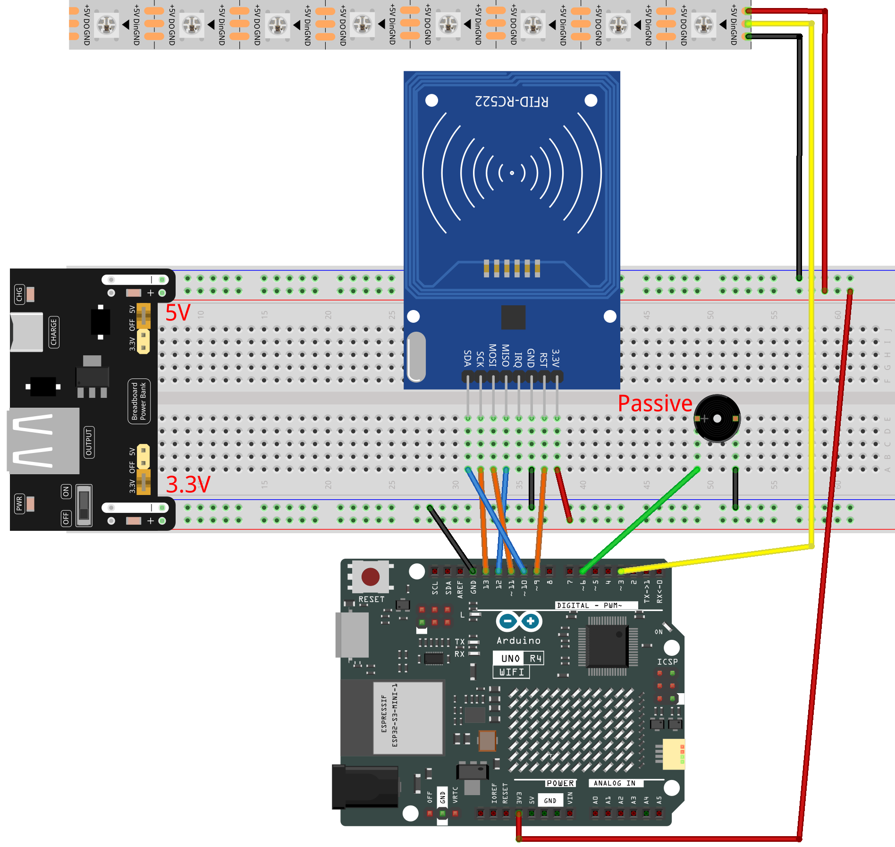

.. _rfid_Jukebox_:

RFID Jukebox
==============================================================
.. note::
  
  Hello, welcome to the SunFounder Raspberry Pi & Arduino & ESP32 Enthusiasts Community on Facebook! Dive deeper into Raspberry Pi, Arduino, and ESP32 with fellow enthusiasts.

  👉 Ready to explore and create with us? Click [|link_sf_facebook|] and join today!

  To get all the components for this project, consider one of the kits below. 

  Each includes the required parts, extra components for other projects, and beginner-friendly tutorials.

  .. list-table::
    :widths: 20 20 20
    :header-rows: 1

    *   - Name
        - Arduino board
        - PURCHASE LINK
    *   - Elite Explorer Kit
        - Arduino Uno R4 WiFi
        - |link_elite_buy|

Course Introduction
------------------------

n this lesson, we’ll build a Jukebox using an MFRC522 module, an LED strip, and a passive buzzer. 

First we’ll write track data to an RFID card, then scanning it will trigger music playback and lighting effects.

..  .. raw:: html

..    <iframe width="700" height="394" src="https://www.youtube.com/embed/tXVDkziwIbU?si=KxsVHx-1tClx8HN6" title="YouTube video player" frameborder="0" allow="accelerometer; autoplay; clipboard-write; encrypted-media; gyroscope; picture-in-picture; web-share" referrerpolicy="strict-origin-when-cross-origin" allowfullscreen></iframe>

.. note::

  If this is your first time working with an Arduino project, we recommend downloading and reviewing the basic materials first.
  
  * :ref:`install_arduino`
  * :ref:`introduce_arduino`

**Required Components**

In this project, we need the following components:

.. list-table::
    :widths: 5 20 5 20
    :header-rows: 1

    *   - SN
        - COMPONENT INTRODUCTION	
        - QUANTITY
        - PURCHASE LINK
    
    *   - 1
        - Arduino UNO R4 Minima/Arduino UNO R4 WIFI
        - 1
        - |link_unor4_wifi_buy|
    *   - 2
        - USB Type-C cable
        - 1
        - 
    *   - 3
        - Breadboard
        - 1
        - |link_breadboard_buy|
    *   - 4
        - Wires
        - Several
        - |link_wires_buy|
    *   - 5
        - Passive Buzzer
        - 1
        - |link_passive_buzzer_buy|
    *   - 6
        - MFRC522 Module
        - 1
        - |link_mfrc522_module_buy|
    *   - 7
        - Power Supply Module
        - 1
        - |link_power_buy|
    *   - 8
        - LED Strip
        - 1
        - |link_ws2812_buy|

**Wiring**

**Common Connections:**

* **MFRC522 Module**

  - **SDA:** Connect to **10** on the Arduino.
  - **SCK:** Connect to **13** on the Arduino.
  - **MOSI:** Connect to **11** on the Arduino.
  - **MISO:** Connect to **12** on the Arduino.
  - **GND:** Connect to breadboard’s negative power bus.
  - **RST:** Connect to **9** on the Arduino.
  - **3.3V:** Connect to breadboard’s passive power bus.

* **Passive Buzzer**

  - **＋:** Connect to **6** on the Arduino.
  - **－:** Connect to breadboard’s negative power bus.

* **LED Strip**

  - **Din:** Connect to **3** on the Arduino.
  - **GND:** Connect to breadboard’s negative power bus.
  - **+5V:** Connect to breadboard’s passive power bus.

**Writing the Code**

.. note::

    * You can copy this code into **Arduino IDE**. 
    * To install the library, use the Arduino Library Manager and search for **FastLED** and install it.
    * To install the library, use the Arduino Library Manager and search for **MFRC522** and install it.
    * Don't forget to select the board(Arduino UNO R4 Minima) and the correct port before clicking the **Upload** button.

1. Information writing

.. code-block:: arduino

      #include <SPI.h>
      #include <MFRC522.h>

      #define SS_PIN  10   // SDA (SS) pin for RFID module
      #define RST_PIN 9    // RST pin for RFID module

      MFRC522 rfid(SS_PIN, RST_PIN);  // Create RFID reader instance

      void setup() {
        Serial.begin(9600);   // Initialize serial communication
        SPI.begin();          // Initialize SPI bus
        rfid.PCD_Init();      // Initialize MFRC522 module
        Serial.println("Place your RFID card near the reader to write a melody...");
      }

      void loop() {
        if (!rfid.PICC_IsNewCardPresent() || !rfid.PICC_ReadCardSerial()) {
          return;
        }

        // ==== Write data block ====

        // Melody 1: Custom melody example (can be replaced)
        // byte dataBlock[16] = {'C','D','E','F','G','A','B',' ',
        //                       'B','A','G','F','E','D','C'};

        // Melody 2: Ode to Joy (commented out)
        byte dataBlock[16] = {'E','E','F','G','G','F','E','D',
                              'C','C','D','E','E','D','D'};

        // ==== End of melody selection ====

        byte block = 4;

        MFRC522::MIFARE_Key key;
        for (byte i = 0; i < 6; i++) {
          key.keyByte[i] = 0xFF;
        }

        MFRC522::StatusCode status = rfid.PCD_Authenticate(
          MFRC522::PICC_CMD_MF_AUTH_KEY_A,
          block,
          &key,
          &(rfid.uid)
        );

        if (status != MFRC522::STATUS_OK) {
          Serial.print("Authentication failed: ");
          Serial.println(rfid.GetStatusCodeName(status));
          return;
        }

        status = rfid.MIFARE_Write(block, dataBlock, 16);

        if (status != MFRC522::STATUS_OK) {
          Serial.print("Write failed: ");
          Serial.println(rfid.GetStatusCodeName(status));
        } else {
          Serial.println("✅ Melody successfully written to RFID card!");
        }

        rfid.PICC_HaltA();
        rfid.PCD_StopCrypto1();
        delay(1500);
      }

2. Information reading

.. code-block:: arduino

      #include <SPI.h>
      #include <MFRC522.h>
      #include <FastLED.h>

      #define SS_PIN        10    // MFRC522 SDA/SS
      #define RST_PIN       9     // MFRC522 RST
      #define BUZZER_PIN    6     // Passive buzzer
      #define LED_PIN       3     // WS2812 DIN
      #define NUM_LEDS      8     // Number of LEDs
      #define NOTE_DURATION 300   // ms per note

      MFRC522 rfid(SS_PIN, RST_PIN);
      CRGB leds[NUM_LEDS];

      // Base notes → fixed LED indices
      const char baseNotes[8] = {'C','D','E','F','G','A','B',' '};

      // Map note to LED index (C→0 … ' '→7)
      int mapNoteToLED(char note) {
        for (int i = 0; i < NUM_LEDS; i++) {
          if (note == baseNotes[i]) return i;
        }
        return -1;
      }

      // Note → frequency
      int getNoteFrequency(char note) {
        switch (note) {
          case 'C': return 261;
          case 'D': return 294;
          case 'E': return 329;
          case 'F': return 349;
          case 'G': return 392;
          case 'A': return 440;
          case 'B': return 493;
          default:  return 0;  // rest
        }
      }

      void setup() {
        Serial.begin(9600);
        SPI.begin();
        rfid.PCD_Init();

        pinMode(BUZZER_PIN, OUTPUT);
        FastLED.addLeds<WS2812, LED_PIN, GRB>(leds, NUM_LEDS);

        // startup all-blue
        for (int i = 0; i < NUM_LEDS; i++) leds[i] = CRGB::Blue;
        FastLED.show();

        Serial.println("Waiting for RFID card to play melody...");
      }

      void loop() {
        if (!rfid.PICC_IsNewCardPresent() ||
            !rfid.PICC_ReadCardSerial()) {
          return;
        }

        // authenticate & read block 4
        byte block = 4, buffer[18], size = sizeof(buffer);
        MFRC522::MIFARE_Key key;
        for (byte i = 0; i < 6; i++) key.keyByte[i] = 0xFF;

        auto status = rfid.PCD_Authenticate(
          MFRC522::PICC_CMD_MF_AUTH_KEY_A, block, &key, &rfid.uid
        );
        if (status != MFRC522::STATUS_OK) {
          Serial.print("Auth failed: ");
          Serial.println(rfid.GetStatusCodeName(status));
          return;
        }
        status = rfid.MIFARE_Read(block, buffer, &size);
        if (status != MFRC522::STATUS_OK) {
          Serial.print("Read failed: ");
          Serial.println(rfid.GetStatusCodeName(status));
          return;
        }

        Serial.print("Melody: ");
        for (int i = 0; i < 16; i++) Serial.print((char)buffer[i]);
        Serial.println();

        // play with LED feedback
        char lastNote = '\0';
        int lastLED = -1;
        for (int i = 0; i < 16; i++) {
          char noteChar = (char)buffer[i];
          int ledIdx = mapNoteToLED(noteChar);
          int freq   = getNoteFrequency(noteChar);

          // sound
          if (freq > 0) tone(BUZZER_PIN, freq, NOTE_DURATION);

          // LED update: only change previous and current
          if (lastLED >= 0) {
            leds[lastLED] = CRGB::Blue;
          }
          if (ledIdx >= 0) {
            leds[ledIdx] = CRGB::Red;
          }
          FastLED.show();

          delay(NOTE_DURATION);
          noTone(BUZZER_PIN);

          lastNote = noteChar;
          lastLED  = ledIdx;
        }

        rfid.PICC_HaltA();
        rfid.PCD_StopCrypto1();
        delay(1000);
      }
