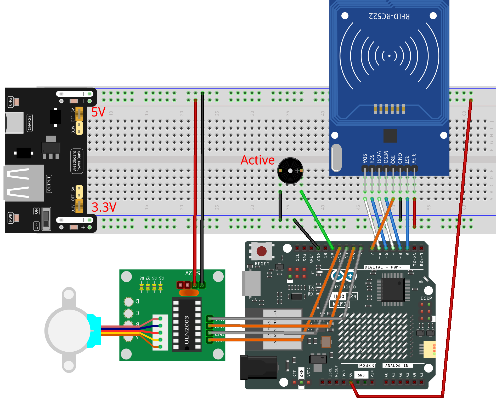

.. _rfid_access1.0_:

RFID Access1.0
==============================================================
.. note::
  
  Hello, welcome to the SunFounder Raspberry Pi & Arduino & ESP32 Enthusiasts Community on Facebook! Dive deeper into Raspberry Pi, Arduino, and ESP32 with fellow enthusiasts.

  👉 Ready to explore and create with us? Click [|link_sf_facebook|] and join today!

  To get all the components for this project, consider one of the kits below. 

  Each includes the required parts, extra components for other projects, and beginner-friendly tutorials.

  .. list-table::
    :widths: 20 20 20
    :header-rows: 1

    *   - Name	
        - Arduino board
        - PURCHASE LINK
    *   - Elite Explorer Kit
        - Arduino Uno R4 WiFi
        - |link_elite_buy|
    *   - Ultimate Starter Kit for Arduino Mega 2560
        - Arduino Mega 2560
        - |link_mega_2560_kit_buy|

Course Introduction
------------------------

In this lesson, we’ll build a 1.0 access-control system using the MFRC522 module, a stepper motor, and an active buzzer. 

When a valid card is presented, the motor unlocks the door and plays an “access granted” tone; an invalid card triggers a warning alarm.

  .. raw:: html

    <iframe width="700" height="394" src="https://www.youtube.com/embed/MRM3VxnGLxY?si=3k0mtbbSTRhLoyLz" title="YouTube video player" frameborder="0" allow="accelerometer; autoplay; clipboard-write; encrypted-media; gyroscope; picture-in-picture; web-share" referrerpolicy="strict-origin-when-cross-origin" allowfullscreen></iframe>

.. note::

  If this is your first time working with an Arduino project, we recommend downloading and reviewing the basic materials first.
  
  * :ref:`install_arduino`
  * :ref:`introduce_arduino`

**Required Components**

In this project, we need the following components:

.. list-table::
    :widths: 5 20 5 20
    :header-rows: 1

    *   - SN
        - COMPONENT INTRODUCTION	
        - QUANTITY
        - PURCHASE LINK

    *   - 1
        - Arduino UNO R4 Minima/Arduino UNO R4 WIFI
        - 1
        - |link_unor4_wifi_buy|
    *   - 2
        - USB Type-C cable
        - 1
        - 
    *   - 3
        - Breadboard
        - 1
        - |link_breadboard_buy|
    *   - 4
        - Wires
        - Several
        - |link_wires_buy|
    *   - 5
        - Active Buzzer
        - 1
        - 
    *   - 6
        - Stepper Motor 28BYJ-48 ULN2003 Drive Module 5
        - 1
        - |link_stepper_buy|
    *   - 7
        - MFRC522 Module
        - 1
        - |link_mfrc522_module_buy|
    *   - 8
        - Power Supply Module
        - 1
        - |link_power_buy|
  
**Wiring**

**Common Connections:**

* **MFRC522 Module**

  - **SDA:** Connect to **6** on the Arduino.
  - **SCK:** Connect to **5** on the Arduino.
  - **MOSI:** Connect to **4** on the Arduino.
  - **MISO:** Connect to **3** on the Arduino.
  - **IRQ:** Connect to **7** on the Arduino.
  - **GND:** Connect to breadboard’s negative power bus.
  - **RST:** Connect to **2** on the Arduino.
  - **3.3V:** Connect to breadboard’s passive power bus.

* **Active Buzzer**

  - **＋:** Connect to **12** on the Arduino.
  - **－:** Connect to breadboard’s negative power bus.

* **Stepper Motor 28BYJ-48 ULN2003 Drive Module 5**

  - **IN1:** Connect to **11** on the Arduino.
  - **IN2:** Connect to **10** on the Arduino.
  - **IN3:** Connect to **9** on the Arduino.
  - **IN4:** Connect to **8** on the Arduino.

**Writing the Code**

.. note::

    * You can copy this code into **Arduino IDE**. 
    * The ``RFID1`` library is used here. You can click here :download:`RFID1.zip </_static/RFID1.zip>` to download it.
    * Don't forget to select the board(Arduino UNO R4 Minima) and the correct port before clicking the **Upload** button.

.. code-block:: arduino

      /*
        The code is designed for an Arduino Uno R4 board and uses an MFRC522 RFID module, 
        a stepper motor, and a buzzer. The system serves as an RFID-based door lock. It 
        reads an RFID card and matches its ID with a pre-defined authenticated ID. If the 
        ID matches, the stepper motor turns to open the door, and a buzzer beeps to indicate 
        success. Otherwise, the buzzer beeps differently to indicate failure.

        Board: Arduino Uno R4 
        Component: MFRC522 Module, Stepper Motor and Buzzer
      */

      #include <rfid1.h>
      #include <Stepper.h>
      #include <Wire.h>

      #define ID_LEN 4

      /*Stepper Motor*/
      const int stepsPerRevolution = 2048;  // Steps per revolution for stepper motor
      const int rolePerMinute = 16;         // Motor speed in RPM
      const int IN1 = 11;
      const int IN2 = 10;
      const int IN3 = 9;
      const int IN4 = 8;

      /*Buzzer*/
      const int buzPin = 12;

      /*Authentication Parameters*/
      uchar userIdRead[ID_LEN] = { "" };
      uchar userId[ID_LEN] = { 0x36, 0xE2, 0xC4, 0xF7 };  // Authenticated ID
      bool approved = 0;

      RFID1 rfid;  //create a variable type of RFID1
      Stepper stepper(stepsPerRevolution, IN1, IN3, IN2, IN4);

      void setup() {
        Serial.begin(9600);
        stepper.setSpeed(rolePerMinute);
        pinMode(buzPin, OUTPUT);
        rfid.begin(7, 5, 4, 3, 6, 2);
        rfid.init();  //initialize the RFID
        Serial.println("start");
      }

      void loop() {
        // If not approved, try to read RFID
        if (approved == 0) {
          approved = rfidRead();
          for (int i = 0; i < ID_LEN; i++) {
            userIdRead[i] = NULL;  // Clear read ID
          }
        }
        // If approved, open the door
        if (approved == 1) {
          openDoor();
          approved = 0;  // Reset approval flag
        }
      }

      void beep(int duration, int frequency) {
        for (int i = 0; i < frequency; i++) {
          digitalWrite(buzPin, HIGH);
          delay(duration);
          digitalWrite(buzPin, LOW);
          delay(100);
        }
      }

      void verifyPrint(bool result) {
        if (result == true) {
          beep(100, 3);
          delay(400);
        } else {
          beep(500, 1);
          delay(400);
        }
      }

      void openDoor() {
        int doorStep = 512;  //This means the door will open to 90 degrees
        stepper.step(doorStep);
        for (int i = 0; i < 5; i++) {
          delay(1000);
        }
        stepper.step(-doorStep);
      }

      bool rfidRead() {
        getId();
        if (userIdRead[0] != NULL) {
          return idVerify();
        }
        return 0;
      }

      void getId() {
        uchar status;
        uchar str[MAX_LEN];
        status = rfid.request(PICC_REQIDL, str);
        if (status != MI_OK) {
          return;
        } else {
          status = rfid.anticoll(str);
          Serial.println("");
          Serial.print("Reading Card ID: ");
          if (status == MI_OK) {
            for (int i = 0; i < ID_LEN; i++) {
              userIdRead[i] = str[i];
              Serial.print("0x");
              Serial.print(userIdRead[i], HEX);
              Serial.print(", ");
            }
          }
          delay(500);
          rfid.halt();
          beep(150, 1);
        }
      }

      bool idVerify() {
        for (int i = 0; i < ID_LEN; i++) {
          if (userIdRead[i] != userId[i]) {
            verifyPrint(0);
            return 0;
          }
        }
        verifyPrint(1);
        return 1;
      }
