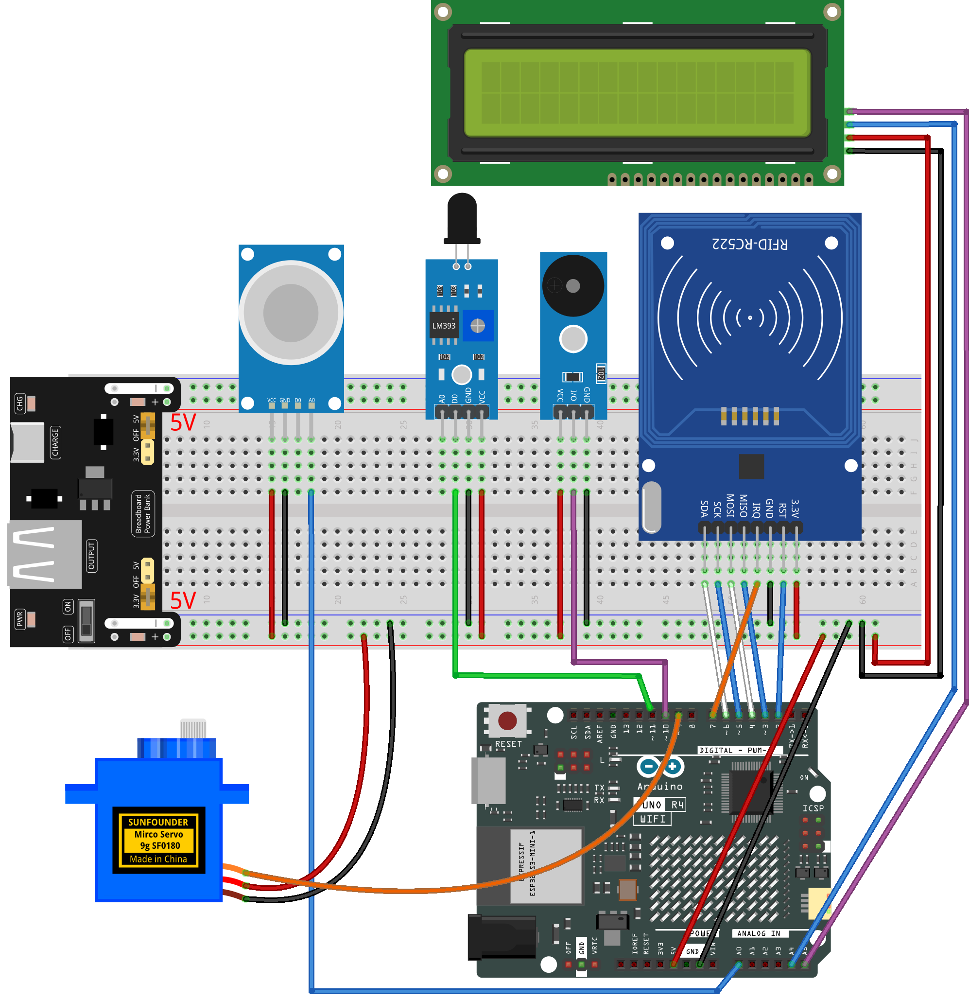

.. _rfid_access10.0_:

RFID Access10.0
==============================================================

.. note::
  
  🌟 Welcome to the SunFounder Facebook Community! Whether you're into Raspberry Pi, Arduino, or ESP32, you'll find inspiration, help ideas here.
   
  - ✅ Be the first to get free learning resources. 
   
  - ✅ Stay updated on new products & exclusive giveaways. 
   
  - ✅ Share your creations and get real feedback.
   
  * 👉 Need faster updates or support? Click [|link_sf_facebook|] join our Facebook community 

  * 👉 Or join our WhatsApp group: Click [|link_sf_whatsapp|]
   
Kit purchase
------------------------

Looking for parts? Check out our all-in-one kits below — packed with components, beginner-friendly guides, and tons of fun.

.. image:: img/elite_explore_kit.png
   :width: 100%
   :align: center
   :target: https://www.sunfounder.com/collections/arduino-kits-bundles/products/sunfounder-elite-explorer-kit-with-official-arduino-uno-r4-wifi?ref=jbzmncle

.. raw:: html

     

.. list-table::
   :widths: 20 20 20
   :header-rows: 1

   * - Name
     - Includes Arduino board
     - PURCHASE LINK
   * - Elite Explorer Kit
     - Arduino Uno R4 WiFi
     - |link_elite_buy|
   * - Inventor Lab Kit
     - Arduino Uno R3
     - |link_inventorkit_buy|

Course Introduction
------------------------

In this lesson, we’ll build a 10.0 access-control system using the I2C LCD, MFRC522 module, MQ-2 gas sensor, a digital servo motor, buzzer module, flame sensor module. 

.. .. raw:: html

..  <iframe width="700" height="394" src="https://www.youtube.com/embed/iZJJDMygGDQ?si=F1lCHsxbb2v4GYrc" title="YouTube video player" frameborder="0" allow="accelerometer; autoplay; clipboard-write; encrypted-media; gyroscope; picture-in-picture; web-share" referrerpolicy="strict-origin-when-cross-origin" allowfullscreen></iframe>

.. note::

  If this is your first time working with an Arduino project, we recommend downloading and reviewing the basic materials first.
  
  * :ref:`install_arduino`
  * :ref:`introduce_arduino`

**Required Components**

In this project, we need the following components:

.. list-table::
    :widths: 5 20 5 20
    :header-rows: 1

    *   - SN
        - COMPONENT INTRODUCTION	
        - QUANTITY
        - PURCHASE LINK

    *   - 1
        - Arduino UNO R4 Minima/Arduino UNO R4 WIFI
        - 1
        - |link_unor4_wifi_buy|
    *   - 2
        - USB Type-C cable
        - 1
        - 
    *   - 3
        - Breadboard
        - 1
        - |link_breadboard_buy|
    *   - 4
        - Wires
        - Several
        - |link_wires_buy|
    *   - 5
        - Flame Sensor Module
        - 1
        - |link_flame_buy|
    *   - 6
        - Buzzer Modudle
        - 1
        - |link_buzzer_module_buy|
    *   - 7
        - MFRC522 Module
        - 1
        - |link_mfrc522_module_buy|
    *   - 8
        - Power Supply Module
        - 1
        - |link_power_buy|
    *   - 9
        - Digital Servo Motor
        - 1
        - |link_motor_buy|
    *   - 10
        - MQ-2 Gas Sensor Module
        - 1
        - |link_gas_leak_buy|
    *   - 11
        - I2C LCD 1602
        - 1
        - |link_i2clcd1602_buy|

**Wiring**

**Common Connections:**

* **MFRC522 Module**

  - **IRQ:** Connect to **7** on the ESP32.
  - **SDA:** Connect to **6** on the ESP32.
  - **SCK:** Connect to **5** on the ESP32.
  - **MOSI:** Connect to **4** on the ESP32.
  - **MISO:** Connect to **3** on the ESP32.
  - **GND:** Connect to breadboard’s negative power bus.
  - **RST:** Connect to **2** on the ESP32.
  - **3.3V:** Connect to breadboard’s passive power bus.

* **MQ-2 Gas Sensor Module**

  - **A0:** Connect to **A0** on the Arduino.
  - **GND:** Connect to breadboard’s negative power bus.
  - **VCC:** Connect to breadboard’s red power bus.

* **Buzzer Module**

  - **I/0:** Connect to **10** on the Arduino.
  - **＋:** Connect to breadboard’s red power bus. 
  - **－:** Connect to breadboard’s negative power bus.

* **Digital Servo Motor**

  - Connect to breadboard’s positive power bus.
  - Connect to breadboard’s negative power bus.
  - Connect to  **9** on the Arduino.

* **Flame Sensor Module**

  - **D0:** Connect to **11** on the Arduino.
  - **GND:** Connect to **GND** on the Arduino.
  - **VCC:** Connect to **5V** on the Arduino.

* **I2C LCD 1602**

  - **SDA:** Connect to **A4** on the Arduino.
  - **SCL:** Connect to **A5** on the Arduino.
  - **GND:** Connect to breadboard’s negative power bus.
  - **VCC:** Connect to breadboard’s red power bus.

**Writing the Code**

.. note::

    * You can copy this code into **Arduino IDE**. 
    * The ``RFID1`` library is used here. You can click here :download:`RFID1.zip </_static/RFID1.zip>` to download it.
    * To install the library, use the Arduino Library Manager and search for **LiquidCrystal_I2C** and install it.
    * Don't forget to select the board(Arduino UNO R4 WIFI) and the correct port before clicking the **Upload** button.

.. code-block:: arduino

      #include <Wire.h>
      #include <LiquidCrystal_I2C.h>
      #include <rfid1.h>
      #include <Servo.h>

      #define ID_LEN 4    // Length of RFID UID

      // Pin definitions
      const int servoPin  = 9;    // Servo motor for door
      const int buzzerPin = 10;   // Buzzer
      const int flamePin  = 11;   // Flame sensor (digital)
      const int smokePin  = A0;   // Smoke sensor (analog)

      // Objects
      RFID1 rfid;
      Servo myServo;
      LiquidCrystal_I2C lcd(0x27, 16, 2);

      // Authorized RFID card UID
      uchar userId[ID_LEN] = {0x36, 0xE2, 0xC4, 0xF7};
      uchar userIdRead[ID_LEN];

      // Servo movement control
      int targetPos  = 0;   // Target angle
      int currentPos = 0;   // Current angle

      // Door state after valid card
      bool cardAction = false;
      unsigned long cardTimer = 0;

      // Emergency control flags
      bool emergencyAlert = false;
      bool emergencyRecovering = false;
      unsigned long emergencyRecoverStart = 0;

      // Smoke sensor threshold
      int smokeValue = 0;
      const int smokeThreshold = 200;

      // System states for LCD display
      enum SystemState {
        STATE_BOOT,
        STATE_IDLE,
        STATE_ACCESS_GRANTED,
        STATE_ACCESS_DENIED,
        STATE_EMERGENCY
      };

      SystemState currentState = STATE_BOOT;
      SystemState lastState    = STATE_IDLE;

      // Emergency type for LCD message
      enum EmergencyType {
        EM_NONE,
        EM_SMOKE,
        EM_FIRE,
        EM_BOTH
      };

      EmergencyType emergencyType = EM_NONE;

      // Set servo target angle (0–90 degrees)
      void setServoAngle(int angle) {
        targetPos = constrain(angle, 0, 90);
      }

      // Move servo smoothly without blocking the program
      void servoSmoothRun() {
        static unsigned long lastStep = 0;

        if (millis() - lastStep >= 15) {
          lastStep = millis();

          if (currentPos < targetPos) currentPos++;
          else if (currentPos > targetPos) currentPos--;

          myServo.write(currentPos);
        }
      }

      // Short beep for authorized card
      void beepShort() {
        tone(buzzerPin, 2000);
        delay(80);
        noTone(buzzerPin);
      }

      // Beep pattern for denied card (blocking)
      void beepDenied() {
        for (int i = 0; i < 4; i++) {
          tone(buzzerPin, 1600);
          delay(100);
          noTone(buzzerPin);
          delay(100);
        }
      }

      // Alarm sound for emergency (non-blocking)
      void beepAlarmNonBlock() {
        static unsigned long t = 0;
        static bool buz = false;

        if (millis() - t > 120) {
          t = millis();
          buz = !buz;
          if (buz) tone(buzzerPin, 1500);
          else noTone(buzzerPin);
        }
      }

      // Read RFID card UID
      void getId() {
        uchar status, str[MAX_LEN];
        status = rfid.anticoll(str);

        if (status == MI_OK) {
          for (int i = 0; i < ID_LEN; i++) {
            userIdRead[i] = str[i];
          }
          rfid.halt();
        }
      }

      // Compare scanned UID with authorized UID
      bool idVerify() {
        for (int i = 0; i < ID_LEN; i++) {
          if (userIdRead[i] != userId[i]) return false;
        }
        return true;
      }

      // Clear UID buffer after each scan
      void clearBuffer() {
        for (int i = 0; i < ID_LEN; i++) {
          userIdRead[i] = 0;
        }
      }

      // Update LCD only when system state changes
      void updateLCD() {
        if (currentState == lastState) return;

        lcd.clear();

        switch (currentState) {
          case STATE_BOOT:
            lcd.print("System Booting");
            break;

          case STATE_IDLE:
            lcd.print("System Ready");
            lcd.setCursor(0, 1);
            lcd.print("Scan Your Card");
            break;

          case STATE_ACCESS_GRANTED:
            lcd.print("Access Granted");
            lcd.setCursor(0, 1);
            lcd.print("Door Opening");
            break;

          case STATE_ACCESS_DENIED:
            lcd.print("Access Denied");
            lcd.setCursor(0, 1);
            lcd.print("Try Again");
            break;

          case STATE_EMERGENCY:
            lcd.print("Emergency");
            lcd.setCursor(0, 1);
            if (emergencyType == EM_FIRE)       lcd.print("Fire Detected!");
            else if (emergencyType == EM_SMOKE) lcd.print("Smoke Detected!");
            else if (emergencyType == EM_BOTH)  lcd.print("Fire & Smoke!");
            break;
        }

        lastState = currentState;
      }

      void setup() {
        Wire.begin();
        lcd.init();
        lcd.backlight();

        currentState = STATE_BOOT;
        updateLCD();
        delay(1000);

        currentState = STATE_IDLE;
        updateLCD();

        rfid.begin(7, 5, 4, 3, 6, 2);
        rfid.init();

        pinMode(buzzerPin, OUTPUT);
        pinMode(flamePin, INPUT);

        myServo.attach(servoPin);
        myServo.write(0);
      }

      void loop() {
        smokeValue = analogRead(smokePin);
        bool flameDetected = (digitalRead(flamePin) == LOW);

        // Determine emergency type
        if (smokeValue > smokeThreshold && flameDetected)
          emergencyType = EM_BOTH;
        else if (smokeValue > smokeThreshold)
          emergencyType = EM_SMOKE;
        else if (flameDetected)
          emergencyType = EM_FIRE;
        else
          emergencyType = EM_NONE;

        bool emergencyDetected = (emergencyType != EM_NONE);
        bool allowRFID = true;

        // Emergency handling
        if (emergencyDetected) {
          emergencyAlert = true;
          emergencyRecovering = false;

          setServoAngle(90);              // Force door open
          beepAlarmNonBlock();
          allowRFID = false;
          currentState = STATE_EMERGENCY;
        }
        else if (emergencyAlert) {
          if (!emergencyRecovering) {
            emergencyRecovering = true;
            emergencyRecoverStart = millis();
          }

          if (millis() - emergencyRecoverStart < 1500) {
            beepAlarmNonBlock();
            allowRFID = false;
          }
          else {
            emergencyAlert = false;
            emergencyRecovering = false;
            emergencyType = EM_NONE;

            setServoAngle(0);             // Start closing door
            noTone(buzzerPin);
          }
        }

        // RFID access control
        if (allowRFID && !cardAction) {
          uchar status, str[MAX_LEN];
          status = rfid.request(PICC_REQIDL, str);

          if (status == MI_OK) {
            getId();

            if (idVerify()) {
              beepShort();
              setServoAngle(90);
              cardAction = true;
              cardTimer = 0;
              currentState = STATE_ACCESS_GRANTED;
            }
            else {
              currentState = STATE_ACCESS_DENIED;
              updateLCD();                // Show message immediately
              beepDenied();               // Then beep
            }

            clearBuffer();
          }
        }

        // Auto close door after valid card
        if (cardAction) {
          if (currentPos >= 90) {
            if (cardTimer == 0) cardTimer = millis();
            if (millis() - cardTimer >= 1500) {
              setServoAngle(0);
            }
          }

          if (currentPos <= 3 && targetPos == 0) {
            cardAction = false;
            cardTimer = 0;
            currentState = STATE_IDLE;
          }
        }

        // Change LCD back to idle only after door fully closes
        if (!emergencyDetected &&
            !emergencyAlert &&
            targetPos == 0 &&
            currentPos <= 3 &&
            currentState == STATE_EMERGENCY) {

          currentState = STATE_IDLE;
        }

        servoSmoothRun();
        updateLCD();
      }
