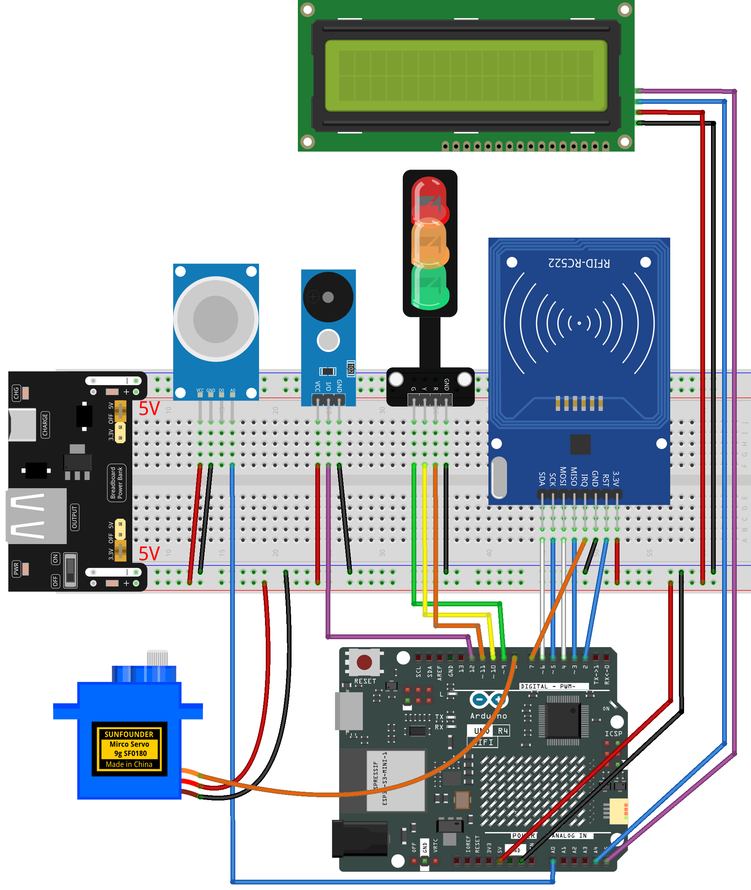

.. _rfid_access11.0_:

RFID Access11.0
==============================================================

.. note::
  
  🌟 Welcome to the SunFounder Facebook Community! Whether you're into Raspberry Pi, Arduino, or ESP32, you'll find inspiration, help ideas here.
   
  - ✅ Be the first to get free learning resources. 
   
  - ✅ Stay updated on new products & exclusive giveaways. 
   
  - ✅ Share your creations and get real feedback.
   
  * 👉 Need faster updates or support? Click [|link_sf_facebook|] join our Facebook community 

  * 👉 Or join our WhatsApp group: Click [|link_sf_whatsapp|]
   
Kit purchase
------------------------

Looking for parts? Check out our all-in-one kits below — packed with components, beginner-friendly guides, and tons of fun.

.. raw:: html

     

.. list-table::
   :widths: 20 20 20
   :header-rows: 1

   * - Name
     - Includes Arduino board
     - PURCHASE LINK
   * - Elite Explorer Kit
     - Arduino Uno R4 WiFi
     - |link_elite_buy|
   * - Inventor Lab Kit
     - Arduino Uno R3
     - |link_inventorkit_buy|

Course Introduction
------------------------

In this lesson, we’ll build a 11.0 access-control system using the I2C LCD, MFRC522 module, MQ-2 gas sensor, a digital servo motor, buzzer module, traffic light module. 

.. .. raw:: html

.. <iframe width="700" height="394" src="https://www.youtube.com/embed/Plk5srVCMn0?si=2lDA-LTwgq1-XX2_" title="YouTube video player" frameborder="0" allow="accelerometer; autoplay; clipboard-write; encrypted-media; gyroscope; picture-in-picture; web-share" referrerpolicy="strict-origin-when-cross-origin" allowfullscreen></iframe>

.. note::

  If this is your first time working with an Arduino project, we recommend downloading and reviewing the basic materials first.
  
  * :ref:`install_arduino`
  * :ref:`introduce_arduino`

**Required Components**

In this project, we need the following components:

.. list-table::
    :widths: 5 20 5 20
    :header-rows: 1

    *   - SN
        - COMPONENT INTRODUCTION	
        - QUANTITY
        - PURCHASE LINK

    *   - 1
        - Arduino UNO R4 Minima/Arduino UNO R4 WIFI
        - 1
        - |link_unor4_wifi_buy|
    *   - 2
        - USB Type-C cable
        - 1
        - 
    *   - 3
        - Breadboard
        - 1
        - |link_breadboard_buy|
    *   - 4
        - Wires
        - Several
        - |link_wires_buy|
    *   - 5
        - Buzzer Modudle
        - 1
        - |link_buzzer_module_buy|
    *   - 6
        - MFRC522 Module
        - 1
        - |link_mfrc522_module_buy|
    *   - 7
        - Power Supply Module
        - 1
        - |link_power_buy|
    *   - 8
        - Digital Servo Motor
        - 1
        - |link_motor_buy|
    *   - 910
        - MQ-2 Gas Sensor Module
        - 1
        - |link_gas_leak_buy|
    *   - 10
        - I2C LCD 1602
        - 1
        - |link_i2clcd1602_buy|
    *   - 11
        - Traffic Light LED
        - 1
        - |link_trafficlinght_buy|

**Wiring**

**Common Connections:**

* **MFRC522 Module**

  - **IRQ:** Connect to **7** on the ESP32.
  - **SDA:** Connect to **6** on the ESP32.
  - **SCK:** Connect to **5** on the ESP32.
  - **MOSI:** Connect to **4** on the ESP32.
  - **MISO:** Connect to **3** on the ESP32.
  - **GND:** Connect to breadboard’s negative power bus.
  - **RST:** Connect to **2** on the ESP32.
  - **3.3V:** Connect to breadboard’s passive power bus.

* **Traffic light LED**

  - **R:** Connect to **11** on the Arduino.
  - **Y:** Connect to **10** on the Arduino.
  - **G:** Connect to **9** on the Arduino.
  - **GND:** Connect to **GND** on the Arduino.

* **MQ-2 Gas Sensor Module**

  - **A0:** Connect to **A0** on the Arduino.
  - **GND:** Connect to breadboard’s negative power bus.
  - **VCC:** Connect to breadboard’s red power bus.

* **Buzzer Module**

  - **I/0:** Connect to **12** on the Arduino.
  - **＋:** Connect to breadboard’s red power bus. 
  - **－:** Connect to breadboard’s negative power bus.

* **Digital Servo Motor**

  - Connect to breadboard’s positive power bus.
  - Connect to breadboard’s negative power bus.
  - Connect to  **8** on the Arduino.

* **I2C LCD 1602**

  - **SDA:** Connect to **A4** on the Arduino.
  - **SCL:** Connect to **A5** on the Arduino.
  - **GND:** Connect to breadboard’s negative power bus.
  - **VCC:** Connect to breadboard’s red power bus.

**Writing the Code**

.. note::

    * You can copy this code into **Arduino IDE**. 
    * The ``RFID1`` library is used here. You can click here :download:`RFID1.zip </_static/RFID1.zip>` to download it.
    * To install the library, use the Arduino Library Manager and search for **LiquidCrystal_I2C** and install it.
    * Don't forget to select the board(Arduino UNO R4 WIFI) and the correct port before clicking the **Upload** button.

.. code-block:: arduino

      #include <rfid1.h>
      #include <Servo.h>
      #include <LiquidCrystal_I2C.h>

      #define ID_LEN 4   // RFID UID length (4 bytes)

      RFID1 rfid;
      Servo myServo;
      LiquidCrystal_I2C lcd(0x27, 16, 2);  // Change to 0x3F if the LCD stays blank

      // Pin configuration
      const int servoPin  = 8;     // Servo signal pin
      const int buzzerPin = 12;    // Passive buzzer pin
      const int smokePin  = A0;    // Smoke sensor analog output

      // Traffic light pins
      const int greenPin  = 9;
      const int yellowPin = 10;
      const int redPin    = 11;

      // Authorized RFID card UID
      uchar userId[ID_LEN] = {0x33, 0xF8, 0xB8, 0x1A};
      uchar userIdRead[ID_LEN];    // Buffer to store scanned UID

      // State flags
      bool cardAction = false;             // True while the door is opening or closing
      unsigned long cardTimer = 0;         // Used to keep the door open for a short time

      bool smokeAlert = false;             // True when smoke level is above the threshold
      bool smokeRecovering = false;        // Recovery period after smoke disappears
      unsigned long smokeRecoverStart = 0; // Timer for recovery delay

      int smokeValue = 0;                  // Current smoke sensor value
      const int smokeThreshold = 200;      // Threshold that triggers the alarm

      // Servo position control
      int targetPos = 0;   // Target servo angle
      int currentPos = 0;  // Current servo angle

      // LCD page tracker
      String lcdState = "";

      // Set the desired servo angle
      void setServoAngle(int angle) {
        targetPos = constrain(angle, 0, 90);
      }

      // Move the servo gradually to the target position
      void servoSmoothRun() {
        static unsigned long lastStep = 0;

        if (millis() - lastStep >= 15) {
          lastStep = millis();

          if (currentPos < targetPos) currentPos++;
          else if (currentPos > targetPos) currentPos--;

          myServo.write(currentPos);
        }
      }

      // Short confirmation beep for a valid card
      void beepShort() {
        tone(buzzerPin, 2000);
        delay(80);
        noTone(buzzerPin);
      }

      // Warning sound for an invalid card
      void beepDenied() {
        for (int i = 0; i < 4; i++) {
          tone(buzzerPin, 1600);
          delay(100);
          noTone(buzzerPin);
          delay(100);
        }
      }

      // Non-blocking alarm sound for smoke alert
      void beepAlarmNonBlock() {
        static unsigned long t = 0;
        static bool buz = false;

        if (millis() - t > 120) {
          t = millis();
          buz = !buz;

          if (buz) tone(buzzerPin, 1500);
          else noTone(buzzerPin);
        }
      }

      // Read the UID from the RFID card
      void getId() {
        uchar status, str[MAX_LEN];
        status = rfid.anticoll(str);

        if (status == MI_OK) {
          for (int i = 0; i < ID_LEN; i++) {
            userIdRead[i] = str[i];
          }
          rfid.halt();   // Stop repeatedly reading the same card
        }
      }

      // Compare the scanned UID with the authorized UID
      bool idVerify() {
        for (int i = 0; i < ID_LEN; i++) {
          if (userIdRead[i] != userId[i]) return false;
        }
        return true;
      }

      // Clear the UID buffer after each scan
      void clearBuffer() {
        for (int i = 0; i < ID_LEN; i++) {
          userIdRead[i] = 0;
        }
      }

      // Show the default waiting screen
      void showNormal() {
        if (lcdState == "normal") return;

        lcdState = "normal";
        lcd.clear();
        lcd.setCursor(0, 0);
        lcd.print("Door Locked");
        lcd.setCursor(0, 1);
        lcd.print("Scan Card");
      }

      // Show access granted message
      void showAccessGranted() {
        if (lcdState == "grant") return;

        lcdState = "grant";
        lcd.clear();
        lcd.setCursor(0, 0);
        lcd.print("Access Granted");
        lcd.setCursor(0, 1);
        lcd.print("Door Opening");
      }

      // Show fully open door message
      void showDoorOpen() {
        if (lcdState == "open") return;

        lcdState = "open";
        lcd.clear();
        lcd.setCursor(0, 0);
        lcd.print("Door Open");
        lcd.setCursor(0, 1);
        lcd.print("Enter Now");
      }

      // Show door closing message
      void showDoorClosing() {
        if (lcdState == "closing") return;

        lcdState = "closing";
        lcd.clear();
        lcd.setCursor(0, 0);
        lcd.print("Door Closing");
        lcd.setCursor(0, 1);
        lcd.print("Please Wait");
      }

      // Show invalid card message
      void showAccessDenied() {
        if (lcdState == "denied") return;

        lcdState = "denied";
        lcd.clear();
        lcd.setCursor(0, 0);
        lcd.print("Access Denied");
        lcd.setCursor(0, 1);
        lcd.print("Invalid Card");
      }

      // Show smoke warning message
      void showSmokeWarning() {
        if (lcdState == "smoke") return;

        lcdState = "smoke";
        lcd.clear();
        lcd.setCursor(0, 0);
        lcd.print("Smoke Alert");
        lcd.setCursor(0, 1);
        lcd.print("Evacuate Now");
      }

      // Set the traffic light LEDs
      void setTrafficLight(bool r, bool y, bool g) {
        digitalWrite(redPin, r);
        digitalWrite(yellowPin, y);
        digitalWrite(greenPin, g);
      }

      // Update traffic lights based on the current state
      void updateTrafficLight() {

        // Smoke alert has the highest priority
        // Red LED blinks faster during alarm
        if (smokeAlert || smokeRecovering) {
          static unsigned long lastBlink = 0;
          static bool redState = false;

          if (millis() - lastBlink > 150) {
            lastBlink = millis();
            redState = !redState;
          }

          digitalWrite(redPin, redState);
          digitalWrite(yellowPin, LOW);
          digitalWrite(greenPin, LOW);
          return;
        }

        // Yellow LED stays on while the door is moving
        if (currentPos != targetPos) {
          setTrafficLight(LOW, HIGH, LOW);
          return;
        }

        // Green LED stays on when the door is fully open
        if (currentPos >= 87 && targetPos == 90) {
          setTrafficLight(LOW, LOW, HIGH);
          return;
        }

        // Red LED stays on in the default locked state
        setTrafficLight(HIGH, LOW, LOW);
      }

      // Initial setup
      void setup() {
        // Initialize RFID module
        rfid.begin(7, 5, 4, 3, 6, 2);
        rfid.init();

        pinMode(buzzerPin, OUTPUT);

        pinMode(redPin, OUTPUT);
        pinMode(yellowPin, OUTPUT);
        pinMode(greenPin, OUTPUT);

        // Initialize servo
        myServo.attach(servoPin);
        myServo.write(0);

        currentPos = 0;
        targetPos = 0;

        // Initialize LCD
        lcd.init();
        lcd.backlight();

        showNormal();
        updateTrafficLight();
      }

      // Main loop
      void loop() {
        // Read smoke sensor value
        smokeValue = analogRead(smokePin);

        // Handle door movement after a valid card scan
        if (cardAction) {

          if (currentPos < 90 && targetPos == 90) {
            showAccessGranted();
            servoSmoothRun();
          }

          else if (currentPos >= 90 && targetPos == 90) {
            showDoorOpen();

            if (cardTimer == 0) cardTimer = millis();

            if (millis() - cardTimer >= 1500) {
              setServoAngle(0);
            }

            servoSmoothRun();
          }

          else if (targetPos == 0 && currentPos > 0) {
            showDoorClosing();
            servoSmoothRun();
          }
        }

        // Return to the normal page after the door is fully closed
        if (!smokeAlert && !smokeRecovering && currentPos <= 3 && targetPos == 0 && lcdState != "normal") {
          cardAction = false;
          cardTimer = 0;
          lcdState = "";
          showNormal();
        }

        // Smoke detection logic
        bool allowRFID = true;

        if (smokeValue > smokeThreshold) {
          smokeAlert = true;
          smokeRecovering = false;

          setServoAngle(90);
          beepAlarmNonBlock();
          showSmokeWarning();
          allowRFID = false;
        }
        else {
          if (smokeAlert) {

            if (!smokeRecovering) {
              smokeRecovering = true;
              smokeRecoverStart = millis();
            }

            if (millis() - smokeRecoverStart < 1500) {
              beepAlarmNonBlock();
              showSmokeWarning();
              allowRFID = false;
            }
            else {
              smokeAlert = false;
              smokeRecovering = false;

              setServoAngle(0);
              noTone(buzzerPin);
              allowRFID = true;
            }
          }
        }

        // RFID scanning logic
        if (allowRFID && !cardAction) {
          uchar status, str[MAX_LEN];
          status = rfid.request(PICC_REQIDL, str);

          if (status == MI_OK) {
            getId();

            if (idVerify()) {
              beepShort();
              showAccessGranted();

              setServoAngle(90);
              cardAction = true;
              cardTimer = 0;
            }
            else {
              showAccessDenied();
              beepDenied();
              delay(800);
              showNormal();
            }

            clearBuffer();
          }
        }

        // Keep the servo moving smoothly
        servoSmoothRun();

        // Update the traffic light every loop
        updateTrafficLight();
      }

