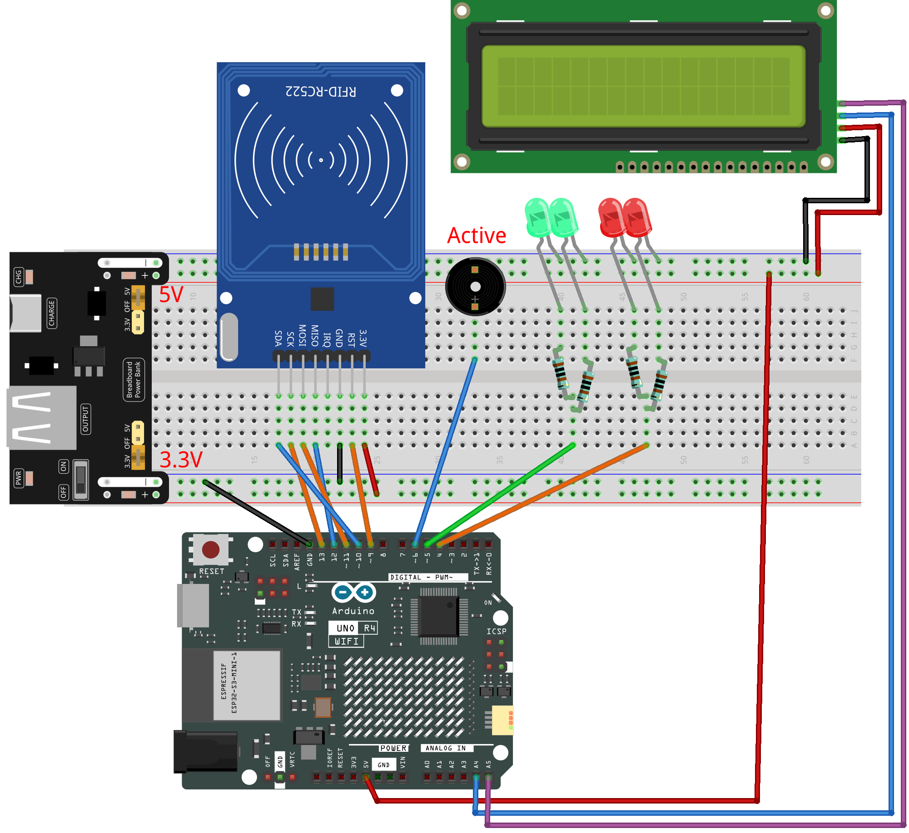

.. _rfid_access2.0_:

RFID Access2.0
==============================================================

.. note::
  
  🌟 Welcome to the SunFounder Facebook Community! Whether you're into Raspberry Pi, Arduino, or ESP32, you'll find inspiration, help ideas here.
   
  - ✅ Be the first to get free learning resources. 
   
  - ✅ Stay updated on new products & exclusive giveaways. 
   
  - ✅ Share your creations and get real feedback.
   
  * 👉 Need faster updates or support? Click [|link_sf_facebook|] join our Facebook community 

  * 👉 Or join our WhatsApp group: Click [|link_sf_whatsapp|]
   
Kit purchase
------------------------

Looking for parts? Check out our all-in-one kits below — packed with components, beginner-friendly guides, and tons of fun.

.. image:: img/elite_explore_kit.png
   :width: 100%
   :align: center
   :target: https://www.sunfounder.com/collections/arduino-kits-bundles/products/sunfounder-elite-explorer-kit-with-official-arduino-uno-r4-wifi?ref=jbzmncle

.. raw:: html

     

.. list-table::
   :widths: 20 20 20
   :header-rows: 1

   * - Name
     - Includes Arduino board
     - PURCHASE LINK
   * - Elite Explorer Kit
     - Arduino Uno R4 WiFi
     - |link_elite_buy|
   * - Inventor Lab Kit
     - Arduino Uno R3
     - |link_inventorkit_buy|

Course Introduction
------------------------

In this lesson, we’ll build a 2.0 access-control system using the MFRC522 module, a 1602 LCD, and an active buzzer. 

Valid cards light the green LED and play an “access granted” tone; invalid cards light the red LED and trigger a warning alarm.

.. raw:: html

  <iframe width="700" height="394" src="https://www.youtube.com/embed/XP2OF9M9UCs?si=iL6X316rgUh9h8B4" title="YouTube video player" frameborder="0" allow="accelerometer; autoplay; clipboard-write; encrypted-media; gyroscope; picture-in-picture; web-share" referrerpolicy="strict-origin-when-cross-origin" allowfullscreen></iframe>

.. note::

  If this is your first time working with an Arduino project, we recommend downloading and reviewing the basic materials first.
  
  * :ref:`install_arduino`
  * :ref:`introduce_arduino`

**Required Components**

In this project, we need the following components:

.. list-table::
    :widths: 5 20 5 20
    :header-rows: 1

    *   - SN
        - COMPONENT INTRODUCTION	
        - QUANTITY
        - PURCHASE LINK

    *   - 1
        - Arduino UNO R4 Minima/Arduino UNO R4 WIFI
        - 1
        - |link_unor4_wifi_buy|
    *   - 2
        - USB Type-C cable
        - 1
        - 
    *   - 3
        - Breadboard
        - 1
        - |link_breadboard_buy|
    *   - 4
        - Wires
        - Several
        - |link_wires_buy|
    *   - 5
        - Active Buzzer
        - 1
        - 
    *   - 6
        - I2C LCD 1602
        - 1
        - |link_i2clcd1602_buy|
    *   - 7
        - MFRC522 Module
        - 1
        - |link_mfrc522_module_buy|
    *   - 8
        - Power Supply Module
        - 1
        - |link_power_buy|
    *   - 9
        - LED
        - 4
        - |link_led_buy|
    *   - 10
        - Resistor
        - 1KΩ × 4
        - |link_resistor_buy|

**Wiring**

**Common Connections:**

* **MFRC522 Module**

  - **SDA:** Connect to **10** on the Arduino.
  - **SCK:** Connect to **13** on the Arduino.
  - **MOSI:** Connect to **11** on the Arduino.
  - **MISO:** Connect to **12** on the Arduino.
  - **GND:** Connect to breadboard’s negative power bus.
  - **RST:** Connect to **9** on the Arduino.
  - **3.3V:** Connect to breadboard’s passive power bus.

* **Active Buzzer**

  - **＋:** Connect to **6** on the Arduino.
  - **－:** Connect to breadboard’s negative power bus.

* **I2C LCD 1602**

  - **SDA:** Connect to **A4** on the Arduino.
  - **SCL:** Connect to **A5** on the Arduino.
  - **GND:** Connect to breadboard’s negative power bus.
  - **VCC:** Connect to breadboard’s red power bus.

* **LED**

  - Connect the LEDs **cathode** to the negative power bus on the breadboard, and the Green LED **anode** to the **5** on the Arduino through a **1 kΩ resistor**, the Red LED **cathode** to the **6** on the Arduino through a **1 kΩ resistor**.

**Writing the Code**

.. note::

    * You can copy this code into **Arduino IDE**. 
    * To install the library, use the Arduino Library Manager and search for **LiquidCrystal I2C** and install it.
    * To install the library, use the Arduino Library Manager and search for **MFRC522** and install it.
    * Don't forget to select the board(Arduino UNO R4 WIFI) and the correct port before clicking the **Upload** button.

.. code-block:: arduino

      #include <SPI.h>                  // SPI library for RFID communication
      #include <MFRC522.h>              // RFID library for MFRC522 module
      #include <Wire.h>                 // I2C library for LCD
      #include <LiquidCrystal_I2C.h>    // LCD library for I2C-based LCDs

      // Pin definitions
      #define SS_PIN         10         // RFID SDA (SS) pin
      #define RST_PIN        9          // RFID reset pin
      #define RED_LED_PIN    4          // Red LED pin
      #define GREEN_LED_PIN  5          // Green LED pin
      #define BUZZER_PIN     6          // Active buzzer pin

      // Create RFID and LCD objects
      MFRC522 rfid(SS_PIN, RST_PIN);
      LiquidCrystal_I2C lcd(0x27, 16, 2);  // LCD address (change if needed), 16 columns x 2 rows

      // UID of the authorized card (replace with your own card UID)
      byte authorizedUID[4] = {0x36, 0xE2, 0xC4, 0xF7};

      void setup() {
        Serial.begin(9600);          // Start serial monitor for debugging
        SPI.begin();                 // Initialize SPI communication
        rfid.PCD_Init();             // Initialize RFID reader

        lcd.init();                  // Initialize the LCD
        lcd.backlight();             // Turn on LCD backlight

        pinMode(RED_LED_PIN, OUTPUT);
        pinMode(GREEN_LED_PIN, OUTPUT);
        pinMode(BUZZER_PIN, OUTPUT);

        // Set default state: red LED on, LCD shows prompt
        digitalWrite(RED_LED_PIN, HIGH);
        lcd.setCursor(0, 0);
        lcd.print("Scan your card");
      }

      void loop() {
        // Wait for a new card
        if (!rfid.PICC_IsNewCardPresent() || !rfid.PICC_ReadCardSerial()) return;

        // Print the scanned UID to the Serial Monitor
        Serial.print("Card UID: ");
        for (byte i = 0; i < rfid.uid.size; i++) {
          Serial.print(rfid.uid.uidByte[i] < 0x10 ? " 0" : " ");
          Serial.print(rfid.uid.uidByte[i], HEX);
        }
        Serial.println();

        // Check if the scanned card is authorized
        bool authorized = compareUID(rfid.uid.uidByte, rfid.uid.size);
        showAccessResult(authorized);

        // Stop communicating with the current card
        rfid.PICC_HaltA();
        rfid.PCD_StopCrypto1();
      }

      // Compare scanned UID with the authorized one
      bool compareUID(byte *uid, byte len) {
        if (len != 4) return false;
        for (byte i = 0; i < 4; i++) {
          if (uid[i] != authorizedUID[i]) return false;
        }
        return true;
      }

      // Display access result and give feedback
      void showAccessResult(bool granted) {
        if (granted) {
          // Access granted:
          // Turn off red LED, turn on green LED, show welcome message
          digitalWrite(RED_LED_PIN, LOW);
          digitalWrite(GREEN_LED_PIN, HIGH);
          lcd.clear();
          lcd.setCursor(0, 0);
          lcd.print("Welcome!");
          shortBeep();
          delay(1000);

          // Reset to default state
          digitalWrite(GREEN_LED_PIN, LOW);
          digitalWrite(RED_LED_PIN, HIGH);
          lcd.clear();
          lcd.setCursor(0, 0);
          lcd.print("Scan your card");

        } else {
          // Access denied:
          // Flash red LED, beep 3 times, show denial message
          lcd.clear();
          lcd.setCursor(0, 0);
          lcd.print("Access Denied");
          deniedFeedback(1500);  // Flash and beep for 1.5 seconds

          // Reset to default state
          digitalWrite(RED_LED_PIN, HIGH);
          lcd.clear();
          lcd.setCursor(0, 0);
          lcd.print("Scan your card");
        }
      }

      // Play a short beep (used for access granted)
      void shortBeep() {
        digitalWrite(BUZZER_PIN, HIGH);
        delay(200);
        digitalWrite(BUZZER_PIN, LOW);
      }

      // Flash red LED and beep 3 times over a duration
      void deniedFeedback(unsigned long duration) {
        unsigned long start = millis();
        int flashState = LOW;
        unsigned long lastFlash = 0;
        int beepCount = 0;
        unsigned long lastBeep = 0;
        bool beeping = false;

        while (millis() - start < duration) {
          unsigned long now = millis();

          // Toggle red LED every 100ms
          if (now - lastFlash >= 100) {
            flashState = !flashState;
            digitalWrite(RED_LED_PIN, flashState);
            lastFlash = now;
          }

          // Play 3 beeps, each 100ms long, spaced 200ms apart
          if (beepCount < 3) {
            if (!beeping && (now - lastBeep >= 200)) {
              digitalWrite(BUZZER_PIN, HIGH);
              lastBeep = now;
              beeping = true;
            }
            if (beeping && (now - lastBeep >= 100)) {
              digitalWrite(BUZZER_PIN, LOW);
              beeping = false;
              beepCount++;
            }
          }
        }

        // Ensure everything is off after feedback
        digitalWrite(BUZZER_PIN, LOW);
      }
