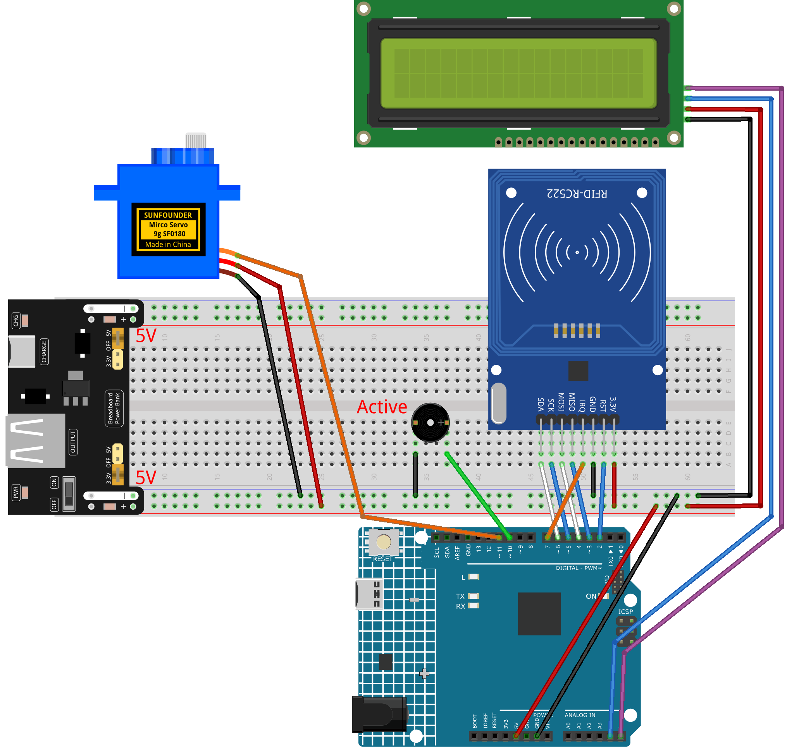

.. _rfid_access3.0_:

RFID Access3.0
==============================================================

.. note::
  
  🌟 Welcome to the SunFounder Facebook Community! Whether you're into Raspberry Pi, Arduino, or ESP32, you'll find inspiration, help ideas here.
   
  - ✅ Be the first to get free learning resources. 
   
  - ✅ Stay updated on new products & exclusive giveaways. 
   
  - ✅ Share your creations and get real feedback.
   
  * 👉 Need faster updates or support? Click [|link_sf_facebook|] join our Facebook community 

  * 👉 Or join our WhatsApp group: Click [|link_sf_whatsapp|]
   
Kit purchase
------------------------

Looking for parts? Check out our all-in-one kits below — packed with components, beginner-friendly guides, and tons of fun.

.. image:: img/elite_explore_kit.png
   :width: 100%
   :align: center
   :target: https://www.sunfounder.com/collections/arduino-kits-bundles/products/sunfounder-elite-explorer-kit-with-official-arduino-uno-r4-wifi?ref=jbzmncle

.. raw:: html

     

.. list-table::
   :widths: 20 20 20
   :header-rows: 1

   * - Name
     - Includes Arduino board
     - PURCHASE LINK
   * - Elite Explorer Kit
     - Arduino Uno R4 WiFi
     - |link_elite_buy|
   * - Inventor Lab Kit
     - Arduino Uno R3
     - |link_inventorkit_buy|

Course Introduction
------------------------

In this lesson, we’ll build a 3.0 access-control system using the MFRC522 module, a 1602 LCD, a digital servo motor, and an active buzzer. 

.. raw:: html

  <iframe width="700" height="394" src="https://www.youtube.com/embed/NTM_WniSmV4?si=Nauil7ME5hYNHTgY" title="YouTube video player" frameborder="0" allow="accelerometer; autoplay; clipboard-write; encrypted-media; gyroscope; picture-in-picture; web-share" referrerpolicy="strict-origin-when-cross-origin" allowfullscreen></iframe>

.. note::

  If this is your first time working with an Arduino project, we recommend downloading and reviewing the basic materials first.
  
  * :ref:`install_arduino`
  * :ref:`introduce_arduino`

**Required Components**

In this project, we need the following components:

.. list-table::
    :widths: 5 20 5 20
    :header-rows: 1

    *   - SN
        - COMPONENT INTRODUCTION	
        - QUANTITY
        - PURCHASE LINK

    *   - 1
        - Arduino UNO R4 Minima/Arduino UNO R4 WIFI
        - 1
        - |link_unor4_buy|
    *   - 2
        - USB Type-C cable
        - 1
        - 
    *   - 3
        - Breadboard
        - 1
        - |link_breadboard_buy|
    *   - 4
        - Wires
        - Several
        - |link_wires_buy|
    *   - 5
        - Active Buzzer
        - 1
        - 
    *   - 6
        - I2C LCD 1602
        - 1
        - |link_i2clcd1602_buy|
    *   - 7
        - MFRC522 Module
        - 1
        - |link_mfrc522_module_buy|
    *   - 8
        - Power Supply Module
        - 1
        - |link_power_buy|
    *   - 9
        - Digital Servo Motor
        - 1
        - |link_motor_buy|

**Wiring**

**Common Connections:**

* **MFRC522 Module**

  - **SDA:** Connect to **6** on the Arduino.
  - **SCK:** Connect to **5** on the Arduino.
  - **MOSI:** Connect to **4** on the Arduino.
  - **MISO:** Connect to **3** on the Arduino.
  - **GND:** Connect to breadboard’s negative power bus.
  - **RST:** Connect to **2** on the Arduino.
  - **3.3V:** Connect to breadboard’s passive power bus.

* **Active Buzzer**

  - **＋:** Connect to **10** on the Arduino.
  - **－:** Connect to breadboard’s negative power bus.

* **I2C LCD 1602**

  - **SDA:** Connect to **A4** on the Arduino.
  - **SCL:** Connect to **A5** on the Arduino.
  - **GND:** Connect to breadboard’s negative power bus.
  - **VCC:** Connect to breadboard’s red power bus.

* **Digital Servo Motor**

  - Connect to breadboard’s positive power bus.
  - Connect to breadboard’s negative power bus.
  - Connect to  **11** on the Arduino.

**Writing the Code**

.. note::

    * You can copy this code into **Arduino IDE**. 
    * To install the library, use the Arduino Library Manager and search for **LiquidCrystal I2C** and install it.
    * The ``RFID1`` library is used here. You can click here :download:`RFID1.zip </_static/RFID1.zip>` to download it.
    * Don't forget to select the board(Arduino UNO R4 WIFI) and the correct port before clicking the **Upload** button.

.. code-block:: arduino

    #include <rfid1.h>               // MFRC522 RFID library
    #include <Wire.h>                // I2C communication library
    #include <LiquidCrystal_I2C.h>   // I2C LCD library
    #include <Servo.h>               // Servo motor library

    #define ID_LEN 4                 // Length of the RFID UID in bytes

    // ———— Global objects & pins ————
    RFID1               rfid;                // RFID reader object
    LiquidCrystal_I2C  lcd(0x27, 16, 2);     // LCD at I2C address 0x27, 16×2 chars
    Servo               myServo;             // Servo motor object

    const int buzPin   = 10;   // Buzzer output pin
    const int servoPin = 11;   // Servo control pin

    // Authorized card UID (change to your card’s UID)
    uchar userId[ID_LEN]     = { 0x36, 0xE2, 0xC4, 0xF7 };
    // Buffer to store the UID read from a card
    uchar userIdRead[ID_LEN];                               

    // ———— Setup runs once ————
    void setup() {
      Serial.begin(9600);            // Start serial monitor for debugging

      // Initialize RFID reader (SS, RST, MISO, MOSI, SCK, IRQ)
      rfid.begin(7, 5, 4, 3, 6, 2);
      rfid.init();                   // Power up and reset RFID module

      pinMode(buzPin, OUTPUT);       // Configure buzzer pin as output

      // Attach servo and move it to 90° (door closed)
      myServo.attach(servoPin);
      myServo.write(90);
      delay(500);                    // Wait for servo to reach position

      lcd.init();                    // Initialize the LCD
      lcd.backlight();               // Turn on LCD backlight

      showWelcome();                 // Display the welcome screen
    }

    // ———— Main loop repeats forever ————
    void loop() {
      uchar status, str[MAX_LEN];

      // Ask RFID module if a card is in range
      status = rfid.request(PICC_REQIDL, str);
      if (status == MI_OK) {
        getId();                // Read the card’s UID into buffer
        scanningAnimation();    // Show “Scanning……” with dots

        // Check if the read UID matches authorized UID
        if (idVerify()) {
          handleSuccess();      // If match, open door
        } else {
          handleFailure();      // If no match, show error
        }

        delay(500);             // Short pause before resetting screen
        showWelcome();          // Return to welcome message

        // Clear the UID buffer for next read
        for (int i = 0; i < ID_LEN; i++) {
          userIdRead[i] = 0;
        }
      }
    }

    // ———— Display initial welcome screen ————
    void showWelcome() {
      lcd.clear();
      lcd.setCursor(0, 0);
      lcd.print("Welcome!");         // Top line
      lcd.setCursor(0, 1);
      lcd.print("Place your card");  // Bottom line
    }

    // ———— Show scanning animation ————
    void scanningAnimation() {
      lcd.clear();
      lcd.setCursor(0, 0);
      lcd.print("Scanning");         // Print text
      // Add six dots one by one
      for (int i = 0; i < 6; i++) {
        lcd.print(".");
        delay(500);                  // Wait half a second per dot
      }
    }

    // ———— Read UID from the card ————
    void getId() {
      uchar status, str[MAX_LEN];
      status = rfid.anticoll(str);   // Anti-collision to get full UID
      if (status == MI_OK) {
        Serial.print("Card ID: ");
        // Copy each byte into our buffer and print it for debug
        for (int i = 0; i < ID_LEN; i++) {
          userIdRead[i] = str[i];
          Serial.print("0x");         
          Serial.print(str[i], HEX);
          Serial.print(" ");
        }
        Serial.println();
        rfid.halt();                 // Halt further readings until next loop
      }
    }

    // ———— Compare read UID with authorized UID ————
    bool idVerify() {
      for (int i = 0; i < ID_LEN; i++) {
        if (userIdRead[i] != userId[i]) {
          verifyPrint(false);        // Mismatch: indicate failure
          return false;
        }
      }
      verifyPrint(true);             // Match: indicate success
      return true;
    }

    // ———— Sound buzzer for pass/fail feedback ————
    void verifyPrint(bool result) {
      if (result) {
        beep(100, 3);                // Three short beeps for success
        delay(400);                  // Pause before next action
      } else {
        beep(500, 1);                // One long beep for error
        delay(400);
      }
    }

    // duration: length of one beep in ms; frequency: number of beeps
    void beep(int duration, int frequency) {
      for (int i = 0; i < frequency; i++) {
        tone(buzPin, 1000);          // Play 1 kHz tone
        delay(duration);             // Keep tone on
        noTone(buzPin);              // Stop tone
        delay(100);                  // Short gap between beeps
      }
    }

    // ———— Actions when card is valid ————
    void handleSuccess() {
      lcd.clear();
      lcd.setCursor(0, 0);
      lcd.print("Card success!");
      lcd.setCursor(0, 1);
      lcd.print("Welcome home");

      delay(500);                     // Let user read the message
      myServo.write(0);               // Move servo to 0° (open door)
      delay(2000);                    // Door stays open for 2 seconds
      myServo.write(90);              // Return servo to 90° (close door)
    }

    // ———— Actions when card is invalid ————
    void handleFailure() {
      lcd.clear();
      lcd.setCursor(0, 0);
      lcd.print("Card error!");       // Show error message
      delay(1000);                    // Pause so user sees the error
    }
