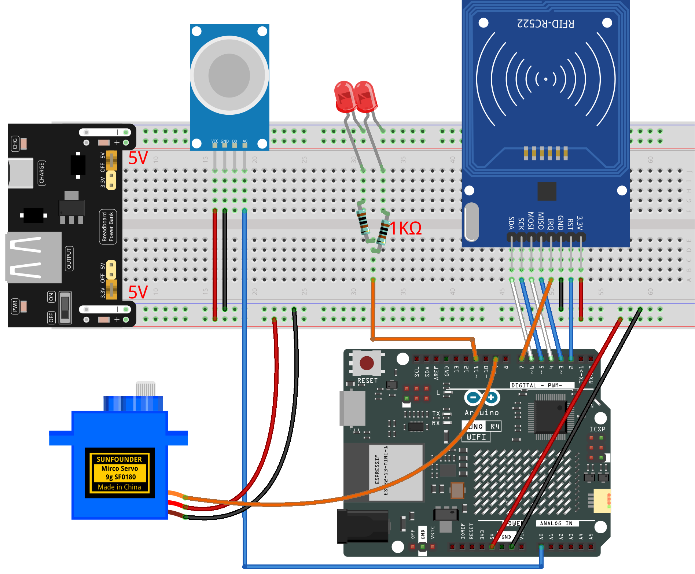

.. _rfid_access4.0_:

RFID Access4.0
==============================================================

.. note::
  
  🌟 Welcome to the SunFounder Facebook Community! Whether you're into Raspberry Pi, Arduino, or ESP32, you'll find inspiration, help ideas here.
   
  - ✅ Be the first to get free learning resources. 
   
  - ✅ Stay updated on new products & exclusive giveaways. 
   
  - ✅ Share your creations and get real feedback.
   
  * 👉 Need faster updates or support? Click [|link_sf_facebook|] join our Facebook community 

  * 👉 Or join our WhatsApp group: Click [|link_sf_whatsapp|]
   
  * 🎁 Looking for parts?Check out our all-in-one kits below — packed with components, beginner-friendly guides, and tons of fun.
  
  .. list-table::
    :widths: 20 20 20
    :header-rows: 1

    *   - Name	
        - Arduino board
        - PURCHASE LINK
    *   - Elite Explorer Kit
        - Arduino Uno R4 WiFi
        - |link_elite_buy|
    *   - Ultimate Starter Kit for Arduino Mega 2560
        - Arduino Mega 2560
        - |link_mega_2560_kit_buy|

Course Introduction
------------------------

In this lesson, we’ll build a 4.0 access-control system using the MFRC522 module, leds, a digital servo motor, and gas sensor module. 

.. raw:: html

  <iframe width="700" height="394" src="https://www.youtube.com/embed/2EGX7uNZ20c" title="YouTube video player" frameborder="0" allow="accelerometer; autoplay; clipboard-write; encrypted-media; gyroscope; picture-in-picture; web-share" referrerpolicy="strict-origin-when-cross-origin" allowfullscreen></iframe>

.. note::

  If this is your first time working with an Arduino project, we recommend downloading and reviewing the basic materials first.
  
  * :ref:`install_arduino`
  * :ref:`introduce_arduino`

**Required Components**

In this project, we need the following components:

.. list-table::
    :widths: 5 20 5 20
    :header-rows: 1

    *   - SN
        - COMPONENT INTRODUCTION	
        - QUANTITY
        - PURCHASE LINK

    *   - 1
        - Arduino UNO R4 Minima/Arduino UNO R4 WIFI
        - 1
        - |link_unor4_buy|
    *   - 2
        - USB Type-C cable
        - 1
        - 
    *   - 3
        - Breadboard
        - 1
        - |link_breadboard_buy|
    *   - 4
        - Wires
        - Several
        - |link_wires_buy|
    *   - 5
        - MQ-2 Gas Sensor Module
        - 1
        - |link_gas_leak_buy|
    *   - 6
        - LED
        - 2
        - |link_led_buy|
    *   - 7
        - MFRC522 Module
        - 1
        - |link_mfrc522_module_buy|
    *   - 8
        - Power Supply Module
        - 1
        - |link_power_buy|
    *   - 9
        - Digital Servo Motor
        - 1
        - |link_motor_buy|
    *   - 10
        - 1kΩ resistor
        - 4
        - |link_resistor_buy|

**Wiring**

**Common Connections:**

* **MFRC522 Module**

  - **IRQ:** Connect to **7** on the Arduino.
  - **SDA:** Connect to **6** on the Arduino.
  - **SCK:** Connect to **5** on the Arduino.
  - **MOSI:** Connect to **4** on the Arduino.
  - **MISO:** Connect to **3** on the Arduino.
  - **GND:** Connect to breadboard’s negative power bus.
  - **RST:** Connect to **2** on the Arduino.
  - **3.3V:** Connect to breadboard’s passive power bus.

* **MQ-2 Gas Sensor Module**

  - **A0:** Connect to **A0** on the Arduino.
  - **GND:** Connect to breadboard’s negative power bus.
  - **VCC:** Connect to breadboard’s red power bus.

* **LED**

  - Connect the LEDs **cathode** to the negative power bus on the breadboard, and the LEDs **anode** to **1kΩ resistor** then to **11** on the Arduino.

* **Digital Servo Motor**

  - Connect to breadboard’s positive power bus.
  - Connect to breadboard’s negative power bus.
  - Connect to  **9** on the Arduino.

**Writing the Code**

.. note::

    * You can copy this code into **Arduino IDE**. 
    * The ``RFID1`` library is used here. You can click here :download:`RFID1.zip </_static/RFID1.zip>` to download it.
    * Don't forget to select the board(Arduino UNO R4 WIFI) and the correct port before clicking the **Upload** button.

.. code-block:: arduino

      #include <rfid1.h>      // Library for RFID reader
      #include <Servo.h>      // Library for servo motor

      #define ID_LEN 4

      RFID1 rfid;
      Servo myServo;

      // Pin setup
      const int servoPin  = 9;
      const int ledPin    = 11;
      const int smokePin  = A0;

      // Your RFID card UID
      uchar userId[ID_LEN] = {0x36, 0xE2, 0xC4, 0xF7};
      uchar userIdRead[ID_LEN];

      // Smoke threshold (>200 = danger)
      const int smokeThreshold = 200;

      // State flags
      bool smokeAlert       = false;
      bool smokeRecovering  = false;
      unsigned long smokeRecoverStart = 0;

      bool cardAction       = false;     // Door opened by valid card
      unsigned long cardTimer = 0;

      int targetPos  = 0;   // Target position for servo
      int currentPos = 0;   // Current position for servo

      // Set target angle for servo
      void setServoAngle(int angle) {
        targetPos = constrain(angle, 0, 90);
      }

      // Move servo smoothly (non-blocking)
      void servoSmoothRun() {
        static unsigned long lastStep = 0;
        if (millis() - lastStep >= 15) {
          lastStep = millis();
          if (currentPos < targetPos) currentPos++;
          else if (currentPos > targetPos) currentPos--;
          myServo.write(currentPos);
        }
      }

      // Blink LED without delay()
      void ledBlinkNonBlock() {
        static unsigned long lastBlink = 0;
        static bool ledState = false;
        if (millis() - lastBlink >= 120) {
          lastBlink = millis();
          ledState = !ledState;
          digitalWrite(ledPin, ledState);
        }
      }

      // Read UID from RFID card
      void getId() {
        uchar status, str[MAX_LEN];
        status = rfid.anticoll(str);
        if (status == MI_OK) {
          for (int i = 0; i < ID_LEN; i++) userIdRead[i] = str[i];
          rfid.halt();
        }
      }

      // Compare UID with stored valid UID
      bool idVerify() {
        for (int i = 0; i < ID_LEN; i++)
          if (userIdRead[i] != userId[i]) return false;
        return true;
      }

      // Clear UID buffer
      void clearBuffer() {
        for (int i = 0; i < ID_LEN; i++) userIdRead[i] = 0;
      }

      // LED blink for invalid card
      void denyAccessBlink() {
        for (int i = 0; i < 4; i++) {
          digitalWrite(ledPin, HIGH); delay(200);
          digitalWrite(ledPin, LOW);  delay(200);
        }
        digitalWrite(ledPin, HIGH);
      }

      // Setup runs once
      void setup() {
        rfid.begin(7, 5, 4, 3, 6, 2);
        rfid.init();
        pinMode(ledPin, OUTPUT);
        myServo.attach(servoPin);

        myServo.write(0);
        currentPos = 0;
        targetPos  = 0;
        digitalWrite(ledPin, HIGH);
      }

      // Main loop runs repeatedly
      void loop() {

        // Valid card opening (smooth + wait 1s)
        if (cardAction) {
          if (currentPos < 90) {
            servoSmoothRun();
            return;
          }
          if (cardTimer == 0) {
            cardTimer = millis();
          }
          if (millis() - cardTimer >= 1000) {
            setServoAngle(0);
            cardAction = false;
            cardTimer  = 0;
            digitalWrite(ledPin, HIGH);
          }
          servoSmoothRun();
          return;
        }

        // Smoke detection logic
        int smokeVal = analogRead(smokePin);
        bool allowRFID = false;

        if (smokeVal > smokeThreshold) {     // Danger smoke
          smokeAlert       = true;
          smokeRecovering  = false;
          setServoAngle(90);
          ledBlinkNonBlock();
          allowRFID = false;
        }
        else if (smokeVal > 50) {            // Light smoke
          ledBlinkNonBlock();
          allowRFID = false;
        }
        else {                               // No smoke
          if (smokeAlert) {
            if (!smokeRecovering) {
              smokeRecovering = true;
              smokeRecoverStart = millis();
            }
            if (millis() - smokeRecoverStart < 1000) {
              ledBlinkNonBlock();
              allowRFID = false;
            } else {
              smokeAlert       = false;
              smokeRecovering  = false;
              setServoAngle(0);
              digitalWrite(ledPin, HIGH);
              allowRFID = true;
            }
          } else {
            digitalWrite(ledPin, HIGH);
            allowRFID = true;
          }
        }

        // RFID scanning if safe
        if (allowRFID) {
          uchar status, str[MAX_LEN];
          status = rfid.request(PICC_REQIDL, str);
          if (status == MI_OK) {
            getId();
            if (idVerify()) {
              setServoAngle(90);
              cardAction = true;
              cardTimer  = 0;
              digitalWrite(ledPin, LOW);
            } else {
              denyAccessBlink();
            }
            clearBuffer();
          }
        }

        // Keep servo moving
        servoSmoothRun();
      }
