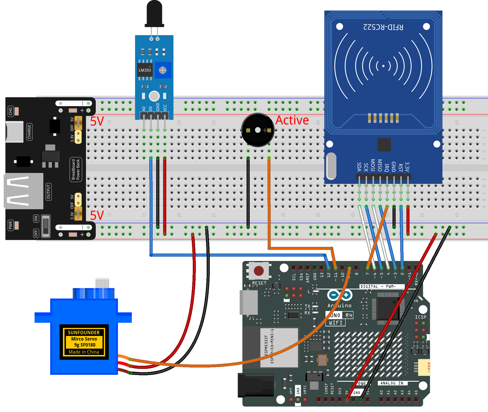

.. _rfid_access5.0_:

RFID Access5.0
==============================================================

.. note::
  
  🌟 Welcome to the SunFounder Facebook Community! Whether you're into Raspberry Pi, Arduino, or ESP32, you'll find inspiration, help ideas here.
   
  - ✅ Be the first to get free learning resources. 
   
  - ✅ Stay updated on new products & exclusive giveaways. 
   
  - ✅ Share your creations and get real feedback.
   
  * 👉 Need faster updates or support? Click [|link_sf_facebook|] join our Facebook community 

  * 👉 Or join our WhatsApp group: Click [|link_sf_whatsapp|]
   
Kit purchase
------------------------

Looking for parts? Check out our all-in-one kits below — packed with components, beginner-friendly guides, and tons of fun.

.. image:: img/elite_explore_kit.png
   :width: 100%
   :align: center
   :target: https://www.sunfounder.com/collections/arduino-kits-bundles/products/sunfounder-elite-explorer-kit-with-official-arduino-uno-r4-wifi?ref=jbzmncle

.. raw:: html

     

.. list-table::
   :widths: 20 20 20
   :header-rows: 1

   * - Name
     - Includes Arduino board
     - PURCHASE LINK
   * - Elite Explorer Kit
     - Arduino Uno R4 WiFi
     - |link_elite_buy|
   * - Inventor Lab Kit
     - Arduino Uno R3
     - |link_inventorkit_buy|

Course Introduction
------------------------

In this lesson, we’ll build a 5.0 access-control system using the MFRC522 module, active buzzer, a digital servo motor, and flame sensor module. 

.. raw:: html

  <iframe width="700" height="394" src="https://www.youtube.com/embed/IAZ5AWQtw0o?si=nu02KSJUirUPWpX9" title="YouTube video player" frameborder="0" allow="accelerometer; autoplay; clipboard-write; encrypted-media; gyroscope; picture-in-picture; web-share" referrerpolicy="strict-origin-when-cross-origin" allowfullscreen></iframe>

.. note::

  If this is your first time working with an Arduino project, we recommend downloading and reviewing the basic materials first.
  
  * :ref:`install_arduino`
  * :ref:`introduce_arduino`

**Required Components**

In this project, we need the following components:

.. list-table::
    :widths: 5 20 5 20
    :header-rows: 1

    *   - SN
        - COMPONENT INTRODUCTION	
        - QUANTITY
        - PURCHASE LINK

    *   - 1
        - Arduino UNO R4 Minima/Arduino UNO R4 WIFI
        - 1
        - |link_unor4_buy|
    *   - 2
        - USB Type-C cable
        - 1
        - 
    *   - 3
        - Breadboard
        - 1
        - |link_breadboard_buy|
    *   - 4
        - Wires
        - Several
        - |link_wires_buy|
    *   - 5
        - Flame Sensor Module
        - 1
        - |link_flame_buy|
    *   - 6
        - Active Buzzer
        - 1
        - 
    *   - 7
        - MFRC522 Module
        - 1
        - |link_mfrc522_module_buy|
    *   - 8
        - Power Supply Module
        - 1
        - |link_power_buy|
    *   - 9
        - Digital Servo Motor
        - 1
        - |link_motor_buy|

**Wiring**

**Common Connections:**

* **MFRC522 Module**

  - **IRQ:** Connect to **7** on the Arduino.
  - **SDA:** Connect to **6** on the Arduino.
  - **SCK:** Connect to **5** on the Arduino.
  - **MOSI:** Connect to **4** on the Arduino.
  - **MISO:** Connect to **3** on the Arduino.
  - **GND:** Connect to breadboard’s negative power bus.
  - **RST:** Connect to **2** on the Arduino.
  - **3.3V:** Connect to breadboard’s passive power bus.

* **Flame Sensor Module**

  - **D0:** Connect to **12** on the Arduino.
  - **GND:** Connect to breadboard’s negative power bus.
  - **VCC:** Connect to breadboard’s red power bus.

* **Active Buzzer**

  - **＋:** Connect to **11** on the Arduino.
  - **－:** Connect to breadboard’s negative power bus.

* **Digital Servo Motor**

  - Connect to breadboard’s positive power bus.
  - Connect to breadboard’s negative power bus.
  - Connect to  **9** on the Arduino.

**Writing the Code**

.. note::

    * You can copy this code into **Arduino IDE**. 
    * The ``RFID1`` library is used here. You can click here :download:`RFID1.zip </_static/RFID1.zip>` to download it.
    * Don't forget to select the board(Arduino UNO R4 WIFI) and the correct port before clicking the **Upload** button.

.. code-block:: arduino

      #include <rfid1.h>
      #include <Servo.h>

      #define ID_LEN 4

      RFID1 rfid;
      Servo myServo;

      // Pin setup
      const int servoPin  = 9;     // Servo motor pin
      const int buzzerPin = 11;    // Active buzzer pin
      const int flamePin  = 12;    // Flame sensor (LOW = fire detected)

      // Your RFID card UID (you changed it)
      uchar userId[ID_LEN] = {0x33, 0xF8, 0xB8, 0x1A};
      uchar userIdRead[ID_LEN];

      // State
      bool cardAction       = false;
      unsigned long cardTimer = 0;

      bool flameAlert       = false;
      bool flameRecovering  = false;
      unsigned long flameRecoverStart = 0;

      // Servo status
      int targetPos  = 0;
      int currentPos = 0;

      // Set target servo angle (0–90)
      void setServoAngle(int angle) {
        targetPos = constrain(angle, 0, 90);
      }

      // Move servo smoothly (non-blocking)
      void servoSmoothRun() {
        static unsigned long lastStep = 0;
        if (millis() - lastStep >= 15) {
          lastStep = millis();
          if (currentPos < targetPos) currentPos++;
          else if (currentPos > targetPos) currentPos--;
          myServo.write(currentPos);
        }
      }

      // Beep without delay() (used for fire alarm)
      void buzzerBeepNonBlock() {
        static unsigned long lastBeep = 0;
        static bool buzzState = false;
        if (millis() - lastBeep >= 120) {
          lastBeep = millis();
          buzzState = !buzzState;
          digitalWrite(buzzerPin, buzzState);
        }
      }

      // Read UID from RFID card
      void getId() {
        uchar status, str[MAX_LEN];
        status = rfid.anticoll(str);
        if (status == MI_OK) {
          for (int i = 0; i < ID_LEN; i++) userIdRead[i] = str[i];
          rfid.halt();
        }
      }

      // Check if UID matches
      bool idVerify() {
        for (int i = 0; i < ID_LEN; i++)
          if (userIdRead[i] != userId[i]) return false;
        return true;
      }

      // Clear UID buffer
      void clearBuffer() {
        for (int i = 0; i < ID_LEN; i++) userIdRead[i] = 0;
      }

      // Faster beeps for invalid card (100ms)
      void denyAccessBeep() {
        for (int i = 0; i < 4; i++) {
          digitalWrite(buzzerPin, HIGH); delay(100);
          digitalWrite(buzzerPin, LOW);  delay(100);
        }
        digitalWrite(buzzerPin, LOW);
      }

      // Setup runs once
      void setup() {
        rfid.begin(7, 5, 4, 3, 6, 2);
        rfid.init();

        pinMode(buzzerPin, OUTPUT);
        pinMode(flamePin, INPUT);
        myServo.attach(servoPin);

        myServo.write(0);            // Door starts closed
        currentPos = 0;
        targetPos  = 0;
        digitalWrite(buzzerPin, LOW);
      }

      // Main loop
      void loop() {

        // ------------ Valid card → open → hold → close ------------
        if (cardAction) {

          // Keep opening until fully open
          if (currentPos < 90) {
            servoSmoothRun();
            return;
          }

          // Start hold timer (1.5s) after fully opened
          if (cardTimer == 0) {
            cardTimer = millis();
          }

          // 1.5s hold time reached → close door
          if (millis() - cardTimer >= 1500) {
            setServoAngle(0);
            cardAction = false;
            cardTimer  = 0;
            digitalWrite(buzzerPin, LOW);
          }

          servoSmoothRun();
          return;
        }

        // ------------ Flame detection & alarm ------------
        bool flameDetected = (digitalRead(flamePin) == LOW);
        bool allowRFID = false;

        if (flameDetected) {
          flameAlert       = true;
          flameRecovering  = false;
          setServoAngle(90);         // Open immediately
          buzzerBeepNonBlock();      // Alarm (non-blocking)
          allowRFID = false;
        }
        else {
          if (flameAlert) {          // Fire just stopped
            if (!flameRecovering) {
              flameRecovering = true;
              flameRecoverStart = millis();
            }

            // Keep alarm 1.5s more after fire stops
            if (millis() - flameRecoverStart < 1500) {
              buzzerBeepNonBlock();
              allowRFID = false;
            } else {
              flameAlert       = false;
              flameRecovering  = false;
              setServoAngle(0);     // Close door
              digitalWrite(buzzerPin, LOW);
              allowRFID = true;
            }
          } else {
            digitalWrite(buzzerPin, LOW);
            allowRFID = true;
          }
        }

        // ------------ RFID scanning if allowed ------------
        if (allowRFID) {
          uchar status, str[MAX_LEN];
          status = rfid.request(PICC_REQIDL, str);
          if (status == MI_OK) {
            getId();
            if (idVerify()) {

              // 🔔 Short beep feedback when opening door
              digitalWrite(buzzerPin, HIGH); delay(80);
              digitalWrite(buzzerPin, LOW);

              setServoAngle(90);
              cardAction = true;
              cardTimer  = 0;
            } else {
              denyAccessBeep();
            }
            clearBuffer();
          }
        }

        // Keep servo smooth always
        servoSmoothRun();
      }
