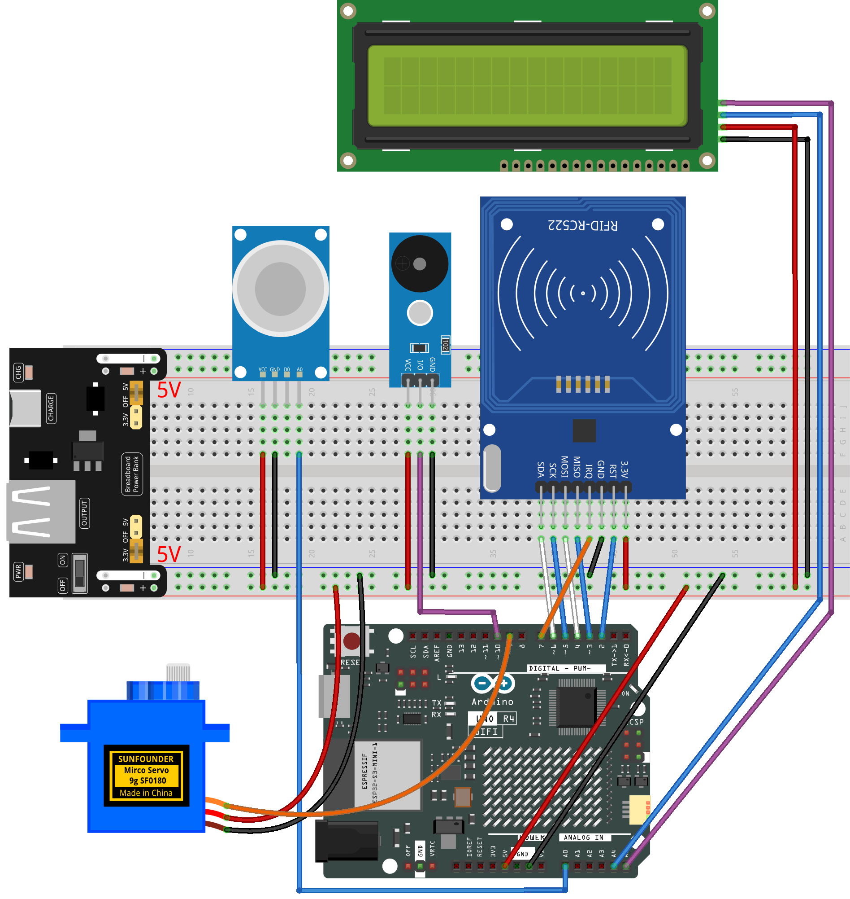

.. _rfid_access6.0_:

RFID Access6.0
==============================================================

.. note::
  
  🌟 Welcome to the SunFounder Facebook Community! Whether you're into Raspberry Pi, Arduino, or ESP32, you'll find inspiration, help ideas here.
   
  - ✅ Be the first to get free learning resources. 
   
  - ✅ Stay updated on new products & exclusive giveaways. 
   
  - ✅ Share your creations and get real feedback.
   
  * 👉 Need faster updates or support? Click [|link_sf_facebook|] join our Facebook community 

  * 👉 Or join our WhatsApp group: Click [|link_sf_whatsapp|]
   
  * 🎁 Looking for parts?Check out our all-in-one kits below — packed with components, beginner-friendly guides, and tons of fun.
  
  .. list-table::
    :widths: 20 20 20
    :header-rows: 1

    *   - Name	
        - Arduino board
        - PURCHASE LINK
    *   - Elite Explorer Kit
        - Arduino Uno R4 WiFi
        - |link_elite_buy|
    *   - Ultimate Starter Kit for Arduino Mega 2560
        - Arduino Mega 2560
        - |link_mega_2560_kit_buy|

Course Introduction
------------------------

In this lesson, we’ll build a 6.0 access-control system using the MFRC522 module, a digital servo motor, buzzer module, and gas sensor module. 

.. raw:: html

  <iframe width="700" height="394" src="https://www.youtube.com/embed/OzJ6BnD71k8?si=lDNmW0rSUuvWXnRn" title="YouTube video player" frameborder="0" allow="accelerometer; autoplay; clipboard-write; encrypted-media; gyroscope; picture-in-picture; web-share" referrerpolicy="strict-origin-when-cross-origin" allowfullscreen></iframe>

.. note::

  If this is your first time working with an Arduino project, we recommend downloading and reviewing the basic materials first.
  
  * :ref:`install_arduino`
  * :ref:`introduce_arduino`

**Required Components**

In this project, we need the following components:

.. list-table::
    :widths: 5 20 5 20
    :header-rows: 1

    *   - SN
        - COMPONENT INTRODUCTION	
        - QUANTITY
        - PURCHASE LINK

    *   - 1
        - Arduino UNO R4 Minima/Arduino UNO R4 WIFI
        - 1
        - |link_unor4_buy|
    *   - 2
        - USB Type-C cable
        - 1
        - 
    *   - 3
        - Breadboard
        - 1
        - |link_breadboard_buy|
    *   - 4
        - Wires
        - Several
        - |link_wires_buy|
    *   - 5
        - MQ-2 Gas Sensor Module
        - 1
        - |link_gas_leak_buy|
    *   - 6
        - Buzzer Modudle
        - 1
        - |link_buzzer_module_buy|
    *   - 7
        - MFRC522 Module
        - 1
        - |link_mfrc522_module_buy|
    *   - 8
        - Power Supply Module
        - 1
        - |link_power_buy|
    *   - 9
        - Digital Servo Motor
        - 1
        - |link_motor_buy|
    *   - 10
        - I2C LCD 1602
        - 1
        - |link_i2clcd1602_buy|

**Wiring**

**Common Connections:**

* **MFRC522 Module**

  - **IRQ:** Connect to **7** on the Arduino.
  - **SDA:** Connect to **6** on the Arduino.
  - **SCK:** Connect to **5** on the Arduino.
  - **MOSI:** Connect to **4** on the Arduino.
  - **MISO:** Connect to **3** on the Arduino.
  - **GND:** Connect to breadboard’s negative power bus.
  - **RST:** Connect to **2** on the Arduino.
  - **3.3V:** Connect to breadboard’s passive power bus.

* **MQ-2 Gas Sensor Module**

  - **A0:** Connect to **A0** on the Arduino.
  - **GND:** Connect to breadboard’s negative power bus.
  - **VCC:** Connect to breadboard’s red power bus.

* **Buzzer Module**

  - **I/0:** Connect to **10** on the Arduino.
  - **＋:** Connect to breadboard’s red power bus. 
  - **－:** Connect to breadboard’s negative power bus.

* **Digital Servo Motor**

  - Connect to breadboard’s positive power bus.
  - Connect to breadboard’s negative power bus.
  - Connect to  **9** on the Arduino.

* **I2C LCD 1602**

  - **SDA:** Connect to **A4** on the Arduino.
  - **SCL:** Connect to **A5** on the Arduino.
  - **GND:** Connect to breadboard’s negative power bus.
  - **VCC:** Connect to breadboard’s red power bus.

**Writing the Code**

.. note::

    * You can copy this code into **Arduino IDE**. 
    * The ``RFID1`` library is used here. You can click here :download:`RFID1.zip </_static/RFID1.zip>` to download it.
    * Don't forget to select the board(Arduino UNO R4 WIFI) and the correct port before clicking the **Upload** button.

.. code-block:: arduino

      #include <rfid1.h>
      #include <Servo.h>
      #include <LiquidCrystal_I2C.h>

      #define ID_LEN 4    // Length of the RFID UID (4 bytes)

      RFID1 rfid;
      Servo myServo;
      LiquidCrystal_I2C lcd(0x27, 16, 2);  // Change 0x27 → 0x3F if screen is blank

      // ==== Pin Setup ====
      const int servoPin  = 9;   // Servo signal pin
      const int buzzerPin = 10;  // Passive buzzer pin
      const int smokePin  = A0;  // Analog input from the smoke sensor

      // ==== Authorized RFID Card UID (change to your own card) ====
      uchar userId[ID_LEN] = {0x33, 0xF8, 0xB8, 0x1A};
      uchar userIdRead[ID_LEN];   // Temporary buffer to store scanned UID

      // ==== System State Flags ====
      bool cardAction       = false;       // True while the door is opening/closing after valid card
      unsigned long cardTimer = 0;         // Timer for keeping the door open

      bool smokeAlert       = false;       // True when smoke level > threshold
      bool smokeRecovering  = false;       // True when smoke just dropped below threshold, buffer period
      unsigned long smokeRecoverStart = 0; // Timer for smoke recovery delay

      int smokeValue = 0;                  // Current sensor reading
      const int smokeThreshold = 200;      // Smoke alarm trigger threshold

      // ==== Servo Control Values ====
      int targetPos  = 0;  // Desired servo angle (0° or 90°)
      int currentPos = 0;  // Incrementally updated servo position

      // ==== LCD Page Lock ====
      String lcdState = "";  // Stores the name of the current LCD page

      // ======================= SERVO CONTROL =======================
      void setServoAngle(int angle) {
        targetPos = constrain(angle, 0, 90);
      }

      void servoSmoothRun() {
        // Move the servo slowly, step-by-step (non-blocking)
        static unsigned long lastStep = 0;
        if (millis() - lastStep >= 15) {  // Move every 15 ms
          lastStep = millis();
          if (currentPos < targetPos) currentPos++;
          else if (currentPos > targetPos) currentPos--;
          myServo.write(currentPos);
        }
      }

      // ======================= BUZZER =======================
      void beepShort() {
        tone(buzzerPin, 2000);
        delay(80);
        noTone(buzzerPin);
      }

      void beepDenied() {
        for (int i = 0; i < 4; i++) {
          tone(buzzerPin, 1600); delay(100);
          noTone(buzzerPin);     delay(100);
        }
      }

      void beepAlarmNonBlock() {
        // Non-blocking beeping for smoke alarm
        static unsigned long t = 0;
        static bool buz = false;
        if (millis() - t > 120) {
          t = millis();
          buz = !buz;
          if (buz) tone(buzzerPin, 1500);
          else noTone(buzzerPin);
        }
      }

      // ======================= RFID =======================
      void getId() {
        // Read 4 bytes UID into userIdRead[]
        uchar status, str[MAX_LEN];
        status = rfid.anticoll(str);
        if (status == MI_OK) {
          for (int i = 0; i < ID_LEN; i++) userIdRead[i] = str[i];
          rfid.halt();   // Stop reading the same card repeatedly
        }
      }

      bool idVerify() {
        // Compare scanned UID with authorized UID
        for (int i = 0; i < ID_LEN; i++)
          if (userIdRead[i] != userId[i]) return false;
        return true;
      }

      void clearBuffer() {
        // Clear temporary UID storage
        for (int i = 0; i < ID_LEN; i++) userIdRead[i] = 0;
      }

      // ======================= LCD PAGES =======================
      void showNormal() {
        lcdState = "normal";
        lcd.clear();
        lcd.setCursor(0, 0); lcd.print("Door: Locked");
        lcd.setCursor(0, 1); lcd.print("Please Tap Card");
      }

      void showAccessGranted() {
        lcdState = "grant";
        lcd.clear();
        lcd.setCursor(0, 0); lcd.print("Access Granted");
        lcd.setCursor(0, 1); lcd.print("Welcome!");
      }

      void showAccessDenied() {
        lcdState = "denied";
        lcd.clear();
        lcd.setCursor(0, 0); lcd.print("Access Denied");
        lcd.setCursor(0, 1); lcd.print("Try Again!");
      }

      void showSmokeWarning() {
        if (lcdState != "smoke") {
          lcdState = "smoke";
          lcd.clear();
          lcd.setCursor(0, 1); lcd.print("Run Away!!!");
        }
        lcd.setCursor(0, 0); lcd.print("Smoke: ");
        lcd.print(smokeValue);
        lcd.print("   "); // Clear leftover digits
      }

      // ======================= SETUP =======================
      void setup() {
        rfid.begin(7, 5, 4, 3, 6, 2);  // RFID pins (library specific)
        rfid.init();

        pinMode(buzzerPin, OUTPUT);
        myServo.attach(servoPin);

        myServo.write(0);  // Start fully closed
        currentPos = 0;
        targetPos  = 0;

        lcd.init();
        lcd.backlight();
        showNormal();
      }

      // ======================= MAIN LOOP =======================
      void loop() {

        smokeValue = analogRead(smokePin);  // Read smoke sensor value

        // ===== RFID Door Flow =====
        if (cardAction) {
          if (currentPos < 90) {          // Opening door
            servoSmoothRun();
          } else {                        // Door fully open → hold 1.5 seconds
            if (cardTimer == 0) cardTimer = millis();
            if (millis() - cardTimer >= 1500) {
              setServoAngle(0);           // Start closing
            }
            servoSmoothRun();
          }
        }

        // ===== After Servo Fully Closed → Clear State & Restore LCD =====
        if (!smokeAlert && currentPos <= 3 && targetPos == 0 && lcdState != "normal") {
          cardAction = false;     // FIX: allow second unlock!
          cardTimer  = 0;         // Reset timer
          lcdState   = "";        // Unlock LCD state
          showNormal();           // Main screen
        }

        // ===== Smoke Detection =====
        bool allowRFID = true;  // Disabled when smoke detected

        if (smokeValue > smokeThreshold) {
          smokeAlert      = true;
          smokeRecovering = false;
          setServoAngle(90);      // Safety: force door open
          beepAlarmNonBlock();
          showSmokeWarning();
          allowRFID = false;
        }
        else {
          if (smokeAlert) {
            // Smoke dropped → enter recovery buffer 1.5 seconds
            if (!smokeRecovering) {
              smokeRecovering = true;
              smokeRecoverStart = millis();
            }
            if (millis() - smokeRecoverStart < 1500) {
              beepAlarmNonBlock();
              showSmokeWarning();
              allowRFID = false;
            } 
            else {
              // Smoke cleared → close door
              smokeAlert       = false;
              smokeRecovering  = false;
              setServoAngle(0);
              noTone(buzzerPin);
              allowRFID = true;
            }
          }
        }

        // ===== RFID Scan =====
        if (allowRFID && !cardAction) {
          uchar status, str[MAX_LEN];
          status = rfid.request(PICC_REQIDL, str);

          if (status == MI_OK) {
            getId();

            if (idVerify()) {            // Authorized card
              beepShort();
              showAccessGranted();
              setServoAngle(90);
              cardAction = true;
              cardTimer  = 0;
            } 
            else {                       // Unauthorized card
              showAccessDenied();
              beepDenied();
              delay(800);
              showNormal();
            }
            clearBuffer();
          }
        }

        // Keep servo moving smoothly
        servoSmoothRun();
      }
