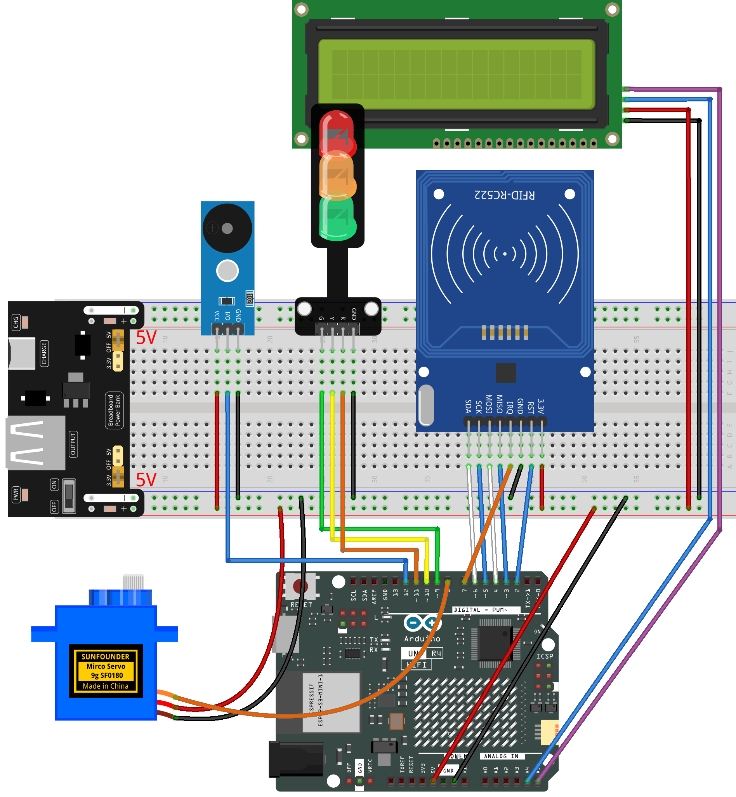

.. _rfid_access8.0_:

RFID Access8.0
==============================================================

.. note::
  
  🌟 Welcome to the SunFounder Facebook Community! Whether you're into Raspberry Pi, Arduino, or ESP32, you'll find inspiration, help ideas here.
   
  - ✅ Be the first to get free learning resources. 
   
  - ✅ Stay updated on new products & exclusive giveaways. 
   
  - ✅ Share your creations and get real feedback.
   
  * 👉 Need faster updates or support? Click [|link_sf_facebook|] join our Facebook community 

  * 👉 Or join our WhatsApp group: Click [|link_sf_whatsapp|]
   
  * 🎁 Looking for parts?Check out our all-in-one kits below — packed with components, beginner-friendly guides, and tons of fun.
  
  .. list-table::
    :widths: 20 20 20
    :header-rows: 1

    *   - Name	
        - Arduino board
        - PURCHASE LINK
    *   - Elite Explorer Kit
        - Arduino Uno R4 WiFi
        - |link_elite_buy|
    *   - Ultimate Starter Kit for Arduino Mega 2560
        - Arduino Mega 2560
        - |link_mega_2560_kit_buy|

Course Introduction
------------------------

In this lesson, we’ll build a 8.0 access-control system using the MFRC522 module, I2C LCD, a digital servo motor, buzzer module, traffic light. 

.. raw:: html

  <iframe width="700" height="394" src="https://www.youtube.com/embed/iZJJDMygGDQ?si=F1lCHsxbb2v4GYrc" title="YouTube video player" frameborder="0" allow="accelerometer; autoplay; clipboard-write; encrypted-media; gyroscope; picture-in-picture; web-share" referrerpolicy="strict-origin-when-cross-origin" allowfullscreen></iframe>

.. note::

  If this is your first time working with an Arduino project, we recommend downloading and reviewing the basic materials first.
  
  * :ref:`install_arduino`
  * :ref:`introduce_arduino`

**Required Components**

In this project, we need the following components:

.. list-table::
    :widths: 5 20 5 20
    :header-rows: 1

    *   - SN
        - COMPONENT INTRODUCTION	
        - QUANTITY
        - PURCHASE LINK

    *   - 1
        - Arduino UNO R4 Minima/Arduino UNO R4 WIFI
        - 1
        - |link_unor4_wifi_buy|
    *   - 2
        - USB Type-C cable
        - 1
        - 
    *   - 3
        - Breadboard
        - 1
        - |link_breadboard_buy|
    *   - 4
        - Wires
        - Several
        - |link_wires_buy|
    *   - 5
        - Traffic Light LED
        - 1
        - |link_trafficlinght_buy|
    *   - 6
        - Buzzer Modudle
        - 1
        - |link_buzzer_module_buy|
    *   - 7
        - MFRC522 Module
        - 1
        - |link_mfrc522_module_buy|
    *   - 8
        - Power Supply Module
        - 1
        - |link_power_buy|
    *   - 9
        - Digital Servo Motor
        - 1
        - |link_motor_buy|
    *   - 10
        - I2C LCD 1602
        - 1
        - |link_i2clcd1602_buy|

**Wiring**

**Common Connections:**

* **MFRC522 Module**

  - **IRQ:** Connect to **7** on the ESP32.
  - **SDA:** Connect to **6** on the ESP32.
  - **SCK:** Connect to **5** on the ESP32.
  - **MOSI:** Connect to **4** on the ESP32.
  - **MISO:** Connect to **3** on the ESP32.
  - **GND:** Connect to breadboard’s negative power bus.
  - **RST:** Connect to **2** on the ESP32.
  - **3.3V:** Connect to breadboard’s passive power bus.

* **Traffic light LED**

  - **R:** Connect to **11** on the Arduino.
  - **Y:** Connect to **10** on the Arduino.
  - **G:** Connect to **9** on the Arduino.
  - **GND:** Connect to breadboard’s negative power bus.

* **Buzzer Module**

  - **I/0:** Connect to **12** on the Arduino.
  - **＋:** Connect to breadboard’s red power bus. 
  - **－:** Connect to breadboard’s negative power bus.

* **Digital Servo Motor**

  - Connect to breadboard’s positive power bus.
  - Connect to breadboard’s negative power bus.
  - Connect to  **8** on the Arduino.

* **I2C LCD 1602**

  - **SDA:** Connect to **A4** on the Arduino.
  - **SCL:** Connect to **A5** on the Arduino.
  - **GND:** Connect to breadboard’s negative power bus.
  - **VCC:** Connect to breadboard’s red power bus.

**Writing the Code**

.. note::

    * You can copy this code into **Arduino IDE**. 
    * The ``RFID1`` library is used here. You can click here :download:`RFID1.zip </_static/RFID1.zip>` to download it.
    * Don't forget to select the board(Arduino UNO R4 WIFI) and the correct port before clicking the **Upload** button.

.. code-block:: arduino

      #include <rfid1.h>
      #include <Servo.h>
      #include <LiquidCrystal_I2C.h>

      #define ID_LEN 4   // Length of the RFID card UID (4 bytes)

      RFID1 rfid;                         
      Servo myServo;
      LiquidCrystal_I2C lcd(0x27, 16, 2);  // I2C LCD (address 0x27, 16 columns, 2 rows)

      // Pin definitions
      const int servoPin  = 8;
      const int buzzerPin = 12;

      const int greenPin  = 9;
      const int yellowPin = 10;
      const int redPin    = 11;

      // Authorized card UID (modify to your own card)
      uchar userId[ID_LEN] = {0x33, 0xF8, 0xB8, 0x1A};
      uchar userIdRead[ID_LEN];

      int currentPos = 0;     // Current servo angle
      int targetPos  = 0;     // Target servo angle

      bool busy = false;      // Prevents scanning while gate animation plays

      // Smoothly move the servo toward the target angle
      void setServoAngle(int angle) {
        targetPos = constrain(angle, 0, 90);
      }

      bool servoSmoothRun() {
        static unsigned long lastStep = 0;

        // Update every 15 ms for smooth movement
        if (millis() - lastStep >= 15) {
          lastStep = millis();

          if (currentPos < targetPos) currentPos++;
          else if (currentPos > targetPos) currentPos--;
          else return true;  // Movement completed

          myServo.write(currentPos);
        }
        return false;
      }

      // Default LCD interface
      void showNormal() {
        lcd.clear();
        lcd.setCursor(0,0); lcd.print("Gate Locked");
        lcd.setCursor(0,1); lcd.print("Tap Your Card");
      }

      // Short beep for authorized card
      void beepShort() {
        tone(buzzerPin, 1800);
        delay(80);
        noTone(buzzerPin);
      }

      // Softer beep for denied card
      void beepDeniedSoft() {
        tone(buzzerPin, 1200);
        delay(60);
        noTone(buzzerPin);
      }

      // Read RFID UID
      void getId() {
        uchar status, str[MAX_LEN];
        status = rfid.anticoll(str);
        if (status == MI_OK) {
          for (int i = 0; i < ID_LEN; i++)
            userIdRead[i] = str[i];
          rfid.halt();
        }
      }

      // Compare scanned UID to authorized UID
      bool idVerify() {
        for (int i = 0; i < ID_LEN; i++)
          if (userIdRead[i] != userId[i]) return false;
        return true;
      }

      void clearBuffer() {
        for (int i = 0; i < ID_LEN; i++)
          userIdRead[i] = 0;
      }

      // Authorized card behavior
      void authorizedSequence() {
        busy = true;

        beepShort();
        lcd.clear();
        lcd.setCursor(0,0); lcd.print("Access Granted");
        lcd.setCursor(0,1); lcd.print("Please Pass");

        digitalWrite(redPin, LOW);
        digitalWrite(greenPin, LOW);
        digitalWrite(yellowPin, LOW);

        // Open gate
        setServoAngle(90);
        while (true) {
          bool done = servoSmoothRun();

          // Yellow blinking during opening
          static unsigned long t = 0;
          if (millis() - t >= 150) {
            t = millis();
            digitalWrite(yellowPin, !digitalRead(yellowPin));
          }
          if (done) break;
        }

        digitalWrite(yellowPin, LOW);
        digitalWrite(greenPin, HIGH);  // Green ON
        delay(1000);                   // Wait 1 second

        // Close gate
        setServoAngle(0);
        digitalWrite(greenPin, LOW);

        while (true) {
          bool done = servoSmoothRun();

          // Yellow blinking during closing
          static unsigned long t2 = 0;
          if (millis() - t2 >= 150) {
            t2 = millis();
            digitalWrite(yellowPin, !digitalRead(yellowPin));
          }
          if (done) break;
        }

        digitalWrite(yellowPin, LOW);
        digitalWrite(redPin, HIGH);  // Red ON (locked)

        showNormal();
        busy = false;
      }

      // Denied card behavior — Version B (LED first → then sound)
      void deniedSequence() {
        busy = true;

        lcd.clear();
        lcd.setCursor(0,0); lcd.print("Access Denied");
        lcd.setCursor(0,1); lcd.print("No Entry");

        // Flash 4 times
        for (int i = 0; i < 4; i++) {

          // LED ON first (visual priority)
          digitalWrite(redPin, HIGH);
          delay(80);

          // Then beep (sound follows light)
          tone(buzzerPin, 1200);
          delay(80);
          noTone(buzzerPin);

          // LED OFF
          digitalWrite(redPin, LOW);
          delay(80);
        }

        // Keep red ON after flashing
        digitalWrite(redPin, HIGH);

        delay(500);  // Keep LCD message visible

        showNormal();
        busy = false;
      }

      // =============================
      // setup()
      // Runs once at startup
      // =============================
      void setup() {

        // Initialize RFID module (pins depend on library)
        rfid.begin(7,5,4,3,6,2);
        rfid.init();

        // Attach servo to pin
        myServo.attach(servoPin);

        // Set pin modes
        pinMode(buzzerPin, OUTPUT);
        pinMode(greenPin, OUTPUT);
        pinMode(yellowPin, OUTPUT);
        pinMode(redPin, OUTPUT);

        // Start with gate fully closed
        myServo.write(0);
        currentPos = 0;
        targetPos = 0;

        // Initialize LCD screen
        lcd.init();
        lcd.backlight();
        showNormal();  // Display idle screen

        // Default traffic light state
        digitalWrite(redPin, HIGH);   // Gate locked
      }

      // =============================
      // loop()
      // Main program — runs forever
      // =============================
      void loop() {

        // If gate animation is running, ignore card scanning
        if (busy) return;

        // Check for RFID card
        uchar status, str[MAX_LEN];
        status = rfid.request(PICC_REQIDL, str);

        // Card detected
        if (status == MI_OK) {
          getId();

          // Authorized card
          if (idVerify()) {
            clearBuffer();
            authorizedSequence();
          }
          // Unauthorized card
          else {
            clearBuffer();
            deniedSequence();
          }
        }
      }
