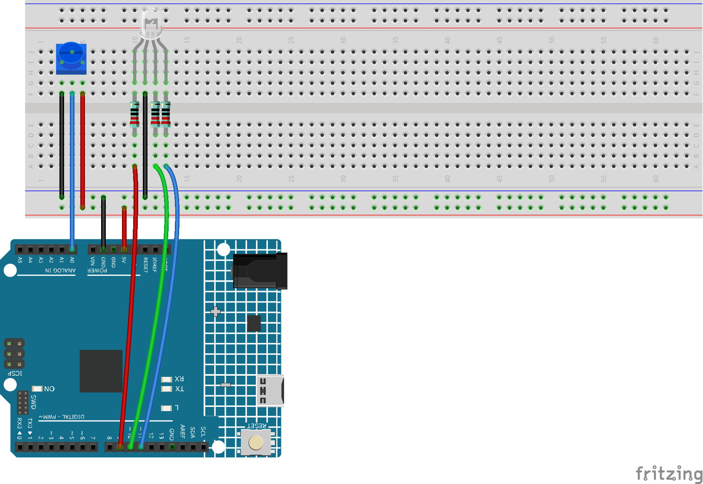

.. _rgb_controll:

RGB Controll
==============================================================

.. note::
  
  🌟 Welcome to the SunFounder Facebook Community! Whether you're into Raspberry Pi, Arduino, or ESP32, you'll find inspiration, help ideas here.
   
  - ✅ Be the first to get free learning resources. 
   
  - ✅ Stay updated on new products & exclusive giveaways. 
   
  - ✅ Share your creations and get real feedback.
   
  * 👉 Need faster updates or support? Click [|link_sf_facebook|] join our Facebook community 

  * 👉 Or join our WhatsApp group: Click [|link_sf_whatsapp|]
   
Kit purchase
------------------------

Looking for parts? Check out our all-in-one kits below — packed with components, beginner-friendly guides, and tons of fun.

.. image:: img/elite_explore_kit.png
   :width: 100%
   :align: center
   :target: https://www.sunfounder.com/collections/arduino-kits-bundles/products/sunfounder-elite-explorer-kit-with-official-arduino-uno-r4-wifi?ref=jbzmncle

.. raw:: html

     

.. list-table::
   :widths: 20 20 20
   :header-rows: 1

   * - Name
     - Includes Arduino board
     - PURCHASE LINK
   * - Elite Explorer Kit
     - Arduino Uno R4 WiFi
     - |link_elite_buy|
   * - Inventor Lab Kit
     - Arduino Uno R3
     - |link_inventorkit_buy|

Course Introduction
------------------------

In this lesson, you’ll learn how to use a potentiometer with the Arduino UNO R4 to control an RGB LED. 

As you turn the knob, the LED color smoothly transitions through red, yellow, green, and blue, creating a dynamic color blending effect.

.. raw:: html

  <iframe width="700" height="394" src="https://www.youtube.com/embed/Pl0YdiJNR9s?si=zPCK-daRX-_9uIbx" title="YouTube video player" frameborder="0" allow="accelerometer; autoplay; clipboard-write; encrypted-media; gyroscope; picture-in-picture; web-share" referrerpolicy="strict-origin-when-cross-origin" allowfullscreen></iframe>

.. note::

  If this is your first time working with an Arduino project, we recommend downloading and reviewing the basic materials first.
  
  * :ref:`install_arduino`
  * :ref:`introduce_arduino`

**Required Components**

In this project, we need the following components:

.. list-table::
    :widths: 5 20 5 20
    :header-rows: 1

    *   - SN
        - COMPONENT INTRODUCTION	
        - QUANTITY
        - PURCHASE LINK

    *   - 1
        - Arduino UNO R4 Minima/Arduino UNO R4 WIFI
        - 1
        - |link_arduinor4_buy|
    *   - 2
        - USB Type-C cable
        - 1
        - 
    *   - 3
        - Breadboard
        - 1
        - |link_breadboard_buy|
    *   - 4
        - Wires
        - Several
        - |link_wires_buy|
    *   - 5
        - Potentiometer
        - 1
        - |link_potentiometer_buy|
    *   - 6
        - RGB LED
        - 1
        - |link_rgbled_buy|

**Wiring**

**Common Connections:**

* **RGB LED**

  - **R:** Connect to **9** on the Arduino.
  - **Y:** Connect to **10** on the Arduino.
  - **G:** Connect to **11** on the Arduino.
  - **GND:** Connect to breadboard’s negative power bus.

* **Potentiometer**

  - **OUT:** Connect to **A0** on the Arduino.
  - **GND:** Connect to breadboard’s negative power bus.
  - **VCC:** Connect to breadboard’s red power bus.

**Writing the Code**

.. note::

    * You can copy this code into **Arduino IDE**. 
    * Don't forget to select the board(Arduino UNO R4 Minima/WIFI) and the correct port before clicking the **Upload** button.

.. code-block:: arduino

    // RGB LED pins
    const int redPin = 9;
    const int greenPin = 10;
    const int bluePin = 11;

    // Potentiometer pin
    const int potPin = A0;

    void setup() {
      pinMode(redPin, OUTPUT);
      pinMode(greenPin, OUTPUT);
      pinMode(bluePin, OUTPUT);
      Serial.begin(9600);
    }

    void loop() {
      // Read potentiometer value (0–1023)
      int potValue = analogRead(potPin);
      Serial.println(potValue);

      // Map the potentiometer value to 0–765 range for color blending
      int range = map(potValue, 0, 1023, 0, 765);

      int r = 0, g = 0, b = 0;

      // Blend RGB colors based on range
      if (range <= 255) {
        r = 255;
        g = range;
        b = 0;
      } else if (range <= 510) {
        r = 510 - range;
        g = 255;
        b = range - 255;
      } else {
        r = 0;
        g = 765 - range;
        b = 255;
      }

      // Set RGB LED color
      analogWrite(redPin, 255 - r);   // Inverted for common cathode
      analogWrite(greenPin, 255 - g);
      analogWrite(bluePin, 255 - b);

      delay(20);
    }
