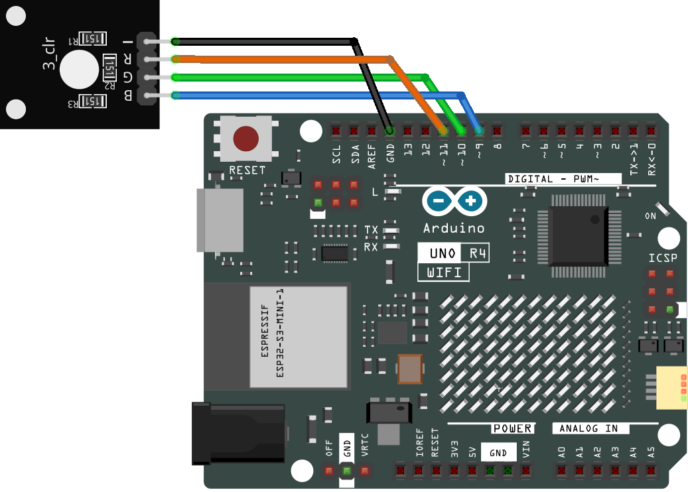

.. _rgb_module:

RGB Module
==============================================================

.. note::
  
  🌟 Welcome to the SunFounder Facebook Community! Whether you're into Raspberry Pi, Arduino, or ESP32, you'll find inspiration, help ideas here.
   
  - ✅ Be the first to get free learning resources. 
   
  - ✅ Stay updated on new products & exclusive giveaways. 
   
  - ✅ Share your creations and get real feedback.
   
  * 👉 Need faster updates or support? Click [|link_sf_facebook|] join our Facebook community 

  * 👉 Or join our WhatsApp group: Click [|link_sf_whatsapp|]
   
Kit purchase
------------------------

Looking for parts? Check out our all-in-one kits below — packed with components, beginner-friendly guides, and tons of fun.

.. image:: img/ultimate_sensor_kit.png
   :width: 100%
   :align: center
   :target: https://www.sunfounder.com/collections/arduino-kits-bundles/products/sunfounder-ultimate-sensor-kit-with-original-arduino-uno-r4-minima?ref=jbzmncle

.. raw:: html

     

.. list-table::
   :widths: 20 20 20
   :header-rows: 1

   * - Name
     - Includes Arduino board
     - PURCHASE LINK
   * - Elite Explorer Kit
     - Arduino Uno R4 WiFi
     - |link_elite_buy|
   * - 3 in 1 Ultimate Starter Kit
     - Arduino Uno R4 Minima
     - |link_arduinor4_buy|

Course Introduction
------------------------

In this lesson, we will learn how to use the RGB LED Module with Arduino.

.. .. raw:: html

..  <iframe width="700" height="394" src="https://www.youtube.com/embed/itvyQ4JMRbU?si=e2y2_PAK3W2yfU3D" title="YouTube video player" frameborder="0" allow="accelerometer; autoplay; clipboard-write; encrypted-media; gyroscope; picture-in-picture; web-share" referrerpolicy="strict-origin-when-cross-origin" allowfullscreen></iframe>

.. note::

  If this is your first time working with an Arduino project, we recommend downloading and reviewing the basic materials first.
  
  * :ref:`install_arduino`
  * :ref:`introduce_arduino`

**Required Components**

In this project, we need the following components:

.. list-table::
    :widths: 5 20 5 20
    :header-rows: 1

    *   - SN
        - COMPONENT INTRODUCTION	
        - QUANTITY
        - PURCHASE LINK

    *   - 1
        - Arduino UNO R4 Minima
        - 1
        - |link_unor4_buy|
    *   - 2
        - USB Type-C cable
        - 1
        - 
    *   - 3
        - Breadboard
        - 1
        - |link_breadboard_buy|
    *   - 4
        - Wires
        - Several
        - |link_wires_buy|
    *   - 5
        - RGB LED Module
        - 1
        - |link_rgb_buy|

**Wiring**

**Common Connections:**

* **RGB LED Module**

  - **R:** Connect to **11** on the Arduino.
  - **G:** Connect to **10** on the Arduino.
  - **B:** Connect to **9** on the Arduino.
  - **-:** Connect to **GND** on the Arduino.

**Writing the Code**

.. note::

    * You can copy this code into **Arduino IDE**. 
    * Don't forget to select the board(Arduino UNO R4 Minima) and the correct port before clicking the **Upload** button.

.. code-block:: arduino

    /*
      This code initializes an RGB LED module and displays the primary colors of red, green, and blue. 
      It then proceeds to display the seven colors of the rainbow in sequence.
      
      Board: Arduino Uno R3 (or R4)
      Component: RGB LED module
    */

    // Pin numbers for each color channel
    const int rledPin = 11;  // pin connected to the red color channel
    const int gledPin = 10;  // pin connected to the green color channel
    const int bledPin = 9;   // pin connected to the blue color channel

    void setup() {
      pinMode(rledPin, OUTPUT);
      pinMode(gledPin, OUTPUT);
      pinMode(bledPin, OUTPUT);
    }

    void loop() {
    setColor(255, 0, 0);  // Set RGB LED color to red
    delay(1000);
    setColor(0, 255, 0);  // Set RGB LED color to green
    delay(1000);
    setColor(0, 0, 255);  // Set RGB LED color to blue
    delay(1000);

    // Display the colors of the rainbow
    setColor(255, 0, 0);  // Set RGB LED color to red
    delay(1000);
    setColor(255, 165, 0);  // Set RGB LED color to orange
    delay(1000);
    setColor(255, 255, 0);  // Set RGB LED color to yellow
    delay(1000);
    setColor(0, 128, 0);  // Set RGB LED color to green
    delay(1000);
    setColor(0, 0, 255);  // Set RGB LED color to blue
    delay(1000);
    setColor(75, 0, 130);  // Set RGB LED color to indigo
    delay(1000);
    setColor(230, 130, 238);  // Set RGB LED color to violet
    delay(1000);
    }

    void setColor(int R, int G, int B) {
      // Set the intensity of the red color channel
      analogWrite(rledPin, R);  
      // Set the intensity of the green color channel
      analogWrite(gledPin, G);  
      // Set the intensity of the blue color channel
      analogWrite(bledPin, B);  
    }