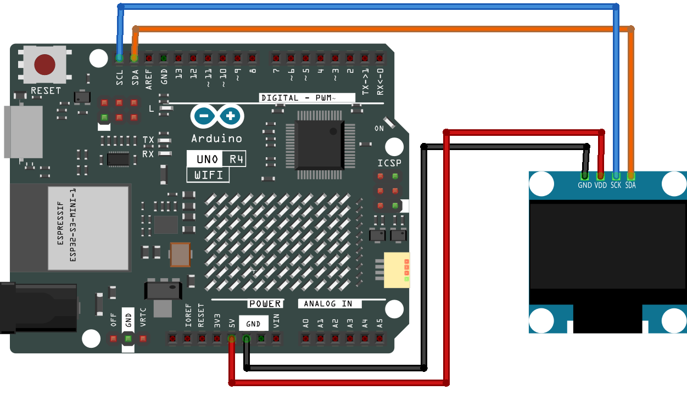

.. _roboeyes_1.0:

RoboEyes 1.0
==============================================================

.. note::
  
  🌟 Welcome to the SunFounder Facebook Community! Whether you're into Raspberry Pi, Arduino, or ESP32, you'll find inspiration, help ideas here.
   
  - ✅ Be the first to get free learning resources. 
   
  - ✅ Stay updated on new products & exclusive giveaways. 
   
  - ✅ Share your creations and get real feedback.
   
  * 👉 Need faster updates or support? Click [|link_sf_facebook|] join our Facebook community 

  * 👉 Or join our WhatsApp group: Click [|link_sf_whatsapp|]
   
Kit purchase
------------------------

Looking for parts? Check out our all-in-one kits below — packed with components, beginner-friendly guides, and tons of fun.

.. image:: img/elite_explore_kit.png
   :width: 100%
   :align: center
   :target: https://www.sunfounder.com/collections/arduino-kits-bundles/products/sunfounder-elite-explorer-kit-with-official-arduino-uno-r4-wifi?ref=jbzmncle

.. raw:: html

     

.. list-table::
   :widths: 20 20 20
   :header-rows: 1

   * - Name
     - Includes Arduino board
     - PURCHASE LINK
   * - Ultimate Sensor Kit
     - Arduino Uno R4 Minima
     - |link_ultimate_sensor_buy|
   * - Elite Explorer Kit
     - Arduino Uno R4 WiFi
     - |link_elite_buy|
   * - 3 in 1 Ultimate Starter Kit
     - Arduino Uno R4 Minima
     - |link_arduinor4_buy|
   * - Universal Maker Sensor Kit
     - ×
     - |link_umsk_buy|

Course Introduction
------------------------

In this lesson, we’ll create animated robot eyes using an SSD1306 OLED Display and the RoboEyes library with Arduino.

The OLED eyes will automatically blink, switch between different expressions, and look in multiple directions to create a lively robot face.

.. .. raw:: html

..  <iframe width="700" height="394" src="https://www.youtube.com/embed/7pZ717-XMPE" title="YouTube video player" frameborder="0" allow="accelerometer; autoplay; clipboard-write; encrypted-media; gyroscope; picture-in-picture; web-share" referrerpolicy="strict-origin-when-cross-origin" allowfullscreen></iframe>

.. note::

  If this is your first time working with an Arduino project, we recommend downloading and reviewing the basic materials first.

  * :ref:`install_arduino`
  * :ref:`introduce_arduino`

**Required Components**

In this project, we need the following components:

.. list-table::
    :widths: 5 20 5 20
    :header-rows: 1

    *   - SN
        - COMPONENT INTRODUCTION	
        - QUANTITY
        - PURCHASE LINK

    *   - 1
        - Arduino UNO R4 WIFI
        - 1
        - |link_unor4_wifi_buy|
    *   - 2
        - USB Type-C cable
        - 1
        - 
    *   - 3
        - Breadboard
        - 1
        - |link_breadboard_buy|
    *   - 4
        - Wires
        - Several
        - |link_wires_buy|
    *   - 5
        - OLED Display Module
        - 1
        - |link_oled_buy|

**Wiring**

**Common Connections:**

* **OLED Display Module**

  - **SDA:** Connect to **A4** on the Arduino.
  - **SCK:** Connect to **A5** on the Arduino.
  - **GND:** Connect to breadboard’s negative power bus.
  - **VCC:** Connect to breadboard’s red power bus.

**Writing the Code**

.. note::

    * You can copy this code into **Arduino IDE**. 
    * To install the library, use the Arduino Library Manager and search for **Adafruit_GFX** and **Adafruit SSD1306** and **FluxGarage_RoboEyes** and install it.
    * Don't forget to select the board(Arduino UNO R4 Minima) and the correct port before clicking the **Upload** button.

.. code-block:: arduino

      #include <Wire.h>
      #include <Adafruit_GFX.h>
      #include <Adafruit_SSD1306.h>
      #include <FluxGarage_RoboEyes.h>

      // Set the OLED screen size and I2C address
      #define SCREEN_WIDTH 128
      #define SCREEN_HEIGHT 64
      #define OLED_RESET -1
      #define OLED_ADDRESS 0x3C

      // Create the OLED display object
      Adafruit_SSD1306 display(
        SCREEN_WIDTH,
        SCREEN_HEIGHT,
        &Wire,
        OLED_RESET
      );

      // Create the RoboEyes object
      RoboEyes<Adafruit_SSD1306> roboEyes(display);

      // Change the animation every 2 seconds
      const unsigned long animationInterval = 2000;
      unsigned long previousMillis = 0;

      // Keep track of the current animation
      int animationStep = 0;

      void setup() {

        // Start the OLED display
        if (!display.begin(SSD1306_SWITCHCAPVCC, OLED_ADDRESS)) {
          while (true);
        }

        // Clear anything already shown on the screen
        display.clearDisplay();
        display.display();

        // Start RoboEyes with a maximum frame rate of 60 FPS
        roboEyes.begin(SCREEN_WIDTH, SCREEN_HEIGHT, 60);

        // Set the size and shape of both eyes
        roboEyes.setWidth(36, 36);
        roboEyes.setHeight(36, 36);
        roboEyes.setBorderradius(8, 8);
        roboEyes.setSpacebetween(10);

        // Blink automatically at slightly random intervals
        roboEyes.setAutoblinker(ON, 3, 2);

        // Start with the normal expression
        roboEyes.setMood(DEFAULT);
        roboEyes.setPosition(DEFAULT);
      }

      void loop() {

        // Update the eyes continuously for smooth animation
        roboEyes.update();

        // Switch to the next animation every 2 seconds
        if (millis() - previousMillis >= animationInterval) {

          previousMillis = millis();

          switch (animationStep) {

            // Show the normal expression
            case 0:
              roboEyes.setMood(DEFAULT);
              roboEyes.setPosition(DEFAULT);
              break;

            // Show a happy expression
            case 1:
              roboEyes.setMood(HAPPY);
              roboEyes.setPosition(DEFAULT);
              break;

            // Show a tired expression
            case 2:
              roboEyes.setMood(TIRED);
              roboEyes.setPosition(DEFAULT);
              break;

            // Show an angry expression
            case 3:
              roboEyes.setMood(ANGRY);
              roboEyes.setPosition(DEFAULT);
              break;

            // Look to the left
            case 4:
              roboEyes.setMood(DEFAULT);
              roboEyes.setPosition(W);
              break;

            // Look to the right
            case 5:
              roboEyes.setPosition(E);
              break;

            // Look upward
            case 6:
              roboEyes.setPosition(N);
              break;

            // Look downward
            case 7:
              roboEyes.setPosition(S);
              break;

            // Play the confused animation
            case 8:
              roboEyes.setMood(DEFAULT);
              roboEyes.setPosition(DEFAULT);
              roboEyes.anim_confused();
              break;

            // Play the laughing animation
            case 9:
              roboEyes.setMood(HAPPY);
              roboEyes.anim_laugh();
              break;
          }

          // Move to the next animation
          animationStep++;

          // Restart after the last animation
          if (animationStep > 9) {
            animationStep = 0;
          }
        }
      }