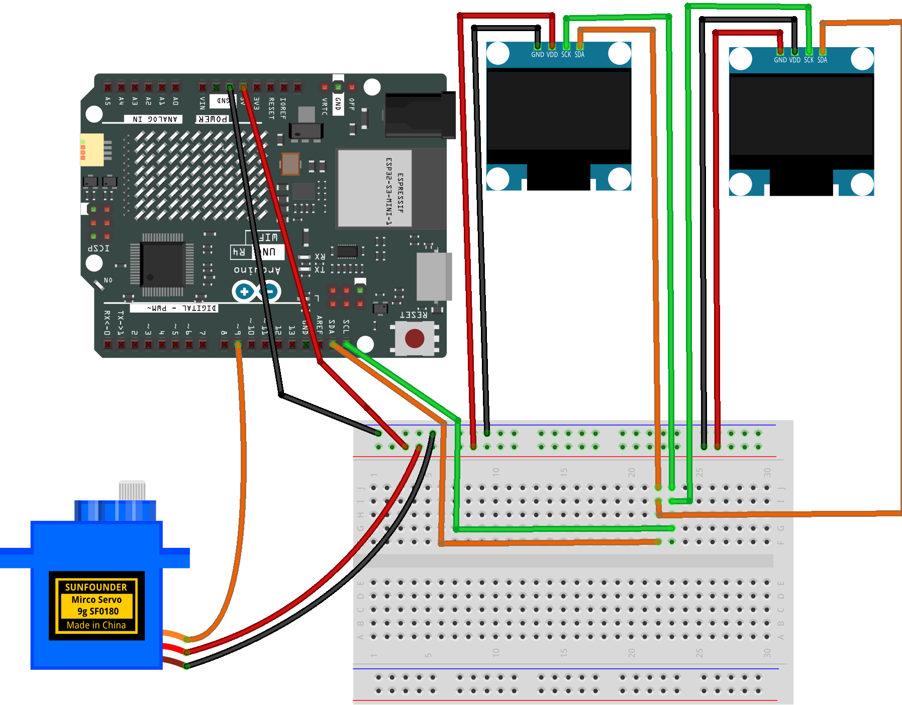

.. _robot_face:

Robot Face
==============================================================

.. note::
  
  🌟 Welcome to the SunFounder Facebook Community! Whether you're into Raspberry Pi, Arduino, or ESP32, you'll find inspiration, help ideas here.
   
  - ✅ Be the first to get free learning resources. 
   
  - ✅ Stay updated on new products & exclusive giveaways. 
   
  - ✅ Share your creations and get real feedback.
   
  * 👉 Need faster updates or support? Click [|link_sf_facebook|] join our Facebook community 

  * 👉 Or join our WhatsApp group: Click [|link_sf_whatsapp|]
   
Kit purchase
------------------------

Looking for parts? Check out our all-in-one kits below — packed with components, beginner-friendly guides, and tons of fun.

.. image:: img/elite_explore_kit.png
   :width: 100%
   :align: center
   :target: https://www.sunfounder.com/collections/arduino-kits-bundles/products/sunfounder-elite-explorer-kit-with-official-arduino-uno-r4-wifi?ref=jbzmncle

.. raw:: html

     

.. list-table::
   :widths: 20 20 20
   :header-rows: 1

   * - Name
     - Includes Arduino board
     - PURCHASE LINK
   * - Ultimate Sensor Kit
     - Arduino Uno R4 Minima
     - |link_ultimate_sensor_buy|
   * - Elite Explorer Kit
     - Arduino Uno R4 WiFi
     - |link_elite_buy|
   * - 3 in 1 Ultimate Starter Kit
     - Arduino Uno R4 Minima
     - |link_arduinor4_buy|
   * - Universal Maker Sensor Kit
     - ×
     - |link_umsk_buy|

Course Introduction
------------------------

This project uses two SSD1306 OLED displays, a servo motor, and an Arduino UNO R4 WiFi to create an animated robot face.

The OLEDs display blinking eyes with moving pupils, while the servo smoothly turns the robot’s head from side to side, creating a lively and expressive robot.

.. .. raw:: html
 
..  <iframe width="700" height="394" src="https://www.youtube.com/embed/8P2FZA5f90E?si=u_6onrcnZY4Xhi4J" title="YouTube video player" frameborder="0" allow="accelerometer; autoplay; clipboard-write; encrypted-media; gyroscope; picture-in-picture; web-share" referrerpolicy="strict-origin-when-cross-origin" allowfullscreen></iframe>

.. note::

  If this is your first time working with an Arduino project, we recommend downloading and reviewing the basic materials first.
  
  * :ref:`install_arduino`
  * :ref:`introduce_arduino`

**Required Components**

In this project, we need the following components:

.. list-table::
    :widths: 5 20 5 20
    :header-rows: 1

    *   - SN
        - COMPONENT INTRODUCTION	
        - QUANTITY
        - PURCHASE LINK

    *   - 1
        - Arduino UNO R4 Minima
        - 1
        - |link_unor4_buy|
    *   - 2
        - USB Type-C cable
        - 1
        - 
    *   - 3
        - Breadboard
        - 1
        - |link_breadboard_buy|
    *   - 4
        - Wires
        - Several
        - |link_wires_buy|
    *   - 5
        - Digital Servo Motor
        - 1
        - |link_motor_buy|
    *   - 6
        - OLED Display Module
        - 2
        - |link_oled_buy|

**Wiring**

**Common Connections:**

* **Digital Servo Motor**

  - Connect to breadboard’s positive power bus.
  - Connect to breadboard’s negative power bus.
  - Connect to **9** on the Arduino.

* **OLED Display Module 1**

  - **SDA:** Connect to **SDA** on the Arduino.
  - **SCK:** Connect to **SCL** on the Arduino.
  - **GND:** Connect to breadboard’s negative power bus.
  - **VCC:** Connect to breadboard’s red power bus.

* **OLED Display Module 2**

  - **SDA:** Connect to **SDA** on the Arduino.
  - **SCK:** Connect to **SCL** on the Arduino.
  - **GND:** Connect to breadboard’s negative power bus.
  - **VCC:** Connect to breadboard’s red power bus.

**Writing the Code**

.. note::

    * You can copy this code into **Arduino IDE**. 
    * To install the library, use the Arduino Library Manager and search for **Adafruit GFX** and **Adafruit SSD1306** and install it.
    * Don't forget to select the board(Arduino UNO R4 Minima/WIFI) and the correct port before clicking the **Upload** button.

.. code-block:: arduino

      /*
        Blinky - Two OLED Robot Face
        Board: Arduino UNO R4 WiFi

        Hardware:
        - 2 x SSD1306 128x64 I2C OLED
        - 1 x Servo

        OLED addresses:
        - Left OLED  : 0x3C
        - Right OLED : 0x3D

        Servo:
        - Signal -> D9
      */

      #include <Wire.h>
      #include <Adafruit_GFX.h>
      #include <Adafruit_SSD1306.h>
      #include <Servo.h>

      // ==============================
      // OLED settings
      // ==============================

      #define SCREEN_WIDTH 128
      #define SCREEN_HEIGHT 64
      #define OLED_RESET -1

      #define LEFT_ADDR  0x3C
      #define RIGHT_ADDR 0x3D

      Adafruit_SSD1306 leftEye(
        SCREEN_WIDTH,
        SCREEN_HEIGHT,
        &Wire,
        OLED_RESET
      );

      Adafruit_SSD1306 rightEye(
        SCREEN_WIDTH,
        SCREEN_HEIGHT,
        &Wire,
        OLED_RESET
      );

      // ==============================
      // Servo settings
      // ==============================

      Servo neck;

      const int NECK_PIN = 9;

      int neckAngle = 90;
      int neckDirection = 1;

      // Neck movement limits
      const int MIN_NECK_ANGLE = 50;
      const int MAX_NECK_ANGLE = 130;

      // ==============================
      // Timing
      // ==============================

      unsigned long lastNeckUpdate = 0;

      const unsigned long NECK_INTERVAL = 30;

      // Blink timing
      unsigned long blinkStartTime = 0;

      bool blinking = false;

      const unsigned long BLINK_DURATION = 150;

      // ==============================
      // Setup
      // ==============================

      void setup() {
        Serial.begin(115200);

        // Start UNO R4 standard I2C
        Wire.begin();

        // Use 400 kHz I2C
        Wire.setClock(400000);

        delay(200);

        // ------------------------------
        // Left OLED
        // ------------------------------

        if (!leftEye.begin(
              SSD1306_SWITCHCAPVCC,
              LEFT_ADDR
            )) {

          Serial.println(
            "Left OLED initialization failed!"
          );

          while (true) {
            delay(100);
          }
        }

        // ------------------------------
        // Right OLED
        // ------------------------------

        if (!rightEye.begin(
              SSD1306_SWITCHCAPVCC,
              RIGHT_ADDR
            )) {

          Serial.println(
            "Right OLED initialization failed!"
          );

          while (true) {
            delay(100);
          }
        }

        Serial.println(
          "Both OLEDs initialized."
        );

        // Clear both displays
        leftEye.clearDisplay();
        rightEye.clearDisplay();

        leftEye.display();
        rightEye.display();

        // ------------------------------
        // Servo
        // ------------------------------

        neck.attach(NECK_PIN);

        neck.write(neckAngle);

        // Random blink timing
        randomSeed(
          analogRead(A0) ^
          micros()
        );

        // Show initial eyes
        drawEyes(0, false);
      }

      // ==============================
      // Main loop
      // ==============================

      void loop() {
        unsigned long currentTime = millis();

        // ------------------------------
        // Update neck
        // ------------------------------

        if (
          currentTime - lastNeckUpdate >=
          NECK_INTERVAL
        ) {
          lastNeckUpdate = currentTime;

          neckAngle += neckDirection;

          // Reverse at movement limits
          if (
            neckAngle >= MAX_NECK_ANGLE
          ) {
            neckAngle =
              MAX_NECK_ANGLE;

            neckDirection = -1;
          }

          else if (
            neckAngle <= MIN_NECK_ANGLE
          ) {
            neckAngle =
              MIN_NECK_ANGLE;

            neckDirection = 1;
          }

          neck.write(neckAngle);

          // Move pupils with neck
          int pupilShift = map(
            neckAngle,
            MIN_NECK_ANGLE,
            MAX_NECK_ANGLE,
            -10,
            10
          );

          // ------------------------------
          // Blink control
          // ------------------------------

          if (!blinking) {

            // Random chance to blink
            if (random(0, 100) < 3) {
              blinking = true;

              blinkStartTime =
                currentTime;
            }
          }

          else {

            if (
              currentTime -
              blinkStartTime >=
              BLINK_DURATION
            ) {
              blinking = false;
            }
          }

          // Draw eyes
          drawEyes(
            pupilShift,
            blinking
          );
        }
      }

      // ==============================
      // Draw both eyes
      // ==============================

      void drawEyes(
        int pupilShift,
        bool blink
      ) {
        leftEye.clearDisplay();
        rightEye.clearDisplay();

        if (blink) {

          // Closed eyes
          leftEye.drawLine(
            30,
            32,
            98,
            32,
            SSD1306_WHITE
          );

          rightEye.drawLine(
            30,
            32,
            98,
            32,
            SSD1306_WHITE
          );

        } else {

          // Left eye
          drawRobotEye(
            leftEye,
            64 + pupilShift,
            32
          );

          // Right eye
          drawRobotEye(
            rightEye,
            64 + pupilShift,
            32
          );
        }

        leftEye.display();
        rightEye.display();
      }

      // ==============================
      // Robot eye
      // ==============================

      void drawRobotEye(
        Adafruit_SSD1306 &screen,
        int centerX,
        int centerY
      ) {
        // Outer white eye
        screen.fillCircle(
          centerX,
          centerY,
          20,
          SSD1306_WHITE
        );

        // Dark pupil
        screen.fillCircle(
          centerX,
          centerY,
          9,
          SSD1306_BLACK
        );

        // Small highlight
        screen.fillCircle(
          centerX - 3,
          centerY - 3,
          2,
          SSD1306_WHITE
        );
      }