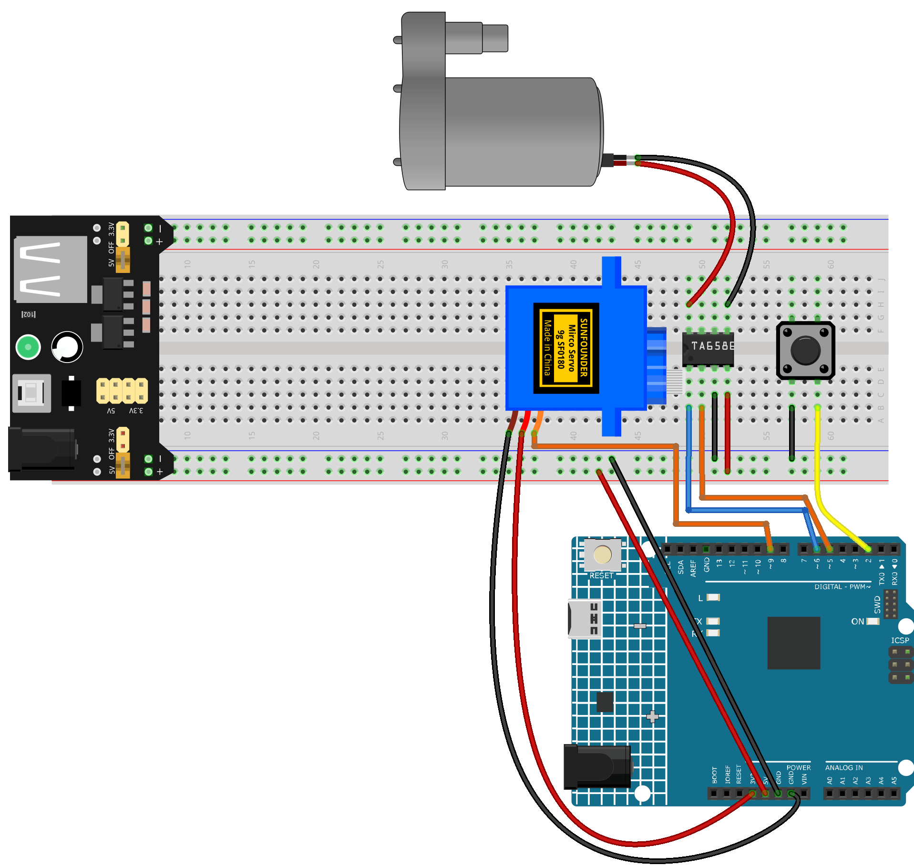

.. _rotary_sprinkler:

Rrotary Sprinkler
==============================================================

.. note::
  
  🌟 Welcome to the SunFounder Facebook Community! Whether you're into Raspberry Pi, Arduino, or ESP32, you'll find inspiration, help ideas here.
   
  - ✅ Be the first to get free learning resources. 
   
  - ✅ Stay updated on new products & exclusive giveaways. 
   
  - ✅ Share your creations and get real feedback.
   
  * 👉 Need faster updates or support? Click [|link_sf_facebook|] join our Facebook community 

  * 👉 Or join our WhatsApp group: Click [|link_sf_whatsapp|]
   
Kit purchase
------------------------

Looking for parts? Check out our all-in-one kits below — packed with components, beginner-friendly guides, and tons of fun.

.. image:: img/ultimate_sensor_kit.png
   :width: 100%
   :align: center
   :target: https://www.sunfounder.com/collections/arduino-kits-bundles/products/sunfounder-ultimate-sensor-kit-with-original-arduino-uno-r4-minima?ref=jbzmncle

.. raw:: html

     

.. list-table::
   :widths: 20 20 20
   :header-rows: 1

   * - Name
     - Includes Arduino board
     - PURCHASE LINK
   * - Elite Explorer Kit
     - Arduino Uno R4 WiFi
     - |link_elite_buy|
   * - 3 in 1 Ultimate Starter Kit
     - Arduino Uno R4 Minima
     - |link_arduinor4_buy|

Course Introduction
------------------------

In this lesson, you'll use a servo motor, a water pump driven by a TA6586 motor driver, and a button with Arduino to create a toggle-controlled watering system.

Pressing the button starts the pump and sweeps the servo back and forth to distribute water. Pressing it again stops the system, allowing for simple and hands-free operation.

.. raw:: html
 
  <iframe width="700" height="394" src="https://www.youtube.com/embed/7-EbRnddho4?si=DjwbCAGSaGKplZwG" title="YouTube video player" frameborder="0" allow="accelerometer; autoplay; clipboard-write; encrypted-media; gyroscope; picture-in-picture; web-share" referrerpolicy="strict-origin-when-cross-origin" allowfullscreen></iframe>

.. note::

  If this is your first time working with an Arduino project, we recommend downloading and reviewing the basic materials first.
  
  * :ref:`install_arduino`
  * :ref:`introduce_arduino`

**Required Components**

In this project, we need the following components:

.. list-table::
    :widths: 5 20 5 20
    :header-rows: 1

    *   - SN
        - COMPONENT INTRODUCTION	
        - QUANTITY
        - PURCHASE LINK

    *   - 1
        - Arduino UNO R4 WIFI
        - 1
        - |link_unor4_wifi_buy|
    *   - 2
        - USB Type-C cable
        - 1
        - 
    *   - 3
        - Breadboard
        - 1
        - |link_breadboard_buy|
    *   - 4
        - Wires
        - Several
        - |link_wires_buy|
    *   - 5
        - Power Supply
        - 1
        - |link_power_buy|
    *   - 6
        - Digital Servo Motor
        - 1
        - |link_motor_buy|
    *   - 7
        - TA6586 - Motor Driver Chip
        - 1
        - 
    *   - 8
        - Centrifugal Pump
        - 1
        - 
    *   - 9
        - Button
        - 1
        - |link_button_buy|

**Wiring**

**Common Connections:**

* **Digital Servo Motor**

  - Connect to breadboard’s positive power bus.
  - Connect to breadboard’s negative power bus.
  - Connect to **9** on the Arduino.

* **TA6586 - Motor Driver Chip**

  - **BI:** Connect to **6** on the Arduino.
  - **FI:** Connect to **5** on the Arduino.
  - **GND:** Connect to breadboard’s negative power bus.
  - **VCC:** Connect to breadboard’s red power bus.

* **Centrifugal Pump**

  -  Connect to **TA6586** B0.
  -  Connect to **TA6586** F0.

* **Button**

  - Connect to the breadboard’s negative power bus, and the other end to **2** on the Arduino board.

**Writing the Code**

.. note::

    * You can copy this code into **Arduino IDE**. 
    * Don't forget to select the board(Arduino UNO R4 Minima/WIFI) and the correct port before clicking the **Upload** button.

.. code-block:: arduino

      #include <Servo.h>

      Servo servo;

      const int servoPin = 9;
      const int motorIn1 = 5;  // TA6586 IN1 (FI)
      const int motorIn2 = 6;  // TA6586 IN2 (BI)
      const int buttonPin = 2;

      bool isRunning = false;
      bool lastButtonState = HIGH;

      int servoPos = 0;    // Current servo position
      int servoStep = 2;   // Servo movement step
      unsigned long lastServoMove = 0;
      const unsigned long servoInterval = 15; // Servo movement interval (ms)

      void setup() {
        servo.attach(servoPin);
        pinMode(motorIn1, OUTPUT);
        pinMode(motorIn2, OUTPUT);
        pinMode(buttonPin, INPUT_PULLUP); // Use internal pull-up resistor
        stopSystem();
      }

      void loop() {
        bool buttonState = digitalRead(buttonPin);

        // Button toggle logic (falling edge detection)
        if (lastButtonState == HIGH && buttonState == LOW) {
          isRunning = !isRunning;
          delay(200); // Debounce
        }
        lastButtonState = buttonState;

        if (isRunning) {
          // Keep water pump running
          digitalWrite(motorIn1, HIGH);
          digitalWrite(motorIn2, LOW);

          // Non-blocking servo sweeping
          unsigned long currentMillis = millis();
          if (currentMillis - lastServoMove >= servoInterval) {
            lastServoMove = currentMillis;
            servoPos += servoStep;
            if (servoPos >= 180 || servoPos <= 0) {
              servoStep = -servoStep;
            }
            servo.write(servoPos);
          }

        } else {
          stopSystem();
        }
      }

      void stopSystem() {
        // Stop water pump
        digitalWrite(motorIn1, LOW);
        digitalWrite(motorIn2, LOW);

        // Stop servo at current position
        servo.write(servoPos);
      }
