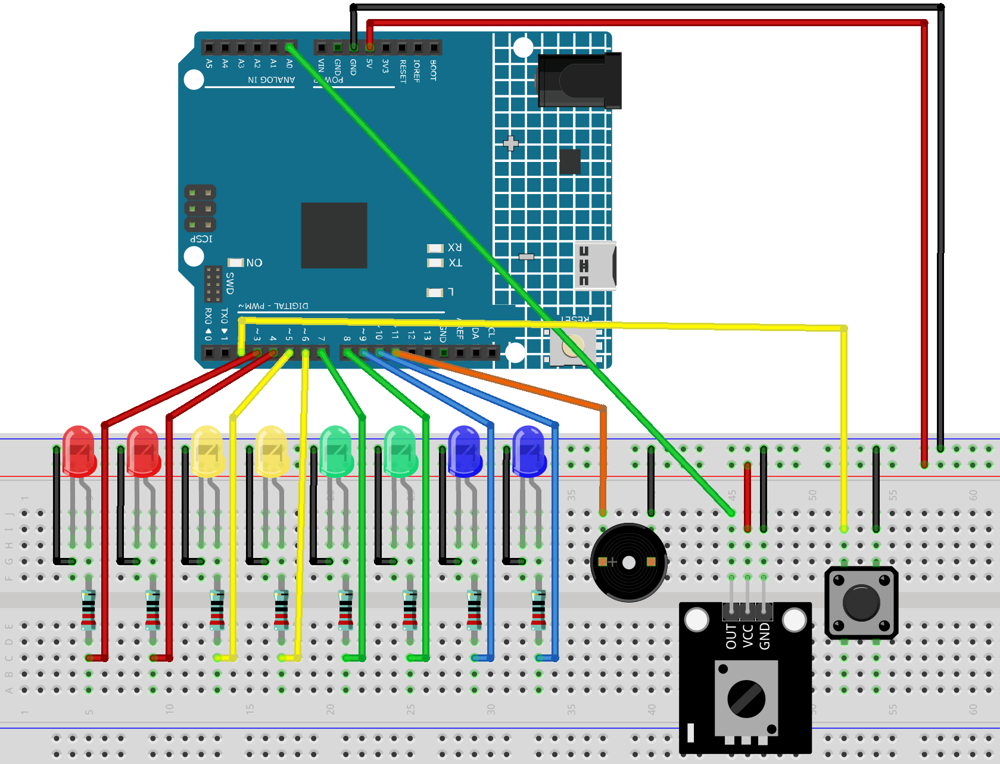

.. _run_led1.0:

Running Light 1.0
==============================================================

.. note::
  
  🌟 Welcome to the SunFounder Facebook Community! Whether you're into Raspberry Pi, Arduino, or ESP32, you'll find inspiration, help ideas here.
   
  - ✅ Be the first to get free learning resources. 
   
  - ✅ Stay updated on new products & exclusive giveaways. 
   
  - ✅ Share your creations and get real feedback.
   
  * 👉 Need faster updates or support? Click [|link_sf_facebook|] join our Facebook community 

  * 👉 Or join our WhatsApp group: Click [|link_sf_whatsapp|]
   
Kit purchase
------------------------

Looking for parts? Check out our all-in-one kits below — packed with components, beginner-friendly guides, and tons of fun.

.. image:: img/elite_explore_kit.png
   :width: 100%
   :align: center
   :target: https://www.sunfounder.com/collections/arduino-kits-bundles/products/sunfounder-elite-explorer-kit-with-official-arduino-uno-r4-wifi?ref=jbzmncle

.. raw:: html

     

.. list-table::
   :widths: 20 20 20
   :header-rows: 1

   * - Name
     - Includes Arduino board
     - PURCHASE LINK
   * - Ultimate Sensor Kit
     - Arduino Uno R4 Minima
     - |link_ultimate_sensor_buy|
   * - Elite Explorer Kit
     - Arduino Uno R4 WiFi
     - |link_elite_buy|
   * - 3 in 1 Ultimate Starter Kit
     - Arduino Uno R4 Minima
     - |link_arduinor4_buy|
   * - Universal Maker Sensor Kit
     - ×
     - |link_umsk_buy|

Course Introduction
------------------------

In this lesson, you will learn how to use Arduino with LEDs, a potentiometer, a button, and an active buzzer to create a running light effect.

Rotate the potentiometer to adjust the speed of the flowing LEDs. Press the button to pause the light at its current position or resume the animation, while the buzzer beeps in sync with the movement.

.. raw:: html

  <iframe width="700" height="394" src="https://www.youtube.com/embed/qLM4343hLPs" title="YouTube video player" frameborder="0" allow="accelerometer; autoplay; clipboard-write; encrypted-media; gyroscope; picture-in-picture; web-share" referrerpolicy="strict-origin-when-cross-origin" allowfullscreen></iframe>

.. note::

  If this is your first time working with an Arduino project, we recommend downloading and reviewing the basic materials first.
  
  * :ref:`install_arduino`
  * :ref:`introduce_arduino`

**Required Components**

In this project, we need the following components:

.. list-table::
    :widths: 5 20 5 20
    :header-rows: 1

    *   - SN
        - COMPONENT INTRODUCTION	
        - QUANTITY
        - PURCHASE LINK

    *   - 1
        - Arduino UNO R4 Minima
        - 1
        - |link_unor4_buy|
    *   - 2
        - USB Type-C cable
        - 1
        - 
    *   - 3
        - Breadboard
        - 1
        - |link_breadboard_buy|
    *   - 4
        - Wires
        - Several
        - |link_wires_buy|
    *   - 5
        - 220 resistor
        - Several
        - |link_resistor_buy|
    *   - 6
        - Button
        - 1
        - |link_button_buy|
    *   - 7
        - LED
        - Several
        - |link_led_buy|
    *   - 8
        - Active Buzzer
        - 1
        - 
    *   - 9
        - Potentiometer Sensor Module
        - 1
        - |link_potentiometer_module_buy|

**Wiring**

**Common Connections:**

* **LED**

  - Connect the LEDs **cathode** to the negative power bus on the breadboard, and the LEDs **anode** to a **220Ω resistor** then to **3** to **10** on the Arduino.

* **Button**

  - Connect to breadboard’s negative power bus.
  - Connect to **2** on the Arduino.

* **Active Buzzer**

  - **＋:** Connect to **11** on the Arduino.
  - **－:** Connect to breadboard’s negative power bus.

* **Potentiometer Sensor Module**

  - **OUT:** Connect to **A0** on the Arduino.
  - **GND:** Connect to breadboard’s negative power bus.
  - **VCC:** Connect to breadboard’s red power bus.

**Writing the Code**

.. note::

    * You can copy this code into **Arduino IDE**. 
    * Don't forget to select the board(Arduino UNO R4 Minima) and the correct port before clicking the **Upload** button.

.. code-block:: arduino

      // LED pins
      const int ledPins[] = {3, 4, 5, 6, 7, 8, 9, 10};
      const int ledCount = 8;

      // Potentiometer pin
      const int POT_PIN = A0;

      // Button pin
      const int BUTTON_PIN = 2;

      // Active buzzer pin
      const int BUZZER_PIN = 11;

      int currentLed = 0;
      bool isRunning = true;

      unsigned long lastLedTime = 0;
      unsigned long lastButtonTime = 0;
      unsigned long buzzerStartTime = 0;

      const unsigned long debounceDelay = 200;
      const unsigned long buzzerBeepTime = 40;

      bool lastButtonState = HIGH;
      bool buzzerActive = false;

      void setup() {
        for (int i = 0; i < ledCount; i++) {
          pinMode(ledPins[i], OUTPUT);
          digitalWrite(ledPins[i], LOW);
        }

        pinMode(BUTTON_PIN, INPUT_PULLUP);
        pinMode(BUZZER_PIN, OUTPUT);

        digitalWrite(BUZZER_PIN, LOW);
        digitalWrite(ledPins[currentLed], HIGH);
      }

      void loop() {
        handleButton();
        handleBuzzer();

        if (isRunning) {
          int potValue = analogRead(POT_PIN);

          // Adjust flowing speed with the potentiometer
          int flowDelay = map(potValue, 0, 1023, 80, 800);

          if (millis() - lastLedTime >= flowDelay) {
            lastLedTime = millis();

            digitalWrite(ledPins[currentLed], LOW);

            currentLed++;
            if (currentLed >= ledCount) {
              currentLed = 0;
            }

            digitalWrite(ledPins[currentLed], HIGH);

            beepOnce();
          }
        }
      }

      void handleButton() {
        bool currentButtonState = digitalRead(BUTTON_PIN);

        if (lastButtonState == HIGH && currentButtonState == LOW) {
          if (millis() - lastButtonTime > debounceDelay) {
            isRunning = !isRunning;
            lastButtonTime = millis();

            beepOnce();

            if (!isRunning) {
              delay(60);
              digitalWrite(BUZZER_PIN, LOW);
              buzzerActive = false;
            }
          }
        }

        lastButtonState = currentButtonState;
      }

      void beepOnce() {
        digitalWrite(BUZZER_PIN, HIGH);
        buzzerStartTime = millis();
        buzzerActive = true;
      }

      void handleBuzzer() {
        if (buzzerActive && millis() - buzzerStartTime >= buzzerBeepTime) {
          digitalWrite(BUZZER_PIN, LOW);
          buzzerActive = false;
        }
      }