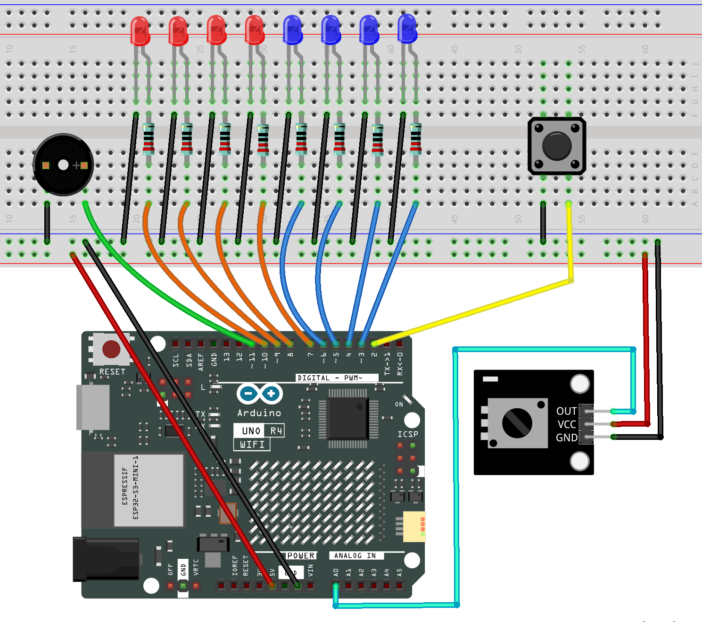

.. _run_led2.0:

Running Light 2.0
==============================================================

.. note::
  
  🌟 Welcome to the SunFounder Facebook Community! Whether you're into Raspberry Pi, Arduino, or ESP32, you'll find inspiration, help ideas here.
   
  - ✅ Be the first to get free learning resources. 
   
  - ✅ Stay updated on new products & exclusive giveaways. 
   
  - ✅ Share your creations and get real feedback.
   
  * 👉 Need faster updates or support? Click [|link_sf_facebook|] join our Facebook community 

  * 👉 Or join our WhatsApp group: Click [|link_sf_whatsapp|]
   
Kit purchase
------------------------

Looking for parts? Check out our all-in-one kits below — packed with components, beginner-friendly guides, and tons of fun.

.. image:: img/elite_explore_kit.png
   :width: 100%
   :align: center
   :target: https://www.sunfounder.com/collections/arduino-kits-bundles/products/sunfounder-elite-explorer-kit-with-official-arduino-uno-r4-wifi?ref=jbzmncle

.. raw:: html

     

.. list-table::
   :widths: 20 20 20
   :header-rows: 1

   * - Name
     - Includes Arduino board
     - PURCHASE LINK
   * - Ultimate Sensor Kit
     - Arduino Uno R4 Minima
     - |link_ultimate_sensor_buy|
   * - Elite Explorer Kit
     - Arduino Uno R4 WiFi
     - |link_elite_buy|
   * - 3 in 1 Ultimate Starter Kit
     - Arduino Uno R4 Minima
     - |link_arduinor4_buy|
   * - Universal Maker Sensor Kit
     - ×
     - |link_umsk_buy|

Course Introduction
------------------------

In this lesson, you will learn how to use Arduino with LEDs, a potentiometer, a button, and an active buzzer to create a running light effect 2.0 version.

Rotate the potentiometer to adjust the speed of the flowing LEDs. Press the button to pause the light at its current position or resume the animation, while the buzzer beeps in sync with the movement.

.. .. raw:: html

..  <iframe width="700" height="394" src="https://www.youtube.com/embed/qLM4343hLPs" title="YouTube video player" frameborder="0" allow="accelerometer; autoplay; clipboard-write; encrypted-media; gyroscope; picture-in-picture; web-share" referrerpolicy="strict-origin-when-cross-origin" allowfullscreen></iframe>

.. note::

  If this is your first time working with an Arduino project, we recommend downloading and reviewing the basic materials first.
  
  * :ref:`install_arduino`
  * :ref:`introduce_arduino`

**Required Components**

In this project, we need the following components:

.. list-table::
    :widths: 5 20 5 20
    :header-rows: 1

    *   - SN
        - COMPONENT INTRODUCTION	
        - QUANTITY
        - PURCHASE LINK

    *   - 1
        - Arduino UNO R4 Minima
        - 1
        - |link_unor4_buy|
    *   - 2
        - USB Type-C cable
        - 1
        - 
    *   - 3
        - Breadboard
        - 1
        - |link_breadboard_buy|
    *   - 4
        - Wires
        - Several
        - |link_wires_buy|
    *   - 5
        - 220 resistor
        - Several
        - |link_resistor_buy|
    *   - 6
        - Button
        - 1
        - |link_button_buy|
    *   - 7
        - LED
        - Several
        - |link_led_buy|
    *   - 8
        - Active Buzzer
        - 1
        - 
    *   - 9
        - Potentiometer Sensor Module
        - 1
        - |link_potentiometer_module_buy|

**Wiring**

**Common Connections:**

* **LED**

  - Connect the LEDs **cathode** to the negative power bus on the breadboard, and the LEDs **anode** to a **220Ω resistor** then to **3** to **10** on the Arduino.

* **Button**

  - Connect to breadboard’s negative power bus.
  - Connect to **2** on the Arduino.

* **Active Buzzer**

  - **＋:** Connect to **11** on the Arduino.
  - **－:** Connect to breadboard’s negative power bus.

* **Potentiometer Sensor Module**

  - **OUT:** Connect to **A0** on the Arduino.
  - **GND:** Connect to breadboard’s negative power bus.
  - **VCC:** Connect to breadboard’s red power bus.

**Writing the Code**

.. note::

    * You can copy this code into **Arduino IDE**. 
    * Don't forget to select the board(Arduino UNO R4 Minima/WIFI) and the correct port before clicking the **Upload** button.

.. code-block:: arduino

      /*
        Bidirectional LED Flow

        Potentiometer:
        - Turn clockwise:
          LEDs flow from the center to both sides.
        - Turn counterclockwise:
          LEDs flow from both sides to the center.
        - The farther the knob is turned from the center,
          the faster the LEDs move and the higher the buzzer pitch.

        Button:
        - Press once to pause.
        - Press again to continue.

        Buzzer:
        - Use a passive buzzer for variable-frequency tones.
      */

      // ==================== LED settings ====================

      const int ledPins[] = {
        3, 4, 5, 6, 7, 8, 9, 10
      };

      const int ledCount = 8;

      // Four symmetrical LED pairs:
      //
      // Step 0: LEDs 6 and 7   -> indexes 3 and 4
      // Step 1: LEDs 5 and 8   -> indexes 2 and 5
      // Step 2: LEDs 4 and 9   -> indexes 1 and 6
      // Step 3: LEDs 3 and 10  -> indexes 0 and 7

      const int PAIR_COUNT = ledCount / 2;

      // ==================== Pin settings ====================

      const int POT_PIN = A0;
      const int BUTTON_PIN = 2;
      const int BUZZER_PIN = 11;

      // ==================== Potentiometer settings ====================

      // UNO R4 uses 10-bit ADC readings in this program.
      const int ADC_MAX = 1023;
      const int POT_CENTER = 512;

      // Ignore small fluctuations near the center.
      const int CENTER_DEAD_ZONE = 45;

      // ==================== Speed settings ====================

      // Faster speed at maximum rotation.
      const unsigned long MIN_FLOW_DELAY = 70;

      // Slower speed near the center.
      const unsigned long MAX_FLOW_DELAY = 700;

      // ==================== Buzzer settings ====================

      const int MIN_BUZZER_FREQUENCY = 350;
      const int MAX_BUZZER_FREQUENCY = 1800;

      const unsigned long BUZZER_BEEP_TIME = 45;

      // ==================== Button settings ====================

      const unsigned long DEBOUNCE_DELAY = 40;

      bool lastButtonReading = HIGH;
      bool stableButtonState = HIGH;

      unsigned long lastDebounceTime = 0;

      // ==================== Game state ====================

      bool isRunning = true;

      // Current symmetrical LED pair.
      int currentPair = 0;

      // Animation direction:
      //  1 = center to outside
      // -1 = outside to center
      //  0 = potentiometer in center
      int flowDirection = 0;

      int lastFlowDirection = 0;

      // ==================== Timing variables ====================

      unsigned long lastLedTime = 0;
      unsigned long buzzerStartTime = 0;

      bool buzzerActive = false;

      // ==================== Setup ====================

      void setup() {
        analogReadResolution(10);

        for (int i = 0; i < ledCount; i++) {
          pinMode(ledPins[i], OUTPUT);
          digitalWrite(ledPins[i], LOW);
        }

        pinMode(BUTTON_PIN, INPUT_PULLUP);
        pinMode(BUZZER_PIN, OUTPUT);

        noTone(BUZZER_PIN);

        // Start with the two center LEDs lit.
        currentPair = 0;
        showLedPair(currentPair);
      }

      // ==================== Main loop ====================

      void loop() {
        handleButton();
        handleBuzzer();

        if (!isRunning) {
          return;
        }

        int potValue = analogRead(POT_PIN);

        updateFlowDirection(potValue);

        // Stop the animation and sound near the center.
        if (flowDirection == 0) {
          noTone(BUZZER_PIN);
          buzzerActive = false;
          return;
        }

        // Restart the animation from the correct side
        // whenever the knob crosses the center.
        if (flowDirection != lastFlowDirection) {
          if (flowDirection > 0) {
            // Clockwise: start from the middle.
            currentPair = 0;
          } else {
            // Counterclockwise: start from the outside.
            currentPair = PAIR_COUNT - 1;
          }

          showLedPair(currentPair);

          lastFlowDirection = flowDirection;
          lastLedTime = millis();
        }

        int distanceFromCenter =
          abs(potValue - POT_CENTER);

        int maximumDistance;

        if (potValue >= POT_CENTER) {
          maximumDistance = ADC_MAX - POT_CENTER;
        } else {
          maximumDistance = POT_CENTER;
        }

        // Convert distance from the center into animation speed.
        unsigned long flowDelay = map(
          distanceFromCenter,
          CENTER_DEAD_ZONE,
          maximumDistance,
          MAX_FLOW_DELAY,
          MIN_FLOW_DELAY
        );

        flowDelay = constrain(
          flowDelay,
          MIN_FLOW_DELAY,
          MAX_FLOW_DELAY
        );

        // Convert distance from the center into buzzer frequency.
        int buzzerFrequency = map(
          distanceFromCenter,
          CENTER_DEAD_ZONE,
          maximumDistance,
          MIN_BUZZER_FREQUENCY,
          MAX_BUZZER_FREQUENCY
        );

        buzzerFrequency = constrain(
          buzzerFrequency,
          MIN_BUZZER_FREQUENCY,
          MAX_BUZZER_FREQUENCY
        );

        if (millis() - lastLedTime >= flowDelay) {
          lastLedTime = millis();

          advanceLedPair();

          showLedPair(currentPair);

          beepOnce(buzzerFrequency);
        }
      }

      // ==================== Potentiometer direction ====================

      void updateFlowDirection(int potValue) {
        if (potValue > POT_CENTER + CENTER_DEAD_ZONE) {
          // Clockwise:
          // middle LEDs move toward both sides.
          flowDirection = 1;
        } else if (
          potValue < POT_CENTER - CENTER_DEAD_ZONE
        ) {
          // Counterclockwise:
          // outer LEDs move toward the middle.
          flowDirection = -1;
        } else {
          // Center position.
          flowDirection = 0;
          lastFlowDirection = 0;
        }
      }

      // ==================== LED animation ====================

      void advanceLedPair() {
        if (flowDirection > 0) {
          // Center to outside:
          // 0 -> 1 -> 2 -> 3 -> 0
          currentPair++;

          if (currentPair >= PAIR_COUNT) {
            currentPair = 0;
          }
        } else {
          // Outside to center:
          // 3 -> 2 -> 1 -> 0 -> 3
          currentPair--;

          if (currentPair < 0) {
            currentPair = PAIR_COUNT - 1;
          }
        }
      }

      void showLedPair(int pairIndex) {
        turnOffAllLeds();

        int leftLedIndex =
          PAIR_COUNT - 1 - pairIndex;

        int rightLedIndex =
          PAIR_COUNT + pairIndex;

        digitalWrite(
          ledPins[leftLedIndex],
          HIGH
        );

        digitalWrite(
          ledPins[rightLedIndex],
          HIGH
        );
      }

      void turnOffAllLeds() {
        for (int i = 0; i < ledCount; i++) {
          digitalWrite(ledPins[i], LOW);
        }
      }

      // ==================== Button handling ====================

      void handleButton() {
        bool currentReading =
          digitalRead(BUTTON_PIN);

        if (currentReading != lastButtonReading) {
          lastDebounceTime = millis();
        }

        if (
          millis() - lastDebounceTime >=
          DEBOUNCE_DELAY
        ) {
          if (
            currentReading != stableButtonState
          ) {
            stableButtonState = currentReading;

            // INPUT_PULLUP means LOW is pressed.
            if (stableButtonState == LOW) {
              isRunning = !isRunning;

              if (!isRunning) {
                turnOffAllLeds();

                noTone(BUZZER_PIN);
                buzzerActive = false;
              } else {
                // Resume from the appropriate starting point.
                int potValue =
                  analogRead(POT_PIN);

                updateFlowDirection(potValue);

                if (flowDirection > 0) {
                  currentPair = 0;
                } else if (flowDirection < 0) {
                  currentPair = PAIR_COUNT - 1;
                } else {
                  currentPair = 0;
                }

                showLedPair(currentPair);

                lastFlowDirection =
                  flowDirection;

                lastLedTime = millis();
              }
            }
          }
        }

        lastButtonReading = currentReading;
      }

      // ==================== Buzzer handling ====================

      void beepOnce(int frequency) {
        tone(
          BUZZER_PIN,
          frequency
        );

        buzzerStartTime = millis();
        buzzerActive = true;
      }

      void handleBuzzer() {
        if (
          buzzerActive &&
          millis() - buzzerStartTime >=
            BUZZER_BEEP_TIME
        ) {
          noTone(BUZZER_PIN);
          buzzerActive = false;
        }
      }