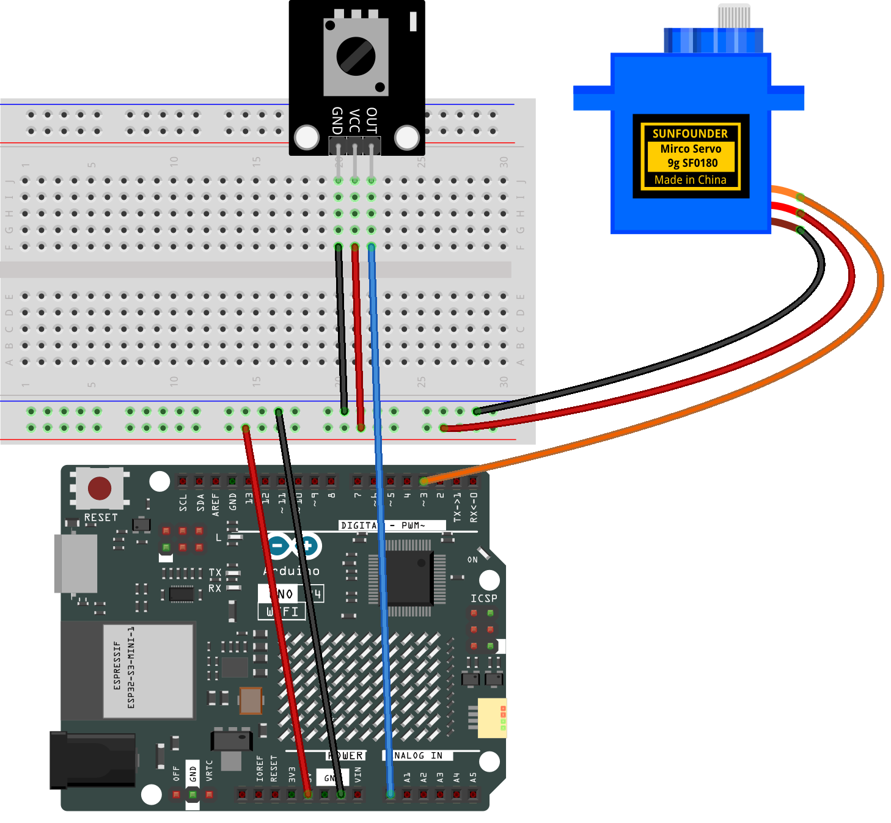

.. _servo_control:

Servo Control
==============================================================

.. note::
  
  🌟 Welcome to the SunFounder Facebook Community! Whether you're into Raspberry Pi, Arduino, or ESP32, you'll find inspiration, help ideas here.
   
  - ✅ Be the first to get free learning resources. 
   
  - ✅ Stay updated on new products & exclusive giveaways. 
   
  - ✅ Share your creations and get real feedback.
   
  * 👉 Need faster updates or support? Click [|link_sf_facebook|] join our Facebook community 

  * 👉 Or join our WhatsApp group: Click [|link_sf_whatsapp|]
   
Kit purchase
------------------------

Looking for parts? Check out our all-in-one kits below — packed with components, beginner-friendly guides, and tons of fun.

.. image:: img/ultimate_sensor_kit.png
   :width: 100%
   :align: center
   :target: https://www.sunfounder.com/collections/arduino-kits-bundles/products/sunfounder-ultimate-sensor-kit-with-original-arduino-uno-r4-minima?ref=jbzmncle

.. raw:: html

     

.. list-table::
   :widths: 20 20 20
   :header-rows: 1

   * - Name
     - Includes Arduino board
     - PURCHASE LINK
   * - Elite Explorer Kit
     - Arduino Uno R4 WiFi
     - |link_elite_buy|
   * - 3 in 1 Ultimate Starter Kit
     - Arduino Uno R4 Minima
     - |link_arduinor4_buy|

Course Introduction
------------------------

This Arduino project uses a potentiometer to control a servo motor. As the potentiometer is turned, its analog value is read and mapped to an angle between 0° and 180°, which adjusts the servo’s position accordingly. 

The angle and raw value are displayed via serial monitor, making it a simple and interactive demo of analog input to motor control.

.. raw:: html

  <iframe width="700" height="394" src="https://www.youtube.com/embed/TlZUs-bDu_E?si=LV2dt49xzpg_M-NU" title="YouTube video player" frameborder="0" allow="accelerometer; autoplay; clipboard-write; encrypted-media; gyroscope; picture-in-picture; web-share" referrerpolicy="strict-origin-when-cross-origin" allowfullscreen></iframe>

.. note::

  If this is your first time working with an Arduino project, we recommend downloading and reviewing the basic materials first.
  
  * :ref:`install_arduino`
  * :ref:`introduce_arduino`

**Required Components**

In this project, we need the following components:

.. list-table::
    :widths: 5 20 5 20
    :header-rows: 1

    *   - SN
        - COMPONENT INTRODUCTION	
        - QUANTITY
        - PURCHASE LINK

    *   - 1
        - Arduino UNO R4 WIFI
        - 1
        - |link_unor4_wifi_buy|
    *   - 2
        - USB Type-C cable
        - 1
        - 
    *   - 3
        - Breadboard
        - 1
        - |link_breadboard_buy|
    *   - 4
        - Wires
        - Several
        - |link_wires_buy|
    *   - 5
        - Digital Servo Motor
        - 1
        - |link_motor_buy|
    *   - 6
        - Potentiometer Sensor Module
        - 1
        - |link_potentiometer_sensor_buy|

**Wiring**

**Common Connections:**

* **Digital Servo Motor**

  - Connect to breadboard’s positive power bus.
  - Connect to breadboard’s negative power bus.
  - Connect to  **3** on the Arduino.

* **Potentiometer Sensor Module**

  - **OUT:** Connect to **A0** on the Arduino.
  - **GND:** Connect to breadboard’s negative power bus.
  - **VCC:** Connect to breadboard’s red power bus.

**Writing the Code**

.. note::

    * You can copy this code into **Arduino IDE**. 
    * Don't forget to select the board(Arduino UNO R4 Minima/WIFI) and the correct port before clicking the **Upload** button.

.. code-block:: arduino

      #include <Servo.h>

      // Define the potentiometer pin and the servo pin
      const int potPin = A0;     // Potentiometer connected to analog pin A0
      const int servoPin = 3;    // Servo connected to digital pin 3

      // Create a servo object
      Servo myServo;

      void setup() {
        myServo.attach(servoPin);  // Attach the servo to pin 3
        Serial.begin(9600);        // Start serial communication
      }

      void loop() {
        int potValue = analogRead(potPin);                // Read analog value (0~1023)
        int angle = map(potValue, 0, 1023, 0, 180);        // Map to servo angle
        myServo.write(angle);                             // Set servo position

        // Debug output
        Serial.print("Potentiometer Value: ");
        Serial.print(potValue);
        Serial.print(" | Servo Angle: ");
        Serial.println(angle);

        delay(15); // Delay to smooth out the signal
      }
