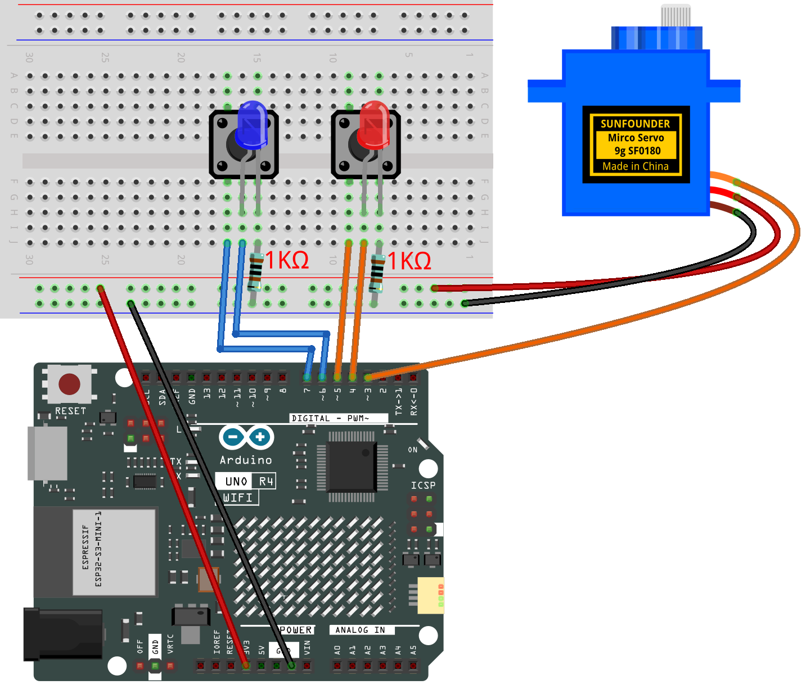

.. _servo_control2.0:

Servo Control 2.0
==============================================================

.. note::
  
  🌟 Welcome to the SunFounder Facebook Community! Whether you're into Raspberry Pi, Arduino, or ESP32, you'll find inspiration, help ideas here.
   
  - ✅ Be the first to get free learning resources. 
   
  - ✅ Stay updated on new products & exclusive giveaways. 
   
  - ✅ Share your creations and get real feedback.
   
  * 👉 Need faster updates or support? Click [|link_sf_facebook|] join our Facebook community 

  * 👉 Or join our WhatsApp group: Click [|link_sf_whatsapp|]
   
  * 🎁 Looking for parts?Check out our all-in-one kits below — packed with components, beginner-friendly guides, and tons of fun.

  .. list-table::
    :widths: 20 20 20
    :header-rows: 1

    *   - Name	
        - Includes Arduino board
        - PURCHASE LINK
    *   - Ultimate Sensor Kit
        - Arduino Uno R4 Minima
        - |link_ultimate_sensor_buy|
    *   - Elite Explorer Kit
        - Arduino Uno R4 WiFi
        - |link_elite_buy|
    *   - 3 in 1 Ultimate Starter Kit
        - Arduino Uno R4 Minima
        - |link_arduinor4_buy|
    *   - Universal Maker Sensor Kit
        - ×
        - |link_umsk_buy|

Course Introduction
------------------------

This Arduino project lets you control a servo motor with two buttons: the red button moves it toward 0° and the blue button toward 180°, with LEDs lighting up as feedback.

.. .. raw:: html

..  <iframe width="700" height="394" src="https://www.youtube.com/embed/TlZUs-bDu_E?si=LV2dt49xzpg_M-NU" title="YouTube video player" frameborder="0" allow="accelerometer; autoplay; clipboard-write; encrypted-media; gyroscope; picture-in-picture; web-share" referrerpolicy="strict-origin-when-cross-origin" allowfullscreen></iframe>

.. note::

  If this is your first time working with an Arduino project, we recommend downloading and reviewing the basic materials first.
  
  * :ref:`install_arduino`
  * :ref:`introduce_arduino`

**Required Components**

In this project, we need the following components:

.. list-table::
    :widths: 5 20 5 20
    :header-rows: 1

    *   - SN
        - COMPONENT INTRODUCTION	
        - QUANTITY
        - PURCHASE LINK

    *   - 1
        - Arduino UNO R4 WIFI
        - 1
        - |link_unor4_wifi_buy|
    *   - 2
        - USB Type-C cable
        - 1
        - 
    *   - 3
        - Breadboard
        - 1
        - |link_breadboard_buy|
    *   - 4
        - Wires
        - Several
        - |link_wires_buy|
    *   - 5
        - Digital Servo Motor
        - 1
        - |link_motor_buy|
    *   - 6
        - Button
        - 2
        - |link_button_buy|
    *   - 7
        - LED
        - 2
        - |link_led_buy|

**Wiring**

**Common Connections:**

* **Digital Servo Motor**

  - Connect to breadboard’s positive power bus.
  - Connect to breadboard’s negative power bus.
  - Connect to  **3** on the Arduino.

* **Button1**

  - **GND:** Connect to a **1kΩ resistor**, then to negative power bus on the breadboard
  - **VCC:** Connect to  **7** on the Arduino.

* **Button2**

  - **GND:** Connect to a **1kΩ resistor**, then to negative power bus on the breadboard
  - **VCC:** Connect to  **5** on the Arduino.

* **Blue LED**

  - Connect the LED **cathode** to  the to a **1kΩ resistor**, then to negative power bus on the breadboard, **anode** to **6** on the Arduino.

* **Red LED**

  - Connect the LED **cathode** to  the to a **1kΩ resistor**, then to negative power bus on the breadboard, **anode** to **4** on the Arduino.

**Writing the Code**

.. note::

    * You can copy this code into **Arduino IDE**. 
    * Don't forget to select the board(Arduino UNO R4 Minima/WIFI) and the correct port before clicking the **Upload** button.

.. code-block:: arduino

      #include <Servo.h>

      // --- Pin definitions ---
      const int servoPin = 3;   // Servo signal wire connected to pin 3
      const int redLED   = 4;   // Red LED connected to pin 4 (with resistor)
      const int redBtn   = 5;   // Red button connected to pin 5
      const int blueLED  = 6;   // Blue LED connected to pin 6 (with resistor)
      const int blueBtn  = 7;   // Blue button connected to pin 7

      Servo myServo;             // Create a Servo object
      int currentAngle = 90;     // Start servo at the middle position (90°)
      const int stepSize = 5;    // Servo moves 3° for each button press

      // Variables to remember the last button states
      bool lastRedState  = HIGH; // HIGH means not pressed (because of INPUT_PULLUP)
      bool lastBlueState = HIGH;

      void setup() {
        myServo.attach(servoPin);       // Attach the servo to pin 3
        myServo.write(currentAngle);    // Move servo to initial position

        pinMode(redLED, OUTPUT);        // Set LED pins as outputs
        pinMode(blueLED, OUTPUT);

        pinMode(redBtn, INPUT_PULLUP);  // Use internal pull-up resistor
        pinMode(blueBtn, INPUT_PULLUP); // Button is active LOW
      }

      void loop() {
        // Read current button states
        bool redPressed  = (digitalRead(redBtn)  == LOW); // LOW means pressed
        bool bluePressed = (digitalRead(blueBtn) == LOW);

        // --- Red button logic ---
        if (redPressed && lastRedState == HIGH) { // Detect new press (not held down)
          delay(50);                              // Small delay to debounce
          if (digitalRead(redBtn) == LOW) {       // Check again to confirm press
            digitalWrite(redLED, HIGH);           // Turn on red LED
            currentAngle = max(0, currentAngle - stepSize); // Move 3° toward 0°
            myServo.write(currentAngle);          // Update servo position
          }
        } else {
          digitalWrite(redLED, LOW);              // Turn off LED when not pressed
        }

        // --- Blue button logic ---
        if (bluePressed && lastBlueState == HIGH) { // Detect new press
          delay(50);                                // Debounce
          if (digitalRead(blueBtn) == LOW) {        // Confirm press
            digitalWrite(blueLED, HIGH);            // Turn on blue LED
            currentAngle = min(180, currentAngle + stepSize); // Move 3° toward 180°
            myServo.write(currentAngle);            // Update servo position
          }
        } else {
          digitalWrite(blueLED, LOW);               // Turn off LED when not pressed
        }

        // Remember button states for next loop
        lastRedState  = redPressed;
        lastBlueState = bluePressed;
      }
