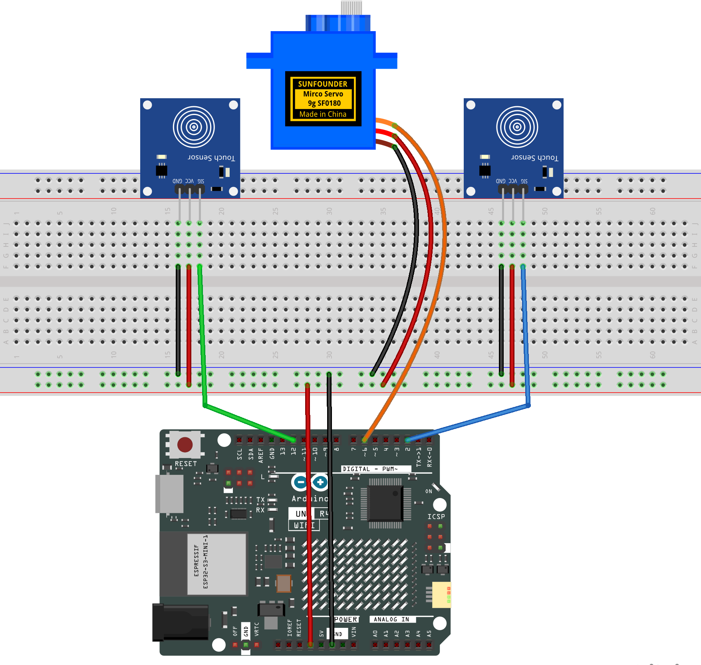

.. _servo_control4.0:

Servo Control 4.0
==============================================================

.. note::
  
  🌟 Welcome to the SunFounder Facebook Community! Whether you're into Raspberry Pi, Arduino, or ESP32, you'll find inspiration, help ideas here.
   
  - ✅ Be the first to get free learning resources. 
   
  - ✅ Stay updated on new products & exclusive giveaways. 
   
  - ✅ Share your creations and get real feedback.
   
  * 👉 Need faster updates or support? Click [|link_sf_facebook|] join our Facebook community 

  * 👉 Or join our WhatsApp group: Click [|link_sf_whatsapp|]
   
Kit purchase
------------------------

Looking for parts? Check out our all-in-one kits below — packed with components, beginner-friendly guides, and tons of fun.

.. image:: img/elite_explore_kit.png
   :width: 100%
   :align: center
   :target: https://www.sunfounder.com/collections/arduino-kits-bundles/products/sunfounder-elite-explorer-kit-with-official-arduino-uno-r4-wifi?ref=jbzmncle

.. raw:: html

     

.. list-table::
   :widths: 20 20 20
   :header-rows: 1

   * - Name
     - Includes Arduino board
     - PURCHASE LINK
   * - Elite Explorer Kit
     - Arduino Uno R4 WiFi
     - |link_elite_buy|
   * - Inventor Lab Kit
     - Arduino Uno R3
     - |link_inventorkit_buy|

Course Introduction
------------------------

This project uses two touch sensors to control a servo motor.
Press and hold a sensor to move the servo toward 0° or 180° in 5° steps.
Both pressed = no movement.
Initial angle: 90°.

.. raw:: html

  <iframe width="700" height="394" src="https://www.youtube.com/embed/URUrUUSfsKs" title="YouTube video player" frameborder="0" allow="accelerometer; autoplay; clipboard-write; encrypted-media; gyroscope; picture-in-picture; web-share" referrerpolicy="strict-origin-when-cross-origin" allowfullscreen></iframe>

.. note::

  If this is your first time working with an Arduino project, we recommend downloading and reviewing the basic materials first.
  
  * :ref:`install_arduino`
  * :ref:`introduce_arduino`

**Required Components**

In this project, we need the following components:

.. list-table::
    :widths: 5 20 5 20
    :header-rows: 1

    *   - SN
        - COMPONENT INTRODUCTION	
        - QUANTITY
        - PURCHASE LINK

    *   - 1
        - Arduino UNO R4 WIFI
        - 1
        - |link_unor4_wifi_buy|
    *   - 2
        - USB Type-C cable
        - 1
        - 
    *   - 3
        - Breadboard
        - 1
        - |link_breadboard_buy|
    *   - 4
        - Wires
        - Several
        - |link_wires_buy|
    *   - 5
        - Touch Sensor Module
        - 1
        - |link_touch_buy|
    *   - 6
        - Rotary Encoder Module
        - 1
        - |link_rotary_encoder_buy|

**Wiring**

**Common Connections:**

* **Digital Servo Motor**

  - Connect to breadboard’s positive power bus.
  - Connect to breadboard’s negative power bus.
  - Connect to  **6** on the Arduino.

* **Touch Sensor Module 1**

  - **SIG:** Connect to **2** on the Arduino.
  - **GND:** Connect to breadboard’s negative power bus.
  - **VCC:** Connect to breadboard’s red power bus.

* **Touch Sensor Module 2**

  - **SIG:** Connect to **12** on the Arduino.
  - **GND:** Connect to breadboard’s negative power bus.
  - **VCC:** Connect to breadboard’s red power bus.

**Writing the Code**

.. note::

    * You can copy this code into **Arduino IDE**. 
    * Don't forget to select the board(Arduino UNO R4 Minima/WIFI) and the correct port before clicking the **Upload** button.

.. code-block:: arduino

      /* Two Touch Sensors -> Servo (press-and-hold auto-repeat)
      * Pins:
      *   Touch #1 (toward 0°):  D2
      *   Touch #2 (toward 180°): D12
      *   Servo: D6
      *
      * Behavior:
      *   - Initial angle = 90°
      *   - On press: move immediately by 3°
      *   - While holding: keep stepping every REPEAT_MS by 3°
      *   - If both held: neutral (no move). You can change to priority if desired.
      *
      * Note:
      *   Most capacitive touch modules output HIGH when touched.
      *   If your module is ACTIVE-LOW, flip the read logic as commented below.
      */

      #include <Servo.h>

      const int PIN_TOUCH_01 = 2;     // toward 0°
      const int PIN_TOUCH_02 = 12;    // toward 180°
      const int PIN_SERVO    = 6;

      const int  STEP_DEG       = 5;      // degrees per step
      const unsigned long REPEAT_MS = 80;  // step interval while holding
      const unsigned long FIRST_STEP_DELAY_MS = 0; // 0 = immediate first step

      Servo servo;
      int angleDeg = 90;  // start at 90°

      enum Dir { STOP = 0, TO_0 = -1, TO_180 = +1 };

      // state for auto-repeat
      Dir currentDir = STOP;
      unsigned long holdStartMs = 0;   // when the currentDir started
      unsigned long lastStepMs  = 0;   // last time we stepped

      void setup() {
        pinMode(PIN_TOUCH_01, INPUT);  // HIGH when touched (typical)
        pinMode(PIN_TOUCH_02, INPUT);
        // If ACTIVE-LOW modules, you can keep INPUT but invert reads below.

        servo.attach(PIN_SERVO);
        servo.write(angleDeg);

        Serial.begin(9600);
        Serial.println("Press-and-hold servo control ready.");
      }

      void loop() {
        unsigned long now = millis();

        // --- Read touch states ---
        bool t1 = (digitalRead(PIN_TOUCH_01) == HIGH);  // ACTIVE-HIGH typical
        bool t2 = (digitalRead(PIN_TOUCH_02) == HIGH);
        // If ACTIVE-LOW modules, use:
        // bool t1 = (digitalRead(PIN_TOUCH_01) == LOW);
        // bool t2 = (digitalRead(PIN_TOUCH_02) == LOW);

        // --- Decide direction ---
        Dir nextDir = STOP;
        if (t1 && !t2)      nextDir = TO_0;
        else if (!t1 && t2) nextDir = TO_180;
        else                nextDir = STOP;  // both idle or both pressed -> neutral

        // --- Handle dir changes (start/stop hold) ---
        if (nextDir != currentDir) {
          currentDir = nextDir;
          holdStartMs = now;
          lastStepMs  = 0;  // reset so we can apply FIRST_STEP_DELAY_MS cleanly
          // Immediate first step if requested
          if (currentDir != STOP && FIRST_STEP_DELAY_MS == 0) {
            stepOnce(currentDir);
            lastStepMs = now;
          }
        }

        // --- While holding, auto-repeat ---
        if (currentDir != STOP) {
          unsigned long wait = (lastStepMs == 0)
                              ? FIRST_STEP_DELAY_MS   // first step after a delay (if not immediate)
                              : REPEAT_MS;            // subsequent steps
          if (now - (lastStepMs == 0 ? holdStartMs : lastStepMs) >= wait) {
            stepOnce(currentDir);
            lastStepMs = now;
          }
        }

        // non-blocking loop keeps the system responsive
      }

      void stepOnce(Dir d) {
        int before = angleDeg;
        angleDeg += (d == TO_180 ? +STEP_DEG : -STEP_DEG);
        if (angleDeg < 0)   angleDeg = 0;
        if (angleDeg > 180) angleDeg = 180;

        if (angleDeg != before) {
          servo.write(angleDeg);
          Serial.print("Angle: ");
          Serial.println(angleDeg);
        }
      }
