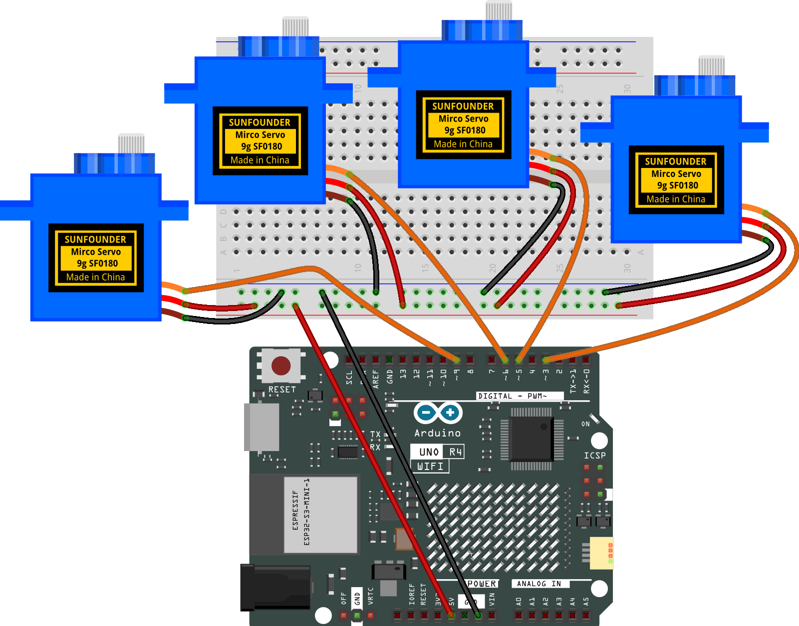

.. _servo_control_iot:

Servo Control (IOT)
==============================================================

.. note::
  
  🌟 Welcome to the SunFounder Facebook Community! Whether you're into Raspberry Pi, Arduino, or ESP32, you'll find inspiration, help ideas here.
   
  - ✅ Be the first to get free learning resources. 
   
  - ✅ Stay updated on new products & exclusive giveaways. 
   
  - ✅ Share your creations and get real feedback.
   
  * 👉 Need faster updates or support? Click [|link_sf_facebook|] join our Facebook community 

  * 👉 Or join our WhatsApp group: Click [|link_sf_whatsapp|]
   
  * 🎁 Looking for parts?Check out our all-in-one kits below — packed with components, beginner-friendly guides, and tons of fun.
  
  .. list-table::
    :widths: 20 20 20
    :header-rows: 1

    *   - Name	
        - Includes Arduino board
        - PURCHASE LINK
    *   - Elite Explorer Kit	
        - Arduino Uno R4 WiFi
        - |link_elite_buy|

Course Introduction
------------------------

This Arduino project uses Arduino IoT Remote to control a servo motor. 

.. .. raw:: html
 
..  <iframe width="700" height="394" src="https://www.youtube.com/embed/wDVh-0BptOI?si=F7Yddwn72Qfo1eqi" title="YouTube video player" frameborder="0" allow="accelerometer; autoplay; clipboard-write; encrypted-media; gyroscope; picture-in-picture; web-share" referrerpolicy="strict-origin-when-cross-origin" allowfullscreen></iframe>

**Required Components**

In this project, we need the following components:

.. list-table::
    :widths: 5 20 5 20
    :header-rows: 1

    *   - SN
        - COMPONENT INTRODUCTION	
        - QUANTITY
        - PURCHASE LINK

    *   - 1
        - Arduino UNO R4 WIFI
        - 1
        - |link_unor4_wifi_buy|
    *   - 2
        - USB Type-C cable
        - 1
        - 
    *   - 3
        - Breadboard
        - 1
        - |link_breadboard_buy|
    *   - 4
        - Wires
        - Several
        - |link_wires_buy|
    *   - 5
        - Digital Servo Motor
        - 4
        - |link_motor_buy|

**Wiring**

**Common Connections:**

* **Digital Servo Motor A**

  - Connect to breadboard’s positive power bus.
  - Connect to breadboard’s negative power bus.
  - Connect to  **3** on the Arduino.

* **Digital Servo Motor B**

  - Connect to breadboard’s positive power bus.
  - Connect to breadboard’s negative power bus.
  - Connect to  **5** on the Arduino.

* **Digital Servo Motor C**

  - Connect to breadboard’s positive power bus.
  - Connect to breadboard’s negative power bus.
  - Connect to  **6** on the Arduino.

* **Digital Servo Motor D**

  - Connect to breadboard’s positive power bus.
  - Connect to breadboard’s negative power bus.
  - Connect to  **9** on the Arduino.

.. note::

  If this is your first time working with an Arduino IOT project, we recommend downloading and reviewing the basic materials first.
  
  * :ref:`install_arduino`
  * :ref:`introduce_arduino`

  Please follow the steps in the tutorial below to complete the binding and setup of Arduino Cloud and the Arduino WiFi board.

  * :ref:`iot_arduino_cloud`

**Create a New IoT Project**

  After configuring the Arduino Cloud and the Arduino WiFi board, follow the steps below to complete the Arduino Cloud project setup

  .. image:: img/servo_step1.png

Edit Value

   .. image:: img/servo_value.png
    :width: 400

Follow the steps below to configure the dashboard.

  1. Create New Dashboard

  .. image:: img/dashboard_step.png

  2. Add Widgets

  .. image:: img/servo_dashboard1.png

  3. Link Variable

  .. image:: img/servo_variable1.png
  .. image:: img/servo_variable2.png

  4. Remember to click Done

  .. image:: img/done.png

  After completing the above configuration, return to the Things page and open the sketch.
  
  .. image:: img/done2.png

  When you have completed the configuration of the Things and Dashboard, as well as the connection and network setup of the Arduino WiFi board, the thingProperties.h and Sketch Secrets files will be generated automatically. 
  If Sketch Secrets is not generated, please manually enter the connected SSID and OPTIONAL_PASS

Copy this code into **Arduino Cloud**. 
  
  .. image:: img/servo_code.png

Don't forget to select the board(Arduino UNO R4 WIFI) and the correct port before clicking the **Upload** button.

.. code-block:: arduino

      #include <Servo.h>
      #include "thingProperties.h"

      // ========== Servo pins (modifiable if needed) ==========
      const uint8_t SERVO_PINS[4] = {3, 5, 6, 9}; // D3, D5, D6, D9
      // Servo pulse width (microseconds), adjustable according to your servo, e.g., 500~2400us
      const int SERVOMIN_US = 500;
      const int SERVOMAX_US = 2400;
      // ======================================================

      Servo servos[4];

      void setup() {
        Serial.begin(115200);
        delay(500);

        // Initialize cloud properties and connect to IoT Cloud
        initProperties();
        ArduinoCloud.begin(ArduinoIoTPreferredConnection);
        setDebugMessageLevel(2);
        ArduinoCloud.printDebugInfo();

        // Attach 4 servos and set default angle
        for (int i = 0; i < 4; i++) {
          servos[i].attach(SERVO_PINS[i], SERVOMIN_US, SERVOMAX_US);
          servos[i].write(90);
        }

        // (Optional) Sync current device angle to the cloud
        angle0 = 90; angle1 = 90; angle2 = 90; angle3 = 90;
      }

      void loop() {
        ArduinoCloud.update();   // Must be placed inside loop
      }

      // ====== Cloud property change callbacks (triggered when slider changes) ======
      void onAngle0Change() { servos[0].write(constrain(angle0, 0, 180)); }
      void onAngle1Change() { servos[1].write(constrain(angle1, 0, 180)); }
      void onAngle2Change() { servos[2].write(constrain(angle2, 0, 180)); }
      void onAngle3Change() { servos[3].write(constrain(angle3, 0, 180)); }
