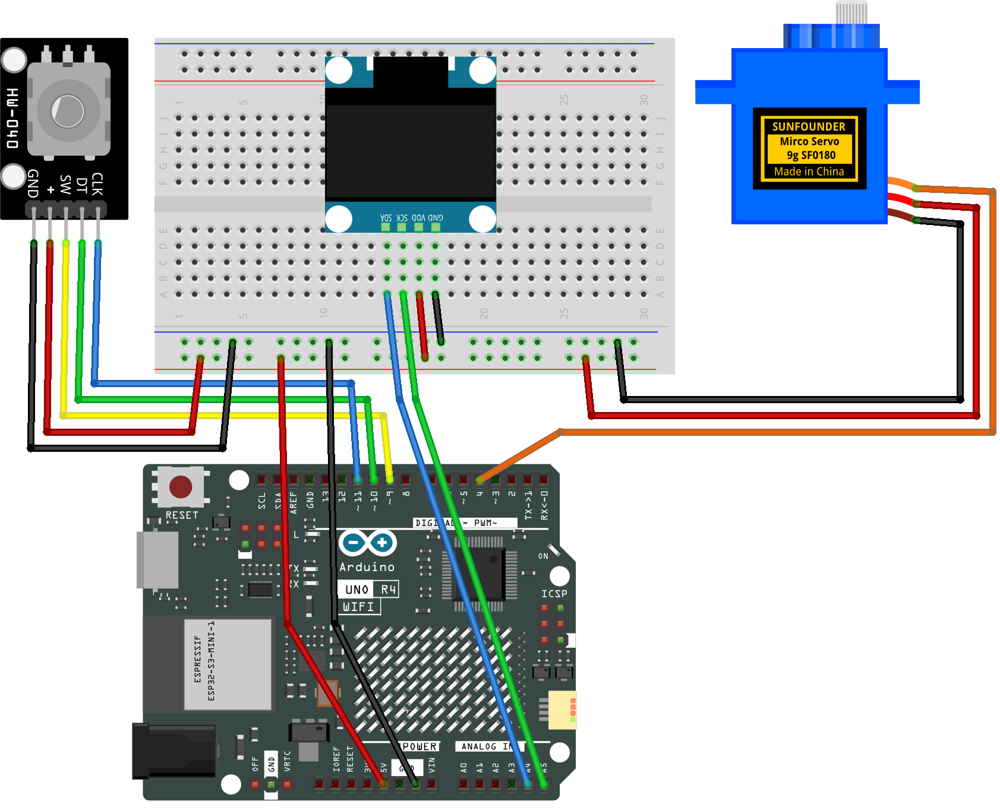

.. _servo_tuner:

Servo Tuner
==============================================================

.. note::
  
  🌟 Welcome to the SunFounder Facebook Community! Whether you're into Raspberry Pi, Arduino, or ESP32, you'll find inspiration, help ideas here.
   
  - ✅ Be the first to get free learning resources. 
   
  - ✅ Stay updated on new products & exclusive giveaways. 
   
  - ✅ Share your creations and get real feedback.
   
  * 👉 Need faster updates or support? Click [|link_sf_facebook|] join our Facebook community 

  * 👉 Or join our WhatsApp group: Click [|link_sf_whatsapp|]
   
  * 🎁 Looking for parts?Check out our all-in-one kits below — packed with components, beginner-friendly guides, and tons of fun.

  .. list-table::
    :widths: 20 20 20
    :header-rows: 1

    *   - Name	
        - Includes Arduino board
        - PURCHASE LINK
    *   - Ultimate Sensor Kit
        - Arduino Uno R4 Minima
        - |link_ultimate_sensor_buy|
    *   - Elite Explorer Kit
        - Arduino Uno R4 WiFi
        - |link_elite_buy|
    *   - 3 in 1 Ultimate Starter Kit
        - Arduino Uno R4 Minima
        - |link_arduinor4_buy|
    *   - Universal Maker Sensor Kit
        - ×
        - |link_umsk_buy|

Course Introduction
------------------------

This Arduino project uses a rotary encoder to precisely control a servo motor, allowing you to set its angle from 0° to 180° in adjustable steps. 

An OLED display provides real-time feedback, showing the current servo angle and step size, while a button on the encoder lets you switch between fine and coarse adjustments. 

This interactive setup demonstrates digital input for accurate motor positioning and live data display.

.. .. raw:: html

..  <iframe width="700" height="394" src="https://www.youtube.com/embed/TlZUs-bDu_E?si=LV2dt49xzpg_M-NU" title="YouTube video player" frameborder="0" allow="accelerometer; autoplay; clipboard-write; encrypted-media; gyroscope; picture-in-picture; web-share" referrerpolicy="strict-origin-when-cross-origin" allowfullscreen></iframe>

.. note::

  If this is your first time working with an Arduino project, we recommend downloading and reviewing the basic materials first.

  * :ref:`install_arduino`
  * :ref:`introduce_arduino`

**Required Components**

In this project, we need the following components:

.. list-table::
    :widths: 5 20 5 20
    :header-rows: 1

    *   - SN
        - COMPONENT INTRODUCTION	
        - QUANTITY
        - PURCHASE LINK

    *   - 1
        - Arduino UNO R4 WIFI
        - 1
        - |link_unor4_wifi_buy|
    *   - 2
        - USB Type-C cable
        - 1
        - 
    *   - 3
        - Breadboard
        - 1
        - |link_breadboard_buy|
    *   - 4
        - Wires
        - Several
        - |link_wires_buy|
    *   - 5
        - Digital Servo Motor
        - 1
        - |link_motor_buy|
    *   - 6
        - Rotary Encoder Module
        - 1
        - |link_rotary_encoder_buy|
    *   - 7
        - OLED Display Module
        - 1
        - |link_oled_buy|

**Wiring**

**Common Connections:**

* **Digital Servo Motor**

  - Connect to breadboard’s positive power bus.
  - Connect to breadboard’s negative power bus.
  - Connect to  **4** on the Arduino.

* **Rotary Encoder Module**

  - **SW:** Connect to **9** on the Arduino.
  - **DT:** Connect to **10** on the Arduino.
  - **CLK:** Connect to **11** on the Arduino.
  - **GND:** Connect to breadboard’s negative power bus.
  - **VCC:** Connect to breadboard’s red power bus.

* **OLED Display Module**

  - **SDA:** Connect to **A4** on the Arduino.
  - **SCK:** Connect to **A5** on the Arduino.
  - **GND:** Connect to breadboard’s negative power bus.
  - **VCC:** Connect to breadboard’s red power bus.

**Writing the Code**

.. note::

    * You can copy this code into **Arduino IDE**. 
    * To install the library, use the Arduino Library Manager and search for **Adafruit SSD1306** and **Adafruit GFX** and install it.
    * Don't forget to select the board(Arduino UNO R4 Minima/WIFI) and the correct port before clicking the **Upload** button.

.. code-block:: arduino

      #include <Servo.h>           // Include servo motor control library
      #include <Wire.h>            // Include I2C communication library
      #include <Adafruit_GFX.h>    // Include core graphics library
      #include <Adafruit_SSD1306.h>// Include SSD1306 OLED display library

      // OLED display parameters
      #define SCREEN_WIDTH 128     // OLED display width in pixels
      #define SCREEN_HEIGHT 64     // OLED display height in pixels
      #define OLED_RESET    -1     // No hardware reset pin used
      #define SCREEN_ADDR   0x3C   // I2C address for OLED display
      Adafruit_SSD1306 display(SCREEN_WIDTH, SCREEN_HEIGHT, &Wire, OLED_RESET);

      // Rotary encoder pins
      #define ENCODER_CLK  11      // Encoder output A (CLK)
      #define ENCODER_DT   10      // Encoder output B (DT)
      #define ENCODER_SW    9      // Encoder button switch (SW)

      // Servo control pin
      #define SERVO_PIN     3      // Servo signal pin

      Servo myServo;              // Create servo object
      int angle = 90;             // Initial servo angle (0-180)
      int stepSize = 1;           // Rotation step: 1°, 5°, or 10°
      int lastClkState;           // Previous state of CLK for edge detection
      int lastSwState;            // Previous state of SW for debounce
      unsigned long lastDebounce = 0;
      const unsigned long DEBOUNCE_MS = 50; // Debounce time in milliseconds

      void setup() {
        // Initialize encoder pins with internal pull-ups
        pinMode(ENCODER_CLK, INPUT_PULLUP);
        pinMode(ENCODER_DT,  INPUT_PULLUP);
        pinMode(ENCODER_SW,  INPUT_PULLUP);

        Serial.begin(9600);      // Start serial communication for debugging

        myServo.attach(SERVO_PIN); // Attach servo to control pin
        myServo.write(angle);    // Move servo to starting angle

        // Initialize OLED display and halt if failed
        if (!display.begin(SSD1306_SWITCHCAPVCC, SCREEN_ADDR)) {
          Serial.println("SSD1306 allocation failed");
          while (true);          // Stop execution on failure
        }
        display.clearDisplay();  // Clear the buffer
        display.display();       // Display cleared buffer

        // Read initial encoder states
        lastClkState = digitalRead(ENCODER_CLK);
        lastSwState  = digitalRead(ENCODER_SW);

        updateDisplay();         // Draw the initial UI
      }

      void loop() {
        // Detect rotation on rising edge of CLK
        int clkState = digitalRead(ENCODER_CLK);
        if (clkState != lastClkState && clkState == HIGH) {
          // Determine direction using DT
          if (digitalRead(ENCODER_DT) != clkState) angle = max(0, angle - stepSize);
          else                                   angle = min(180, angle + stepSize);
          myServo.write(angle);  // Move servo to new angle
          updateDisplay();       // Update the display
        }
        lastClkState = clkState;

        // Detect button press with debounce
        int swState = digitalRead(ENCODER_SW);
        if (swState != lastSwState) {
          unsigned long now = millis();
          if (now - lastDebounce > DEBOUNCE_MS && swState == LOW) {
            // Cycle step sizes: 1 -> 5 -> 10
            if      (stepSize == 1)  stepSize = 5;
            else if (stepSize == 5)  stepSize = 10;
            else                      stepSize = 1;
            updateDisplay();        // Refresh display after change
          }
          lastDebounce = now;
        }
        lastSwState = swState;
      }

      // Draw UI elements on OLED display
      void updateDisplay() {
        // Energy bar region (0-20px)
        display.fillRect(0, 0, SCREEN_WIDTH, 20, BLACK);
        display.drawRect(0, 0, SCREEN_WIDTH, 20, WHITE);
        int barWidth = map(angle, 0, 180, 0, SCREEN_WIDTH);
        if (barWidth > 2) display.fillRect(1, 1, barWidth - 2, 18, WHITE);

        // Tick marks and labels (20-32px)
        display.fillRect(0, 20, SCREEN_WIDTH, 12, BLACK);
        display.setTextSize(1);
        display.setTextColor(WHITE);
        int ticks[] = {0, 30, 60, 90, 120, 150, 180};
        for (int deg : ticks) {
          int x = map(deg, 0, 180, 0, SCREEN_WIDTH);
          display.drawLine(x, 20, x, 24, WHITE);
          char buf[4]; snprintf(buf, sizeof(buf), "%d", deg);
          int16_t tbx, tby; uint16_t tbw, tbh;
          display.getTextBounds(buf, 0, 0, &tbx, &tby, &tbw, &tbh);
          display.setCursor(x - tbw/2, 25);
          display.print(buf);
        }

        // Info region (32-64px)
        display.fillRect(0, 32, SCREEN_WIDTH, 32, BLACK);
        int baseY = 34;

        // Draw "Angle" label
        display.setTextSize(1);
        const char* lblA = "Angle";
        int16_t ax, ay; uint16_t aw, ah;
        display.getTextBounds(lblA, 0, 0, &ax, &ay, &aw, &ah);
        display.setCursor(32 - aw/2, baseY);
        display.print(lblA);

        // Draw numeric angle value
        char valA[4]; snprintf(valA, sizeof(valA), "%d", angle);
        display.setTextSize(2);
        int16_t vx, vy; uint16_t vw, vh;
        display.getTextBounds(valA, 0, 0, &vx, &vy, &vw, &vh);
        int valX = 32 - vw/2;
        int valY = baseY + ah + 4;
        display.setCursor(valX, valY);
        display.print(valA);
        // Hollow degree symbol next to angle
        int r = max(1, vh / 6);
        display.drawCircle(valX + vw + r + 1,
                          valY + vh/2 - r,
                          r, WHITE);

        // Draw "Step" label
        display.setTextSize(1);
        const char* lblS = "Step";
        int16_t sx, sy; uint16_t sw_, sh;
        display.getTextBounds(lblS, 0, 0, &sx, &sy, &sw_, &sh);
        display.setCursor(96 - sw_/2, baseY);
        display.print(lblS);

        // Draw numeric step value
        char valS[4]; snprintf(valS, sizeof(valS), "%d", stepSize);
        display.setTextSize(2);
        display.getTextBounds(valS, 0, 0, &sx, &sy, &sw_, &sh);
        int sX = 96 - sw_/2;
        display.setCursor(sX, valY);
        display.print(valS);
        // Hollow degree symbol next to step
        int r2 = max(1, sh / 6);
        display.drawCircle(sX + sw_ + r2 + 1,
                          valY + sh/2 - r2,
                          r2, WHITE);

        display.display();  // Send buffer to screen
      }
