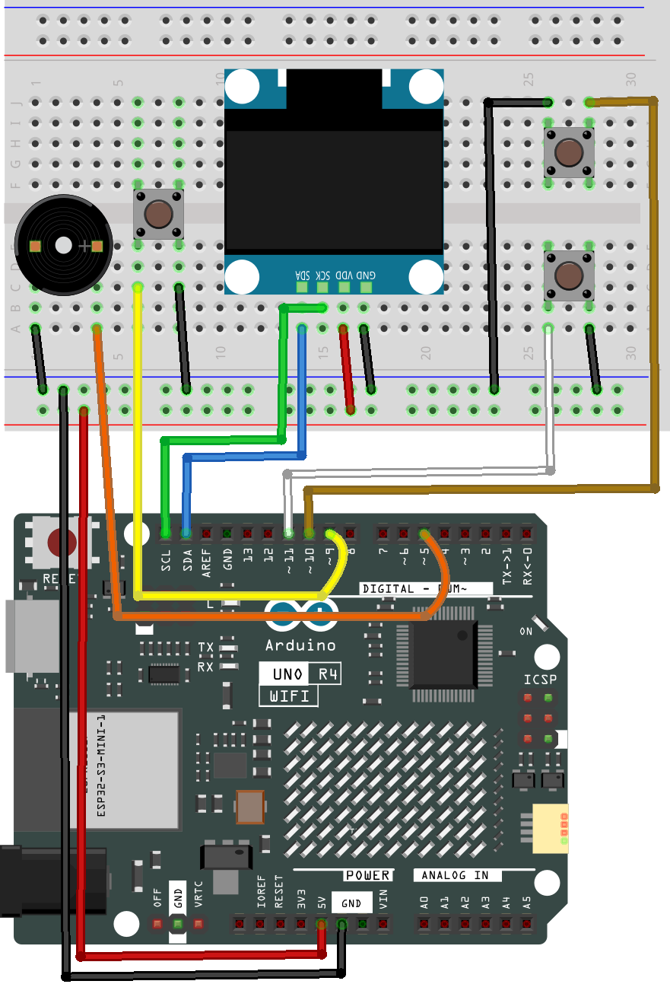

.. _shooting_game:

Shooting Game
==============================================================

.. note::
  
  🌟 Welcome to the SunFounder Facebook Community! Whether you're into Raspberry Pi, Arduino, or ESP32, you'll find inspiration, help ideas here.
   
  - ✅ Be the first to get free learning resources. 
   
  - ✅ Stay updated on new products & exclusive giveaways. 
   
  - ✅ Share your creations and get real feedback.
   
  * 👉 Need faster updates or support? Click [|link_sf_facebook|] join our Facebook community 

  * 👉 Or join our WhatsApp group: Click [|link_sf_whatsapp|]
   
Kit purchase
------------------------

Looking for parts? Check out our all-in-one kits below — packed with components, beginner-friendly guides, and tons of fun.

.. image:: img/elite_explore_kit.png
   :width: 100%
   :align: center
   :target: https://www.sunfounder.com/collections/arduino-kits-bundles/products/sunfounder-elite-explorer-kit-with-official-arduino-uno-r4-wifi?ref=jbzmncle

.. raw:: html

     

.. list-table::
   :widths: 20 20 20
   :header-rows: 1

   * - Name
     - Includes Arduino board
     - PURCHASE LINK
   * - Elite Explorer Kit
     - Arduino Uno R4 WiFi
     - |link_elite_buy|
   * - Inventor Lab Kit
     - Arduino Uno R3
     - |link_inventorkit_buy|

Course Introduction
------------------------

In this lesson, you'll use an OLED display, three buttons, and a passive buzzer with the Arduino UNO R4 WiFi to create a retro space shooting game.

Move the X-Wing up and down, fire at the Death Star, and dodge incoming attacks. The game ends when the player runs out of lives.

.. .. raw:: html

..  <iframe width="700" height="394" src="https://www.youtube.com/embed/PkFBRMxYFRk" title="YouTube video player" frameborder="0" allow="accelerometer; autoplay; clipboard-write; encrypted-media; gyroscope; picture-in-picture; web-share" referrerpolicy="strict-origin-when-cross-origin" allowfullscreen></iframe>

.. note::

  If this is your first time working with an Arduino project, we recommend downloading and reviewing the basic materials first.

  * :ref:`install_arduino`
  * :ref:`introduce_arduino`

**Required Components**

In this project, we need the following components:

.. list-table::
    :widths: 5 20 5 20
    :header-rows: 1

    *   - SN
        - COMPONENT INTRODUCTION	
        - QUANTITY
        - PURCHASE LINK

    *   - 1
        - Arduino UNO R4 Wifi
        - 1
        - |link_unor4_wifi_buy|
    *   - 2
        - USB Type-C cable
        - 1
        - 
    *   - 3
        - Breadboard
        - 1
        - |link_breadboard_buy|
    *   - 4
        - Wires
        - Several
        - |link_wires_buy|
    *   - 5
        - Button
        - 3
        - |link_button_buy|
    *   - 6
        - OLED Display Module
        - 1
        - |link_oled_buy|
    *   - 7
        - Passive Buzzer
        - 1
        - |link_passive_buzzer_buy|

**Wiring**

**Common Connections:**

* **OLED Display Module**

  - **SDA:** Connect to **SDA** on the Arduino.
  - **SCK:** Connect to **SCL** on the Arduino.
  - **GND:** Connect to breadboard’s negative power bus.
  - **VCC:** Connect to breadboard’s red power bus.

* **Buttons**

  - Connect to breadboard’s negative power bus.
  - **up:** Connect to **11** on the Arduino.
  - **down:** Connect to **10** on the Arduino.
  - **shoot:** Connect to **9** on the Arduino.

* **Passive Buzzer**

  - **＋:** Connect to **5** on the Arduino.
  - **－:** Connect to breadboard’s negative power bus.

**Writing the Code**

.. note::

    * You can copy this code into **Arduino IDE**. 
    * To install the library, use the Arduino Library Manager and search for **Adafruit SSD1306** and **Adafruit GFX** and install it.
    * Don't forget to select the board(Arduino UNO R4 WIFI) and the correct port before clicking the **Upload** button.

.. code-block:: arduino

      /*
      * Death Star vs X-Wing
      *
      * Board: Arduino UNO R4 WiFi
      * Display: 128x64 I2C SSD1306 OLED
      * Controls:
      *   D11 = Move up
      *   D10 = Move down
      *   D9  = Shoot / Restart
      *   D5  = Passive buzzer
      */

      #include <Wire.h>
      #include <Adafruit_GFX.h>
      #include <Adafruit_SSD1306.h>

      // ---------------- OLED ----------------

      #define SCREEN_WIDTH 128
      #define SCREEN_HEIGHT 64
      #define OLED_RESET -1
      #define OLED_ADDRESS 0x3C

      Adafruit_SSD1306 display(
        SCREEN_WIDTH,
        SCREEN_HEIGHT,
        &Wire,
        OLED_RESET
      );

      // ---------------- Pins ----------------

      const uint8_t SHOOT_BUTTON_PIN = 9;
      const uint8_t DOWN_BUTTON_PIN = 10;
      const uint8_t UP_BUTTON_PIN = 11;
      const uint8_t BUZZER_PIN = 5;

      // ---------------- Game settings ----------------

      const int PLAYER_X = 4;
      const int PLAYER_WIDTH = 16;
      const int PLAYER_HEIGHT = 12;

      const int ENEMY_X = 105;

      const int MAX_ENEMY_BULLETS = 4;

      const unsigned long FRAME_INTERVAL = 35;
      const unsigned long LEVEL_INTERVAL = 50000;
      const unsigned long BUTTON_DEBOUNCE = 25;

      // ---------------- Player bitmap ----------------

      // A compact 16x12 X-Wing-style ship
      const uint8_t PROGMEM xWingBitmap[] = {
        0b00000001, 0b10000000,
        0b00000011, 0b11000000,
        0b10000111, 0b11100001,
        0b11001111, 0b11110011,
        0b01111111, 0b11111110,
        0b00111111, 0b11111100,
        0b00111111, 0b11111100,
        0b01111111, 0b11111110,
        0b11001111, 0b11110011,
        0b10000111, 0b11100001,
        0b00000011, 0b11000000,
        0b00000001, 0b10000000
      };

      // ---------------- Game states ----------------

      enum GameState {
        START_SCREEN,
        PLAYING,
        GAME_OVER
      };

      GameState gameState = START_SCREEN;

      // ---------------- Enemy bullet ----------------

      struct EnemyBullet {
        float x;
        int y;
        int radius;
        bool active;
      };

      EnemyBullet enemyBullets[MAX_ENEMY_BULLETS];

      // ---------------- Game variables ----------------

      int playerY = 27;

      bool playerBulletActive = false;
      float playerBulletX = 0;
      int playerBulletY = 0;

      int enemyY = 15;
      int enemyDirection = 1;
      int enemyRadius = 9;

      unsigned long score = 0;
      int lives = 5;
      int level = 1;

      float enemyBulletSpeed = 75.0;
      float enemyMoveSpeed = 32.0;

      unsigned long gameStartTime = 0;
      unsigned long lastFrameTime = 0;
      unsigned long lastLevelTime = 0;
      unsigned long lastEnemyShotTime = 0;

      unsigned long nextEnemyShotDelay = 900;

      // Button debounce
      bool lastShootReading = HIGH;
      bool stableShootState = HIGH;
      unsigned long lastShootChangeTime = 0;

      // ---------------- Setup ----------------

      void setup() {
        pinMode(SHOOT_BUTTON_PIN, INPUT_PULLUP);
        pinMode(DOWN_BUTTON_PIN, INPUT_PULLUP);
        pinMode(UP_BUTTON_PIN, INPUT_PULLUP);

        pinMode(BUZZER_PIN, OUTPUT);
        digitalWrite(BUZZER_PIN, LOW);

        Serial.begin(115200);

        // Some OLED modules need a short startup delay.
        delay(100);

        if (!display.begin(
              SSD1306_SWITCHCAPVCC,
              OLED_ADDRESS
            )) {
          Serial.println("SSD1306 initialization failed.");

          while (true) {
            tone(BUZZER_PIN, 200, 100);
            delay(500);
          }
        }

        display.clearDisplay();
        display.setTextColor(SSD1306_WHITE);
        display.display();

        randomSeed(analogRead(A1) ^ micros());

        showStartScreen();
      }

      // ---------------- Main loop ----------------

      void loop() {
        bool shootPressed = readShootButtonPressed();

        if (gameState == START_SCREEN) {
          if (shootPressed) {
            startGame();
          }

          return;
        }

        if (gameState == GAME_OVER) {
          if (shootPressed) {
            startGame();
          }

          return;
        }

        unsigned long currentTime = millis();

        if (shootPressed && !playerBulletActive) {
          firePlayerBullet();
        }

        if (currentTime - lastFrameTime < FRAME_INTERVAL) {
          return;
        }

        float deltaTime =
          (currentTime - lastFrameTime) / 1000.0;

        lastFrameTime = currentTime;

        updatePlayer();
        updatePlayerBullet(deltaTime);
        updateEnemy(deltaTime);
        updateEnemyBullets(deltaTime);
        updateEnemyFire();
        updateLevel();

        checkPlayerBulletCollision();
        checkEnemyBulletCollisions();

        if (lives <= 0) {
          endGame();
          return;
        }

        drawGame();
      }

      // ---------------- Button handling ----------------

      bool readShootButtonPressed() {
        bool reading = digitalRead(SHOOT_BUTTON_PIN);

        if (reading != lastShootReading) {
          lastShootChangeTime = millis();
        }

        bool pressed = false;

        if (
          millis() - lastShootChangeTime >=
          BUTTON_DEBOUNCE
        ) {
          if (reading != stableShootState) {
            stableShootState = reading;

            if (stableShootState == LOW) {
              pressed = true;
            }
          }
        }

        lastShootReading = reading;

        return pressed;
      }

      // ---------------- Game control ----------------

      void startGame() {
        score = 0;
        lives = 5;
        level = 1;

        playerY = 27;

        playerBulletActive = false;

        enemyY = 15;
        enemyDirection = 1;
        enemyRadius = 9;

        enemyBulletSpeed = 75.0;
        enemyMoveSpeed = 32.0;

        for (int i = 0; i < MAX_ENEMY_BULLETS; i++) {
          enemyBullets[i].active = false;
        }

        gameStartTime = millis();
        lastFrameTime = millis();
        lastLevelTime = millis();
        lastEnemyShotTime = millis();

        nextEnemyShotDelay = random(700, 1300);

        gameState = PLAYING;

        playStartSound();
      }

      void endGame() {
        gameState = GAME_OVER;

        tone(BUZZER_PIN, 300, 180);
        delay(200);

        tone(BUZZER_PIN, 220, 220);
        delay(240);

        tone(BUZZER_PIN, 150, 350);
        delay(380);

        showGameOverScreen();
      }

      // ---------------- Player ----------------

      void updatePlayer() {
        const int moveStep = 2;

        if (
          digitalRead(UP_BUTTON_PIN) == LOW &&
          playerY > 10
        ) {
          playerY -= moveStep;
        }

        if (
          digitalRead(DOWN_BUTTON_PIN) == LOW &&
          playerY < SCREEN_HEIGHT - PLAYER_HEIGHT - 1
        ) {
          playerY += moveStep;
        }
      }

      void firePlayerBullet() {
        playerBulletActive = true;

        playerBulletX =
          PLAYER_X + PLAYER_WIDTH;

        playerBulletY =
          playerY + PLAYER_HEIGHT / 2;

        tone(BUZZER_PIN, 1250, 35);
      }

      void updatePlayerBullet(float deltaTime) {
        if (!playerBulletActive) {
          return;
        }

        playerBulletX += 240.0 * deltaTime;

        if (playerBulletX > SCREEN_WIDTH + 5) {
          playerBulletActive = false;
        }
      }

      // ---------------- Enemy ----------------

      void updateEnemy(float deltaTime) {
        enemyY +=
          enemyDirection * enemyMoveSpeed * deltaTime;

        if (enemyY >= SCREEN_HEIGHT - enemyRadius - 1) {
          enemyY = SCREEN_HEIGHT - enemyRadius - 1;
          enemyDirection = -1;
        }

        if (enemyY <= enemyRadius + 9) {
          enemyY = enemyRadius + 9;
          enemyDirection = 1;
        }
      }

      void updateEnemyFire() {
        unsigned long currentTime = millis();

        if (
          currentTime - lastEnemyShotTime <
          nextEnemyShotDelay
        ) {
          return;
        }

        lastEnemyShotTime = currentTime;

        fireEnemyBullet();

        int minimumDelay = max(280, 850 - level * 45);
        int maximumDelay = max(450, 1350 - level * 55);

        nextEnemyShotDelay =
          random(minimumDelay, maximumDelay);
      }

      void fireEnemyBullet() {
        for (int i = 0; i < MAX_ENEMY_BULLETS; i++) {
          if (!enemyBullets[i].active) {
            enemyBullets[i].active = true;
            enemyBullets[i].x =
              ENEMY_X - enemyRadius;

            enemyBullets[i].y =
              enemyY + random(-enemyRadius / 2,
                              enemyRadius / 2 + 1);

            enemyBullets[i].radius =
              random(1, 4);

            return;
          }
        }
      }

      void updateEnemyBullets(float deltaTime) {
        for (int i = 0; i < MAX_ENEMY_BULLETS; i++) {
          if (!enemyBullets[i].active) {
            continue;
          }

          enemyBullets[i].x -=
            enemyBulletSpeed * deltaTime;

          if (enemyBullets[i].x < -5) {
            enemyBullets[i].active = false;
          }
        }
      }

      // ---------------- Difficulty ----------------

      void updateLevel() {
        unsigned long currentTime = millis();

        if (
          currentTime - lastLevelTime <
          LEVEL_INTERVAL
        ) {
          return;
        }

        lastLevelTime = currentTime;
        level++;

        enemyBulletSpeed += 12.0;
        enemyMoveSpeed += 4.0;

        if (enemyBulletSpeed > 190.0) {
          enemyBulletSpeed = 190.0;
        }

        if (enemyMoveSpeed > 75.0) {
          enemyMoveSpeed = 75.0;
        }

        if (level % 2 == 0 && enemyRadius > 5) {
          enemyRadius--;
        }

        tone(BUZZER_PIN, 900, 80);
        delay(90);
        tone(BUZZER_PIN, 1200, 100);
      }

      // ---------------- Collision detection ----------------

      bool pointInsideCircle(
        int px,
        int py,
        int cx,
        int cy,
        int radius
      ) {
        long dx = px - cx;
        long dy = py - cy;

        return dx * dx + dy * dy <=
              (long)radius * radius;
      }

      void checkPlayerBulletCollision() {
        if (!playerBulletActive) {
          return;
        }

        int bulletX = (int)playerBulletX;

        if (
          pointInsideCircle(
            bulletX,
            playerBulletY,
            ENEMY_X,
            enemyY,
            enemyRadius + 2
          )
        ) {
          playerBulletActive = false;
          score++;

          tone(BUZZER_PIN, 650, 45);
        }
      }

      void checkEnemyBulletCollisions() {
        int playerCenterY =
          playerY + PLAYER_HEIGHT / 2;

        for (int i = 0; i < MAX_ENEMY_BULLETS; i++) {
          if (!enemyBullets[i].active) {
            continue;
          }

          int bulletX = (int)enemyBullets[i].x;
          int bulletY = enemyBullets[i].y;
          int radius = enemyBullets[i].radius;

          bool horizontalHit =
            bulletX + radius >= PLAYER_X + 2 &&
            bulletX - radius <=
              PLAYER_X + PLAYER_WIDTH - 2;

          bool verticalHit =
            bulletY + radius >= playerY + 2 &&
            bulletY - radius <=
              playerY + PLAYER_HEIGHT - 2;

          if (horizontalHit && verticalHit) {
            enemyBullets[i].active = false;
            lives--;

            tone(BUZZER_PIN, 120, 120);

            // Move the other bullets away briefly
            for (int j = 0; j < MAX_ENEMY_BULLETS; j++) {
              if (j != i) {
                enemyBullets[j].active = false;
              }
            }

            lastEnemyShotTime = millis();

            return;
          }
        }
      }

      // ---------------- Drawing ----------------

      void drawGame() {
        display.clearDisplay();

        drawStars();
        drawPlayer();
        drawEnemy();
        drawBullets();
        drawStatusBar();

        display.display();
      }

      void drawStars() {
        // Fixed stars avoid visible flickering.
        const uint8_t stars[][2] = {
          {24, 15}, {34, 31}, {45, 18},
          {57, 43}, {69, 25}, {78, 52},
          {87, 17}, {96, 46}, {116, 22},
          {22, 52}, {51, 55}, {73, 12}
        };

        const int starCount =
          sizeof(stars) / sizeof(stars[0]);

        for (int i = 0; i < starCount; i++) {
          display.drawPixel(
            stars[i][0],
            stars[i][1],
            SSD1306_WHITE
          );
        }
      }

      void drawPlayer() {
        display.drawBitmap(
          PLAYER_X,
          playerY,
          xWingBitmap,
          PLAYER_WIDTH,
          PLAYER_HEIGHT,
          SSD1306_WHITE
        );
      }

      void drawEnemy() {
        display.fillCircle(
          ENEMY_X,
          enemyY,
          enemyRadius,
          SSD1306_WHITE
        );

        display.fillCircle(
          ENEMY_X + 2,
          enemyY + 2,
          max(1, enemyRadius / 3),
          SSD1306_BLACK
        );

        display.drawLine(
          ENEMY_X - enemyRadius,
          enemyY,
          ENEMY_X + enemyRadius,
          enemyY,
          SSD1306_BLACK
        );
      }

      void drawBullets() {
        if (playerBulletActive) {
          int x = (int)playerBulletX;

          display.drawLine(
            x,
            playerBulletY,
            x + 5,
            playerBulletY,
            SSD1306_WHITE
          );
        }

        for (int i = 0; i < MAX_ENEMY_BULLETS; i++) {
          if (!enemyBullets[i].active) {
            continue;
          }

          display.drawCircle(
            (int)enemyBullets[i].x,
            enemyBullets[i].y,
            enemyBullets[i].radius,
            SSD1306_WHITE
          );
        }
      }

      void drawStatusBar() {
        display.fillRect(
          0,
          0,
          SCREEN_WIDTH,
          9,
          SSD1306_BLACK
        );

        display.drawLine(
          0,
          9,
          SCREEN_WIDTH - 1,
          9,
          SSD1306_WHITE
        );

        display.setTextSize(1);
        display.setTextColor(SSD1306_WHITE);

        display.setCursor(0, 0);
        display.print("S:");
        display.print(score);

        display.setCursor(42, 0);
        display.print("HP:");
        display.print(lives);

        display.setCursor(81, 0);
        display.print("L:");
        display.print(level);

        unsigned long elapsedSeconds =
          (millis() - gameStartTime) / 1000;

        display.setCursor(105, 0);
        display.print(elapsedSeconds);
      }

      // ---------------- Screens ----------------

      void showStartScreen() {
        display.clearDisplay();

        display.setTextColor(SSD1306_WHITE);

        display.setTextSize(2);
        display.setCursor(8, 5);
        display.println("X-WING");

        display.setTextSize(1);
        display.setCursor(27, 27);
        display.println("VS DEATH STAR");

        display.setCursor(14, 43);
        display.println("UP/DOWN: MOVE");

        display.setCursor(14, 54);
        display.println("PRESS FIRE");

        display.display();

        playStartSound();
      }

      void showGameOverScreen() {
        display.clearDisplay();

        display.setTextColor(SSD1306_WHITE);

        display.setTextSize(2);
        display.setCursor(8, 4);
        display.println("GAME OVER");

        display.setTextSize(1);

        display.setCursor(22, 27);
        display.print("SCORE: ");
        display.println(score);

        display.setCursor(22, 38);
        display.print("LEVEL: ");
        display.println(level);

        unsigned long elapsedSeconds =
          (millis() - gameStartTime) / 1000;

        display.setCursor(22, 49);
        display.print("TIME: ");
        display.print(elapsedSeconds);
        display.println("s");

        display.setCursor(10, 58);
        display.println("PRESS FIRE AGAIN");

        display.display();
      }

      // ---------------- Sounds ----------------

      void playStartSound() {
        const int melody[] = {
          440, 440, 440,
          349, 523,
          440, 349,
          523, 440
        };

        const int durations[] = {
          140, 140, 140,
          100, 60,
          140, 100,
          60, 220
        };

        const int noteCount =
          sizeof(melody) / sizeof(melody[0]);

        for (int i = 0; i < noteCount; i++) {
          tone(
            BUZZER_PIN,
            melody[i],
            durations[i]
          );

          delay(durations[i] + 25);
        }

        noTone(BUZZER_PIN);
      }