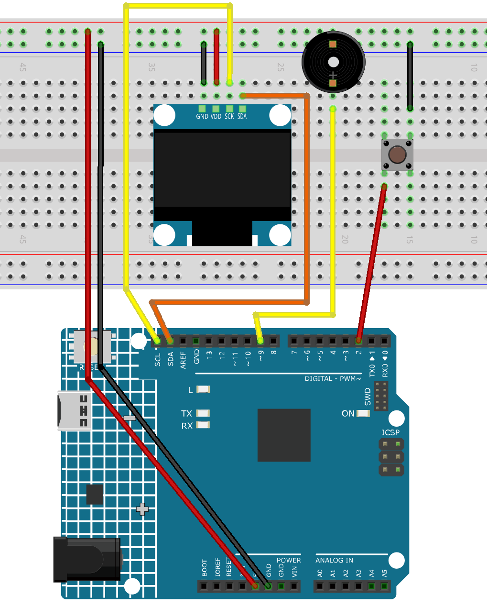

.. _slot_machine:

Slot Machine
==============================================================

.. note::
  
  🌟 Welcome to the SunFounder Facebook Community! Whether you're into Raspberry Pi, Arduino, or ESP32, you'll find inspiration, help ideas here.
   
  - ✅ Be the first to get free learning resources. 
   
  - ✅ Stay updated on new products & exclusive giveaways. 
   
  - ✅ Share your creations and get real feedback.
   
  * 👉 Need faster updates or support? Click [|link_sf_facebook|] join our Facebook community 

  * 👉 Or join our WhatsApp group: Click [|link_sf_whatsapp|]
   
Kit purchase
------------------------

Looking for parts? Check out our all-in-one kits below — packed with components, beginner-friendly guides, and tons of fun.

.. image:: img/elite_explore_kit.png
   :width: 100%
   :align: center
   :target: https://www.sunfounder.com/collections/arduino-kits-bundles/products/sunfounder-elite-explorer-kit-with-official-arduino-uno-r4-wifi?ref=jbzmncle

.. raw:: html

     

.. list-table::
   :widths: 20 20 20
   :header-rows: 1

   * - Name
     - Includes Arduino board
     - PURCHASE LINK
   * - Elite Explorer Kit
     - Arduino Uno R4 WiFi
     - |link_elite_buy|
   * - Inventor Lab Kit
     - Arduino Uno R3
     - |link_inventorkit_buy|

Course Introduction
------------------------

In this lesson, you’ll learn how to use an OLED display, a button, and a buzzer with the Arduino R4 UNO to create a Slot Machine game.

The OLED shows spinning reels with custom icons, the button starts the spin, and the buzzer plays sound effects for spinning, winning, or losing.

.. raw:: html

  <iframe width="700" height="394" src="https://www.youtube.com/embed/dPAmdb7WiMs" title="YouTube video player" frameborder="0" allow="accelerometer; autoplay; clipboard-write; encrypted-media; gyroscope; picture-in-picture; web-share" referrerpolicy="strict-origin-when-cross-origin" allowfullscreen></iframe>

.. note::

  If this is your first time working with an Arduino project, we recommend downloading and reviewing the basic materials first.

  * :ref:`install_arduino`
  * :ref:`introduce_arduino`

**Required Components**

In this project, we need the following components:

.. list-table::
    :widths: 5 20 5 20
    :header-rows: 1

    *   - SN
        - COMPONENT INTRODUCTION	
        - QUANTITY
        - PURCHASE LINK

    *   - 1
        - Arduino UNO R4 Wifi
        - 1
        - |link_unor4_wifi_buy|
    *   - 2
        - USB Type-C cable
        - 1
        - 
    *   - 3
        - Breadboard
        - 1
        - |link_breadboard_buy|
    *   - 4
        - Wires
        - Several
        - |link_wires_buy|
    *   - 5
        - Button
        - 1
        - |link_button_buy|
    *   - 6
        - OLED Display Module
        - 1
        - |link_oled_buy|
    *   - 7
        - Active Buzzer
        - 1
        - 

**Wiring**

**Common Connections:**

* **OLED Display Module**

  - **SDA:** Connect to **SDA** on the Arduino.
  - **SCK:** Connect to **SCL** on the Arduino.
  - **GND:** Connect to breadboard’s negative power bus.
  - **VCC:** Connect to breadboard’s red power bus.

* **Button**

  - Connect to breadboard’s negative power bus.
  - Connect to **2** on the Arduino.

* **Active Buzzer**

  - Connect to breadboard’s negative power bus.
  - Connect to **9** on the Arduino.

**Writing the Code**

.. note::

    * You can copy this code into **Arduino IDE**. 
    * To install the library, use the Arduino Library Manager and search for **Adafruit SSD1306** and **Adafruit GFX** and install it.
    * Don't forget to select the board(Arduino UNO R4 WIFI) and the correct port before clicking the **Upload** button.

.. code-block:: arduino

    #include <Wire.h>
    #include <Adafruit_GFX.h>
    #include <Adafruit_SSD1306.h>

    #define SCREEN_WIDTH 128
    #define SCREEN_HEIGHT 64
    #define OLED_RESET -1
    #define OLED_ADDR 0x3C

    #define BTN_PIN     2
    #define BUZZER_PIN  9

    Adafruit_SSD1306 display(SCREEN_WIDTH, SCREEN_HEIGHT, &Wire, OLED_RESET);

    // ===================== Three "slot" layout =====================
    const int CELL_W = 34;
    const int CELL_H = 34;
    const int GAP    = 6;
    const int AREA_W = CELL_W*3 + GAP*2;
    const int START_X = (SCREEN_WIDTH - AREA_W)/2;
    const int START_Y = 16;

    int reels[3] = {0, 1, 2};

    enum Symbol { CHERRY=0, STAR=1, LEMON=2, HEART=3, SEVEN=4 };
    const int ICON_COUNT = 5;

    // ===================== Sound effects =====================
    void playWinJingle() {
      int notes[] = { 784, 988, 1175, 1568 }; // G5,B5,D6,G6
      int durs[]  = { 120, 120, 120, 220 };
      for (int i=0;i<4;i++) {
        tone(BUZZER_PIN, notes[i], durs[i]);
        delay(durs[i]+40);
      }
      noTone(BUZZER_PIN);
    }

    void playLoseBeep() {
      tone(BUZZER_PIN, 420, 100); delay(130);
      tone(BUZZER_PIN, 360, 100); delay(130);
      noTone(BUZZER_PIN);
    }

    // New: start sound (right when spin starts)
    void playStartChirp() {
      tone(BUZZER_PIN, 900, 80); delay(90);
      tone(BUZZER_PIN, 1200, 90); delay(110);
      noTone(BUZZER_PIN);
    }

    // Spin "tick" sound (short beep every step)
    void spinTick() {
      tone(BUZZER_PIN, 950, 18);
      // No extra delay; handled by main loop refresh rhythm
    }

    // ===================== Layout & drawing =====================
    void drawSlotFrames() {
      for (int i=0;i<3;i++) {
        int x = START_X + i*(CELL_W+GAP);
        display.drawRoundRect(x, START_Y, CELL_W, CELL_H, 4, SSD1306_WHITE);
      }
    }

    void cellCenter(int cellIndex, int &cx, int &cy) {
      int x = START_X + cellIndex*(CELL_W+GAP);
      cx = x + CELL_W/2;
      cy = START_Y + CELL_H/2;
    }

    // ===== Vector icons =====
    void drawCherry(int cx, int cy) {
      int r = 5;
      display.fillCircle(cx-5, cy+4, r, SSD1306_WHITE);
      display.fillCircle(cx+5, cy+4, r, SSD1306_WHITE);
      display.drawLine(cx-2, cy-6, cx-6, cy+0, SSD1306_WHITE);
      display.drawLine(cx+2, cy-6, cx+6, cy+0, SSD1306_WHITE);
      display.drawLine(cx-2, cy-6, cx+2, cy-10, SSD1306_WHITE);
    }
    void drawStar(int cx, int cy) {
      int r1 = 10, r2 = 4;
      int px[5], py[5];
      for (int i=0;i<5;i++) {
        float a = -90 + i*72;
        float rad = a * 3.14159 / 180.0;
        px[i] = cx + (int)(r1 * cos(rad));
        py[i] = cy + (int)(r1 * sin(rad));
      }
      for (int i=0;i<5;i++) display.drawLine(px[i], py[i], px[(i+2)%5], py[(i+2)%5], SSD1306_WHITE);
      display.fillCircle(cx, cy, r2, SSD1306_WHITE);
    }
    void drawLemon(int cx, int cy) {
      int w = 20, h = 12, r = 6;
      int x = cx - w/2, y = cy - h/2;
      display.fillRoundRect(x, y, w, h, r, SSD1306_WHITE);
      display.fillRoundRect(x+2, y+2, w-4, h-4, r-3, SSD1306_BLACK);
      display.drawPixel(x-1, cy, SSD1306_WHITE);
      display.drawPixel(x+w+1, cy, SSD1306_WHITE);
    }
    void drawHeart(int cx, int cy) {
      int r = 6;
      display.fillCircle(cx-5, cy-2, r, SSD1306_WHITE);
      display.fillCircle(cx+5, cy-2, r, SSD1306_WHITE);
      display.fillTriangle(cx-10, cy, cx+10, cy, cx, cy+12, SSD1306_WHITE);
    }
    void drawSeven(int cx, int cy) {
      int w = 18, th = 3;
      int x0 = cx - w/2;
      display.fillRect(x0, cy-9, w, th, SSD1306_WHITE);
      for (int i=0;i<10;i++) {
        display.drawLine(cx + (i/2), cy-9 + th + i, cx + (i/2) + 1, cy-9 + th + i + 1, SSD1306_WHITE);
      }
    }

    void drawIconInCell(int cellIndex, int symbol) {
      int cx, cy; cellCenter(cellIndex, cx, cy);
      switch (symbol) {
        case CHERRY: drawCherry(cx, cy); break;
        case STAR:   drawStar(cx, cy);   break;
        case LEMON:  drawLemon(cx, cy);  break;
        case HEART:  drawHeart(cx, cy);  break;
        case SEVEN:  drawSeven(cx, cy);  break;
      }
    }

    // ===================== Screen & logic =====================
    bool isJackpot() {
      return (reels[0] == reels[1]) && (reels[1] == reels[2]);
    }

    void showIdle() {
      display.clearDisplay();
      display.setTextSize(2);
      display.setTextColor(SSD1306_WHITE);
      display.setCursor(20, 0);
      display.println("SLOT");
      drawSlotFrames();
      for (int i=0;i<3;i++) drawIconInCell(i, reels[i]);
      display.setTextSize(1);
      display.setCursor(18, SCREEN_HEIGHT-10);
      display.println("Press button to spin");
      display.display();
    }

    void drawSpinScreen() {
      display.clearDisplay();
      display.setTextSize(1);
      display.setCursor(32, 2);
      display.println("SPINNING...");
      drawSlotFrames();
      for (int i=0;i<3;i++) drawIconInCell(i, reels[i]);
      display.display();
    }

    // Key modification: tick sound while spinning + start sound
    void spinAndStop() {
      playStartChirp(); // Play start sound immediately after button press

      unsigned long start = millis();
      unsigned long stopAt[3] = { start + 700, start + 1100, start + 1500 };
      int stepDelay[3] = { 40, 55, 70 };
      bool stopped[3] = {false,false,false};

      // Control tick rhythm (avoid too dense)
      unsigned long lastTickMs = 0;
      const unsigned long tickGapMs = 28; // Minimum interval between ticks

      while (!(stopped[0] && stopped[1] && stopped[2])) {
        unsigned long now = millis();
        bool anyStepChanged = false;

        for (int r=0;r<3;r++) {
          if (!stopped[r]) {
            if (now >= stopAt[r]) {
              stopped[r] = true;
              reels[r] = random(ICON_COUNT);
              anyStepChanged = true;
            } else {
              // Spinning effect: change icon at step rate
              static unsigned long lastPhase[3] = {0,0,0};
              if (now - lastPhase[r] >= (unsigned long)stepDelay[r]) {
                lastPhase[r] = now;
                reels[r] = (reels[r] + 1) % ICON_COUNT;
                anyStepChanged = true;
              }
            }
          }
        }

        if (anyStepChanged && (now - lastTickMs >= tickGapMs)) {
          spinTick();              // Play short tick
          lastTickMs = now;
        }

        drawSpinScreen();
        delay(8); // Refresh rate
      }
    }

    void showResult() {
      display.clearDisplay();
      drawSlotFrames();
      for (int i=0;i<3;i++) drawIconInCell(i, reels[i]);

      display.setTextSize(1);
      display.setCursor(6, 2);
      if (isJackpot()) {
        display.println("JACKPOT! You win!");
        display.display();
        playWinJingle();      // Win sound effect
      } else {
        display.println("Try Again");
        display.display();
        playLoseBeep();
      }
    }

    void setup() {
      pinMode(BTN_PIN, INPUT_PULLUP);
      pinMode(BUZZER_PIN, OUTPUT);
      noTone(BUZZER_PIN);

      if (!display.begin(SSD1306_SWITCHCAPVCC, OLED_ADDR)) {
        for(;;);
      }
      display.clearDisplay();
      display.display();

      randomSeed(analogRead(A0));
      showIdle();
    }

    void loop() {
      if (digitalRead(BTN_PIN) == LOW) {
        delay(25);
        if (digitalRead(BTN_PIN) == LOW) {
          spinAndStop();     // Start sound + tick sound handled here
          showResult();      // Win sound effect handled here
          while (digitalRead(BTN_PIN) == LOW) { delay(10); }
          delay(120);
          showIdle();
        }
      }
    }
