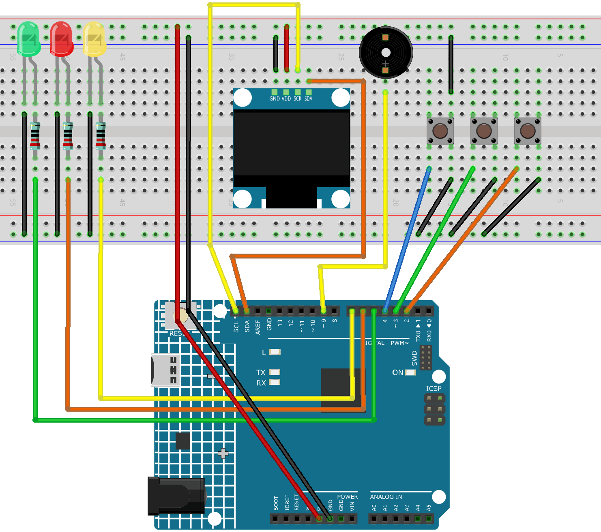

.. _slot_machine2.0:

Slot Machine 2.0
==============================================================

.. note::
  
  🌟 Welcome to the SunFounder Facebook Community! Whether you're into Raspberry Pi, Arduino, or ESP32, you'll find inspiration, help ideas here.
   
  - ✅ Be the first to get free learning resources. 
   
  - ✅ Stay updated on new products & exclusive giveaways. 
   
  - ✅ Share your creations and get real feedback.
   
  * 👉 Need faster updates or support? Click [|link_sf_facebook|] join our Facebook community 

  * 👉 Or join our WhatsApp group: Click [|link_sf_whatsapp|]
   
Kit purchase
------------------------

Looking for parts? Check out our all-in-one kits below — packed with components, beginner-friendly guides, and tons of fun.

.. image:: img/elite_explore_kit.png
   :width: 100%
   :align: center
   :target: https://www.sunfounder.com/collections/arduino-kits-bundles/products/sunfounder-elite-explorer-kit-with-official-arduino-uno-r4-wifi?ref=jbzmncle

.. raw:: html

     

.. list-table::
   :widths: 20 20 20
   :header-rows: 1

   * - Name
     - Includes Arduino board
     - PURCHASE LINK
   * - Elite Explorer Kit
     - Arduino Uno R4 WiFi
     - |link_elite_buy|
   * - Inventor Lab Kit
     - Arduino Uno R3
     - |link_inventorkit_buy|

Course Introduction
------------------------

In this lesson, you’ll learn how to use an OLED display, buttons, and a buzzer with the Arduino R4 UNO to create a Slot Machine game 2.0.

The OLED shows spinning reels with custom icons, the button starts the spin, and the buzzer plays sound effects for spinning, winning, or losing.

.. .. raw:: html

..  <iframe width="700" height="394" src="https://www.youtube.com/embed/dPAmdb7WiMs" title="YouTube video player" frameborder="0" allow="accelerometer; autoplay; clipboard-write; encrypted-media; gyroscope; picture-in-picture; web-share" referrerpolicy="strict-origin-when-cross-origin" allowfullscreen></iframe>

.. note::

  If this is your first time working with an Arduino project, we recommend downloading and reviewing the basic materials first.

  * :ref:`install_arduino`
  * :ref:`introduce_arduino`

**Required Components**

In this project, we need the following components:

.. list-table::
    :widths: 5 20 5 20
    :header-rows: 1

    *   - SN
        - COMPONENT INTRODUCTION	
        - QUANTITY
        - PURCHASE LINK

    *   - 1
        - Arduino UNO R4 Wifi
        - 1
        - |link_unor4_wifi_buy|
    *   - 2
        - USB Type-C cable
        - 1
        - 
    *   - 3
        - Breadboard
        - 1
        - |link_breadboard_buy|
    *   - 4
        - Wires
        - Several
        - |link_wires_buy|
    *   - 5
        - Button
        - 3
        - |link_button_buy|
    *   - 6
        - OLED Display Module
        - 1
        - |link_oled_buy|
    *   - 7
        - Active Buzzer
        - 1
        - 
    *   - 8
        - LED
        - 3
        - |link_led_buy|

**Wiring**

**Common Connections:**

* **OLED Display Module**

  - **SDA:** Connect to **SDA** on the Arduino.
  - **SCK:** Connect to **SCL** on the Arduino.
  - **GND:** Connect to breadboard’s negative power bus.
  - **VCC:** Connect to breadboard’s red power bus.

* **Buttons**

  - Connect to breadboard’s negative power bus.
  - Connect to **2** , **3** , **4** on the Arduino.

* **Active Buzzer**

  - Connect to breadboard’s negative power bus.
  - Connect to **9** on the Arduino.

* **LED**

  - **Green:** Connect the LED **cathode** to  the negative power bus on the breadboard, and the LED **anode** to **1kΩ resistor** then to **5** on the Arduino.
  - **Red:** Connect the LED **cathode** to  the negative power bus on the breadboard, and the LED **anode** to **1kΩ resistor** then to **6** on the Arduino.
  - **Yellow:** Connect the LED **cathode** to  the negative power bus on the breadboard, and the LED **anode** to **1kΩ resistor** then to **7** on the Arduino.

**Writing the Code**

.. note::

    * You can copy this code into **Arduino IDE**. 
    * To install the library, use the Arduino Library Manager and search for **Adafruit SSD1306** and **Adafruit GFX** and install it.
    * Don't forget to select the board(Arduino UNO R4 WIFI) and the correct port before clicking the **Upload** button.

.. code-block:: arduino

      #include <Wire.h>
      #include <Adafruit_GFX.h>
      #include <Adafruit_SSD1306.h>
      #include <math.h>

      #define SCREEN_WIDTH 128
      #define SCREEN_HEIGHT 64
      #define OLED_RESET -1
      #define OLED_ADDR 0x3C

      // ===================== Pins =====================
      #define BTN1_PIN       2
      #define BTN2_PIN       3
      #define BTN3_PIN       4
      #define BUZZER_PIN     9

      #define LED_GREEN_PIN  5
      #define LED_RED_PIN    6
      #define LED_YELLOW_PIN 7

      Adafruit_SSD1306 display(SCREEN_WIDTH, SCREEN_HEIGHT, &Wire, OLED_RESET);

      // ===================== Three "slot" layout =====================
      const int CELL_W = 34;
      const int CELL_H = 34;
      const int GAP    = 6;
      const int AREA_W = CELL_W * 3 + GAP * 2;
      const int START_X = (SCREEN_WIDTH - AREA_W) / 2;
      const int START_Y = 16;

      int reels[3] = {0, 1, 2};

      enum Symbol { CHERRY = 0, STAR = 1, LEMON = 2, HEART = 3, SEVEN = 4 };
      const int ICON_COUNT = 5;

      // ===================== Reel control =====================
      bool spinning[3] = {false, false, false};
      bool finished[3] = {false, false, false};
      bool lastButtonState[3] = {HIGH, HIGH, HIGH};

      unsigned long lastStepTime[3] = {0, 0, 0};
      const int stepDelay[3] = {45, 55, 65};

      bool resultShown = false;

      // ===================== LED control =====================
      bool yellowBlinkState = false;
      unsigned long lastYellowBlink = 0;
      const unsigned long yellowBlinkInterval = 80;

      // ===================== Function declarations =====================
      void allLedsOff();
      void blinkGreenWin();
      void flashRedLose();
      void updateYellowLed();

      void playWinJingle();
      void playLoseBeep();
      void playStartChirp();
      void spinTick();

      void drawSlotFrames();
      void cellCenter(int cellIndex, int &cx, int &cy);
      void drawCherry(int cx, int cy);
      void drawStar(int cx, int cy);
      void drawLemon(int cx, int cy);
      void drawHeart(int cx, int cy);
      void drawSeven(int cx, int cy);
      void drawIconInCell(int cellIndex, int symbol);

      bool isJackpot();
      bool allStopped();

      void startReelSpin(int reelIndex);
      void stopReelSpin(int reelIndex);
      void updateReels();
      void resetGame();

      void showScreen(const char* topText, const char* bottomText);
      void showRunningScreen();

      // ===================== LED functions =====================
      void allLedsOff() {
        digitalWrite(LED_GREEN_PIN, LOW);
        digitalWrite(LED_RED_PIN, LOW);
        digitalWrite(LED_YELLOW_PIN, LOW);
      }

      void blinkGreenWin() {
        for (int i = 0; i < 6; i++) {
          digitalWrite(LED_GREEN_PIN, HIGH);
          delay(120);
          digitalWrite(LED_GREEN_PIN, LOW);
          delay(120);
        }
      }

      void flashRedLose() {
        digitalWrite(LED_RED_PIN, HIGH);
        delay(250);
        digitalWrite(LED_RED_PIN, LOW);
      }

      void updateYellowLed() {
        bool anySpinning = spinning[0] || spinning[1] || spinning[2];

        if (anySpinning) {
          if (millis() - lastYellowBlink >= yellowBlinkInterval) {
            lastYellowBlink = millis();
            yellowBlinkState = !yellowBlinkState;
            digitalWrite(LED_YELLOW_PIN, yellowBlinkState);
          }
        } else {
          yellowBlinkState = false;
          digitalWrite(LED_YELLOW_PIN, LOW);
        }
      }

      // ===================== Sound effects =====================
      void playWinJingle() {
        int notes[] = {784, 988, 1175, 1568}; // G5,B5,D6,G6
        int durs[]  = {120, 120, 120, 220};

        for (int i = 0; i < 4; i++) {
          tone(BUZZER_PIN, notes[i], durs[i]);
          delay(durs[i] + 40);
        }
        noTone(BUZZER_PIN);
      }

      void playLoseBeep() {
        tone(BUZZER_PIN, 420, 100);
        delay(130);
        tone(BUZZER_PIN, 360, 100);
        delay(130);
        noTone(BUZZER_PIN);
      }

      void playStartChirp() {
        tone(BUZZER_PIN, 900, 70);
        delay(20);
        noTone(BUZZER_PIN);
      }

      void spinTick() {
        tone(BUZZER_PIN, 950, 10);
      }

      // ===================== Layout & drawing =====================
      void drawSlotFrames() {
        for (int i = 0; i < 3; i++) {
          int x = START_X + i * (CELL_W + GAP);
          display.drawRoundRect(x, START_Y, CELL_W, CELL_H, 4, SSD1306_WHITE);
        }
      }

      void cellCenter(int cellIndex, int &cx, int &cy) {
        int x = START_X + cellIndex * (CELL_W + GAP);
        cx = x + CELL_W / 2;
        cy = START_Y + CELL_H / 2;
      }

      void drawCherry(int cx, int cy) {
        int r = 5;
        display.fillCircle(cx - 5, cy + 4, r, SSD1306_WHITE);
        display.fillCircle(cx + 5, cy + 4, r, SSD1306_WHITE);
        display.drawLine(cx - 2, cy - 6, cx - 6, cy + 0, SSD1306_WHITE);
        display.drawLine(cx + 2, cy - 6, cx + 6, cy + 0, SSD1306_WHITE);
        display.drawLine(cx - 2, cy - 6, cx + 2, cy - 10, SSD1306_WHITE);
      }

      void drawStar(int cx, int cy) {
        int r1 = 10, r2 = 4;
        int px[5], py[5];

        for (int i = 0; i < 5; i++) {
          float a = -90 + i * 72;
          float rad = a * 3.14159 / 180.0;
          px[i] = cx + (int)(r1 * cos(rad));
          py[i] = cy + (int)(r1 * sin(rad));
        }

        for (int i = 0; i < 5; i++) {
          display.drawLine(px[i], py[i], px[(i + 2) % 5], py[(i + 2) % 5], SSD1306_WHITE);
        }

        display.fillCircle(cx, cy, r2, SSD1306_WHITE);
      }

      void drawLemon(int cx, int cy) {
        int w = 20, h = 12, r = 6;
        int x = cx - w / 2;
        int y = cy - h / 2;

        display.fillRoundRect(x, y, w, h, r, SSD1306_WHITE);
        display.fillRoundRect(x + 2, y + 2, w - 4, h - 4, r - 3, SSD1306_BLACK);
        display.drawPixel(x - 1, cy, SSD1306_WHITE);
        display.drawPixel(x + w + 1, cy, SSD1306_WHITE);
      }

      void drawHeart(int cx, int cy) {
        int r = 6;
        display.fillCircle(cx - 5, cy - 2, r, SSD1306_WHITE);
        display.fillCircle(cx + 5, cy - 2, r, SSD1306_WHITE);
        display.fillTriangle(cx - 10, cy, cx + 10, cy, cx, cy + 12, SSD1306_WHITE);
      }

      void drawSeven(int cx, int cy) {
        int w = 18;
        int th = 3;
        int x0 = cx - w / 2;

        display.fillRect(x0, cy - 9, w, th, SSD1306_WHITE);

        for (int i = 0; i < 10; i++) {
          display.drawLine(cx + (i / 2), cy - 9 + th + i,
                          cx + (i / 2) + 1, cy - 9 + th + i + 1,
                          SSD1306_WHITE);
        }
      }

      void drawIconInCell(int cellIndex, int symbol) {
        int cx, cy;
        cellCenter(cellIndex, cx, cy);

        switch (symbol) {
          case CHERRY: drawCherry(cx, cy); break;
          case STAR:   drawStar(cx, cy);   break;
          case LEMON:  drawLemon(cx, cy);  break;
          case HEART:  drawHeart(cx, cy);  break;
          case SEVEN:  drawSeven(cx, cy);  break;
        }
      }

      // ===================== Game logic =====================
      bool isJackpot() {
        return (reels[0] == reels[1]) && (reels[1] == reels[2]);
      }

      bool allStopped() {
        return finished[0] && finished[1] && finished[2];
      }

      void startReelSpin(int reelIndex) {
        if (!spinning[reelIndex]) {
          spinning[reelIndex] = true;
          finished[reelIndex] = false;
          lastStepTime[reelIndex] = millis();
          resultShown = false;
          playStartChirp();
        }
      }

      void stopReelSpin(int reelIndex) {
        if (spinning[reelIndex]) {
          spinning[reelIndex] = false;
          finished[reelIndex] = true;
          noTone(BUZZER_PIN);
        }
      }

      void updateReels() {
        for (int i = 0; i < 3; i++) {
          if (spinning[i]) {
            unsigned long now = millis();

            if (now - lastStepTime[i] >= (unsigned long)stepDelay[i]) {
              lastStepTime[i] = now;
              reels[i] = (reels[i] + 1) % ICON_COUNT;
              spinTick();
            }
          }
        }
      }

      void resetGame() {
        reels[0] = random(ICON_COUNT);
        reels[1] = random(ICON_COUNT);
        reels[2] = random(ICON_COUNT);

        for (int i = 0; i < 3; i++) {
          spinning[i] = false;
          finished[i] = false;
          lastButtonState[i] = HIGH;
        }

        resultShown = false;
        noTone(BUZZER_PIN);
        allLedsOff();
      }

      void showScreen(const char* topText, const char* bottomText) {
        display.clearDisplay();
        display.setTextSize(1);
        display.setTextColor(SSD1306_WHITE);

        display.setCursor(10, 2);
        display.println(topText);

        drawSlotFrames();
        for (int i = 0; i < 3; i++) {
          drawIconInCell(i, reels[i]);
        }

        display.setCursor(0, SCREEN_HEIGHT - 10);
        display.println(bottomText);
        display.display();
      }

      void showRunningScreen() {
        if (allStopped() && !resultShown) {
          if (isJackpot()) {
            showScreen("RESULT", "JACKPOT! You win!");
            blinkGreenWin();
            playWinJingle();
          } else {
            showScreen("RESULT", "Try Again");
            flashRedLose();
            playLoseBeep();
          }

          resultShown = true;
          allLedsOff();
          delay(300);
          return;
        }

        if (allStopped()) {
          showScreen("DONE", "Press any button restart");
        } else {
          showScreen("SLOT", "Hold btn spin/release stop");
        }
      }

      // ===================== Setup =====================
      void setup() {
        pinMode(BTN1_PIN, INPUT_PULLUP);
        pinMode(BTN2_PIN, INPUT_PULLUP);
        pinMode(BTN3_PIN, INPUT_PULLUP);

        pinMode(BUZZER_PIN, OUTPUT);
        pinMode(LED_GREEN_PIN, OUTPUT);
        pinMode(LED_RED_PIN, OUTPUT);
        pinMode(LED_YELLOW_PIN, OUTPUT);

        allLedsOff();
        noTone(BUZZER_PIN);

        if (!display.begin(SSD1306_SWITCHCAPVCC, OLED_ADDR)) {
          for (;;);
        }

        display.clearDisplay();
        display.display();

        randomSeed(analogRead(A0));
        resetGame();
        showScreen("SLOT", "Hold btn spin/release stop");
      }

      // ===================== Main loop =====================
      void loop() {
        int currentButtonState[3];
        currentButtonState[0] = digitalRead(BTN1_PIN);
        currentButtonState[1] = digitalRead(BTN2_PIN);
        currentButtonState[2] = digitalRead(BTN3_PIN);

        if (allStopped() && resultShown) {
          if (currentButtonState[0] == LOW || currentButtonState[1] == LOW || currentButtonState[2] == LOW) {
            delay(20);
            if (digitalRead(BTN1_PIN) == LOW || digitalRead(BTN2_PIN) == LOW || digitalRead(BTN3_PIN) == LOW) {
              resetGame();
            }
          }
        } else {

          for (int i = 0; i < 3; i++) {
          
            if (lastButtonState[i] == HIGH && currentButtonState[i] == LOW) {
              startReelSpin(i);
            }

            if (lastButtonState[i] == LOW && currentButtonState[i] == HIGH) {
              stopReelSpin(i);
            }

            lastButtonState[i] = currentButtonState[i];
          }
        }

        updateReels();
        updateYellowLed();
        showRunningScreen();
      }