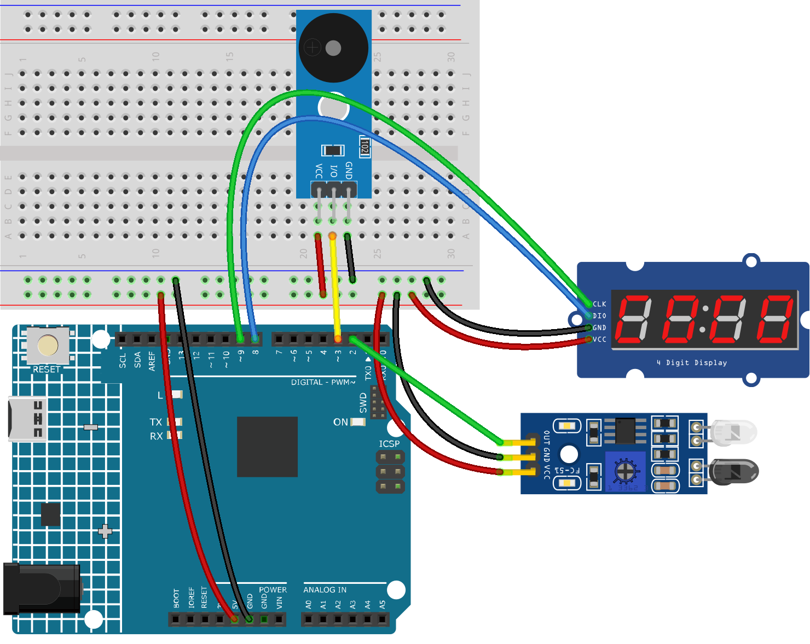

.. _smart_coaster:

Smart Coaster
==============================================================

.. note::
  
  🌟 Welcome to the SunFounder Facebook Community! Whether you're into Raspberry Pi, Arduino, or ESP32, you'll find inspiration, help ideas here.
   
  - ✅ Be the first to get free learning resources. 
   
  - ✅ Stay updated on new products & exclusive giveaways. 
   
  - ✅ Share your creations and get real feedback.
   
  * 👉 Need faster updates or support? Click [|link_sf_facebook|] join our Facebook community 

  * 👉 Or join our WhatsApp group: Click [|link_sf_whatsapp|]
   
Kit purchase
------------------------

Looking for parts? Check out our all-in-one kits below — packed with components, beginner-friendly guides, and tons of fun.

.. image:: img/umsk_kit.png
   :width: 100%
   :align: center
   :target: https://www.sunfounder.com/collections/raspberrypi-kits/products/sunfounder-universal-maker-sensor-kit?ref=jbzmncle

.. raw:: html

     

.. list-table::
   :widths: 20 20 20
   :header-rows: 1

   * - Name
     - Includes Arduino board
     - PURCHASE LINK
   * - Ultimate Sensor Kit
     - Arduino Uno R4 Minima
     - |link_ultimate_sensor_buy|
   * - Universal Maker Sensor Kit
     - ×
     - |link_umsk_buy|

Course Introduction
------------------------

In this lesson, you’ll learn how to build a smart reminder coaster using an Arduino, an IR sensor, a TM1637 4-digit display, and a buzzer.

This experiment detects when a cup is placed, starts a 15-minute countdown, and triggers an alarm to remind you to drink water.

.. .. raw:: html

..  <iframe width="700" height="394" src="https://www.youtube.com/embed/HLTCHluRY54?si=Qusb7o6H1rDCThMW" title="YouTube video player" frameborder="0" allow="accelerometer; autoplay; clipboard-write; encrypted-media; gyroscope; picture-in-picture; web-share" referrerpolicy="strict-origin-when-cross-origin" allowfullscreen></iframe>

.. note::

  If this is your first time working with an Arduino project, we recommend downloading and reviewing the basic materials first.
  
  * :ref:`install_arduino`
  * :ref:`introduce_arduino`

**Required Components**

In this project, we need the following components:

.. list-table::
    :widths: 5 20 5 20
    :header-rows: 1

    *   - SN
        - COMPONENT INTRODUCTION	
        - QUANTITY
        - PURCHASE LINK

    *   - 1
        - Arduino UNO R4 Minima/Arduino UNO R4 WIFI
        - 1
        - |link_arduinor4_buy|
    *   - 2
        - USB Type-C cable
        - 1
        - 
    *   - 3
        - Breadboard
        - 1
        - |link_breadboard_buy|
    *   - 4
        - Wires
        - Several
        - |link_wires_buy|
    *   - 5
        - 4-Digit Segment Display Module
        - 1
        - |link_4segment_buy|
    *   - 6
        - IR Obstacle Avoidance Sensor Module
        - 1
        - |link_IR_module_buy|
    *   - 7
        - Buzzer Modudle
        - 1
        - |link_buzzer_module_buy|

**Wiring**

**Common Connections:**

* **IR Obstacle Avoidance Sensor Module**

  - **OUT:** Connect to **2** on the Arduino.
  - **GND:** Connect to breadboard’s negative power bus.
  - **VCC:** Connect to breadboard’s red power bus.

* **4-Digit Segment Display Module**

  - **CLK:** Connect to **9** on the Arduino.
  - **DIO:** Connect to **8** on the Arduino.
  - **GND:** Connect to breadboard’s negative power bus.
  - **VCC:** Connect to breadboard’s red power bus.

* **Buzzer Module**

  - **I/0:** Connect to **3** on the Arduino.
  - **＋:** Connect to breadboard’s red power bus. 
  - **－:** Connect to breadboard’s negative power bus.

**Writing the Code**

.. note::

    * You can copy this code into **Arduino IDE**. 
    * To install the library, use the Arduino Library Manager and search for **TM1637Display** and install it.
    * Don't forget to select the board(Arduino UNO R4 Minima/WIFI) and the correct port before clicking the **Upload** button.

.. code-block:: arduino

      #include <TM1637Display.h>

      // ---------------------- Pin Definitions ----------------------
      const int CLK_PIN = 9;
      const int DIO_PIN = 8;
      const int IR_PIN = 2;
      const int BUZZER_PIN = 3;

      // ---------------------- Display Object -----------------------
      TM1637Display display(CLK_PIN, DIO_PIN);

      // ---------------------- Timer Settings -----------------------
      const unsigned long COUNTDOWN_TIME = 15UL * 60UL * 1000UL;  // 15 minutes
      const unsigned long LOST_DELAY = 1000;  // ignore very short signal loss (1 second)

      // ---------------------- State Variables ----------------------
      bool cupPresent = false;
      bool lastCupPresent = false;
      bool timerRunning = false;
      bool alarmActive = false;

      unsigned long startTime = 0;
      unsigned long remainingTime = COUNTDOWN_TIME;
      unsigned long lostStartTime = 0;
      bool lostTiming = false;

      // ---------------------- Buzzer Settings ----------------------
      unsigned long lastBeepToggle = 0;
      bool beepState = false;
      const unsigned long beepInterval = 300;

      // ---------------------- IR Logic -----------------------------
      // Most IR obstacle avoidance modules output LOW when an object is detected.
      // If your module behaves the opposite way, change LOW to HIGH.
      const int IR_ACTIVE_STATE = LOW;

      // -------------------------------------------------------------
      // Show time in MM:SS format
      void showTime(unsigned long timeMs) {
        unsigned long totalSeconds = timeMs / 1000;
        int minutes = totalSeconds / 60;
        int seconds = totalSeconds % 60;

        int displayValue = minutes * 100 + seconds;
        display.showNumberDecEx(displayValue, 0b01000000, true);  // show colon
      }

      // -------------------------------------------------------------
      void showIdleDisplay() {
        display.showNumberDec(0, true);  // 0000
      }

      // -------------------------------------------------------------
      void stopBuzzer() {
        noTone(BUZZER_PIN);
        beepState = false;
      }

      // -------------------------------------------------------------
      void handleAlarmBuzzer() {
        unsigned long currentMillis = millis();

        if (currentMillis - lastBeepToggle >= beepInterval) {
          lastBeepToggle = currentMillis;
          beepState = !beepState;

          if (beepState) {
            tone(BUZZER_PIN, 2000);
          } else {
            noTone(BUZZER_PIN);
          }
        }
      }

      // -------------------------------------------------------------
      void startNewCountdown() {
        timerRunning = true;
        alarmActive = false;
        remainingTime = COUNTDOWN_TIME;
        startTime = millis();
        stopBuzzer();
        showTime(remainingTime);
      }

      // -------------------------------------------------------------
      void resetSystem() {
        timerRunning = false;
        alarmActive = false;
        remainingTime = COUNTDOWN_TIME;
        stopBuzzer();
        showIdleDisplay();
      }

      // -------------------------------------------------------------
      void setup() {
        pinMode(IR_PIN, INPUT);
        pinMode(BUZZER_PIN, OUTPUT);

        display.setBrightness(7);
        showIdleDisplay();
      }

      // -------------------------------------------------------------
      void loop() {
        int irState = digitalRead(IR_PIN);
        bool currentDetected = (irState == IR_ACTIVE_STATE);

        // ---------------- Cup detection with brief-loss tolerance ----------------
        if (currentDetected) {
          cupPresent = true;
          lostTiming = false;
        } else {
          // Start timing only if cup was previously present
          if (cupPresent && !lostTiming) {
            lostTiming = true;
            lostStartTime = millis();
          }

          // If object is gone long enough, treat as removed
          if (cupPresent && lostTiming && (millis() - lostStartTime >= LOST_DELAY)) {
            cupPresent = false;
            lostTiming = false;
          }
        }

        // ---------------- Cup placed ----------------
        if (cupPresent && !lastCupPresent) {
          startNewCountdown();
        }

        // ---------------- Cup removed ----------------
        if (!cupPresent && lastCupPresent) {
          resetSystem();
        }

        // ---------------- Countdown ----------------
        if (cupPresent && timerRunning && !alarmActive) {
          unsigned long elapsed = millis() - startTime;

          if (elapsed >= COUNTDOWN_TIME) {
            remainingTime = 0;
            timerRunning = false;
            alarmActive = true;
            showTime(0);
          } else {
            remainingTime = COUNTDOWN_TIME - elapsed;
            showTime(remainingTime);
          }
        }

        // ---------------- Alarm ----------------
        if (cupPresent && alarmActive) {
          showTime(0);
          handleAlarmBuzzer();
        }

        lastCupPresent = cupPresent;
      }