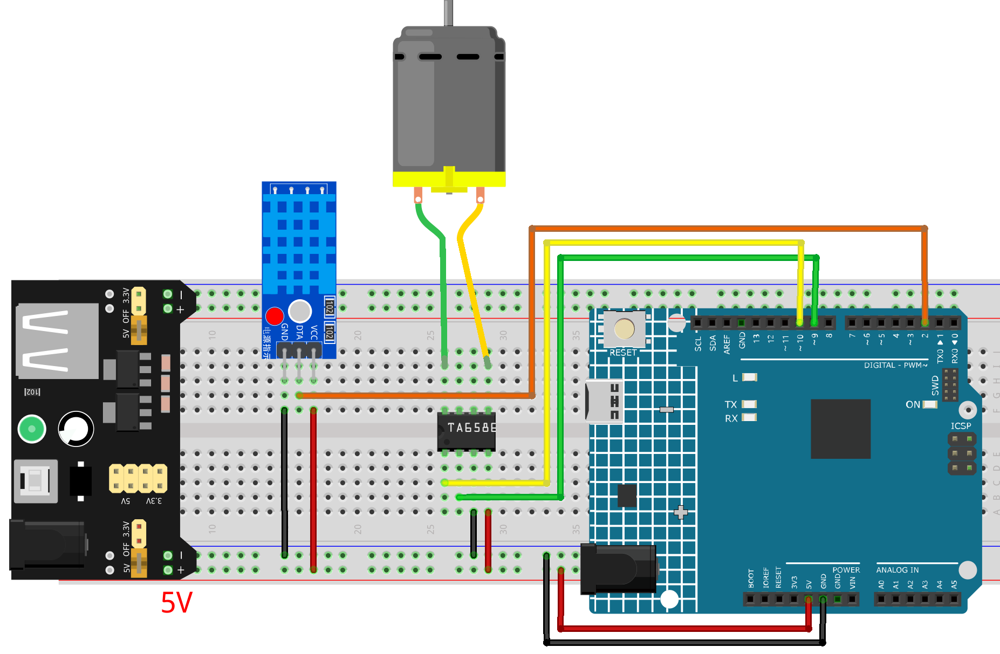

.. _smart_fan1.0:

Smart Fan1.0
==============================================================

.. note::
  
  🌟 Welcome to the SunFounder Facebook Community! Whether you're into Raspberry Pi, Arduino, or ESP32, you'll find inspiration, help ideas here.
   
  - ✅ Be the first to get free learning resources. 
   
  - ✅ Stay updated on new products & exclusive giveaways. 
   
  - ✅ Share your creations and get real feedback.
   
  * 👉 Need faster updates or support? Click [|link_sf_facebook|] join our Facebook community 

  * 👉 Or join our WhatsApp group: Click [|link_sf_whatsapp|]
   
  * 🎁 Looking for parts? Check out our all-in-one kits below — packed with components, beginner-friendly guides, and tons of fun.
  
  .. list-table::
    :widths: 20 20 20
    :header-rows: 1

    *   - Name	
        - Includes Arduino board
        - PURCHASE LINK
    *   - Elite Explorer Kit
        - Arduino Uno R4 WiFi
        - |link_elite_buy|
    *   - Universal Maker Sensor Kit
        - ×
        - |link_umsk_buy|
    *   - 3 in 1 Ultimate Starter Kit	
        - Arduino Uno R3
        - |link_arduinor3_buy|

Course Introduction
------------------------

In this lesson, you’ll build a temperature-controlled fan using a DHT11 sensor and a DC motor with the Arduino UNO R4.

When the temperature reaches a set threshold, the Arduino turns the fan on at a fixed speed using PWM. As the temperature drops below the threshold, the fan stops automatically.

.. .. raw:: html

..  <iframe width="700" height="394" src="https://www.youtube.com/embed/dJjgRm4Qjh0?si=7lZ-xXccWiOGLNSJ" title="YouTube video player" frameborder="0" allow="accelerometer; autoplay; clipboard-write; encrypted-media; gyroscope; picture-in-picture; web-share" referrerpolicy="strict-origin-when-cross-origin" allowfullscreen></iframe>

.. note::

  If this is your first time working with an Arduino project, we recommend downloading and reviewing the basic materials first.
  
  * :ref:`install_arduino`
  * :ref:`introduce_arduino`

**Required Components**

In this project, we need the following components:

.. list-table::
    :widths: 5 20 5 20
    :header-rows: 1

    *   - SN
        - COMPONENT INTRODUCTION	
        - QUANTITY
        - PURCHASE LINK

    *   - 1
        - Arduino UNO R4 Minima/Arduino UNO R4 WIFI
        - 1
        - |link_arduinor4_buy|
    *   - 2
        - USB Cable
        - 1
        - 
    *   - 3
        - Breadboard
        - 1
        - |link_breadboard_buy|
    *   - 4
        - Wires
        - Several
        - |link_wires_buy|
    *   - 5
        - TA6586 - Motor Driver Chip
        - 1
        - 
    *   - 6
        - Humiture Sensor Module
        - 1
        - 
    *   - 7
        - Type Miniature DC Motor
        - 1
        - 
    *   - 8
        - Power Supply
        - 1
        - |link_power_buy|

**Wiring**

**Common Connections:**

* **DHT11 Humiture Sensor Module**

  - **DATA:** Connect to **2** on the Arduino.
  - **GND:** Connect to breadboard’s negative power bus.
  - **VCC:** Connect to breadboard’s red power bus.

* **TA6586 - Motor Driver Chip**

  - **BI:** Connect to **10** on the Arduino.
  - **FI:** Connect to **9** on the Arduino.
  - **GND:** Connect to breadboard’s negative power bus.
  - **VCC:** Connect to breadboard’s red power bus.

* **DC Motor**

  -  Connect to **B0**, **F0** on the **TA6586 - Motor Driver Chip**.

**Writing the Code**

.. note::

    * You can copy this code into **Arduino IDE**. 
    * Don't forget to select the board(Arduino UNO R3) and the correct port before clicking the **Upload** button.

.. code-block:: arduino

            #include <Arduino.h>
            #include <DHT.h>

            /*
            Smart Fan Controller (UNO R4 + DHT11 + TA6586)

            Behavior:
                - If T < 27°C  -> Fan OFF
                - If T >= 27°C -> Fan ON at PWM 225

            Output:
                - Serial prints temperature and fan state
            */

            // ---------- Pin definitions ----------
            #define DHT_PIN   2        // DHT11 data pin
            #define DHT_TYPE  DHT11

            // TA6586 inputs
            #define TA_IN1_PWM  9       // Must be PWM-capable pin
            #define TA_IN2_DIR  10      // Direction pin (kept LOW for forward)

            // ---------- DHT ----------
            DHT dht(DHT_PIN, DHT_TYPE);

            // ---------- Fan tuning ----------
            const float   TEMP_THRESHOLD_C = 27.0f;
            const uint8_t FAN_PWM_ON       = 225;   // fixed speed when ON

            // ---------- Timing ----------
            const unsigned long READ_INTERVAL_MS = 2000; // DHT11 should not be read too fast
            unsigned long lastReadMs = 0;

            // ---------- Helper: fan control ----------
            void fanStop() {
            analogWrite(TA_IN1_PWM, 0);
            digitalWrite(TA_IN2_DIR, LOW);
            }

            void fanForward(uint8_t pwm) {
            digitalWrite(TA_IN2_DIR, LOW);
            analogWrite(TA_IN1_PWM, pwm);
            }

            // ---------- Setup ----------
            void setup() {
            pinMode(TA_IN1_PWM, OUTPUT);
            pinMode(TA_IN2_DIR, OUTPUT);
            fanStop();

            Serial.begin(115200);
            dht.begin();

            Serial.println("Smart Fan Controller Started.");
            }

            // ---------- Main loop ----------
            void loop() {
            unsigned long now = millis();
            if (now - lastReadMs < READ_INTERVAL_MS) return;
            lastReadMs = now;

            // Read temperature from DHT11
            float t = dht.readTemperature(); // Celsius
            if (isnan(t)) {
                fanStop();
                Serial.println("DHT11 read failed! Fan -> OFF");
                return;
            }

            // Fan control by threshold
            if (t >= TEMP_THRESHOLD_C) {
                fanForward(FAN_PWM_ON);
                Serial.print("Temp(C): ");
                Serial.print(t, 1);
                Serial.println(" | Fan: ON (PWM 225)");
            } else {
                fanStop();
                Serial.print("Temp(C): ");
                Serial.print(t, 1);
                Serial.println(" | Fan: OFF");
            }
            }
