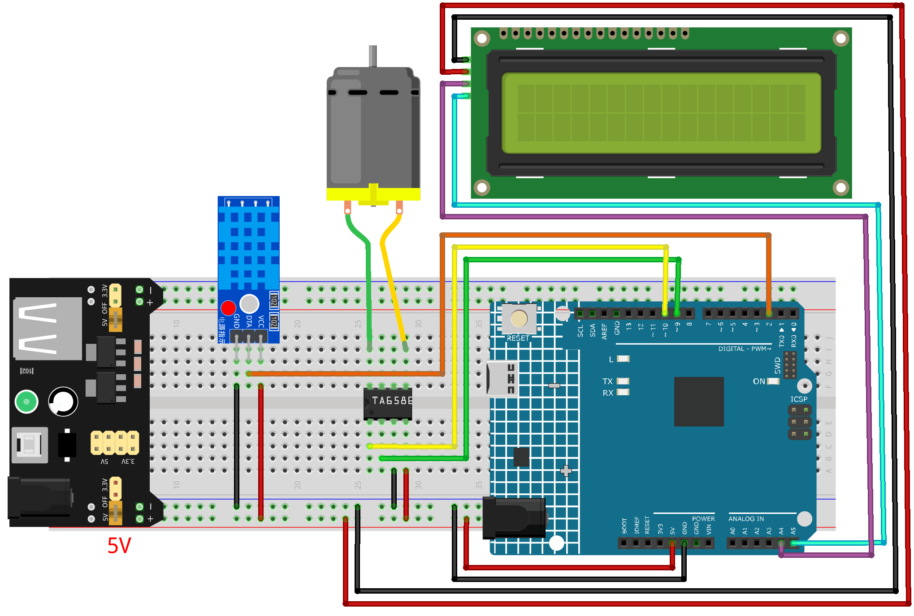

.. _smart_fan2.0:

Smart Fan2.0
==============================================================

.. note::
  
  🌟 Welcome to the SunFounder Facebook Community! Whether you're into Raspberry Pi, Arduino, or ESP32, you'll find inspiration, help ideas here.
   
  - ✅ Be the first to get free learning resources. 
   
  - ✅ Stay updated on new products & exclusive giveaways. 
   
  - ✅ Share your creations and get real feedback.
   
  * 👉 Need faster updates or support? Click [|link_sf_facebook|] join our Facebook community 

  * 👉 Or join our WhatsApp group: Click [|link_sf_whatsapp|]
   
  * 🎁 Looking for parts? Check out our all-in-one kits below — packed with components, beginner-friendly guides, and tons of fun.
  
  .. list-table::
    :widths: 20 20 20
    :header-rows: 1

    *   - Name	
        - Includes Arduino board
        - PURCHASE LINK
    *   - Elite Explorer Kit
        - Arduino Uno R4 WiFi
        - |link_elite_buy|
    *   - Universal Maker Sensor Kit
        - ×
        - |link_umsk_buy|
    *   - 3 in 1 Ultimate Starter Kit	
        - Arduino Uno R3
        - |link_arduinor3_buy|

Course Introduction
------------------------

In this lesson, you’ll build a multi-level temperature-controlled fan using a DHT11 sensor, a DC motor driver, and an I2C LCD with the Arduino UNO R4.

The fan speed automatically changes across four levels based on temperature, while the LCD displays the current temperature and fan level in real time.

.. .. raw:: html

..  <iframe width="700" height="394" src="https://www.youtube.com/embed/dJjgRm4Qjh0?si=7lZ-xXccWiOGLNSJ" title="YouTube video player" frameborder="0" allow="accelerometer; autoplay; clipboard-write; encrypted-media; gyroscope; picture-in-picture; web-share" referrerpolicy="strict-origin-when-cross-origin" allowfullscreen></iframe>

.. note::

  If this is your first time working with an Arduino project, we recommend downloading and reviewing the basic materials first.
  
  * :ref:`install_arduino`
  * :ref:`introduce_arduino`

**Required Components**

In this project, we need the following components:

.. list-table::
    :widths: 5 20 5 20
    :header-rows: 1

    *   - SN
        - COMPONENT INTRODUCTION	
        - QUANTITY
        - PURCHASE LINK

    *   - 1
        - Arduino UNO R4 Minima/Arduino UNO R4 WIFI
        - 1
        - |link_arduinor4_buy|
    *   - 2
        - USB Cable
        - 1
        - 
    *   - 3
        - Breadboard
        - 1
        - |link_breadboard_buy|
    *   - 4
        - Wires
        - Several
        - |link_wires_buy|
    *   - 5
        - TA6586 - Motor Driver Chip
        - 1
        - 
    *   - 6
        - Humiture Sensor Module
        - 1
        - 
    *   - 7
        - Type Miniature DC Motor
        - 1
        - 
    *   - 8
        - Power Supply
        - 1
        - |link_power_buy|
    *   - 9
        - I2C LCD 1602
        - 1
        - |link_i2clcd1602_buy|

**Wiring**

**Common Connections:**

* **DHT11 Humiture Sensor Module**

  - **DATA:** Connect to **2** on the Arduino.
  - **GND:** Connect to breadboard’s negative power bus.
  - **VCC:** Connect to breadboard’s red power bus.

* **TA6586 - Motor Driver Chip**

  - **BI:** Connect to **10** on the Arduino.
  - **FI:** Connect to **9** on the Arduino.
  - **GND:** Connect to breadboard’s negative power bus.
  - **VCC:** Connect to breadboard’s red power bus.

* **DC Motor**

  -  Connect to **B0**, **F0** on the **TA6586 - Motor Driver Chip**.

* **I2C LCD 1602**

  - **SDA:** Connect to **A4** on the Arduino.
  - **SCL:** Connect to **A5** on the Arduino.
  - **GND:** Connect to breadboard’s negative power bus.
  - **VCC:** Connect to breadboard’s red power bus.

**Writing the Code**

.. note::

    * You can copy this code into **Arduino IDE**. 
    * To install the library, use the Arduino Library Manager and search for **LiquidCrystal I2C** and install it.
    * Don't forget to select the board(Arduino UNO R4 WiFi) and the correct port before clicking the **Upload** button.

.. code-block:: arduino

        #include <Arduino.h>
        #include <Wire.h>
        #include <LiquidCrystal_I2C.h>
        #include <DHT.h>

        /*
        Smart Fan Controller (UNO R4 + DHT11 + TA6586 + I2C LCD)

        Fan Levels (4 levels total):
            - OFF:    T < 28°C
            - Level 1: 28°C <= T < 30°C  (slow)
            - Level 2: 30°C <= T < 35°C  (medium)
            - Level 3: T >= 35°C         (fast)

        LCD shows:
            Line 1: Temperature
            Line 2: Fan Level (OFF / Level 1 / Level 2 / Level 3)
        */

        // ---------- Pin definitions ----------
        #define DHT_PIN   2        // DHT11 data pin
        #define DHT_TYPE  DHT11

        // TA6586 inputs (typical H-bridge style control)
        // We use one PWM pin to control speed and one direction pin fixed LOW for forward.
        #define TA_IN1_PWM  9       // Must be PWM-capable pin
        #define TA_IN2_DIR  10      // Direction pin (kept LOW for forward)

        // ---------- LCD (I2C) ----------
        LiquidCrystal_I2C lcd(0x27, 16, 2); // Common address 0x27 (sometimes 0x3F)

        // ---------- DHT ----------
        DHT dht(DHT_PIN, DHT_TYPE);

        // ---------- Fan speed tuning ----------
        const uint8_t PWM_LEVEL_1 = 160;   // slow
        const uint8_t PWM_LEVEL_2 = 200;   // medium
        const uint8_t PWM_LEVEL_3 = 255;   // fast

        // ---------- Timing ----------
        const unsigned long READ_INTERVAL_MS = 2000; // DHT11 should not be read too fast
        unsigned long lastReadMs = 0;

        // ---------- Fan state ----------
        enum FanLevel { FAN_OFF = 0, FAN_L1 = 1, FAN_L2 = 2, FAN_L3 = 3 };
        FanLevel fanLevel = FAN_OFF;

        // ---------- Helper: set fan speed ----------
        void fanStop() {
        // Coast stop
        analogWrite(TA_IN1_PWM, 0);
        digitalWrite(TA_IN2_DIR, LOW);
        }

        void fanForward(uint8_t pwm) {
        // Forward with PWM on IN1
        digitalWrite(TA_IN2_DIR, LOW);
        analogWrite(TA_IN1_PWM, pwm);
        }

        // ---------- Helper: update LCD ----------
        void lcdPrintCentered(uint8_t row, const String &text) {
        String s = text;
        if (s.length() > 16) s = s.substring(0, 16);

        int pad = (16 - (int)s.length()) / 2;
        String line = "";
        for (int i = 0; i < pad; i++) line += " ";
        line += s;
        while (line.length() < 16) line += " ";

        lcd.setCursor(0, row);
        lcd.print(line);
        }

        String levelToText(FanLevel lv) {
        switch (lv) {
            case FAN_OFF: return "Fan: OFF";
            case FAN_L1:  return "Fan: Level 1";
            case FAN_L2:  return "Fan: Level 2";
            case FAN_L3:  return "Fan: Level 3";
            default:      return "Fan: OFF";
        }
        }

        // ---------- Setup ----------
        void setup() {
        pinMode(TA_IN1_PWM, OUTPUT);
        pinMode(TA_IN2_DIR, OUTPUT);
        fanStop();

        Serial.begin(115200);

        dht.begin();

        Wire.begin();
        lcd.init();
        lcd.backlight();

        lcdPrintCentered(0, "Smart Fan");
        lcdPrintCentered(1, "Starting...");
        delay(800);
        }

        // ---------- Main loop ----------
        void loop() {
        unsigned long now = millis();
        if (now - lastReadMs < READ_INTERVAL_MS) return;
        lastReadMs = now;

        // Read temperature from DHT11
        float t = dht.readTemperature(); // Celsius
        if (isnan(t)) {
            // DHT read failed
            fanStop();
            fanLevel = FAN_OFF;
            lcdPrintCentered(0, "Temp: --.- C");
            lcdPrintCentered(1, "Fan: OFF");
            Serial.println("DHT11 read failed!");
            return;
        }

        // Decide fan level by temperature
        FanLevel newLevel;
        if (t < 28.0f) {
            newLevel = FAN_OFF;
        } else if (t < 30.0f) {
            newLevel = FAN_L1;
        } else if (t < 35.0f) {
            newLevel = FAN_L2;
        } else {
            // Includes 35~40 and 40+ (Level 3)
            newLevel = FAN_L3;
        }

        // Apply fan control
        fanLevel = newLevel;
        switch (fanLevel) {
            case FAN_OFF: fanStop(); break;
            case FAN_L1:  fanForward(PWM_LEVEL_1); break;
            case FAN_L2:  fanForward(PWM_LEVEL_2); break;
            case FAN_L3:  fanForward(PWM_LEVEL_3); break;
        }

        // Update LCD
        char buf[17];
        snprintf(buf, sizeof(buf), "Temp: %4.1f C", t);
        lcdPrintCentered(0, String(buf));
        lcdPrintCentered(1, levelToText(fanLevel));

        // Debug
        Serial.print("Temp(C): ");
        Serial.print(t, 1);
        Serial.print(" | ");
        Serial.println(levelToText(fanLevel));
        }
