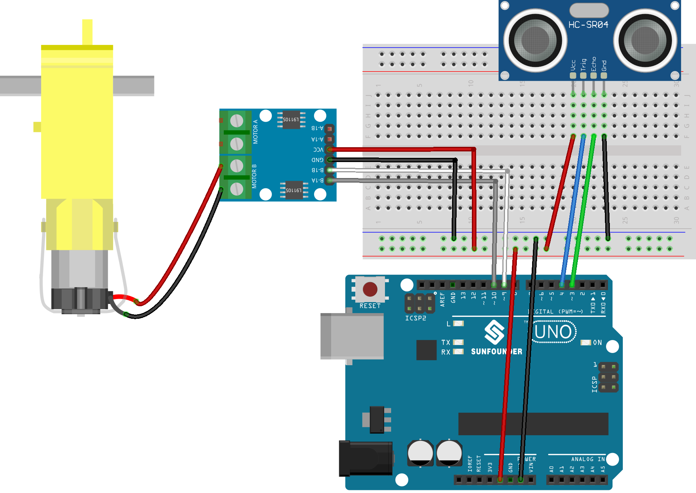

.. _smart_stop1:

Smart Stop 1.0
==============================================================
.. note::
  
  Hello, welcome to the SunFounder Raspberry Pi & Arduino & ESP32 Enthusiasts Community on Facebook! Dive deeper into Raspberry Pi, Arduino, and ESP32 with fellow enthusiasts.

  👉 Ready to explore and create with us? Click [|link_sf_facebook|] and join today!

  To get all the components for this project, consider one of the kits below. 

  Each includes the required parts, extra components for other projects, and beginner-friendly tutorials.

  .. list-table::
    :widths: 20 20 20
    :header-rows: 1

    *   - Name	
        - Includes Arduino board
        - PURCHASE LINK
    *   - Universal Maker Sensor Kit
        - ×
        - |link_umsk_buy|
    *   - 3 in 1 Ultimate Starter Kit	
        - √
        - |link_arduinor3_buy|

Course Introduction
------------------------

In this lesson, you’ll learn how to use an L9110 Motor Driver Module, an Ultrasonic Sensor Module, and a TT motor with the Arduino UNO R3 to create a Smart Stop 1.0 system.

As the obstacle gets closer to the Ultrasonic Sensor Module, the TT motor gradually slows down until it comes to a stop.

.. raw:: html

    <iframe width="700" height="394" src="https://www.youtube.com/embed/MDpiQZTl5g4" title="YouTube video player" frameborder="0" allow="accelerometer; autoplay; clipboard-write; encrypted-media; gyroscope; picture-in-picture; web-share" referrerpolicy="strict-origin-when-cross-origin" allowfullscreen></iframe>

.. note::

  If this is your first time working with an Arduino project, we recommend downloading and reviewing the basic materials first.
  
  * :ref:`install_arduino`
  * :ref:`introduce_arduino`

**Required Components**

In this project, we need the following components:

.. list-table::
    :widths: 5 20 5 20
    :header-rows: 1

    *   - SN
        - COMPONENT INTRODUCTION	
        - QUANTITY
        - PURCHASE LINK

    *   - 1
        - Arduino UNO R3
        - 1
        - |link_unor3_buy|
    *   - 2
        - USB Cable
        - 1
        - 
    *   - 3
        - Breadboard
        - 1
        - |link_breadboard_buy|
    *   - 4
        - Wires
        - Several
        - |link_wires_buy|
    *   - 5
        - L9110 Motor Driver Module
        - 1
        - 
    *   - 6
        - Ultrasonic Sensor Module
        - 1
        - |link_ultrasonic_buy|
    *   - 7
        - TT Motor
        - 1
        - 

**Wiring**

**Common Connections:**

* **Ultrasonic Sensor Module**

  - **Trig:** Connect to **4** on the Arduino.
  - **Echo:** Connect to **3** on the Arduino.
  - **GND:** Connect to breadboard’s negative power bus.
  - **VCC:** Connect to breadboard’s red power bus.

* **TT Motor**

  -  Connect to **MOTOR B** on the L9110 Motor Driver Module.

* **L9110 Motor Driver Module**

  - **GND:** Connect to breadboard’s negative power bus.
  - **VCC:** Connect to breadboard’s red power bus.
  - **B-1B:** Connect to **9** on the Arduino.
  - **B-1A:** Connect to **10** on the Arduino.

**Writing the Code**

.. note::

    * You can copy this code into **Arduino IDE**. 
    * Don't forget to select the board(Arduino UNO R3) and the correct port before clicking the **Upload** button.

.. code-block:: arduino

      // Define pins for ultrasonic sensor and motor
      const int echoPin = 3;
      const int trigPin = 4;
      const int motorB_1A = 9;
      const int motorB_2A = 10;

      void setup() {
        Serial.begin(9600); // Initialize serial communication at 9600 baud rate
        pinMode(echoPin, INPUT); // Set echo pin as input for receiving signals
        pinMode(trigPin, OUTPUT); // Set trig pin as output for sending signals
        pinMode(motorB_1A, OUTPUT); // Set motor control pin 1 as output
        pinMode(motorB_2A, OUTPUT); // Set motor control pin 2 as output
      }

      void loop() {
        float distance = readSensorData(); // Get distance from ultrasonic sensor using the new function name
        Serial.print("Distance: "); // Print distance for debugging
        Serial.print(distance);
        Serial.println(" cm");
        controlMotor(distance); // Control motor speed based on distance
        delay(100); // Delay to reduce sensor noise impact
      }

      float readSensorData() {
        digitalWrite(trigPin, LOW); // Ensure clean pulse
        delayMicroseconds(2); // Wait for 2 microseconds
        digitalWrite(trigPin, HIGH); // Send high pulse for 10 microseconds
        delayMicroseconds(10);
        digitalWrite(trigPin, LOW); // Reset trig pin to low
        unsigned long duration = pulseIn(echoPin, HIGH); // Measure echo pulse width
        float distance = duration / 58.00; // Calculate distance in cm, simplifying the calculation
        return distance;
      }

      void controlMotor(float distance) {
        if (distance < 5) {
          analogWrite(motorB_1A, 0); // Stop motor if distance is less than 5 cm
          analogWrite(motorB_2A, 0);
        } else if (distance < 8) {
          analogWrite(motorB_1A, 85); // Set speed to 85 if distance is less than 8 cm
          analogWrite(motorB_2A, 0);
        } else if (distance < 11) {
          analogWrite(motorB_1A, 170); // Set speed to 170 if distance is less than 11 cm
          analogWrite(motorB_2A, 0);
        } else if (distance > 14) {
          analogWrite(motorB_1A, 255); // Set speed to maximum if distance is more than 14 cm
          analogWrite(motorB_2A, 0);
        }
      }

