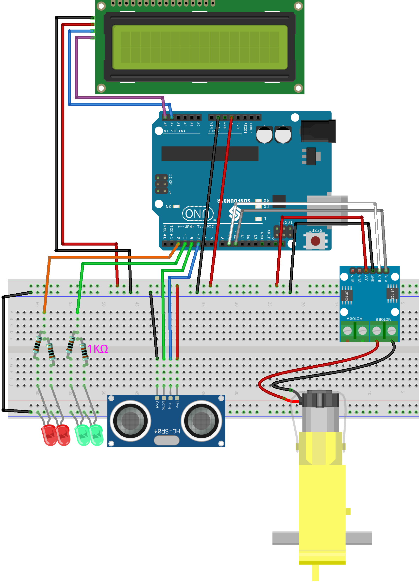

.. _smart_stop2:

Smart Stop 2.0
==============================================================

.. note::
  
  🌟 Welcome to the SunFounder Facebook Community! Whether you're into Raspberry Pi, Arduino, or ESP32, you'll find inspiration, help ideas here.
   
  - ✅ Be the first to get free learning resources. 
   
  - ✅ Stay updated on new products & exclusive giveaways. 
   
  - ✅ Share your creations and get real feedback.
   
  * 👉 Need faster updates or support? Click [|link_sf_facebook|] join our Facebook community 

  * 👉 Or join our WhatsApp group: Click [|link_sf_whatsapp|]
   
  * 🎁 Looking for parts?Check out our all-in-one kits below — packed with components, beginner-friendly guides, and tons of fun.
  
  .. list-table::
    :widths: 20 20 20
    :header-rows: 1

    *   - Name	
        - Includes Arduino board
        - PURCHASE LINK
    *   - Elite Explorer Kit
        - Arduino Uno R4 WiFi
        - |link_elite_buy|
    *   - Universal Maker Sensor Kit
        - ×
        - |link_umsk_buy|
    *   - 3 in 1 Ultimate Starter Kit	
        - Arduino Uno R3
        - |link_arduinor3_buy|

Course Introduction
------------------------

In this lesson, you’ll learn how to use an L9110 Motor Driver Module, an Ultrasonic Sensor Module, a 1602 LCD, and a TT motor with the Arduino UNO R3 to create a Smart Stop 2.0 system.

As the obstacle gets closer to the Ultrasonic Sensor Module, the LCD screen displays the distance to obstacles and the servo speed. When the distance exceeds the predefined safety threshold, the green light switches to a flashing red light as a warning, the TT motor gradually slows down until it comes to a stop.

.. raw:: html

    <iframe width="700" height="394" src="https://www.youtube.com/embed/Ao_hR9dFvOc?si=ryIcOk0LiWaqFwXc" title="YouTube video player" frameborder="0" allow="accelerometer; autoplay; clipboard-write; encrypted-media; gyroscope; picture-in-picture; web-share" referrerpolicy="strict-origin-when-cross-origin" allowfullscreen></iframe>

.. note::

  If this is your first time working with an Arduino project, we recommend downloading and reviewing the basic materials first.
  
  * :ref:`install_arduino`
  * :ref:`introduce_arduino`

**Required Components**

In this project, we need the following components:

.. list-table::
    :widths: 5 20 5 20
    :header-rows: 1

    *   - SN
        - COMPONENT INTRODUCTION	
        - QUANTITY
        - PURCHASE LINK

    *   - 1
        - Arduino UNO R3
        - 1
        - |link_unor3_buy|
    *   - 2
        - USB Cable
        - 1
        - 
    *   - 3
        - Breadboard
        - 1
        - |link_breadboard_buy|
    *   - 4
        - Wires
        - Several
        - |link_wires_buy|
    *   - 5
        - L9110 Motor Driver Module
        - 1
        - 
    *   - 6
        - Ultrasonic Sensor Module
        - 1
        - |link_ultrasonic_buy|
    *   - 7
        - TT Motor
        - 1
        - 
    *   - 8
        - I2C LCD 1602
        - 1
        - |link_i2clcd1602_buy|
    *   - 9
        - Resistor
        - 1KΩ
        - |link_resistor_buy|
    *   - 10
        - LED
        - 4
        - |link_led_buy|

**Wiring**

**Common Connections:**

* **Ultrasonic Sensor Module**

  - **Trig:** Connect to **5** on the Arduino.
  - **Echo:** Connect to **4** on the Arduino.
  - **GND:** Connect to breadboard’s negative power bus.
  - **VCC:** Connect to breadboard’s red power bus.

* **TT Motor**

  -  Connect to **MOTOR B** on the L9110 Motor Driver Module.

* **L9110 Motor Driver Module**

  - **GND:** Connect to breadboard’s negative power bus.
  - **VCC:** Connect to breadboard’s red power bus.
  - **B-1B:** Connect to **9** on the Arduino.
  - **B-1A:** Connect to **10** on the Arduino.

* **I2C LCD 1602**

  - **SDA:** Connect to **A4** on the Arduino.
  - **SCL:** Connect to **A5** on the Arduino.
  - **GND:** Connect to breadboard’s negative power bus.
  - **VCC:** Connect to breadboard’s red power bus.

**Writing the Code**

.. note::

    * You can copy this code into **Arduino IDE**. 
    * To install the library, use the Arduino Library Manager and search for **LiquidCrystal I2C** and install it.
    * Don't forget to select the board(Arduino UNO R3) and the correct port before clicking the **Upload** button.

.. code-block:: arduino

      // Define pins for ultrasonic sensor, motor, and LEDs
      const int echoPin = 5;
      const int trigPin = 4;
      const int motorB_1A = 9;
      const int motorB_2A = 10;
      const int redLED = 2;
      const int greenLED = 3;

      // Include the library code for LCD and I2C communication
      #include <Wire.h>
      #include <LiquidCrystal_I2C.h>

      // Initialize the LCD on address 0x27 for a 16 characters and 2 line display
      LiquidCrystal_I2C lcd(0x27, 16, 2);

      int speed = 0; // Initialize speed at 0
      unsigned long lastBlink = 0; // Last time the LED blinked
      int ledState = LOW; // Current state of the red LED

      void setup() {
        Serial.begin(9600); // Initialize serial communication at 9600 baud rate
        pinMode(echoPin, INPUT); // Set echo pin as input for receiving signals
        pinMode(trigPin, OUTPUT); // Set trig pin as output for sending signals
        pinMode(motorB_1A, OUTPUT); // Set motor control pin 1 as output
        pinMode(motorB_2A, OUTPUT); // Set motor control pin 2 as output
        pinMode(redLED, OUTPUT); // Set red LED pin as output
        pinMode(greenLED, OUTPUT); // Set green LED pin as output

        lcd.init();  // Initialize the LCD
        lcd.backlight();  // Turn on the backlight
      }

      void loop() {
        float distance = readSensorData(); // Get distance from ultrasonic sensor
        int intDistance = round(distance); // Round the distance to the nearest integer

        speed = intDistance < 6 ? 0 : (intDistance - 5) * 15;
        speed = min(speed, 255); // Ensure speed does not exceed 255

        controlMotor(speed); // Control motor speed based on updated speed

        unsigned long currentMillis = millis();

        // Control LED states based on distance
        if (intDistance < 5) {
          digitalWrite(redLED, HIGH); // Red LED stays on if distance is less than 5 cm
          digitalWrite(greenLED, LOW); // Green LED is off
        } else if (intDistance < 20) {
          // Blink red LED if distance is less than 20 cm
          if (currentMillis - lastBlink >= 250) { // Change the interval to control blink speed
            lastBlink = currentMillis;
            ledState = !ledState;
            digitalWrite(redLED, ledState);
          }
          digitalWrite(greenLED, LOW);
        } else {
          digitalWrite(redLED, LOW); // Turn off red LED if distance is 20 cm or more
          digitalWrite(greenLED, HIGH); // Green LED stays on if distance is more than 20 cm
        }

        // Update LCD display
        lcd.clear();
        lcd.setCursor(0, 0);
        lcd.print("Distance: ");
        lcd.print(intDistance);

        lcd.setCursor(0, 1);
        lcd.print("Speed: ");
        lcd.print(speed);

        delay(100); // Short delay to stabilize sensor readings
      }

      // Read and calculate distance from ultrasonic sensor
      float readSensorData() {
        digitalWrite(trigPin, LOW); // Ensure a clean pulse
        delayMicroseconds(2);
        digitalWrite(trigPin, HIGH); // Send a high pulse for 10 microseconds
        delayMicroseconds(10);
        digitalWrite(trigPin, LOW); // End the pulse
        unsigned long duration = pulseIn(echoPin, HIGH); // Measure echo pulse width
        float distance = duration / 58.00; // Convert duration to distance in cm
        return distance;
      }

      // Adjust motor speed
      void controlMotor(int speed) {
        analogWrite(motorB_1A, speed); // Set motor speed
        analogWrite(motorB_2A, 0); // Ensure motor runs in a single direction
      }
